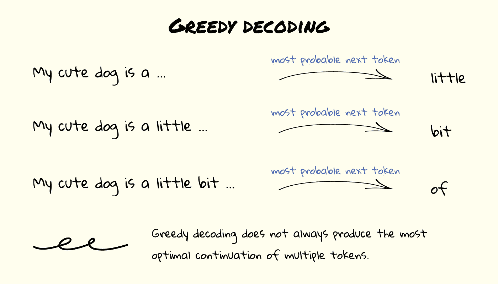

# 受约束语言模型的力量

> 原文：<https://towardsdatascience.com/the-power-of-constrained-language-models-cf63b65a035d?source=collection_archive---------12----------------------->

## 为什么以及如何用自定义的波束搜索算法构建约束语言模型。一个拥抱脸代码的指南。


迈克尔·泽兹奇在 [Unsplash](https://unsplash.com?utm_source=medium&utm_medium=referral) 上的照片

# 概观

1.  介绍
2.  为什么要关心受约束的语言模型？
3.  波束搜索算法是什么？
4.  如何用自定义的波束搜索算法约束任何语言模型？
5.  拥抱脸的实现
6.  结果呢
7.  结论

# 介绍

预先训练好的生成语言模型(如 OpenAI 的 [GPT2](https://openai.com/blog/better-language-models/) 和 [GPT3](https://openai.com/blog/openai-api/) )或 seq2seq 模型(如 [T5](https://ai.googleblog.com/2020/02/exploring-transfer-learning-with-t5.html) 或最近发布的 [T0](https://huggingface.co/bigscience/T0pp) )生成自由流动的自然语言。这意味着他们输出的句子可以是任何形状。为了从这些模型中获得最大价值，我们有时希望输出遵循某种结构——这被称为*受限语言模型*。在这篇文章中，我将解释:

*   为什么你想要一个受约束的语言模型。
*   波束搜索算法的用途。
*   如何用自定义的波束搜索算法轻松约束任何语言模型？
*   如何使用拥抱脸来实现这一点？

读完这篇文章后，你将能够通过控制语言模型输出的形状，从语言模型中获得更多的价值。

这篇文章与我的[上一篇文章](/almost-no-data-and-no-time-unlocking-the-true-potential-of-gpt3-a-case-study-b4710ca0614a)有关，在这篇文章中，我解释了如何通过操纵输入的形状来释放 GPT3 的真正潜力(参见*提示工程*)。

包含示例代码的笔记本可从[这里](https://colab.research.google.com/drive/1ezT24sogpVyr2HJLOvXHzjv61JZJ1gMT?usp=sharing)获得。

# 为什么要关心受约束的语言模型？

如前所述，我们有时希望模型的输出遵循某种结构。例如，如果我们想要进一步处理输出，如果我们对它们的结构和属性有一些保证就好了。

在一个案例研究中，我在这里描述了[和](/almost-no-data-and-no-time-unlocking-the-true-potential-of-gpt3-a-case-study-b4710ca0614a)，一个模型的输出需要被一个额外的组件解析。通过实施适当的结构，我可以保证输出易于解析。

我们可以确保给定的模型永远不会输出两个特定单词同时出现的句子，或者我们可以确保这些单词总是同时出现。可能性是无限的。

或者，我们可能希望生成每个标记只有偶数个字符的句子，只是为了好玩。

# 波束搜索算法是什么？

我们可以通过使用定制的波束搜索算法来实现这种效果。

简而言之，波束搜索算法(有时称为*维特比算法*)用于生成一个句子的极有可能的延续。

生成语言模型被训练来预测给定输入序列的下一个最可能的标记。如果我们想要生成 10 个新令牌，我们可以将此视为 10 次生成 1 个新令牌。我们获取原始句子，生成第一个标记，并使用结果句子生成第二个标记，等等。这叫做*贪婪解码*。



(图片由作者提供)贪婪解码——连续几次取最优的下一个记号并不能得到句子的最优延续。

如果我们想要生成 10 个记号的最可能延续，这并不等于连续 10 次选择最可能的记号——贪婪解码不是最佳的。有时，在给定的步骤中不选择最有可能的下一个标记是有意义的，以便后面的标记可以通过更有可能来补偿这一点。

波束搜索算法试图通过在每一步考虑 K 个最可能的下一个记号来减轻贪婪解码的问题。通过考虑更多的记号，我们可以发现这样的情况，在给定的步骤中选择一个不太可能的记号会在随后的步骤中产生更可能的记号。


(图片由作者提供)波束搜索—波束搜索算法如何通过考虑提示的多种可能的延续来获得更好的延续。

举个例子，如果我们把句子‘我可爱的狗是 a’延续为 1 token，最有可能的延续就变成‘我可爱的狗是 a little’。然而，如果我们使用波束搜索来找到 3 个令牌的最有可能的延续，“我可爱的狗有点 a”成为最有可能的句子。如果我们只考虑 1 个标记，那么与“little”相比,“bit”是不太可能的延续，而 3 个标记的最终结果更可能是“bit”。

这个算法是一个启发式算法，这意味着它并不完美。如果 K 变得更大，并且我们在每一步考虑更多可能的下一个记号，我们将最终得到更可能的最终延续。然而，我们也通过增加算法的计算成本来为此付出代价。

如果你有兴趣了解更多关于语言模型的不同生成技术，我建议[这篇](https://huggingface.co/blog/how-to-generate)博客。

# 如何用自定义的波束搜索算法约束任何语言模型？

通过操纵这种波束搜索算法，我们可以获得符合特定结构的输出。我们可以在特定的步骤动态地将一些下一个令牌的概率设置为零，以确保这些令牌永远不会生成。通过*在适当的时候禁止*某些令牌，我们可以强制输出遵循任何模式。

假设我们想要生成一个输出，其中第一个单词以字母“a”开头，第二个以字母“b”开头，第三个以字母“c”开头，第四个又以字母“a”开头，等等。在波束搜索算法的每个步骤中，我们需要检查前一个单词的第一个字母，然后将所有具有错误起始字母的下一个单词的概率设置为零。该模型现在将生成符合这种格式的最可能的句子。


(图片由作者提供)受约束的束搜索—通过在束搜索算法期间移除我们不需要的标记，我们可以将语言模型的输出约束到预定义的结构。

虽然前面的例子相当简单，但我们可以使用这种技术对生成的句子实施任意约束。

# 拥抱脸的实现

为了节省我们的大量工作，我们将利用[拥抱脸](https://huggingface.co/)做许多繁重的工作。实现上述“a - > b - > c”模式的文档代码(使用 GPT2)可从[这里](https://colab.research.google.com/drive/1ezT24sogpVyr2HJLOvXHzjv61JZJ1gMT?usp=sharing)获得。

# 结果呢

受限于“a -> b -> c”模式的 GPT2 以如下方式继续提示“我可爱的狗是 a ”:

```
beam 0: My cute dog is a bit confused about being called a bitch
beam 1: My cute dog is a bit confused about being called a baby
beam 2: My cute dog is a big cat and big cats are big
beam 3: My cute dog is a bit confused about being called a bunny
beam 4: My cute dog is a bit confused about being called a big
beam 5: My cute dog is a bit confused about being called a boy
beam 6: My cute dog is a bit confused about being called a b
beam 7: My cute dog is a bit confused about being called a bad
beam 8: My cute dog is a bit confused about being confused about being
beam 9: My cute dog is a bit confused about being called a black
```

请注意，模型的输出是如何遵循这种“a -> b -> c”结构的，而我们不必在输入中为模型提供这种模式的任何示例。我特别喜欢该模型仍然设法产生一些连贯的句子——尽管有这种(相当严格的)限制，但如果你是一只狗，被称为兔子是有意义的。

# 结论

通过编写我们自己版本的波束搜索算法，我们能够约束预训练语言模型的输出。这可以应用于生成型模型，如 GPT2 和 GPT3，甚至 seq2seq 模型，如 T5 和 T0。当我们希望模型的输出遵循某个预定义的结构或遵循一组规则时，这特别有用。

通过使用拥抱人脸库，我们可以轻松地自己实现这个自定义的波束搜索算法。代码可以在这里**找到[。](https://colab.research.google.com/drive/1ezT24sogpVyr2HJLOvXHzjv61JZJ1gMT?usp=sharing)**

如果你对从你的语言模型中获得更多价值感兴趣，看看[这篇](/almost-no-data-and-no-time-unlocking-the-true-potential-of-gpt3-a-case-study-b4710ca0614a)关于*提示工程*如何帮助你释放你的生成语言模型的真正价值的帖子。