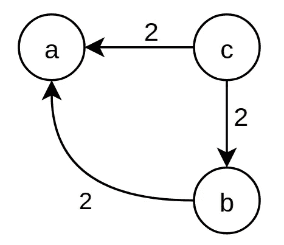
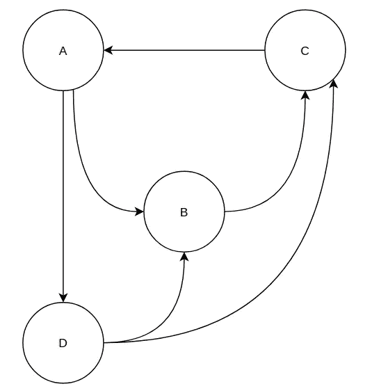
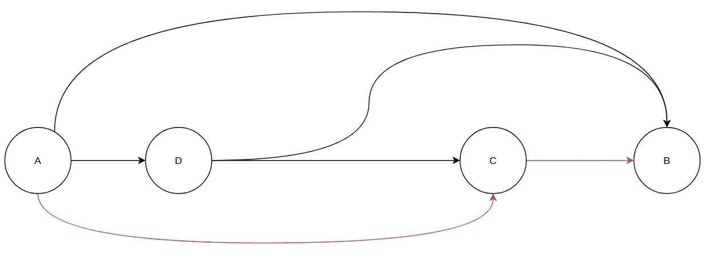
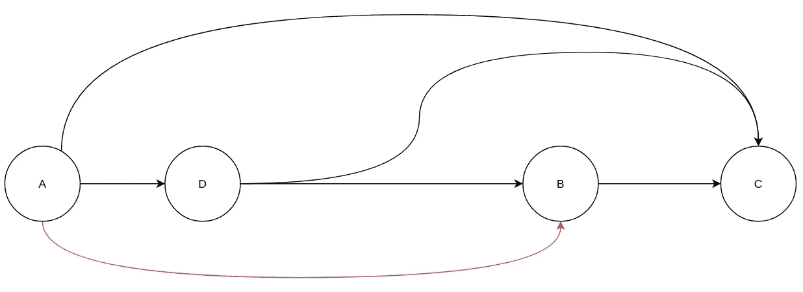
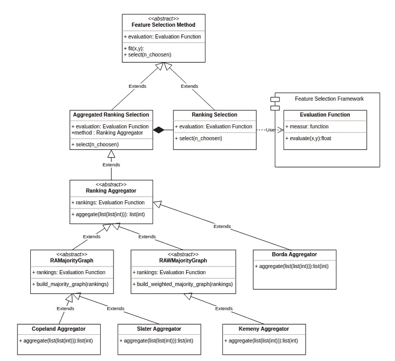
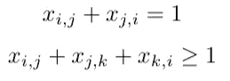
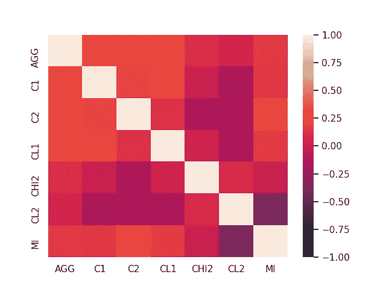
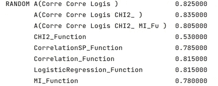

# 民主在特征选择中的力量

> 原文：<https://towardsdatascience.com/the-power-of-democracy-in-feature-selection-dfb75f970b6e?source=collection_archive---------40----------------------->

## [实践教程](https://towardsdatascience.com/tagged/hands-on-tutorials)

## 使用孔多塞方法来聚集特征选择排名


由[迈克·彼得鲁奇](https://unsplash.com/@mikepetrucci?utm_source=medium&utm_medium=referral)在 [Unsplash](https://unsplash.com?utm_source=medium&utm_medium=referral) 上拍摄的照片

根据维基百科，**特征选择**，也称为**变量选择**、**属性选择、**或**变量子集选择**，是选择相关[特征](https://en.wikipedia.org/wiki/Feature_(machine_learning))(变量、预测器)的子集用于模型构建的过程。

使用特征选择技术有几个原因:

*   简化模型，使其更容易被研究人员/用户解释。
*   更短的训练时间，
*   为了避免[维数灾难](https://en.wikipedia.org/wiki/Curse_of_dimensionality)，
*   通过减少[过拟合](https://en.wikipedia.org/wiki/Overfitting) g 来增强通用性

我们研究了先例[故事](/towards-building-a-unified-framework-for-feature-selection-with-ranking-functions-5605ef665f26)中的一类特征选择方法:排序方法。

分级方法是根据质量度量对数据集的要素进行分级并选择第一个要素的方法。

它们是五种度量:距离、信息、一致性、依赖性和分类准确性，我们看到，根据我们采取的度量类型，我们可以获得非常不同的排名，这导致各种排名对于一些数据集是有效的，而对于其他数据集则完全无效，因此需要使用许多度量。

假设我们把每个度量看作一个选择者，把每个属性看作一个候选者。在这种情况下，排名可以被视为偏好的顺序，因此，我们可以应用选举方法来计算汇总排名。

这篇文章将首先给出计算社会选择的背景；之后，我们将看到如何用 Kemeny 方法从多种特征选择方法中汇总排名。最后，我们将评估排名汇总相对于每个排名的性能。

# 计算社会选择背景

## 偏好配置文件

假设你有 n 个候选人，m 个选举人。每个选举人以这种形式给我们一个对候选人的偏好顺序 a ≥ b ≥ … ≥ z，我们称之为“偏好简档”

如果你想选举一个候选人，你应该使用哪种协议？你想拥有什么财产？就复杂程度而言，代价是什么？

## 多数图

多数图是其中每个候选者是顶点的图；

如果多数人严格地偏好 x 而不是 y，即，如果偏好 x 而不是 y 的选举人数量:k(x)严格地大于偏好 y 而不是 x: k(y)的选举人数量，我们就画出从候选人 x 到候选人 y 的有向边。

我们通过加权多数图中的差值 k *(x)-k(y)来加权候选 x 和候选 y 之间的每个有向边。*

## 孔多塞奖获得者

孔多塞方法是一种总是选出孔多塞获胜者的选举方法；如果一个候选人在一场势均力敌的投票中击败了所有其他候选人，他就是孔多塞奖得主；例如，两轮选举不是孔多塞方法，让我们举一个例子来说明:

假设你有 8 个选民有这样的偏好

*   3 选举人:a ≥ c ≥ b
*   3 选举人:b ≥ c ≥ a
*   2 选举人:c ≥ b ≥ a

两轮选举是选民为他们喜欢的候选人投一票的选举。只有在没有候选人在第一轮投票中获得简单多数票(超过 50%)的情况下，选举才会进入第二轮。

在这个例子中，a 和 b 进入第二轮，b 获胜；让我们来看看多数图。



作者图片

我们可以看到，c 在任何一场对决中获胜，但仍然是，他在第一轮就被淘汰；这就是众所周知的孔多塞悖论。

# 孔多塞方法

孔多塞方法是一种总是选出孔多塞奖获得者(如果有的话)的方法。

许多孔多塞方法可能需要不同层次的多数图知识。

## 博尔达法

一些方法不需要任何关于多数图的知识，比如 Borda 计数，它可以在线性时间(O(n*m))内计算

> 假设我们有 n 个选举人，为了用 **Borda** 计数计算总排名，我们给每个候选人 n 分，每次他在一个选举人偏好的第一个位置，n-1，每次他在第二个位置，等等。

在上面的例子中，“a”将有 14 分，“b”将有 16 分，而“c”，孔多塞奖得主，有 18 分。

## 科普兰方法

其他一些方法也是基于计数，但需要未加权多数图，我们可以在二次时间 O(m*n)内计算，因为我们必须比较每对候选。每次比较都涉及所有的选举人。

如果我们有未加权多数图，那么转换 Copeland 排名就很简单了。

> 为了计算科普兰总数的综合排名，我们给每位候选人 2 分，如果他以多数票击败另一位候选人，给 1 分，如果他与他持平。

在前面的例子中，“a”得 0 分，“b”得 2 分，“c”当然以 4 分获胜。

## 斯莱特方法

斯莱特方法也需要未加权多数图，但是用斯莱特方法计算聚合排名是一个 **NP-Hard** 问题，更准确地说是一个[NP-Complete](https://en.wikipedia.org/wiki/NP-completeness)问题。

这意味着我们无法找到一个在多项式时间内运行的算法来用 Slater 方法计算聚合排名，除非 [P=NP](https://en.wikipedia.org/wiki/P_versus_NP_problem) ，这是极不可能的。

> 使用 Slater 方法的综合排名是最小化**不一致数量的排名；**在排名 R 中，每当一名候选人以多数击败另一名候选人，但在 R 中排名在他之后时，我们就计算 1 次异议。

对于上面的例子，c ≥ b≥ a 不一致的次数最少；我们很容易找到它，因为多数图是非循环的，所以任何拓扑排序都是最小化不一致数量的排序。

> 根据维基百科的定义，[有向图](https://en.wikipedia.org/wiki/Directed_graph)的**拓扑排序**或**拓扑排序**是其[顶点](https://en.wikipedia.org/wiki/Vertex_(graph_theory))的[线性排序](https://en.wikipedia.org/wiki/Total_order)，使得对于从顶点 *u* 到顶点 *v* 的每条有向边 *uv* ，在排序中 *u* 在 *v* 之前。

让我们假设事实并非如此，假设我们有一个偏好配置文件，给出了下面的图表:



作者图片

首先，因为我们有一个循环(A，B，C)，我们将不得不至少反转一个弧，这意味着我们能找到的最佳排名将至少有一个分歧，这取决于哪一个将是三个 A，B，C 中的最后一个。

例如，我们可以颠倒(B，C)和(C，A ),从而得到这个图。



作者图片

并且有这个排序 A ≥ D ≥ C ≥ B 有 2 个不一致，因为 B 多数打败 C，A 多数打败 C。

这不是 Slater 排名，因为我们可以通过不反转(B，C)做得更好，我们将有:



作者图片

并由此，推导出这个排序:A ≥ D ≥ B ≥ C 有 1 个不同意，是一个斯莱特的排序(因为我们不能少做)。

## 克梅尼方法

这种方法与斯莱特排名非常相似:

> 使用 Kemeny 方法的综合排名是最小化**不一致数量的排名；**在排名 R 中，每当一名候选人被选举人优先考虑，但在 R 中排名在他之后时，我们计算 1 次异议。

因此，Kemeny 的排名是一种使称为 Kendall Tau 距离的距离最小化的排名，因此，直观地说，如果选举人的初始排名彼此接近，则获得汇总排名是容易的。

谈到复杂性，计算 Kemeny 的排名也是一个 NP-完全问题，这意味着我们无法找到一个算法，它的运行时间是实例大小(n*m)的多项式函数。

事实上，动态编程方法将采用 O(m n2ᵐ)运算(查看[这篇](https://fpt.akt.tu-berlin.de/publications/kemeny-jaamas.pdf)文章了解更多细节)。

然而，我们仍然有一个有趣的属性，为我们提供了一个有效的预处理，大大减少了计算时间。

为了引入这一性质，我们必须引入适当候选者的概念。

> 如果一个候选人对另一个候选人 b 来说，至少有 3/4 的选举人认为 b 比他好，或者至少有 3/4 的选举人认为 b 比他差，那么这个候选人就被认为是合适的。

让我们用一个应用案例来说明这一点。

假设四个老师在一个科研团队，他们正在寻求实习生，但他们事先不知道他们将被允许带多少实习生；每个老师可以根据学生在课程中获得的分数，为申请实习的学生提供一个优先顺序，因此我们将为每个老师提供一个优先顺序。

让我们考虑四个候选人和以下简介:

*   a ≥ c ≥ b ≥ d
*   a ≥ c ≥ b≥ d
*   d ≥ b ≥ a ≥ c
*   c ≥ a ≥ b≥ d

一个合适的候选人的例子是 a，因为他在四门课程中的三门中击败了所有其他候选人，所以他将是综合排名中的第一名。因此，无论选择多少实习生，他都会被录取。

基于这种直觉，[这篇](https://link.springer.com/chapter/10.1007/978-3-642-17493-3_5)文章指出，我们可以将候选人的数量减少到 11δ，其中δ是排名之间的平均距离。

这个过程被称为内核化。

内核化是一种预处理分析，它允许我们将问题简化为一个更小的问题，称为内核；这里，核的大小是排名之间的平均距离的多项式函数。

# 方法的实施

## 全球框架

在[的前一篇文章](/towards-building-a-unified-framework-for-feature-selection-with-ranking-functions-5605ef665f26)中，我解释了我们如何设计一个可扩展的框架来分组许多特征选择排序方法；现在，这是一个极好的机会来看看我们如何扩展它。

其思想是，每种特征选择方法在用评价函数对特征进行排序后选择要保留的特征；现在，我们必须向框架添加一类特征选择方法，这些方法基于来自多个评估函数的许多排名的**聚合**来设置特征。

我们还必须记住，我们可以用任何评估函数的子集来聚合它们，并用任何前面的方法来聚合它们。

一个快速的模型化给了我们这个图表，我们将使用它作为接下来的地图。



类图(作者)

在本教程中，我将解释 Kemeny 聚合器的实现，但是我们可以用同样的方式快速实现其他的。

## 加权多数图

首先，我们必须实现一个加权多数图生成器；为此，我们将考虑邻接矩阵表示并使用 NumPy。

```
def build_weighted_majority_graph(self, rankings, n_candidates):
    graph = np.zeros((n_candidates, n_candidates))
    rankings = np.array(rankings)
    candidates = list(np.unique(rankings))
    for i in range(len(candidates)):
        for k in range(i+1,len(candidates)):
            r = 0
            for ranking in rankings:
                p1 = np.where(ranking == candidates[i])[0][0]
                p2 = np.where(ranking == candidates[k])[0][0]
                if (p1 < p2):
                    r += 1
                else:
                    r -= 1
            if(r > 0):
                graph[i,k] = r
            elif(r < 0):
                graph[k,i] = -r
    return graph
```

之后，我们必须考虑如何从多数图中获得 Kemeny 排序。为此，我们将使用线性编程范式。

如果你不熟悉这个范例，我建议你看看我在 Julia 上写的关于它的文章，但是，你会注意到，它非常相似。

## 线性规划的 Kemeny 排序

要构建 Kemeny 排序问题的线性程序，我们必须首先使用变量和一组相关约束来描述解空间。

排名是候选人的偏好顺序，因此要用一组变量来表示它，我们必须使用 m 个布尔变量，每对候选人一个。

如果在最终排名中候选人 j 优于候选人 I，则每个变量 xᵢⱼ被设置为 1。

如果一个排名是一个偏好顺序，不是任何偏好顺序都是一个排名。首先，排名是一个**总数**的顺序，这意味着对于任何一对候选人，我们要么选择一个，要么选择另一个。此外，排序是一种优先顺序**传递**的顺序，因为如果我们将 x 排在 y 之前，y 排在 z 之前，我们必然将 x 排在 z 之前。

这可以用以下约束来表示:



第一个不等式的意思是:“我们在排名中有 ***i*** 在 ***j*** 或***j*** 在 ***i*** 之后”，而第二个就是违反了如果“我们在***j******j***

现在，我们必须确定要优化的目标函数。

正如我们之前所说的，我们必须最小化不一致的数量，因此，为了得到排序的不一致的数量，我们建立变量的加权和，其中每个变量 xᵢⱼ由弧(I，j)的权重加权。

我们可以用下面的代码做到这一点:

```
import numpy as np
import pulp as pldef aggregate_kemeny(graph):
    prob = pl.LpProblem("Kemeny Ranking Problem", pl.LpMinimize)
    nodes = range(graph.shape[0])
    x = pl.LpVariable.dicts("X", (nodes, nodes), cat='Binary')
    e = 0
    for i in range(graph.shape[0]):
        for j in range(graph.shape[0]):
            if (i == j):
                continue
            prob += (x[i][j] + x[j][i] == 1)
            for k in range(graph.shape[0]):
                if(k == j):
                    continue
                prob += (x[i][j] + x[j][k] + x[k][i] >= 1)
            e += graph[i,j] * x[i][j]
    prob += e
    prob.solve()
    rates = np.zeros(graph.shape[0])
    for i in nodes:
        for j in nodes:
            if(i == j):
                continue
            if(pl.value(x[i][j]) == 1):
                rates[j] += 1
    return rates.argsort()[::-1]
```

# 实验结果

在这个实验中，我首先调查了不同特征选择方法的排序之间的差异。

为了做到这一点，我绘制了一张肯德尔-陶距离的热图，这些距离是来自不同特征选择度量的排名以及它们与 Kemeny 方法的聚合。

肯德尔τ距离是两个等级之间对应性的度量。接近 1 的值表示强烈同意，接近-1 的值表示强烈不同意。

考虑的措施是我在这篇文章中实施的:

*   两个相关性度量(C1、C2)。
*   两种分类方法(CL1，CL2)。
*   通过 CHI2 测试测量的依赖性。
*   互信息。

所使用的数据集是增加了不相关特征的虹膜数据集。



作者图片

正如我们可以注意到的，度量的集合为我们提供了一个尽可能接近每个等级的等级。

我想研究的第二件事是聚合排名的性能。

为此，我使用了随机采样的数据集，并比较了每个度量的最佳特征子集和不同度量的多个聚合所达到的精度。



作者图片

我们可以注意到许多事情:

*   一些特征选择方法对于一些数据集非常有效，而对于其他数据集非常无效，但是聚集总是具有良好的整体性能。
*   第一个聚合向我们展示了，有时将许多度量结合起来会得到一个聚合排名，它比用于聚合的每个度量都更有效。
*   第二个聚合向我们展示了向聚合添加一个弱度量可以提高性能，但情况并非总是如此，如第三个聚合所示。

# 结论

使用来自不同特征选择方法的排序的集合是非常有用的，因为它为我们提供了一个通用协议来获得更健壮并且通常更有效的集合器。

这项研究向我们展示了建立一个集合的组合方面，因为一些措施似乎协同积极和其他没有。此外，一些度量选择对一些分类器有用而对其他分类器无用的特征。

所以，最后，把分类器想象成一个决策者，他会选择一组特权措施，不是更好吗？可以积极或消极互动的措施。但是我们如何建立这样一个模型并训练它，同时限制对分类器非常昂贵的调用呢？

敬请关注，了解更多相关信息:)