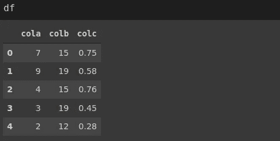
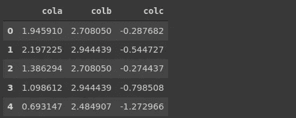
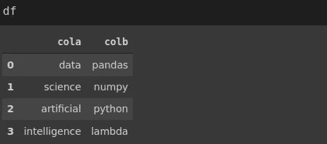
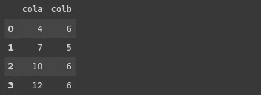

# Python 中 Lambda 表达式的威力

> 原文：<https://towardsdatascience.com/the-power-of-lambda-expressions-in-python-c5a1dcea9837?source=collection_archive---------15----------------------->

## 附有示例的实用指南


莎拉·多维勒在 [Unsplash](https://unsplash.com/s/photos/simple?utm_source=unsplash&utm_medium=referral&utm_content=creditCopyText) 上的照片

函数是一个代码块，它接受零个或多个输入，执行一些操作，然后返回值。函数是创建高效和强大程序的基本工具。

在本文中，我们将介绍 Python 中一种特殊形式的函数:lambda 表达式。我们需要强调的首要一点是，lambda 表达式是一个函数。

```
square = lambda x: x**2type(square)
functionsquare(5)
25
```

square 是一个返回数字平方的函数。在 Python 中定义函数的传统形式中，square 函数如下所示。

```
def square(x):
   return x**2
```

为什么我们需要一种不同的定义函数的方式？lambda 表达式背后的主要动机是简单和实用。

考虑一个需要做一次或很少几次的操作。此外，我们对这个操作进行了许多修改，与原来的略有不同。在这种情况下，为每个操作定义一个单独的函数是不理想的。相反，lambda 表达式提供了一种更有效的方式来完成任务。

lambda 表达式的一个关键特征是它们是无名函数。你可能会争辩说，我们实际上已经给 lambda 表达式指定了一个名称(正方形),但这只是为了演示的目的。一般来说，lambda 表达式是不带名字的。

lambda 表达式的一个常见用例是它们可以作为参数传递给另一个函数。Python 中的 map、reduce 和 filter 函数是高阶函数，可以接受其他函数作为参数。

让我们分别做一个例子，看看 lambda 表达式是如何派上用场的。我们有下面的列表 a。

```
a = [1, 3, 2, 6, 7, 4]
```

reduce 函数通过将一个函数应用于元素来缩减列表。我们可以编写一个 reduce 函数，将列表中的元素相乘。

```
from functools import reducereduce(lambda x, y: x*y, a)
1008
```

map 函数创建一个映射来转换列表中的每个元素。例如，下面的 map 函数根据给定的 lambda 表达式计算列表中每个元素的平方。

```
list(map(lambda x: x*x, a))
[1, 9, 4, 36, 49, 16]
```

过滤功能的操作类似于映射功能。它不是转换元素，而是根据给定的条件过滤元素。

```
list(filter(lambda x: x > 4, a))
[6, 7]
```

filter 函数中的 lambda 表达式用作大于 4 的元素的过滤器。

Lambda 表达式也用于 Pandas 数据操作和转换函数。考虑下面的数据帧。



(图片由作者提供)

例如，我们可以使用 apply 函数和 lambda 表达式获取列的日志。

```
import numpy as np
import pandas as pddf.apply(lambda x: np.log(x))
```



(图片由作者提供)

我们可以使用下面的 lambda 表达式和 apply 函数找到每行中的最大值。

```
df.apply(lambda x: x.max(), axis=1)0    15.0
1    19.0
2    15.0
3    19.0
4    12.0
dtype: float64
```

如果我们将轴参数更改为 0，该函数将返回每列中的最大值。

```
df.apply(lambda x: x.max(), axis=0)cola     9.00
colb    19.00
colc     0.76
dtype: float64
```

pandas 的 apply 函数根据指定的轴按列或按行执行给定的操作。

Pandas 还提供了 applymap 函数，允许对数据帧中的所有元素应用给定的操作。我们还可以将 lambda 表达式传递给 applymap 函数。

考虑下面的数据帧。



(图片由作者提供)

通过使用带有 applymap 函数的 lambda 表达式，我们可以找到每个单元格中字符串的长度。

```
df.applymap(lambda x: len(x))
```



(图片由作者提供)

## 结论

Lambda 表达式非常适合用来替代简单函数。它们还简化了语法。但是，一直使用 lambda 表达式并不理想。

Lambda 表达式不应用于执行复杂的运算。否则，我们将违背宗旨。

Lambda 表达式非常适合只做一次或很少几次任务。如果我们需要在整个代码中多次执行一个操作，最好是显式定义一个函数。

感谢您的阅读。如果您有任何反馈，请告诉我。