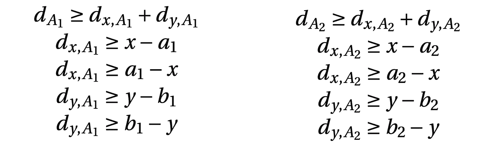
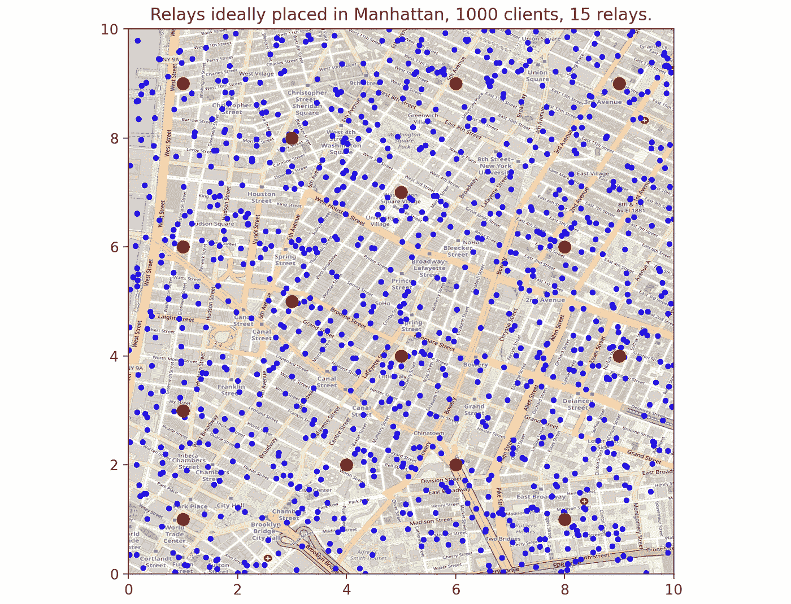

# 线性规划的力量，真实生活案例研究

> 原文：<https://towardsdatascience.com/the-power-of-linear-programming-a-real-life-case-study-6198b2cdb611?source=collection_archive---------14----------------------->

## 使用 Python 中的线性编程方法优雅地解决优化问题


(*图片作者*)

L 线性规划是一种广泛用于解决优化问题的强大工具，但从开发者的角度来看，这种方法仍然相对不为人知。

在这篇文章中，我将解释线性编程的基本原理，然后将这些原理应用到一个具体的日常生活问题中。

线性规划包括将数学模型应用于线性问题，以便最大化或最小化关于某些约束的目标函数。因此，它可以用来解决任何问题，可以表示为一个线性函数与一些参数和约束。例如，著名的[背包](https://en.wikipedia.org/wiki/Knapsack_problem)和[旅行推销员](https://en.wikipedia.org/wiki/Travelling_salesman_problem#Integer_linear_programming_formulations)问题是可以使用线性规划解决的优化问题。

基本上，算法的目标将是确定函数 f 的所有参数的最优值，以便得到对我们的问题的最佳拟合。希望我们已经有了解决这个问题的算法(例如:单纯形算法)，作为开发者，我们甚至可以使用特别优化的解算器来解决这类问题。大多数编程语言都提供了带有易用解算器的库。

困难的部分不是使用将解决我们问题的算法，而是找到一种方法将我们的初始问题转化为一个带有参数和约束的函数。

# 现实生活中的问题

在一些理论之后，让我们将线性规划应用到现实生活的案例研究中。

让我们假设我们是一个著名的电子商务平台，希望在一个城市引入中继站来运送其产品。我们仅有的数据是该公司所有客户在那个城市的位置(坐标)。我们的目标是根据客户的位置优化放置一些中继点。也就是说，我们要把城市里每个中继点和每个客户端之间的距离降到最低。

## 步骤 1 —翻译问题

首先，让我们把这个规范转换成一个可用的数学表达式。我们知道，在坐标在一个城市的情况下，我们可以用[曼哈顿距离](https://en.wikipedia.org/wiki/Taxicab_geometry)来近似两点的距离。

两点 A 和 B 之间的距离可以写成每个坐标之间距离的绝对值之和:


现在我们知道了如何计算两点之间的距离，让我们将其推广到客户端和所有中继点:


其中 **p** 为我们要放置的中继点数量， **l** 为全市客户端总数，(**，**易**)为想要放置的中继点的 p 坐标，( **al** ， **bl** )为全市所有客户端的 m 坐标。**

**因为我们想要最小化该表达式，所以我们添加最小化函数 min()，这意味着我们想要找到表达式的结果将接近最小值的最佳(xi，易)对:**

****

## **第二步——找到约束条件**

**下一步是定义关于方程的良好约束。约束将被写成不等式，如[松弛表](https://en.wikipedia.org/wiki/Slack_variable#:~:text=In%20an%20optimization%20problem%2C%20a,transform%20it%20into%20an%20equality.&text=Slack%20variables%20are%20used%20in%20particular%20in%20linear%20programming.)所示。这些约束将通过给出一些规则来避免方程求解的不可行性。在我们的例子中，对于给定的变量，我们想要遵守的唯一规则是距离计算中使用的绝对值。在线性规划中，我们不能直接在方程上使用绝对值函数来最小化，所以处理绝对值的一种方法是通过约束来[。基于以下规则，我们可以将绝对值转换为一对不等式:](https://optimization.mccormick.northwestern.edu/index.php/Optimization_with_absolute_values)**

****

**当对两个客户端(A1 和 A2)和一个中继点(x，y)之间的曼哈顿距离应用这些规则时，我们得到:**

********

**其中:**

****

**值得注意的是，我们需要为输入中收到的每对坐标编写约束。希望我们能在下一部分中自动生成每个点的不等式。**

## **步骤 3-求解器**

> **为了方便起见，我选择 Python 来实现这个解决方案。**

**好了，现在让我们暂时忘记数学，考虑一下实现。我们有要最小化的方程，我们有要应用的所有约束，现在做什么？如开头所说，我们一般使用求解器来求解线性程序，所以这里也不例外，让我们使用 Python 中的一个求解器:**

```
scipy.optimize.linprog(C, A_ub, b_ub, A_eq, b_eq)
```

**其中 **C** 是我们的方程， **A_ub** 是不等式的左手边， **b_ub** 是不等式的右手边，分别对于 **A_eq** 和 **b_eq** 是相同的，但是方程不同。**

**为什么只有 4 个变量来定义所有的约束？因为约束将被表示为巨大的系数矩阵。矩阵的每一列代表一个变量，每一行代表一个方程。**

**例如， **2x1 + 3x2 ≥ 100** 和 **4x1 + 6x2 ≥ 0** 被转化为:**

****A_ub** = [[-2，-3]，[-4，-6]]； **b_ub** = [-100，0]**

> **在松弛形式中，不等式应该使用≤所以我们对不等式进行逆运算。**

**对于每对坐标，约束(行)的数量将保持不变，如步骤 2 所示。但是变量(列)的数量将随着客户端/中继的数量而增长。**

**例如，这些是用于 1 个中继(x，y)和 2 个客户端(a1，b1)，(a2，b2)的变量:**

> **我们将在接下来的步骤中使用这个例子。**

```
1  var x >= 0;
2  var y >= 0;
3  var a1 >= 0;
4  var b1 >= 0;
5  var a2 >= 0;
6  var b2 >= 0;
7  var d1 >= 0;
8  var d2 >= 0;
9  var dx1 >= 0;
10 var dy1 >= 0;
11 var dx2 >= 0;
12 var dy2 >= 0;
```

**如果我们将所有这些变量视为一个向量，我们可以定义第一个参数 C，等式:**

```
C = [0, 0, 0, 0, 0, 0, 1, 1, 0, 0, 0, 0]
```

**因为我们希望最小化 **d1+d2** ，所以我们告诉设计 d1 和 d2 的列应该用 d1 和 d2 之前的系数(此处为 1)激活。如上面的变量列表所示，索引 6 和 7 实际上是 d1 和 d2。**

**然后，让我们计算代表在步骤 2 中定义的约束的不等式矩阵的左侧:**

```
A_ub = [
[0, 0, 0, 0, 0, 0, -1, 0, 1, 1, 0, 0],
[1, 0, -1, 0, 0, 0, 0, 0, -1, 0, 0, 0], 
[-1, 0, 1, 0, 0, 0, 0, 0, -1, 0, 0, 0], 
[0, 1, 0, -1, 0, 0, 0, 0, 0, -1, 0, 0], 
[0, -1, 0, 1, 0, 0, 0, 0, 0, -1, 0, 0], 
[0, 0, 0, 0, 0, 0, 0, -1, 0, 0, 1, 1], 
[1, 0, 0, 0, -1, 0, 0, 0, 0, 0, -1, 0], 
[-1, 0, 0, 0, 1, 0, 0, 0, 0, 0, -1, 0], 
[0, 1, 0, 0, 0, -1, 0, 0, 0, 0, 0, -1], 
[0, -1, 0, 0, 0, 1, 0, 0, 0, 0, 0, -1]
]
```

**参照向量 C，我们必须用变量在向量中的索引来代替变量。在上面的例子中，我将不等式转换成 x1+x2 **≤0** 的形式，以便右手边总是只有一个 0。这是一个实现细节，但我发现它在我的例子中很有用，因为 **b_ub** 将是一个零向量。**

> **注意 **A_ub** 有 10 行，因为一个中继点只有 2 个客户端，2*5 个约束= 10。**

**现在，最简单的部分，不等式的右边应该是一个零向量，如上所述:**

```
b_ub = [0, 0, 0, 0, 0, 0, 0, 0, 0, 0]
```

**说实话，最难的部分已经过去了；)，我们现在将填充方程矩阵。基本上，不等式是针对约束的，现在方程矩阵表示给定的数据，在我们的例子中，这个数据是客户的坐标列表。因此，矩阵的左侧在每一行为所有客户端枚举一个坐标(ai，bi ),然后在右侧定义该值。**

```
A_eq = [
[0, 0, 1, 0, 0, 0, 0, 0, 0, 0, 0, 0], 
[0, 0, 0, 1, 0, 0, 0, 0, 0, 0, 0, 0],
[0, 0, 0, 0, 1, 0, 0, 0, 0, 0, 0, 0],
[0, 0, 0, 0, 0, 1, 0, 0, 0, 0, 0, 0]
]
```

**不出所料，矩阵中所有客户端坐标(a1，b1)，(a2，b2)的位置都出现了一条对角线。**

```
b_eq = [10.0, 20.0, 15.0, 45.0]
```

> **这些值是客户坐标的例子。**

## **第四步——编码！**

**是时候开始编码了！(最后)**

**为了计算 5 个先前的矩阵/向量，最好将其分成 5 种方法:1 种用于等式，2 种用于不等式 rhs/lhs，2 种用于等式 rhs/lhs。以下方法采用两个参数:**

****M** :客户端坐标对(ai，bi)列表。**

****p** :需要放置的中继点数。**

**最后，使用上述所有方法调用求解器。**

**让我们用前面给出的例子进行测试:**

```
**Input**:
  M = [(10, 20.), (15, 45.)]
  p = 1**Output**:
  [(12, 28)]
```

**给定一个中继只有两个点，这两个点之间的直线上有无限多个最优解(例如:(13，44)在这种情况下也是最优解)，但它返回两个客户端坐标中间附近的一个点，这是一个相干解。**

## **第 4 步——处理大量客户/中继**

**如果我们在多个客户机上使用当前的实现会怎么样？该算法将总是返回一个点的最佳近似值。但是如果我们设置 p > 1，我们需要放置不止一个继电器。因此，我们需要找到一种解决方案，将客户群体 M 划分到应用线性规划的一些组中。可以使用不同的方法，但是，我将展示一个使用 [k-means 聚类算法](https://en.wikipedia.org/wiki/K-means_clustering)的示例，该算法允许根据客户的坐标将我们的客户群划分为 p 个集群(最近的客户将聚集在集群中)。**

```
**Input**:
  M=[(0, 50.), (100, 25.), (100, 40.), (50, 85.)]
  p=3**Output**: [[(0, 50)], [(100, 25), (100, 40)], [50, 85]]
```

**在上面的例子中，我们将人口 M 分成包含最近点的三个子阵列。使用 Python，可以使用 **numpy** 和 **scipy** 来完成，如下所示:**

**最后，通过连接所有的片段，我们来编写 **solve(M，p)** 方法。**

**现在享受大数据集上的算法:)**

```
**Input**:
  n = 10000
  M = [(float(random.randrange(0, n)), float(random.randrange(0, n))) *for* i *in* range(1000)]
  p = 5**Output**:
  [(3521, 8323), (1923, 5113), (2545, 1486), (7495, 2267), (7600, 7528)]
```

## **第 5 步——奖励:UI 可视化**

**基于随机生成的坐标，在城市地图上模拟该算法可能会很有趣。**

**我们可以观察到继电器的重新分配分布得相当好。现在您可以自由使用自己的实现了。**

****

## **还在读书？干得好！**

**感谢您的阅读，如果您有进一步的问题或本文中的错误，请随时联系我，这将是一种乐趣！**

**如果你在这篇文章中学到了什么，你也可以留下掌声:)**

**项目完整源代码:[我的 GitHub repo](https://github.com/TristanBilot/linear-programming-manhattan) 。**