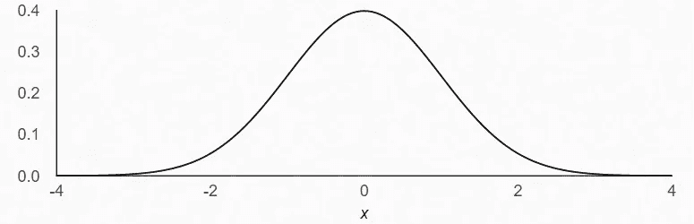
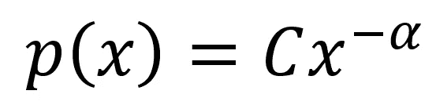
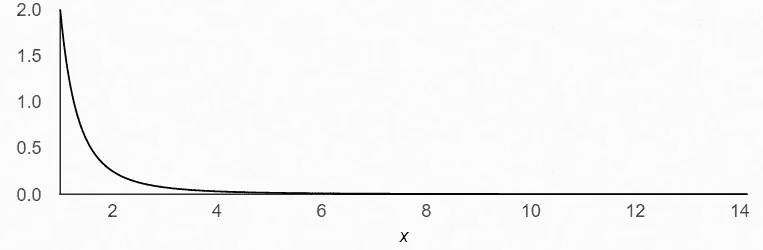

# 长尾分布的极限能力

> 原文：<https://towardsdatascience.com/the-power-of-long-tailed-distributions-bd46f8856039?source=collection_archive---------18----------------------->

## 学会区分长尾分布和正态分布

## 数据科学家识别长尾分布至关重要

美国国家海洋和大气管理局在 [Unsplash](https://unsplash.com?utm_source=medium&utm_medium=referral) 拍摄的照片

## 介绍

如果你处理数据，但你不知道你的钟形曲线的长尾理论，这篇文章是给你的。最重要的是，你能认识到长尾分布及其含义，我希望你能在这篇文章结束时认识到。

长尾分布出现在许多领域，产生了让世界震惊和敬畏的巨大事件。有知识的人利用它们并从中获益，而无知的人则在它们手中受苦。

在这篇短文中，我想直观地描述一下长尾分布。首先，我将简要介绍您可能熟悉的另一种分布类型，即正态分布(或钟形曲线)。

在任何关于长尾分布的讨论中，马修原理都是一个合适的开场白…

> “富人越来越富，穷人越来越穷”

## **直观呈现正态分布**

> 如果正态分布是一个人，他们将是公平和温和的。想想哈利·波特

我们大多数人最熟悉的概念是正态分布。如果我将一些现象描述为“正态分布”，你可能会立即描绘出一条漂亮的钟形曲线。该指标的平均值将正好位于中心，随着远离中心点向极端移动，其两侧都有斜率。

正态分布可以通过其均值( )和标准差(σ)方便地定义。平均值给出了分布的中心点，标准偏差是距平均值(或中心)的距离的度量。

作者图片:正态分布= 0 且σ = 1

正态分布现象出现在许多领域。有些你可能比较熟悉的是智商，身高，考试成绩。由于它们的对称性，它们很友好，容易管理。让我们看一个裁剪服务，看看这在实践中是如何进行的。

一个知道身高是正态分布的裁缝将只需要考虑满足人们平均身高的 3 个标准偏差。她的服务将适合大约 99.7%的人口。

为了获得对正态分布现象的进一步直觉，理解它们是如何产生的很重要。首先，我们将介绍中心极限定理。

T

以《自然》杂志为例，让我们看看成年人的身高。众所周知，遗传和环境决定一个人的身高。只关注基因，我们知道大约有 180 个基因影响身高[2]。一种特殊的基因可能会导致脊椎变长或胫骨变短等。在很大程度上，我们可以假设每个基因独立发挥作用。

因此，如果一个人的身高是这 180 个基因贡献的总和，那么整个人群的身高将按照中心极限定理呈正态分布。

我希望你现在已经对正态分布有了一些直觉。如果有足够的领域知识，你现在甚至可以推测现象什么时候是正态分布的。

那么，长尾理论呢？

## **长尾分布的力量**

> 如果长尾分布是一个人，他们可能是反社会和不稳定的。想想不可思议的绿巨人

长尾分布的其他名称是幂律分布和帕累托分布。

正态分布很直观，但我认为长尾分布同样不直观。这就是问题所在，长尾分布无处不在，难以识别；这应该与你有关。

在自然界中，它们出现在财富分布、图书销售、森林火灾规模、地震震级、数字媒体流等等。

P **幂律关系**:长尾分布由幂律关系定义。它们可以用指数α，常数 c 来表示。

p(x)在区间[min，∞]上表示。α > 1，决定故事的长度。

作者图片:幂律关系

作者图片:指数α=2 的帕累托分布

对不理解它们的人来说，它们表现为“不公平”，事实也的确如此。与正态分布不同，长尾现象不以中点为中心。它们是完全不对称的，极端事件是罕见的，不可预测的，但当它们最终发生时，会产生巨大的影响。

> 长尾分布是如何产生的？

我们可以用两个模型来描绘这些长尾分布是如何发生的。

P 一个节点连接的越多，就越有可能收到新的链接[3]。

偏好依附经常在社会领域发生。以 Instagram 为例，如果你把账号看成节点，把关注者看成连接；一个账户的关注者越多，就越有可能获得更多的关注者。社交媒体账户的关注者分布可能是长尾的。

S **自组织临界**:想象一个空的 N 乘 N 网格。在网格上随机选择一个地点，如果是空的，该地点生长一棵树的概率为 g。如果一个地点包含一棵树，闪电击中该地点的概率为(1-g)。被闪电击中的树着火，火势蔓延到所有相连的树[1]。

简单地说，大多数森林火灾都很小，但是有一个点，森林变得如此密集，火灾可能会很大。

在[森林火灾模型](https://www.aryan.app/randomstuff/forestfire.html)中，有一个很酷的自组织临界模拟。

> 我们为什么要关注长尾分布？

以地震这种大致遵循指数为 2 的幂律分布的现象为例[1]。

一场 9 级地震的规模相当于 2011 年日本本州的地震。据估计，这场地震已经导致大约 29，000 人死亡，并损坏了核反应堆。根据我们对地震分布的假设，这种震级的地震每天发生的概率约为百万分之一。在 1 个世纪中，这种百万分之一的事件发生的概率约为 3.5%。

考虑到它可能造成的破坏，这突然变得非常令人担忧。当你意识到大多数地震都在里氏 5-5.9 级[6]之间，比我们百万分之一的地震弱一千到一万倍时，情况就更是如此了。

缺乏对长尾现象的认识将导致政府对这些导致大规模破坏的极端事件准备不足。

作者纳西姆·尼古拉斯·塔勒布将这类事件称为“黑天鹅事件”。我将用其他一些长尾事件的真实例子来结束这一部分…

2004 年印度洋海啸，2008 年全球金融危机，新冠肺炎。

## 最后的想法

作为数据科学家、统计学家或建模者，我们应该把混淆长尾现象和正态分布现象视为一大罪过。我们必须致力于理解我们工作领域中事件的驱动因素，以便我们能够正确地管理它们。无论是管理自然灾害，还是利用自然灾害发展营销渠道，我们都必须能够做到与众不同。

第一步是理解两者之间的主要区别。我希望这篇文章对你有所帮助。

<https://www.linkedin.com/in/john-adeojo/>  

## *引文*

[1]斯科特·e·佩奇，2018 年。《模范思想家》，第 62、74 页

[2] Lango，Allen H .等人，2010 年。"聚集在基因组位点和生物途径中的数百种变异影响着人类的身高."自然 467，编号 7317:832–838

[3][https://en . Wikipedia . org/wiki/Barab % C3 % A1si % E2 % 80% 93 Albert _ model #:~:text = Preferential % 20 attachment % 20 means % 20 that % 20 the，of % 20 social % 20 networks % 20 connecting % 20 people](https://en.wikipedia.org/wiki/Barab%C3%A1si%E2%80%93Albert_model#:~:text=Preferential%20attachment%20means%20that%20the,of%20social%20networks%20connecting%20people)。

[5][https://www . live science . com/30320-worlds-biggestions-110412 . html](https://www.livescience.com/30320-worlds-biggest-earthquakes-110412.html)

[6][https://www . USGS . gov/natural-hazards/seismic-hazards/lists-maps-and-statistics](https://www.usgs.gov/natural-hazards/earthquake-hazards/lists-maps-and-statistics)