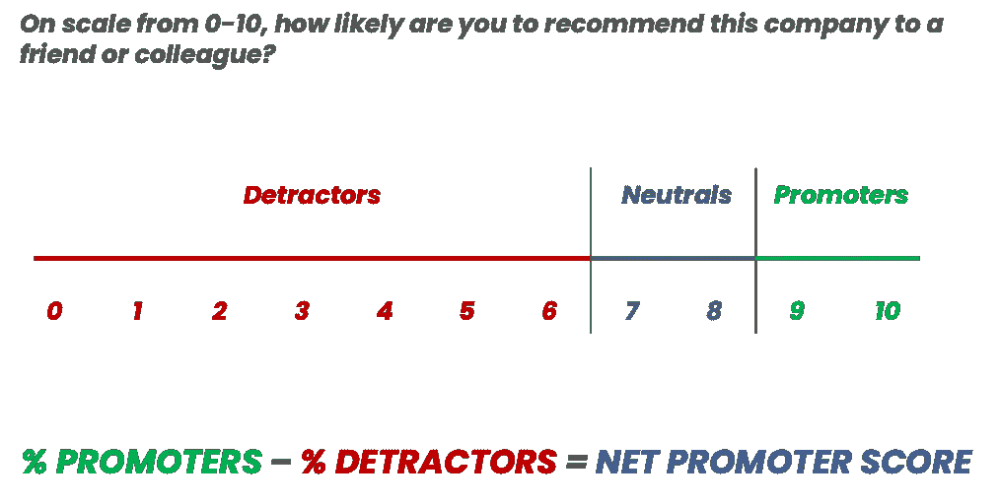
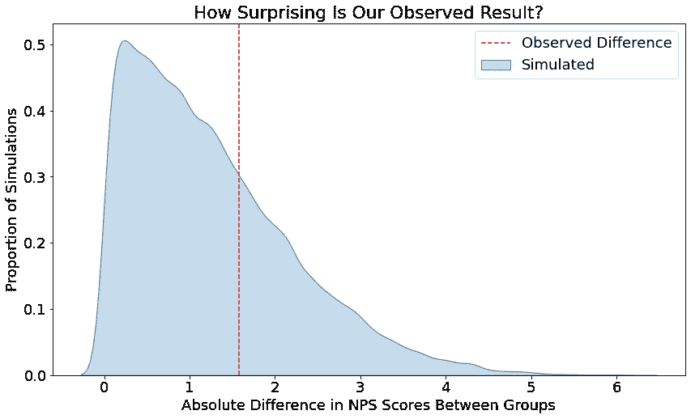

# 排列测试的威力

> 原文：<https://towardsdatascience.com/the-power-of-permutation-testing-c2ac66f2d166?source=collection_archive---------6----------------------->

## 如何让你的假设测试更有创意

假设检验已经存在了几十年，有了确定观察到的结果是否有意义的成熟方法。然而，有时很容易忘记使用哪种测试方法，或者它是否能可靠地应用于您的情况。

# 真实世界的用例

公司经常使用调查来跟踪他们的 [NPS](https://www.netpromoter.com/know/) (净推广者分数)，这是一种旨在反映客户忠诚度和增长潜力的措施。

计算很简单，问客户他们推荐你的企业的可能性有多大(0-10 分),然后从肯定的百分比中减去否定的百分比。



NPS 计算。图片作者。

然而，更不简单的是知道两个分数何时显著不同。传统的假设检验通常是回答两个均值、比例或方差是否有意义不同的问题。NPS 并不完全符合这些测试，因为它实际上是在测量两个相关比例的差异。

> 你用什么测试统计来做这个？

# 回归基础

需要某种解决方案。如果我们正在进行一项实验，随机抽样的客户接受一种新类型的服务，仅仅关注我们的调查结果是不够的，我们想知道它是否对他们的 NPS 产生了真正的影响。

进入排列检验，这是一项非常有用的技术，因为它可以应用于我们定义的任何检验统计量，并且不假设基础分布是正态的。

排列测试从零假设开始，即我们测量的两组之间没有差异。如果这个假设是真的，我们应该能够在两组之间随机改变所有的观察值，而不影响它们的总体统计数据。


由[科迪·诺丁汉](https://unsplash.com/@cody1nottingham?utm_source=medium&utm_medium=referral)在 [Unsplash](https://unsplash.com?utm_source=medium&utm_medium=referral) 上拍摄

# 冲洗并重复

为了检查是否可以拒绝零假设，数据被一次又一次地随机打乱，并且每次记录两个随机创建的组之间的差异。最后，两组之间观察到的实际差异可以与数千次模拟进行比较，以了解在零假设下有多令人惊讶/不太可能。

在使用这种方法时，我们可以省去任何复杂的公式，而是遵循一个直观的过程来捕捉零假设和 p 值的真正含义。

# 把你的代码放到你该说的地方

让我们看看如何在 Python 中实现这一点。

首先，假设我们有一个数据集，其中包括两个不同组的客户的 NPS 调查回复:

```
import pandas as pddf = pd.read_csv('nps_data.csv')
df.head()*| group   | response |
| ------- | -------- |
| control |        7 |
| test    |        3 |
| ...     |      ... |
| test    |        5 |*
```

我从 [Displayr](https://www.displayr.com/nps-recoding/) 借来的一个方便的技术表明，我们不必每次都计算支持者和反对者的百分比，以便将一个从另一个中减去。我们可以用 100 代替推广者分数，用-100 代替贬低者分数，用 0 代替中立者分数，这样取平均值就代表了总的 NPS 分数。

```
df.loc[df['response'].between(0, 6), 'recoded'] = -100  # Detractors
df.loc[df['response'].between(7, 8), 'recoded'] = 0  # Neutrals
df.loc[df['response'].between(9, 10), 'recoded'] = 100  # Promoters
```

接下来，我们需要一个可以随机洗牌并记录 NPS 差异的过程。

```
import numpy as np

def simulate_difference_in_nps(nps_data: pd.DataFrame) -> float:
    *"""
    Shuffle all of the responses and reassign them to each group, 
    before calculating the absolute difference in NPS between the 
    two groups in this simulated scenario.

    Parameters
    ----------
    nps_data : pandas DataFrame
        Dataset containing the NPS scores of survey respondents from 
        two different groups.

    Returns
    -------
    float
        The absolute difference in NPS scores between the two groups 
        once all of the responses had been shuffled and reassigned 
        to each group.
    """* responses_in_single_group = nps_data.value_counts('group')[0]

    randomly_shuffled = np.random.permutation(
        nps_data['recoded'].values
    )

    nps_1 = randomly_shuffled[:responses_in_single_group].mean()
    nps_2 = randomly_shuffled[responses_in_single_group:].mean()

    return abs(nps_2 - nps_1)
```

考虑到即使对于一台强大的计算机来说，探索结果的每一种可能的排列通常也是不切实际的，这个过程将被一次又一次地重复，以建立一个健壮的模拟样本。这种采用固定数量的样本而不是所有可能的排列的方法被称为蒙特卡罗方法。

```
num_simulations = 100000

simulated_results = []

for _ in range(num_simulations): simulated_results.append(
        simulate_difference_in_nps(nps_data=df)
    )

simulated_results = np.array(simulated_results)
```

最后一步是，在将我们观察到的数据与数千个随机排列的数据进行模拟比较后，确定我们是否可以拒绝零假设。

```
**# This would be calculated from the original data, but let's 
# hard-code a value for simplicity**
observed_difference_in_nps = 1.6**# Use 5% level of significance**
significance_level = 0.05**# How often did we see a difference as extreme, or more extreme, 
# than what was observed** simulations_as_or_more_extreme = sum(
    simulated_results >= observed_difference_in_nps
)**# The observed result is statistically significant if its p-value is 
# less than the pre-defined significance level 
# i.e. it was very unlikely to occur under the null hypothesis** num_simulations = simulated_results.shape[0]
p_value = simulations_greater_than_observed / num_simulations**# Boolean which is True if significant, False otherwise**
significant_or_not = p_value < significance_level
```

作为一个很好的奖励，通过执行所有这些随机模拟，我们甚至可以想象在零假设下我们观察到的结果会有多不寻常。

```
import matplotlib.pyplot as plt
import seaborn as sns **# Plot permutation simulations**
density_plot = sns.kdeplot(simulated_results, shade=True)density_plot.set(
    xlabel='Absolute Difference in NPS Scores Between Groups',
    ylabel='Proportion of Simulations',
    title='How Surprising Is Our Observed Result?'
)

**# Add a line to show the actual difference observed in the data**
density_plot.axvline(
    x=observed_difference_in_nps, 
    color='red', 
    linestyle='--'
)

plt.legend(
    labels=['Observed Difference', 'Simulated'], 
    loc='upper right'
)plt.show()
```



观察差异与随机排列的比较。图片作者。

就这样吧！

我们现在有了一个对 NPS 分数进行双尾检验的模板。对于单尾测试来说，重构代码不会花费太多精力；只需记录每个排列的差异，而不是绝对差异。

# 放在一起

上面的实现有助于解释所需的步骤，但是有点笨拙和低效。

查看我的 [GitHub repo](https://github.com/osulki01/nps_significance_testing) ，看看如何将这个过程放置在一个更高效的、经过单元测试的 helper 类中，当重复排列过程时，这个类可以在多个内核上并行化。

同一个回购协议还包含如何使用代码的演示如下。

在 NPS 分数上使用排列测试的演示笔记本，以确定它们是否显著不同。

# 三思而后行

为了便于说明，本文主要关注 NPS，但是置换测试可以应用于任何领域，尤其是那些我们不确定我们测量的变量的分布是什么样子的领域。

然而，与任何统计方法一样，在使用排列测试之前，有一些事情需要考虑。

1.  我们仍然需要从合适的样本量开始。如果每组只有 3 名受访者，任何形式的假设检验都可能是毫无意义的。
2.  零假设表明每组的值是可交换的，因此我们在技术上测试第 1 组的值是否来自与第 2 组相同的分布。因此，置换测试仍然假设两组具有相同的潜在方差，这可能并不总是有效的。
3.  知道要执行多少排列可能很困难。简而言之，最好谨慎行事，在我们愿意等待的时间内，尽可能多地选择我们的机器能够处理的数量。有很多关于提前选择号码的进一步阅读。

记住这些注意事项，您将安全地为您的数据科学工具包添加一种全新的测试方法。

# 当你在这里的时候

请随意查看我的其他文章:

*   [避免内存不足的简单窍门](/a-simple-trick-to-avoid-running-out-of-memory-d45b0a014ceb)
*   [如何找到合适的簇数](https://kieran-95138.medium.com/how-to-find-the-right-number-of-clusters-acc1130ed231)
*   [如何管理初级数据科学家](/how-to-manage-a-junior-data-scientist-2a5b023eda37)
*   [计算您的损失函数](/making-your-loss-function-count-8659cf65feb1)

# 参考

[1] Rand R. Wilcox，8-比较两个独立组，编辑:Rand R. Wilcox，应用当代统计技术，学术出版社，2003，第 237-284 页，ISBN 9780127515410，[https://doi.org/10.1016/B978-012751541-0/50029-8](https://doi.org/10.1016/B978-012751541-0/50029-8)。
([https://www . sciences direct . com/science/article/pii/b 9780127515410500298](https://www.sciencedirect.com/science/article/pii/B9780127515410500298))

[2][http://教职工. Washington . edu/ken rice/sisg/sisg-lie 11-05 . pdf](http://faculty.washington.edu/kenrice/sisg/sisg-lie11-05.pdf)

[3][https://www . evaluation onresearch . com/WP-content/uploads/kb/SpecialReport _ montecarlosimulationrials . pdf](https://www.valuationresearch.com/wp-content/uploads/kb/SpecialReport_MonteCarloSimulationTrials.pdf)