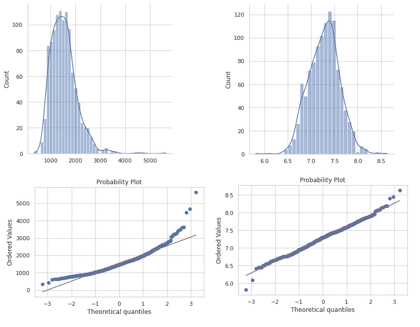
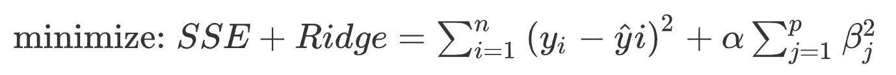
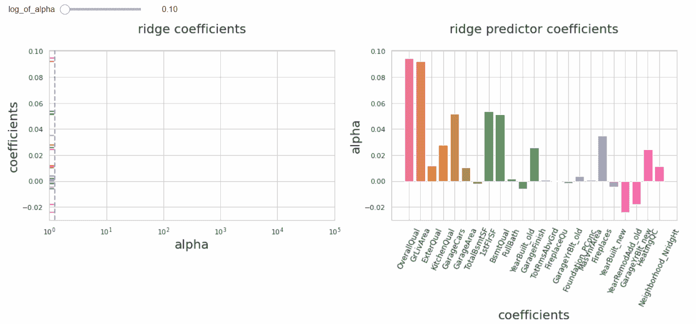

# 应用交叉验证的岭回归

> 原文：<https://towardsdatascience.com/the-power-of-ridge-regression-4281852a64d6?source=collection_archive---------10----------------------->


汉斯·M 在 [Unsplash](https://unsplash.com/s/photos/house-scandinavia?utm_source=unsplash&utm_medium=referral&utm_content=creditCopyText) 拍摄的照片

## 一个回归问题的演练，包括预处理、特征选择和超参数调整

数据科学家经常被要求在没有给出特定指令的情况下预测商业环境中的目标变量。这是一项具有挑战性的任务，有多种方法可以到达终点线。这个博客是一个如何利用岭回归进行端到端多元分析的例子。举例来说，众所周知的[住房数据](https://www.kaggle.com/c/house-prices-advanced-regression-techniques/data?select=data_description.txt)被挑选出来，其中房屋销售价格将是目标变量。

# 预处理

首先，我从消除因缺乏舒适设施而导致的缺失数据开始。像 area 这样的数字缺失值被替换为零，因为用零表示不存在的区域更有意义。带有有序分类值的列中缺少的值将被替换为字符串，以指示该观察中没有数据点。在这里，用一个字符串代替`np.nan`是很重要的，因为它们将按顺序被赋予代表它们等级的数值。对于其余的分类值，缺失的数据将替换为最常用的值。

第二，每个分类值都被转换成一个数值。有序分类值被替换为数字表示，并按照以下代码的顺序保留它们的等级:

```
# creating the dictonary including the replacement values
bsmt_zip = {'Ex':6,'Gd':5,'TA':4,'Fa':3,'Po':2,'NA':1}# using the map function to complete the replacement
housing_data.BsmtQual = housing_data.BsmtQual.map(bsmt_zip)
```

年份列被转换成三个箱:新的、旧的和年中的。1978 年以前的房屋被贴上老旧的标签，因为那时的房屋被涂上了含铅油漆，这在 1978 年是被禁止的。1999 年以后建造的房屋被标为新的。

```
housing_data.YearBuilt.map(lambda x: 'new' if x>1999 else ('mid' if x>1978 else 'old'))
```

稍后，其余的分类值将替换为数值:

```
# columns containing string values
string_columns = df_types[df_types[0]=='object']['index']# columns with only numeric values
non_string_columns = df_types[df_types[0]!='object']['index']# creating dummy columns for string columns
dummy_df = pd.get_dummies(housing_data[string_columns])# dummy and numeric columns are concatenated
df = pd.concat([dummy_df,housing_data[non_string_columns]], axis=1)
```

在这一点上，预测器的数量是 247，需要减少，并且有多种方法可以实现。我将尝试通过检查预测值与目标值的相关性来手动减少预测值的数量。然后利用岭回归调整它们在模型中的系数。与常规多元线性回归相比，我更喜欢岭型回归，因为我的数据有共线列。就正则化偏好而言，我选择山脊而不是套索，因为我已经选择了最相关的预测因子，并且不需要强制预测因子系数为零的苛刻正则化。换句话说，我不需要特征选择技术，我只需要调整我的模型分配给不同预测器的权重。

```
# correlations between sale price and other fields
df_corr = abs(df.corr()).sort_values(by='SalePrice', ascending=False)[['SalePrice']]# a new dataframe including only the relevant predictors
df_small = df[df_corr[df_corr['SalePrice']>0.4].index.tolist()]
```

到目前为止，还剩下 23 个与销售价格的相关系数高于 0.4 的预测值。下一步是将数据集分为训练和测试。

```
X_train, X_test, y_train, y_test = train_test_split(X, y, test_size = 0.25, random_state = 42)
```

这不是必须的，但是在这一点上，我想对多个列应用 log-transform，在这些列中有多个异常值，并且分布有一个正偏差。下面是地面生活区对数变换前后的情况。第一个直方图具有由异常值引起的正偏斜，并且第一个概率图显示了它不是正态分布的良好代表的事实。



图像的左侧和右侧分别代表地面生活区对数变换前后的情况

预处理的最后一步是标准化。有必要将每个预测值调整到相似的范围。否则，一些列将支配其他列。在这种情况下，`StandardScaler`用于根据方差对列进行缩放。这是应用岭回归前必不可少的一步。

```
from sklearn.preprocessing import StandardScaler
# initiate the standard scaler
ss = StandardScaler()
# fit 
Z_train = ss.fit_transform(X_train)
# transform the df
Z_train = pd.DataFrame(ss.transform(X_train), columns=X_train.columns)
```

# 应用岭回归

当应用脊正则化时，我们需要找到用α表示的最优惩罚系数。阿尔法值越高，系数的惩罚就越强。



让我们检查一下 alpha 对系数的影响。这里，标度是α的对数，因为它具有平方误差值。(对于 Lasso，它将是 alpha 本身，因为它使用误差的绝对值而不是误差的平方。)



当α增加时，观察到系数变小是有意义的，但下一个问题是，我们需要选择哪个α来获得最优解？为此，我将使用交叉验证。

```
# list of alphas to check: 100 values from 0 to 5 with
r_alphas = np.logspace(0, 5, 100)# initiate the cross validation over alphas
ridge_model = RidgeCV(alphas=r_alphas, scoring='r2')# fit the model with the best alpha
ridge_model = ridge_model.fit(Z_train, y_train)
```

在意识到使用哪个 alpha 和`ridge_model.alpha_`之后，我们可以利用优化的超参数并拟合新的模型。在我的例子中，测试的 R 值为 85.99%，训练的 R 值为 83.92%。

训练分数还不错，但如果能通过测试数据获得更高的分数就更好了。在可能遭受过拟合的数据集中，我们实现了避免这种情况，并使模型适应信号而不是噪声。

我的方法的下一步可能是比较手动特征选择之上的岭回归和套索回归的结果。毕竟，Lasso 本身将涵盖特征选择和建模。

在上文中，我尝试总结了如何在将数据集输入模型之前对其进行预处理的方法，包括处理缺失值和分类值、挑选相关字段以及标准化。在决定了要使用的算法之后，我决定了最佳的超参数，并将其应用到我的测试数据中。

感谢阅读到最后，你可以在这里找到我的笔记本[。如有任何问题或意见，请](https://colab.research.google.com/drive/1Oyk5m-jtmsyWAKaPatePLfuddRbInS8n?usp=sharing)[联系](https://www.linkedin.com/in/yalimdemirkesen/)。

[1] M. Brems，J. Pounders，K. Katovich，正则化(2019)，大会数据科学沉浸式
[2] P .马塞利诺，[用 Python 进行全面的数据探索](https://www.kaggle.com/pmarcelino/comprehensive-data-exploration-with-python) (2017)，Kaggle