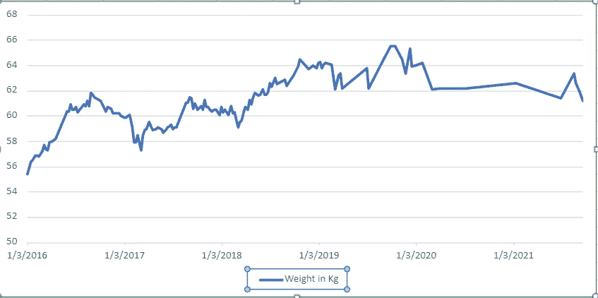
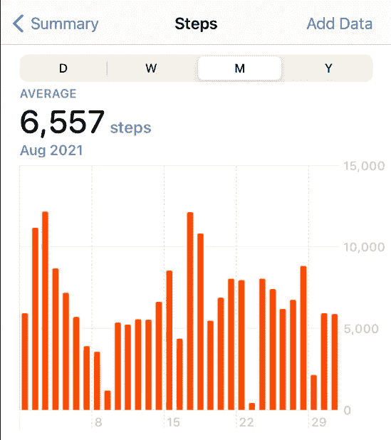

# 健康数据分析的力量

> 原文：<https://towardsdatascience.com/the-power-of-your-health-data-analysis-d48bd61f72ea?source=collection_archive---------51----------------------->

## 个人幸福分析的巨大可能性

[国家癌症研究所](https://unsplash.com/@nci?utm_source=medium&utm_medium=referral)在 [Unsplash](https://unsplash.com?utm_source=medium&utm_medium=referral) 上拍摄的照片

个人健康数据。

你测量它吗？你分析一下吗？它真的有助于改善你的健康吗？

我思考过这个问题。

我在我的村子里见过一些健康的 80+甚至 90+的人，他们可能甚至没有想过跟踪他们的健康数据。他们只是遵循一些好的惯例和习惯。专注于数据分析而不是简单地生活和享受生活会不会太过分了？为什么要做这样的分析？这一切不会太过分吗？

但是，事实是，我们改进了我们测量和分析的东西。

对于那些没有测量和分析数据的人来说，潜意识里，他们关心自己的健康。他们不需要工具来提醒他们需要控制饮食来保持体重。他们不需要数步骤来验证，以确保他们继续前进。或者他们不需要睡眠时间的数据来提醒他们睡眠对每天获得充足睡眠的重要性。他们下意识地做了所有这些。

但是，现在，当我们有工具和方法来有效地做到这一点时，为什么不利用它而不是做得太多呢？

你知道，我们在系统、现实世界的问题、业务增长等方面做了如此多的计划、测量和复杂的数据分析，为什么不在个人健康方面也做一些努力呢？

在我们 20 多岁的时候，我们没有意识到它的重要性，因为你甚至不觉得这些事情有什么关系。你的身体几乎可以应付任何事情。但是当你进入 30 多岁时，你意识到你应该好好照顾自己的健康。我也不例外。

在这篇文章中，我分享了我测量和分析的一些数据是如何帮助我改善健康的。我还想到了一个概念或想法，我想在文章的结尾分享，这只是一个想法，但可能有巨大的可能性。

## 1.重量数据

你能测量这些年来你的体重是如何变化的吗，因为这是衡量长寿和健康生活的重要因素之一。

我认为我们不应该仅仅强调体重，还应该强调其他参数，比如测量腰围，这可以显示腹部脂肪和肥胖的风险，但简单地测量体重数据并进行分析也有助于我提高。

35 之前，我只是偶尔测一下。我是一个瘦的家伙，我的体重是 55 公斤，接近体重不足。从 27 岁开始，我的体重增加了。

从 27 到 33，我上了 72 公斤。暴饮暴食、缺乏良好的睡眠习惯、缺乏锻炼和巨大的压力导致了体重增加。因为我没有持续地测量它，所以我既没有意识到这些变化的发生，也没有做任何事情来控制它。

我随后将体重降低到 55-56，直到 2016 年我 36 岁。自 2016 年以来，我在过去 5 年中定期测量我的体重以及我和我家人的健康数据。我分析了这些年来体重的变化。这是数据看起来的样子。

随着时间的推移，以千克为单位的个人体重数据(图片由作者提供)

1.  在这 5 年里，我的体重从 55 公斤到 65 公斤不等。
2.  大部分时间保持在 60 到 62 公斤的范围内。对于我 5 英尺 5 英寸的身高和年龄来说，这似乎是最理想的。因为我测量并分析了它，所以我有意识地始终保持在这个范围内。

## 2.锻炼数据

你和你的日常锻炼有多一致？你可以记录你每天走的步数。你可以追踪移动花费的时间。

我发现我在工作日一直坐在一个地方。我的 IT 工作的性质就是这样，也许在过去不是这样。如果我没有保持运动的提醒，我甚至不会一天完成 2000 步，而通常我最终能做到的平均水平是 6500 步/天。

当我开始在 Strava 上跟踪我的晨间散步数据时，类似的事情发生了。我越来越多地跟踪我的日常散步、跑步和测量进展，它显示我在哪里，我可以在哪里改进。

我有规律地晨跑了 70 天。

今年我坚持走了 [208 天](https://medium.com/me/stats/post/5a5de9023dd4)。

如果我没有测量和分析数据，这一切都是不可能的。它实际上会激励你做更多的事情。

## 3.年度体检数据

我曾经在一本书上读到过，在日本，大多数人每年做一次体检是很正常的，而且他们通常活得更长。他们及时发现了任何急性疾病。

然而，我也有另一种观点，我们不应该去检查，除非身体出现症状。我们的身体是一台比人类能创造的任何其他系统都要聪明得多的机器。

有相反的观点，为什么不在它们之间取得平衡，在你过了 30 岁后每年做一次体检。

结果数据，如你的胆固醇水平、甘油三酯水平、血糖、甲状腺水平、血压等，可以显示多年来的模式。我发现每次做体检的时候，我也开始通过锻炼等方式做更多的事情来增进健康。这是一个提醒。

此外，我们可以测量和分析许多其他参数。再举几个例子:

*   一年中你身体不适的周数。当我多年来测量它时，这个数字开始下降。
*   你一天喝多少水？这个我是吃了苦头才知道的。我没有喝足够的水，这成为了患肾结石的主要原因之一。现在我在桌子上放了两瓶水，这样我就能保证每天喝两次。

我们后来才意识到健康的重要性。这就是为什么从来不运动的人在 30 多岁时开始跑步和锻炼。你可能已经注意到了。测量和分析你的健康数据可以给你带来健康生活所需的洞察力。毕竟，这几乎不需要任何时间，分析也不复杂，也不需要复杂的工具。

这让我进一步思考一个有趣的想法。

# 个人幸福分析

你知道，当我每周追踪我的体重数据时，我也输入了一些评论。我不分享这些细节，因为这是个人资料，但我写了我生活中发生的事情。

这些数据有助于分析我减肥的时间与我生活中发生的事件以及我的健康状况之间的相关性。

自从我开始工作以来，我还记录了过去 19 年的个人财务数据。我知道我的净值是如何增长的，因为我每个月底都会更新它。我能在我的健康和财务数据之间建立任何关联吗？当我挣得更多或存得更多时，我更快乐吗？或者说，当我的净资产增长时，我的身体和精神健康吗？或者反之亦然？你明白了。

进一步延伸，可以把我们所有的健康、财务、精神、职业、情感、社会数据等等。这将提供一个关于个人幸福的指数。

以及一个预测分析解决方案，它将分析所有这些数据，并建议您可以做些什么来增加您健康中缺少的一个领域。也许你在经济上做得很好，但是在情感上你做得不太好，或者你缺乏社会交往。该解决方案可以分析这些事情，并提供具有人工智能功能的日常建议。

很少有例子像—

*   如果它知道你身体状况不佳，也许会建议你进行体育活动
*   也许建议从事一项爱好(精神)
*   或者，如果数据显示你感到疲劳，需要休息(情绪上的),建议一个度假的地方
*   或者建议和一个你喜欢的很久没说话的人进行一次有趣的对话(社交)
*   或提供赚钱或消费的机会(金融)
*   或者建议读一本书或一篇文章或看一部电影(心理)
*   或者建议捐赠给离你最近的需要帮助的人，或者做一些可以帮助他人的好事(精神上的)

类似这样的事情。

选择是无穷无尽的。该应用程序可能过于个人化，无法为每个人定制某个功能，因此结果可能尽可能地因人而异。它可以从各种应用程序中获取数据，如果数据已经存在于这些应用程序中(比如 Strava、Apple Health、您的财务规划师等)，并提供智能以提供洞察力。

这是目前的想法。我不知道已经有这样的解决方案。我可以想象，这可能是，但如果不是，我可以想象这是如何个性化的，对一个人来说是独一无二的，并尽可能全面地利用人工智能能力。

这个解决方案，我称之为 PWA(个人幸福分析),只是我想出来的一个名字。它能有助于提高幸福感，而不会给生活带来太多人为的味道或干扰吗？

我认为有巨大的可能性，它可以提高生活的幸福和长寿。你怎么想呢?

***(你可能也喜欢*** [***数据分析在解题中的重要性***](/the-importance-of-data-analysis-in-problem-solving-2f8ad041708d) ***关于走向数据科学。)***