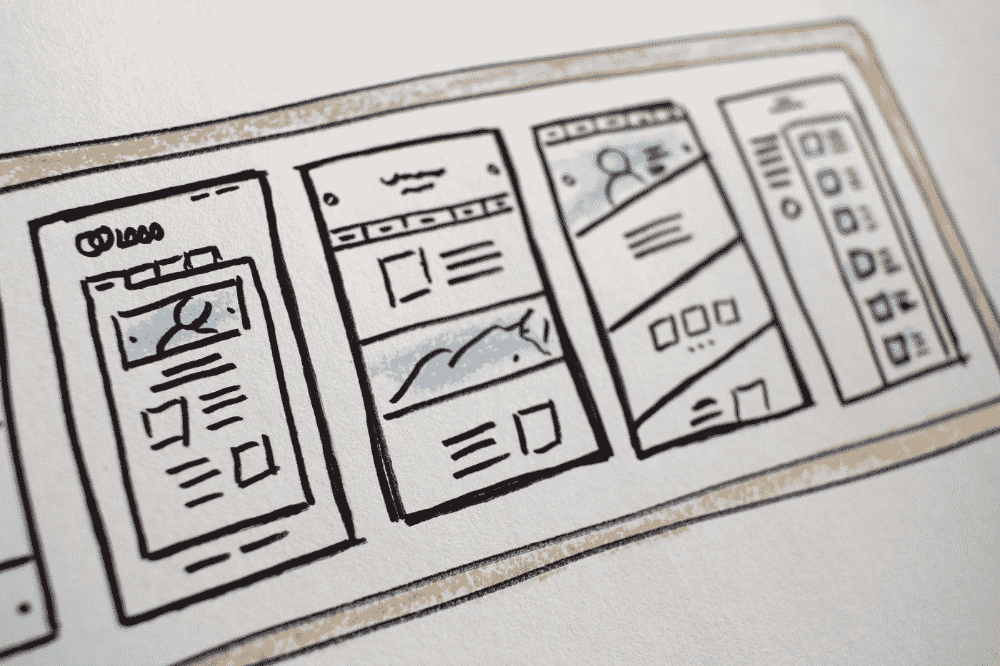

# 提供有效技术演示的实用策略

> 原文：<https://towardsdatascience.com/the-practical-strategies-to-deliver-an-effective-technical-presentation-53a48b11c74c?source=collection_archive---------19----------------------->

## 有效进行技术演示的技巧

马修·奥斯本在 [Unsplash](https://unsplash.com?utm_source=medium&utm_medium=referral) 上拍摄的照片

技术演示是不可避免的，尤其是在围绕快速发展的技术堆栈、算法和工作流传递知识时。

技术演示跨越不同的背景，例如

*   技术销售演讲
*   示范
*   技术支持
*   知识传授会议。

其中每一个都需要不同的粒度来传递关于技术概念的想法，或者向特定的观众群演示技术现场演练。

我第一次糟糕的技术分享激发了我对有效交付方式的探索。对我来说，解释 [LSTM](https://colah.github.io/posts/2015-08-Understanding-LSTMs/) 和建筑结构似乎是一项不可能完成的任务。不用说，观众没有从两个小时的会议中带走任何东西。

从那以后，我努力寻找不同的方法来有效地传递内容。我应用这些方法，观察它在各种场合下的效果，一路修补技术。

*作者照片*

下面是清单上最重要的 3 个诀窍，它们会让一个糟糕的会议变得有意义。唯一的目的是最大限度地理解主题，使会议有价值。

## 内容的要旨:

1.  从大图到细节。而不是相反。
2.  理解观众。
3.  视觉化就是一切。

# 1.从大图到细节。而不是相反。

## **背景:**

演讲者选择演讲顺序的一个常见做法是使用时间顺序来解释某个主题的某个流程。

在技术世界里，这通常意味着它从解释基本块或基本模块开始，这些基本块或基本模块构成了更大的东西。它也可以指从步骤 1 到步骤 N 的工作流程的演练，以实现目标。

由 [Lucrezia Carnelos](https://unsplash.com/@ciabattespugnose?utm_source=medium&utm_medium=referral) 在 [Unsplash](https://unsplash.com?utm_source=medium&utm_medium=referral) 上拍摄的照片

虽然这是完全正常的，但技术模块需要曲折才能完成某个里程碑。可能只有当观众到达旅程的终点时，他们才可能在理解所有的咕哝时刻导致什么的顿悟时刻到来。

这里有一个问题，幸运的是观众们还在关注，大多数人在那之前都没有成功。对于那些开始理解最终目标并打算更彻底地理解这个过程的人来说，这个会议可能已经接近尾声了。

## 相反，应该这样做:

由[欧洲航天局 ESA](https://giphy.com/europeanspaceagency/) 在 [Giphy](https://giphy.com/gifs/EuropeanSpaceAgency-space-tech-7SEDoQAKDtf6YjTw6w) 上拍摄的照片

在课程开始时描绘出大的蓝图，详细说明在终点线上的目标是什么样的，并将其分解为实现该目标所需要的条件。这也间接地增强了观众跟随你完成潜在挑战性步骤的毅力，比如通过代码行的解释，或者算法的分解。

照片由[亚历克斯·金](https://unsplash.com/@stagfoo?utm_source=medium&utm_medium=referral)在 [Unsplash](https://unsplash.com?utm_source=medium&utm_medium=referral) 上拍摄

建立基础只是旅程的开始。在演示过程中，定期与观众进行里程碑检查。清楚地说明我们所处的步骤，我们的前进方向，以及这一步如何映射到全局。

# 2.理解观众。

*作者照片*

几乎每当我准备演讲时，我都会围绕听众提出以下问题。

*   观众是谁？
*   他们有什么背景？
*   人群有多少？

这有助于在考虑听众的情况下塑造整个演讲的基调。从本质上来说，一场演讲的成功取决于每个接受者能拿走多少。因此，清楚地知道谁是接收者，就可以直接决定演示的内容。这包括

*   衡量要涵盖的主题的复杂性
*   确定要包含的背景上下文
*   围绕技术概念形成行话

取决于听众的背景，演讲者通常不得不缩小范围，简化内容，并以听众能够理解的方式来呈现。

简化并不意味着你遮蔽或不解释关键概念，而是强调和关注一些最重要的关键点。人类的注意力是有限的，关注他们最容易忘记的 1000 件事情是没有意义的。相反，把注意力集中在 3 个最重要的关键点上，观众会机智地自己去填补缺失的谜题。

# 3.视觉化就是一切。

在 [Unsplash](https://unsplash.com?utm_source=medium&utm_medium=referral) 上由[halance](https://unsplash.com/@halacious?utm_source=medium&utm_medium=referral)拍摄的照片

虽然技术内容本质上很复杂，但交付方法不一定如此。无论讨论的话题是什么，重新思考呈现方式总是可以的。

有多种可视化方法，从图表、图形、信息图、表格等等开始。

以下是一些非常适用于大多数场景的可视化方法:

*   **流程图**

大多数工程解决方案由一系列步骤和过程组成，每个步骤都有特定的输入和输出。以图形方式展示有助于一目了然地描绘出整个工作流程，并有助于参照流程图一步一步地解释细节。

*作者照片*

*   **表**

工程界的决策是一系列的权衡，权衡利弊，选择最适合情况的一个。

*作者照片*

*   **XY 图形**

XY 图形是一个二维图形，显示 x 元素(水平轴)和 y 元素(垂直轴)之间的关系。这是一个直观的方法来说明输入元素的变化如何影响输出元素。

*作者照片*

总是从解释 X 轴和 Y 轴的含义开始。比如当 X <increase>，Y <increase>，而这个可以翻译成<elaboration here="">。这将最大限度地解释收件人对表。</elaboration></increase></increase>

技术想法、算法、编程有时可能会令人痛苦，但演示不一定会如此。把听众放在心上，并打算有效地传达你的想法，你的演讲将会很棒。

**下次见！**