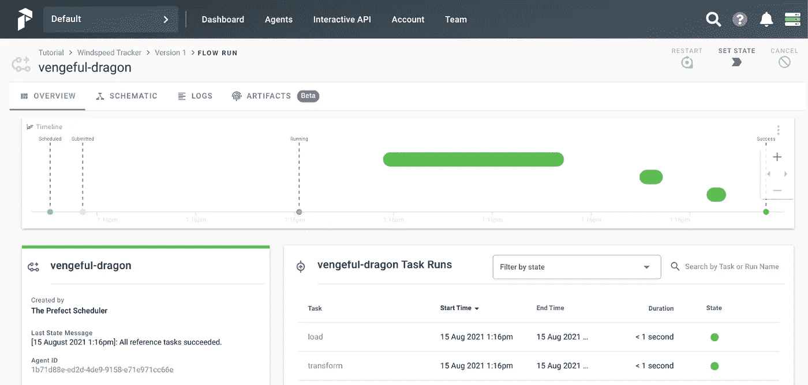
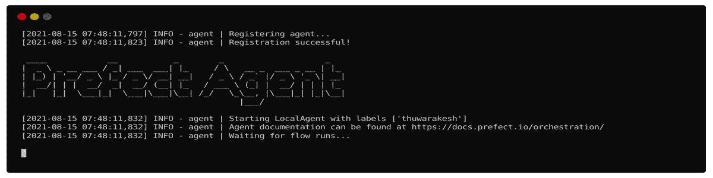
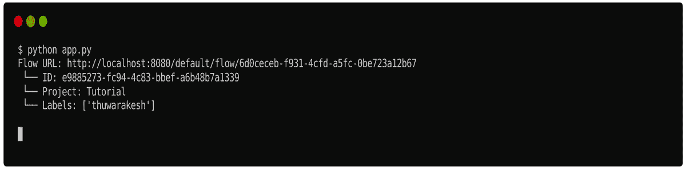
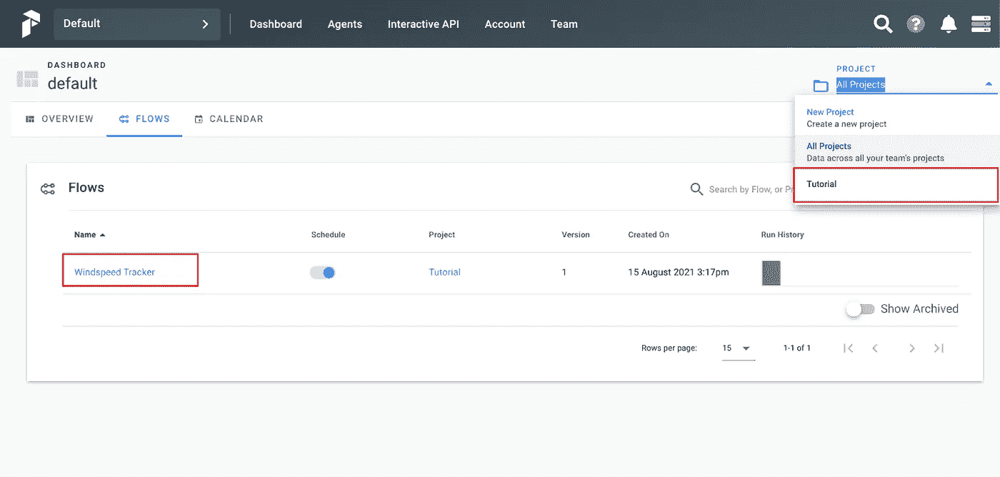
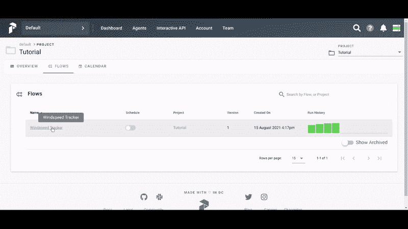

# 自动化和编排数据管道的完美方式

> 原文：<https://towardsdatascience.com/the-prefect-way-to-automate-orchestrate-data-pipelines-d4465638bac2?source=collection_archive---------9----------------------->

## 我正在将我所有的 ETL 工作从 Airflow 迁移到这个超级酷的框架中


从[展开的插图](https://undraw.co/illustrations)

我是阿帕奇气流的忠实粉丝。即使在今天，我也没有太多抱怨。但是新的技术提督在许多方面让我感到惊讶，我忍不住将一切都迁移到它身上。

提督(和气流)是一个工作流程自动化工具。您可以编排单个任务来完成更复杂的工作。您可以管理任务相关性，在任务失败时重试任务，调度任务等。

我相信工作流管理是每个数据科学项目的支柱。即使是小项目也可以通过像 Prefect 这样的工具获得显著的好处。它消除了大量重复性任务。更不用说，它还消除了复杂项目中的思维混乱。

这篇文章涵盖了一些关于提督的常见问题。它包括，

*   一个[简短介绍](#e6bf)提督的核心理念；
*   为什么我决定从气流迁移[；](#9e87)
*   提督令人难以置信的[特性和与其他技术的集成](#eea7)，以及；
*   如何在其[云和内部](#b24d)部署选项之间做出决定。

# 快速入门级。

完美是一个最小的和完整的工作流管理工具。设置起来非常简单。然而，它可以做一切工具，如气流可以和更多。

你可以使用 PyPI，Conda，或者 Pipenv 来安装它，它已经准备好了。关于这一点，请参见气流部分。

```
pip install prefect
# conda install -c conda-forge prefect
# pipenv install --pre prefect
```

在我们开始使用 Prefect 之前，让我们先来看一个非托管工作流。它使得理解完美在工作流管理中的角色变得容易。

下面的脚本查询一个 API (Extract — E)，从中挑选相关字段(Transform — T)，并将它们附加到一个文件(Load — L)。它包含三个功能，分别执行提到的每项任务。这是工作流管理工具的一个简单而日常的用例——ETL。

代码由[作者](https://thuwarakesh.medium.com/)编写。

该脚本从 OpenWeatherMap API 下载天气数据，并将风速值存储在一个文件中。现实生活中的 ETL 应用程序可能很复杂。但是这个示例应用程序很好地涵盖了基本方面。

注意:请用一个真实的 API 密钥替换它。你可以从 https://openweathermap.org/api 得到一个。

您可以使用命令`python app.py`运行这个脚本，其中 app.py 是您的脚本文件的名称。这将在当前目录中用一个值创建一个名为 windspeed.txt 的新文件。这是你到达空气污染指数时马萨诸塞州波士顿的风速。如果您重新运行该脚本，它将向同一个文件追加另一个值。

## 您的第一个完美的 ETL 工作流。

上面的脚本运行良好。然而，它缺少完整 ETL 的一些关键特性，比如重试和调度。此外，如前所述，现实生活中的 ETL 在单个工作流中可能有数百个任务。其中一些可以并行运行，而一些依赖于一个或多个其他任务。

想象一下，如果有一个临时的网络问题阻止您调用 API。该脚本将立即失败，无需进一步尝试。在实时应用中，这样的停机时间并不是奇迹。它们的发生有几个原因—服务器停机、网络停机、服务器查询超出限制。

此外，每次更新 windspeed.txt 文件时，您都必须手动执行上述脚本。然而，在 ETL 工作流中，调度工作流在预定义的时间间隔内在特定的时间运行是很常见的。

这就是诸如 Prefect 和 Airflow 等工具的作用。以下是如何调整上述代码，使其成为一个完美的工作流程。

代码由[作者](https://thuwarakesh.medium.com/)编写。

`@task`装饰器将一个常规的 python 函数转换成一个完美的任务。可选参数允许您指定其重试行为。在上面的例子中，我们已经将该函数配置为在失败之前尝试三次。我们还将其配置为每次重试延迟三分钟。

有了这个新的设置，我们的 ETL 对我们前面讨论的网络问题具有弹性。

要测试它的功能，断开你的计算机与网络的连接，用`python app.py`运行脚本。您将看到一条消息，提示第一次尝试失败，下一次尝试将在接下来的 3 分钟内开始。在三分钟内，将您的计算机重新连接到互联网。已经运行的脚本现在将完成，没有任何错误。

## 使用提督计划工作流。

重试只是 ETL 故事的一部分。许多工作流应用程序面临的另一个挑战是按照预定的时间间隔运行它们。对于任何 Python 程序员来说，Prefect 的调度 API 都很简单。它是这样工作的。

代码由[作者](https://thuwarakesh.medium.com/)编写。

我们已经创建了一个 IntervalSchedule 对象，它在脚本执行五秒钟后启动。我们还将其配置为以一分钟为间隔运行。

如果您使用`python app.py`运行脚本并监控 windspeed.txt 文件，您将每分钟在其中看到新的值。

除了这种简单的调度，提督的调度 API 提供了更多的控制。您可以用类似 cron 的方法安排工作流，使用带时区的时钟时间，或者做一些更有趣的事情，比如只在周末执行工作流。我没有在这里一一介绍，但是关于这一点，提督的官方[文件](https://docs.prefect.io/core/concepts/schedules.html#clocks)是完美的。

## 完美的用户界面。

像 Airflow(和许多其他产品)一样，Prefect 也配备了一个具有漂亮用户界面的服务器。它允许您控制和可视化您的工作流执行。



插图由[作者](https://thuwarakesh.medium.com/)。

要运行这个，你需要在你的电脑上安装 docker 和 docker-compose。但令人惊讶的是，启动它只是一个命令。

```
**$** prefect server start
```


作者插图[。](https://thuwarakesh.medium.com/)

这个命令将启动完美服务器，您可以通过您的 web 浏览器:`[http://localhost:8080/](http://localhost:8080/.)` [访问它。](http://localhost:8080/.)

然而，仅仅依靠完美服务器无法执行您的工作流。它的作用只是为你所有的完美活动提供一个控制面板。因为这个仪表板与应用程序的其余部分是分离的，所以您可以使用 Prefect cloud 来做同样的事情。我们稍后将详细讨论这一点。

为了执行任务，我们还需要一些东西。好消息是，它们也不复杂。

因为服务器只是一个控制面板，我们需要一个代理来执行工作流。以下命令将启动一个本地代理。如果你的项目需要的话，你可以选择 docker 代理或者 Kubernetes 代理，而不是本地代理。

```
**$** prefect agent local start
```



插图作者。

一旦服务器和代理正在运行，您就必须创建一个项目并向该项目注册您的工作流。为此，将执行该流的代码行更改为如下所示。

代码由[作者](https://thuwarakesh.medium.com/)编写。

现在，在终端中，您可以使用`prefect create project <project name>`命令创建一个项目。然后重新运行脚本会将它注册到项目中，而不是立即运行它。

```
**$** prefect create project 'Tutorial'
**$** python app.py
```



作者插图。

在网络用户界面中，你可以看到新项目“教程”在下拉列表中，我们的风速追踪器在流量列表中。该流已经计划并正在运行。如果您愿意，也可以手动运行它们。



作者插图。

## 使用参数运行工作流。

我们在上一个练习中创建的工作流是严格的。它只查询马萨诸塞州的波士顿，我们不能更改它。这是我们可以使用参数的地方。下面是我们如何调整代码以在运行时接受参数。

代码由[作者](https://thuwarakesh.medium.com/)编写。

我们已经更改了函数以接受 city 参数，并在 API 查询中动态设置它。在流内部，我们创建一个参数对象，默认值为' Boston ',并将其传递给提取任务。

如果您在 UI 中手动运行风速跟踪器工作流，您会看到一个名为“输入”的部分。您可以在这里设置每次执行的城市值。



插图由[作者](https://thuwarakesh.medium.com/)提供。

这是运行工作流的一种便捷方式。在许多情况下，ETL 和任何其他工作流都带有运行时参数。

# 为什么我决定从气流迁移到提督？

Airflow 是一个非常棒的工作流管理平台。它在许多项目上为我节省了大量时间。然而，我们需要欣赏接管旧技术的新技术。气流和提督就是这种情况。

> Airflow 做对了很多事情，但是它的核心假设从未预见到已经出现的丰富多样的数据应用程序。
> 
> —完善的文档。

如果你更喜欢气流，我在这里描述的不是死胡同。我们有解决大多数问题的方法。然而，它在 Prefect 中很方便，因为该工具本身就支持它们。

与气流相比，提督的**装置**格外简单。对于训练有素的眼睛来说，可能不是问题。然而，对于任何想要开始工作流编排和自动化的人来说，这是一个麻烦。

Airflow 需要一个运行在后端的**服务器**来执行任何任务。然而，在 Prefect 中，服务器是可选的。这是使用 Prefect 的巨大好处。我有许多喜欢的项目作为服务在我的电脑上运行。早些时候，我必须在启动时就有一个气流服务器。因为提督可以独立运行，我不必再打开这个额外的服务器。

Airflow 不具备使用**参数**运行工作流(或 Dag)的灵活性。我使用的解决方法是让应用程序从数据库中读取它们。对于如此简单的任务来说，这不是一种优秀的编程技术。提督的参数概念是在这方面的例外。

提督允许同一工作流有不同的**版本**。每次将工作流注册到项目时，都会创建一个新版本。如果您需要运行以前的版本，您可以在下拉列表中轻松选择它。这在气流中是不可能的。

提督还允许我们创建团队和基于角色的访问控制。每个团队都可以管理自己的配置。**授权**是每一个现代应用程序的关键部分，Prefect 尽可能以最好的方式处理它。

最后，我发现提督的 **UI** 更加直观和吸引人。Airflow 的 UI，尤其是它的任务执行可视化，一开始很难理解。

# 提督的生态系统以及与其他技术的整合。

Prefect 内置了与许多其他技术的集成。它消除了大量的开销，使使用它们变得非常容易。

实时项目经常需要处理几种技术。例如，当您的 ETL 失败时，您可能希望向维护人员发送一封电子邮件或一个 Slack 通知。

在提督，发送这样的通知是毫不费力的。您可以使用级长任务库中的电子邮件任务，设置凭证，然后开始发送电子邮件。

你可以在他们的[官方文档](https://docs.prefect.io/core/task_library/overview.html#task-library-in-action)中了解更多关于 Prefect 丰富的生态系统。在本文中，我们将了解如何发送电子邮件通知。

要发送电子邮件，我们需要让完美代理可以访问凭证。你可以通过在`$HOME/.prefect/config.toml`中创建下面的文件来实现。

代码由[作者](https://thuwarakesh.medium.com/)编写。

你的应用现在可以发送电子邮件了。下面是我们成功捕获风速测量值时发送通知的方式。

代码由[作者](https://thuwarakesh.medium.com/)编写。

在上面的代码中，我们创建了 EmailTask 类的一个实例。在启动过程中，我们已经使用了电子邮件配置的所有静态元素。然后在流内部，我们使用它来传递可变内容。

上面的配置将发送一封包含捕获的风速测量值的电子邮件。但它的主题将永远是“捕捉到新的风速”

# 完美的云与本地服务器部署。

我们已经了解了如何启动本地服务器。因为这个服务器只是一个控制面板，你可以很容易地使用云版本。要做到这一点，我们几乎没有额外的步骤。

1.  创建一个[提督云](https://cloud.prefect.io/)账号。
2.  从 [API 密钥页](https://cloud.prefect.io/user/keys)生成一个密钥。
3.  在您的终端中，将后端设置为 cloud: `prefect backend cloud`。
4.  同样使用生成的密钥登录:`prefect auth login --key YOUR_API_KEY`。
5.  现在，像往常一样启动代理。`prefect agent local start`。

在云仪表板中，您可以管理之前在本地服务器上所做的一切。

在云版本和服务器版本之间选择的一个大问题是安全性。根据 Prefect 的文档，服务器只存储与工作流执行相关的数据和用户提供的自愿信息。由于本地计算机中的代理执行逻辑，因此您可以控制存储数据的位置。

云选项也是适合**性能**的原因。使用一个云服务器，您可以管理多个代理。因此，您可以毫不费力地扩展您的应用程序。

# 最后的想法

Airflow 是我构建 ETL 和其他工作流管理应用程序的最终选择。然而，提督改变了我的想法，现在我把一切从气流迁移到提督。

Prefect 是一个简单的工具，可以灵活地扩展到超出气流所能做的范围。你甚至可以在 Jupyter 笔记本上运行它。此外，您可以将其作为一个完整的任务管理解决方案。

除了工作流管理的核心问题之外，Prefect 还解决了您在实际系统中可能经常遇到的其他几个问题。使用授权控制管理团队，发送通知就是其中的一些。

在本文中，我们讨论了如何创建一个 ETL

*   根据配置重试一些任务；
*   按计划运行工作流；
*   接受运行时参数，并且。
*   完成后发送电子邮件通知。

我们只是触及了级长能力的皮毛。我推荐阅读官方的[文档](https://docs.prefect.io/core/)以获取更多信息。

> 感谢阅读，朋友！看来你和我有许多共同的兴趣。我很乐意在 [LinkedIn](https://www.linkedin.com/in/thuwarakesh/) 、 [Twitter](https://twitter.com/Thuwarakesh) 和 [Medium](https://thuwarakesh.medium.com/) 上与你联系。

还不是中等会员？请使用此链接 [**成为**](https://thuwarakesh.medium.com/membership) 会员。你可以享受成千上万的有见地的文章，并支持我，因为我赚了一点佣金介绍你。