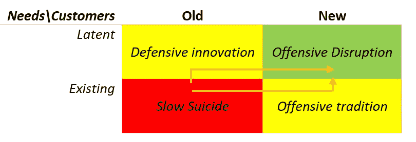
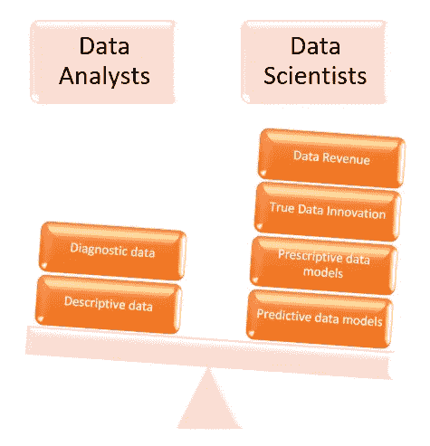
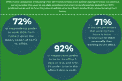

# 数据中断的先决条件

> 原文：<https://towardsdatascience.com/the-prerequisites-for-data-disruption-801ed5541c43?source=collection_archive---------35----------------------->

## 如何构建最强大的数据章节

[安德烈·萨金塞夫](https://unsplash.com/@zvandrei?utm_source=unsplash&utm_medium=referral&utm_content=creditCopyText)在 [Unsplash](https://unsplash.com/@zwone/likes?utm_source=unsplash&utm_medium=referral&utm_content=creditCopyText) 上拍照

*我们生活在一个世界以闪电般的速度前进的时代。有一天，我们在谈论那些收入数十亿、拥有全球专利和分销渠道的老牌公司，它们“大到不能倒”。接下来，世界上价值最高的 10 家公司中有 9 家都是数字公司，它们的前登月照片都是在登月前不到 10 年拍摄的。因此，今天我们都真正知道，要取得成功，关键是数字创新和数据颠覆。是的，我们也知道数据是“新的石油”。但是，关闭 BS 生成器，转而关注如何真正实现这一点，如何在这种数据中断中真正取得成功呢？不那么神奇的答案是，先决条件之一是数据本身的质量，以及能够管理、处理和开发数据产品的架构和平台。更动态的答案是，在机器完全取代人类之前(这不必太远)，需要最合适的人的设置来充分实现这一潜力。在本文中，我们将详细介绍如何构建这样一个最强大的数据章节，它们应该基于什么，需要什么角色，需要知道什么，应该如何获取和组织它们以实现真正的数据中断。祝你好运。*

# 1.战略目标

# 1.1.数字趋势

几年前，数据被宣布为世界上的新石油，然后是最重要的，也许是 T2 的 KSF，过去十年的全球独角兽，十个玉米和百年玉米，数字颠覆了所有传统公司——在所有旧行业中运营，现在被一些公司创造性地摧毁了，AdTech，MarTech，AgriTech，FoodTech，FinTech，InsurTech，EdTech，CleanTech，BioTech，MedTech 等等。这种颠覆的条件总是与新兴技术有关，如 [AR](https://www.linkedin.com/pulse/4-digital-trendspotting-2018-de-tre-omv%C3%A4lvande-som-sluter-lidman/?published=t) 和[元宇宙](https://medium.com/codex/the-birth-of-the-remote-species-b8c56c2e72f8)、[区块链](https://www.linkedin.com/pulse/new-book-chapter-1-revolutionary-technology-change-lidman-fil-lic-/)，最重要的是 [AI 和 ML。](https://www.youtube.com/watch?v=mRUY6ZHmABA)

照片由[本工程图](https://unsplash.com/@thisisengineering?utm_source=unsplash&utm_medium=referral&utm_content=creditCopyText)在 [Unsplash](https://unsplash.com/s/photos/factory?utm_source=unsplash&utm_medium=referral&utm_content=creditCopyText) 上拍摄

所有这些都是由数据的质量和实时快速处理控制的。自 2020 年以来，这一切已经导致了一个高潮，即世界上增长最快的(迄今为止)第二强的数字国家的领导人金平总统去年宣布数据为[“第五生产要素”](https://www.ft.com/content/9ef38be2-9b4d-49a4-a812-97ad6d70ea6f)——等同于劳动力、土地、资本和技术。

# 1.2.枢转价值

与此相一致，今天许多人所在的公司从将其他几个生产要素作为公司最重要的核心，到以最严肃的方式发展公司，其目标是，如果不是今天，那么至少明天将数据作为核心资产。

实现这一目标的战略关键之一是，我们开始将[数据作为产品](/the-contingency-model-of-data-mesh-c4bbe57577d6) (DaaP)来处理。即，不是作为众多其他功能的副作用，而是作为本身具有价值的产品，在极端情况下，不仅作为数据驱动的决策、服务和产品的推动者，而且作为纯粹具体的内在价值，甚至商业价值。

拥有一个能够为公司创造将数据作为核心资产(或至少是 DaaP)所需的所有条件的数字部门，是公司不仅能够在由创造性破坏重启的未来市场中生存，而且能够通过成为破坏而不是被破坏的一方而占据领先地位的前提条件。

在本文中，我们将解决数据破坏成功的先决条件，首先我们将了解公司的[数字战略](https://www.amazon.com/How-Become-Digital-Marketing-Hero/dp/1912562219)如何转化为数据战略、数据架构和合适的数据平台，然后是相关的数据团队来管理这些平台，并充分实现所开发战略的潜力。

# 2.战略手段

要取得成功，需要几件事情，不仅 a)组织良好的数据设置，具有 decom 传统、安全的数据源和干净的数据，而且 b)具有一致架构的现代数据策略，以及适合该架构的合适的技术和组织平台，以及 c)既能生成正确的数据、确保数据质量，又能将生成的数据转化为更多数据驱动的业务结果的数据团队。下面，我们将假设实际的清理工作已经完成，并更战略性地处理后两个问题。

# 2.1.数字战略

在一家公司就其愿景和将实现该愿景的战略达成一致后，数据战略、数据架构和数据流以数字语言构成了将战略转化为数据蓝图的数字相关翻译。

旧的 5 年战略计划或更具进化性的方法在今天的大多数行业中都不可行，在这些行业中，通常需要更具颠覆性的愿景，以实现其核心业务从模拟技术离线到数字技术在线的全面转型。我曾与四大洲三位数的公司在数字战略和创新方面合作过，我很少看到董事会和高管团队不知道，在一年左右的时间里，他们将失去数十亿美元的照常营业收入(BAU)。这个 BAU 需要被新的商业创新所取代，但很少有人真正认识到它是关于什么的——只是如果你不在这个完整的领域占据一席之地，别人会的。

为了帮助实现这个未来的、往往未知的数字香格里拉，这只不过是一个同样引人注目的成功战略。大多数旧的传统市场所面临的不进则退的局面，绝不能停留在数字发展上，以利用现有资产，但也必须创造全新业务的增长——在更戏剧性的情况下，要彻底改造整个行业，从而调整整个战略并重新启动运营。

很简单，基于一个更具创新性的战略，不仅着眼于如何与今天的竞争对手作战，也着眼于如何与明天的竞争对手作战，确保敢于发明真正的登月计划，不仅满足现有客户的现有需求，也满足明天客户的潜在需求。

作者图片

从积极的方面来看，除了一般的数字化之外，还有几种新兴技术——例如人工智能、增强现实和区块链等。，又名 EmTech)，有可能帮助该公司应对这种更具攻击性的中断。如果这转化为一家公司的数字战略，这将意味着积极专注于应对外部压力和内部条件带来的挑战，包括客户战略、内容战略、渠道战略和数据战略。下面我们将讨论后者，我认为，在 2020 年，这是最致命的关键时刻。

# 2.2.数据架构

如果数字战略要转化为如何构建公司的架构以应对挑战，那么它至少是数字架构、平台阵容和组织中适应这一特定战略的戏剧性支点。

由于不知道您和您的公司在未来将拥有什么样的确切架构，通常至少会有一些关于数字战略的指导——在数字颠覆性市场中，这通常会转化为基于 DaaP 的数据战略以取得成功。

稍微取决于[你的上下文条件](/the-contingency-model-of-data-mesh-c4bbe57577d6)，在架构上，这样的 DaaP 策略至少应该考虑到任何[模块化构建的混合体](/data-mesh-topologies-85f4cad14bf2)，它们位于分散的[数据网](https://martinfowler.com/articles/data-monolith-to-mesh.html)和单片数据湖【即。朝着领域驱动架构的方向发展，以实现最高的数据质量和创新，同时通过联合治理确保不同渠道之间的协同，等等。

就技术平台而言，这将意味着一个动态系统，既提供本地 ELT 管道作为自助服务系统，这由确保互操作性的标准中央平台来确保，又辅以各种 AI/ML 数据科学工具。

适合这种解决方案的组织将是本地管理与数据所有者之间的平衡，为了标准化、互操作性和创新，由集中管理但在本地分配的数据工程师和数据科学家来确保。下面将详细介绍这一点。

# 3.数据小组——三个最重要的角色

正如我们在上面看到的，数据中断的一个基本先决条件是数据本身的质量，而另一个先决条件是能够接收、存储、管理和处理这些数据的架构和平台。我们在上面得出的主要轮廓只能构成从数字战略中推导出的一个试验性假设——在向数据架构和组织模型的更细粒度版本发展的过程中被验证、证伪或调整。

但话虽如此，鉴于一家公司正在通过上述战略推导以及架构、平台阵容和组织的发展，往往最适合这样一种战略，我们不可避免地会遇到这样一个问题，即我们在一个数字化颠覆的行业中应该如何充分实现架构、平台和组织模式提供的数据条件。因为在机器完全取代人类之前(这[不一定离人类有多远](https://medium.com/aiar/another-of-my-articles-published-eventually-the-most-crucial-question-in-history-of-humanity-ca88080a0fc8))，最合适的人员设置将始终被要求充分实现累积的潜力。

下面，这些问题分为需要什么角色，他们的任务是什么，他们应该具备什么技能，然后是关于数量和成本的问题，以及如何以最佳方式管理和分配这样的团队。这些问题将在下面依次讨论。

但首先是角色，在一家公司中，至少需要三个与数据相关的角色，才能将数据发展到一定水平，这意味着数据可以真正成为公司的“核心资产”。

由[阿斯德鲁巴卢娜](https://unsplash.com/@infectedluna?utm_source=unsplash&utm_medium=referral&utm_content=creditCopyText)在 [Unsplash](https://unsplash.com/@zwone/likes?utm_source=unsplash&utm_medium=referral&utm_content=creditCopyText) 上拍摄的照片

# 3.1.数据工程师

第一类是纯技术人员，即确保可以检索到正确数据的数据工程师。这可能是关于构建和管理公司可用的数据基础架构，包括选择数据库、硬件或云提供商，计算服务器的类型和数量，以及数据库和服务器需要什么软件。他们管理数据存储、使用，并监控数据如何工作以及谁在使用数据。作为指挥棒，可以提取数据或发布对某些数据的访问，这些数据将被传递到价值流的下一阶段进行分析或处理。

为了在这方面取得成功，数据工程师需要对计算机相关的基础设施有广泛的了解，一部分是关于存储和使用的硬件，一部分是关于数据库、计算、安装、可扩展性等的软件。背景通常是计算机科学或计算机技术或其他与基础设施相关的 IT 主题

# 3.2.数据科学家

第二个角色是纯粹的“分析”角色，其形式是数据科学家，他们将数据从原材料转换为成品，传统上是通过运行实验、提取和清理数据、分析数据，并将结果传达给组织内外的各种利益相关方。

这只是部分关于 ***历史*** 分析，稍微简单一些的部分以描述性数据(“报告”和仪表板)的形式出现，而纯粹的诊断性分析(探索性的)则是更多的数据驱动的决策洞察(可以由数据科学家处理，也可以由分析师处理，有时甚至是相对初级的分析师)。对于这家有 DaaP 雄心的公司来说，挑战主要是更具 ***未来感*** 性质的两个不同部分:

1)更加自动地*预测*客户、员工、供应商、经销商等各方的可能行为，以及*规定的*数据，这些数据的行动往往会产生各方对公司最有利的响应(例如，带有 NBA/NBO/NBC 等个性化预测的“大规模定制”。).

2)也许最先进的努力将是在数据方面实现公司的*创新*和产品开发，以及生成本身具有价值*的丰富数据*，它本身应该能够为公司产生具体的收入。

作者图片

后两个部分是真正的数据科学家之星的工作，为了取得成功，你必须不仅能够处理统计推断，而且能够处理高级预测模型——前者最好有统计学学位，但另外辅以在线课程，后者最好有适合 ML 的编程学位(例如 R/Python ),如果没有在线课程的话。

因此，您必须掌握高级数据分析，同时具备足够的技术知识，能够从数据库(如 SQL)中提取数据、清理数据、对数据进行统计分析和预测，并传达结果(包括可视化以及与管理层和“普通”人员的沟通)。这同样适用于流程的最开始阶段，能够进行对话，将利益相关方的挑战转化为具体的统计模型和实验。

由于数据科学仍然是一个相对“年轻的领域”，在学术方面没有完全的严谨性(在特定的“数据科学”方面，严格的教育相对较少，但至少数量在不断增加，但最重要的是，它们太新了，还没有时间培养出数量可观的毕业生)，通常有两种不同类型的背景。

1)扎实的统计学家，学过一些编程。

2)扎实的程序员，学过一些统计学。

我个人在这两个类别中都遇到过令人敬畏的数据科学家，而我自己——作为前一组的一员，我可能有点偏见——可能会发现前者比后者(我更经常经历的是，后者需要分析师或策略师的指导，以避免陷阱，并能够为利益相关者建立良好的桥梁)中更多的明星例子。不过，我在后一个领域也发现了一大群真正的明星(当他们有更可靠的推论或补充了一些 MBA 内容时，这种情况并不少见)。尽管与今天的需求相比，供给很少(见下文),但我们必须庆幸两者都存在😊

丹尼尔·林肯在 [Unsplash](https://unsplash.com/@zwone/likes?utm_source=unsplash&utm_medium=referral&utm_content=creditCopyText) 上的照片

# 3.3.数据所有者

第三个角色可能是最“有趣”的，在这种情况下，预测的颠覆性市场中的数字战略表明需要混合数据架构，即在联邦级别将最佳与整体稳定性相结合，在域级别将数据网状动态性相结合，这就产生了对实际域中数据质量责任的完全不同的需求。

这意味着推出一种与领域相关的“数据所有者”，这在离线公司中很少见到，这很可能意味着向 DaaP 发展的飞跃。也就是说，他除了在各个领域的日常工作之外，还要确保我们符合监管要求和公司关于 GDPR/CCPA 等的政策。以动态的方式—对不同类型的数据进行不同安全值的信息分类，并基于该分类采取不同的措施。

但最重要的是，作为数据所有者，您要对域内生成的数据的质量承担起[责任](https://medium.com/aiar/the-sexiest-quality-in-the-world-697de1e9aa37)，一部分是在域中获取和存储的数据所需的清理和任何 DQM 方面，另一部分是在本地的任何 ELT 模式中正确处理数据，以及在最合格的模式中，作为公司利益相关者和数据团队的各种专家之间的桥梁，共同创建“数据支持产品”的角色。

就时间而言，这仅适用于特殊情况——即，在具有大领域的真正大的组织中——全职工作，但是职责被分配给领域中的某个角色。就能力而言，也没有必要——或者甚至不需要——让一名统计学家或工程师来承担这一职能，而是让一个了解每个领域的业务，并在分析方面有足够天赋的人来处理数据。

相反，主要优势将是了解数据如何与业务相关，什么时候不相关，什么时候有问题。最重要的是，除了对业务的理解之外，还可能是关于[职责](https://medium.com/aiar/the-sexiest-quality-in-the-world-697de1e9aa37)，对数据重要性的理解，以及确保其相关性和每种数据类型的质量。

# 4.您的新数据章节 2022 —招聘和领导流程

当谈到一家公司在三种不同的角色中需要多少人时，这取决于公司的成熟度，但我想说的是，在开始时，三件事是最重要的，即灵活的任命、开放的招聘和二维组织。

# 4.1.敏捷约会

首先，很少有理由采取大规模行动，而不是从一个较小的数字开始，这不是不可能的，包括一些亚军领导，然后做好准备，当你开始听到第一次抱怨他们的议程有多满时，就要改变。即使最终游戏的目标是一个成熟的数据团队，它也不是不可能的，它可能首先是几个数据工程师和一个集中的联合基础架构的队长，同时在他们的第一次迭代中将一些兼职角色分配给一个较小的域集。

与此同时，数据工程师的角色更多的是关于基础设施及其作为支持功能的角色(即，一旦基本需求到位，您不会因为采用 10 而获得比采用 3 更多的商业价值)。相反，在商业上最重要的是数据科学家的数量和质量。但在这里，无论最终结果如何，您也可以先小规模起步，然后针对不同的职能逐步增加，其中有人可能会将一半时间分配给几个领域，而另一半时间则专门用于更集中的数据创新。但这里的等式在商业上更简单。有了 10 名出色的数据科学家，您将(当基础设施和数据质量真正到位时)贡献 10 倍以上的价值。

# 4.2.开放获取

图片由 Burtch Works LLC 提供

第二个需要理解的重要事情是，这是一个不同类型的品种。你不是世界上唯一一个明白数据需要成为公司核心资产的人，高质量的数据专家是从这些资产中获取真正利益的炼金术士。

这当然是一个普遍的问题。总的来说，90%的高管正在他们的组织中经历技能差距，最主要的是我们在数字角色中看到的[，在未来十年中，如果不能满足未来的技能需求，G20 国家可能会错过智能技术承诺的高达 11.5 万亿美元的累计增长。当然，这体现在我们的数字技术干将的工资和需求上。此外，除了健康、清洁技术和信息安全，对统计学家和数据科学家的最大需求将是 T2。](https://www.accenture.com/_acnmedia/Thought-Leadership-Assets/PDF/Accenture-Education-and-Technology-Skills-Research.pdf)

因此，在招聘数字明星时，不仅要记住一些具体的事情，尤其是对数据科学家来说，这显然是卖方市场，而且这个角色是如此的性感，价格甚至在海外爆炸。数据科学家，在某种程度上也包括数据工程师，是市场上非常抢手的关键资源。

这意味着几件事。部分原因是，你需要为他们或我们提供一些“性感”的东西，不仅作为一家公司，而且作为一个数据驱动的雄心和数据创新挑战。部分原因是它们确实需要成本——我有一些刚从科技大学毕业的明星，他们没有任何经验，与有经验的数字能力的平均工资相比，我不得不支付+ $40K +奖金。

部分原因是，不仅出于经济原因，而且出于质量原因，你经常不得不在西方世界的数字中心之外寻找——除了新毕业生，我所有的明星(有经验的)都是来自中国、越南、韩国或伊朗的移民专家(+20-40K v/s digitals)。部分原因是你可以或者应该考虑离岸(这些年来，除了印度，我在越南也有过，完全-！——上帝保佑，就结果而言，甚至比我在岸上的时候还要好一点。

图片由 Burtch Works LLC 提供

这也意味着一个人不一定，特别是在去[元宇宙](https://medium.com/codex/the-birth-of-the-remote-species-b8c56c2e72f8)的途中没有后 covid 的情况下可能需要“办公室工作”。相反，这项工作通常是在独立于地方的情况下完成的，如果你想成功招募到真正的明星(也许没有太多空间支付真正明星的薪水)，那么你在这里也必须有点自由。在一个密切的案例中，大约有 10 名陆上数据科学家，没有一个是在当地招聘的，甚至大多数陆上数据科学家偶尔在巴西、克罗地亚、西班牙或在家工作。

最后，这意味着基于以上所述，人们必须接受公司语言，至少对于数据来说，必须是英语(如果还不是的话)。你得到一个完全匹配的进口明星的时间比任何退休的研究行业的本地分析师都长，这是你以同样的价格最多能得到的。而且，即使你提高价格，就竞争优势而言，你与三个离岸明星的距离比你以同样的价格从一个昂贵的当地西方顾问那里得到的要远得多。

# 4.3.二维组织

第三件重要的事情是所有这些角色应该如何组织。这也是公司中产生的数据主架构的自然结果。将上述连续体作为一家公司主动或被动迈出颠覆性第一步的工作假设，我会说，一方面，该公司很有可能会或应该继续遵循 [DDD](https://www.amazon.com/Domain-Driven-Design-Tackling-Complexity-Software/dp/0321125215) 模式，在那里，该公司的数据科学家将在各个领域尽最大努力。

另一方面，同样真实的是，数据科学家通常是能够并且需要与众不同的人(有些人可能会称他们/我们为“怪人”)，组织中并不总是有很多其他人理解他们或者对喝咖啡休息时谈论的相同事情感兴趣。这意味着，在我的世界里，将数据科学家组织在一起，有明显的社会和认知价值，有了解他们的领导和互动，可以帮助挑战和发展他们，但分配和“虚线”延伸到与业务理解相互促进的领域，产生“真正”改变数据的机会。

# 5.总结摘要

从整体上看，在一个颠覆性的市场中，除了引人注目的创新之外，不允许有任何其他东西，出于同样的原因，数字战略也需要将数据颠覆作为其核心，因此本文的主题对于在这样一个行业中活动的任何公司的未来来说，都是至关重要的。

在不知道贵公司的确切数据架构的情况下，参考在这样一个颠覆性市场中运营的公司所需的数字战略，至少给出了这种架构应该采取的方向的一些指示。稍加简化，更确切地说，是所有 DaaP 启发的混合体之一，可以在领域驱动的数据网格可能带来的动态性与联合数据基础架构可以提供的稳定性和确保的互操作性之间的连续体中找到。

这不仅关系到最合适的技术数据平台，还关系到哪种组织模式是成功实施这种颠覆性数字战略的最佳工具。简而言之，这将涉及一个二维的组织模式，在这种模式下，你一方面支持公司朝着 DDD 的方向发展，另一方面在当地进行管理，以确保知识和工作满意度方面的协同作用。

这种组织模型应该满足的三个角色是由一小队*数据工程师*组成的，他们在联邦级别上确保正确的数据标准的出现。除此之外，我们还增加了数量稍多的*数据科学家*，他们负责将标准化数据的原材料提炼为数据驱动的见解、数据支持的创新和产品，以及数据本身作为一项业务。最后，我们将这一点与*数据所有者*结合起来，他们在领域级别上确保业务相关的数据质量。

为了在前两者的招聘中取得成功，基于市场对人才的极度渴求，可以认为——除了上述二维组织模式之外——非常值得考虑灵活任命而不是大爆炸的可能性，以及在离岸、移民和远程工作可能性方面更开放的招聘。

完成所有这些后，你就成功地构建了一个模块，这个模块可能是在未来大多数市场中构成最重要的先决条件的最后一个模块，即:数据中断。

所以，祝你好运，另一边见😊

# 鲁弗斯·利德曼，电影。Lic。

图片由 Janne Naess 提供

Lidman 是著名的数字创新者和数据颠覆者，连续社会企业家和顶级技术影响者，拥有 50，000 名追随者。他拥有双学位和博士学位，并以数据科学为平台，是 IAB 的创始人，WFA 的数字顾问，拥有 300 多场讲座的知名演讲者，并在 100 多家公司担任数字战略和创新方面的任务，如三星、宜家、梅赛德斯、伊莱克斯、普华永道等。作为一名数字企业家，他已经经营了 6 家企业，拥有 2-3 个 ok 出口，包括访问量达数百万的网站和一些下载量超过 1500 万的全球最大应用。作为他的最新投资，他在瑞典联合创建了领先的数字人才收购公司 Digitalenta，并在新加坡创建了 EdTech PTE Ltd，利用领先的技术为新兴市场的贫困人口重新创造学习机会。除此之外，他还出版了 4 本书和世界上最大的数字战略学习应用，受到 165 个国家 20 万人的喜爱。