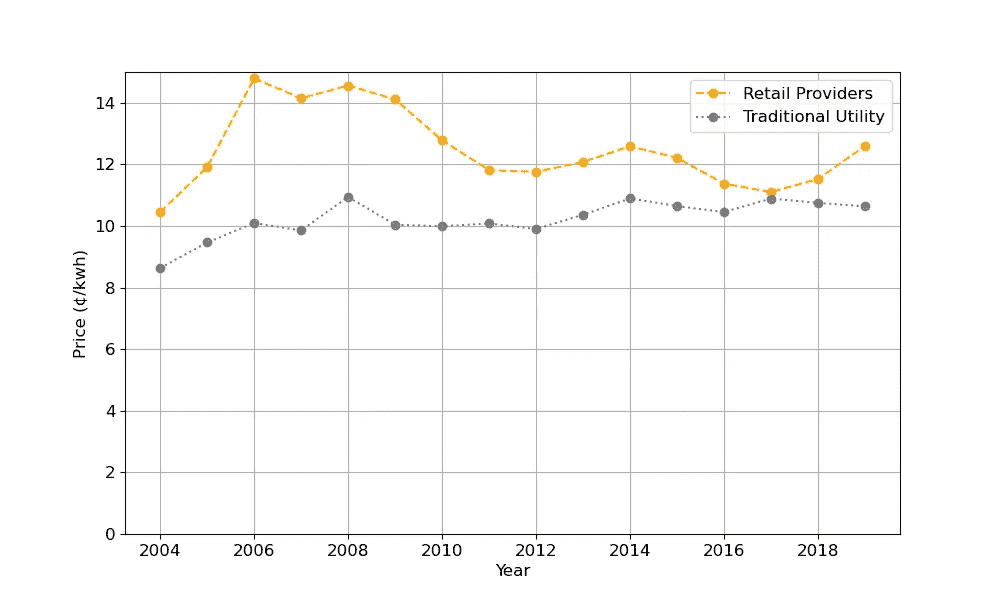
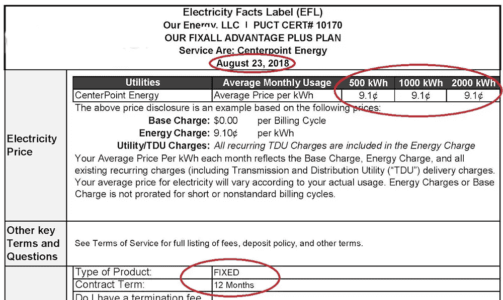
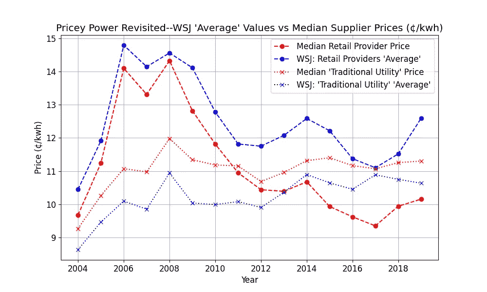
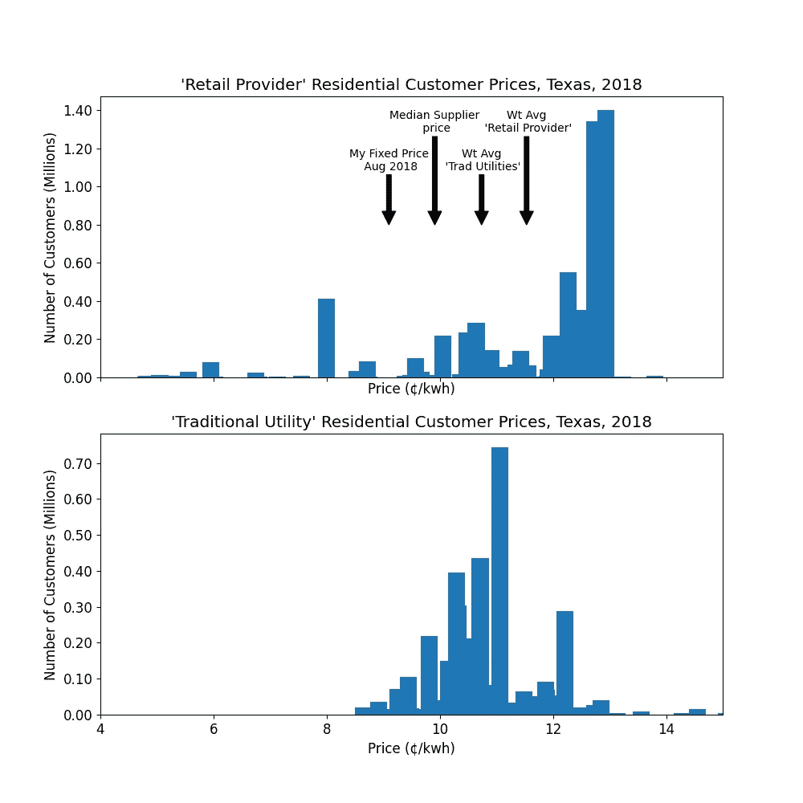

# 电力的价格，第 1 部分

> 原文：<https://towardsdatascience.com/the-price-of-power-part-1-805f512d4c94?source=collection_archive---------35----------------------->

## 得克萨斯州的零售电价:当“平均”歪曲

我饶有兴趣地阅读了《华尔街日报》今年 2 月 24 日的头版文章“[在解除管制的情况下，德州电力账单增加了 280 亿美元](https://www.wsj.com/articles/texas-electric-bills-were-28-billion-higher-under-deregulation-11614162780?st=4669lbei6w8wzq0&reflink=desktopwebshare_permalink)。它承诺对德州零售电价进行“分析”。标题图及其标题(复制于此)似乎提供了一个明确的结论:放松管制的零售客户支付过高。

## 昂贵的电力

> 大约 60%的德州人必须选择零售电力供应商，他们支付的费用始终高于该州从传统电力公司购买电力的客户。

> 来源:《华尔街日报》对美国能源情报署数据的分析

然后，文章在该图中取差价(在其他地方定义为仅*住宅用户的“平均”价格差*)，乘以通过零售提供商出售的能源量，然后*瞧* : [28 *亿美元*](https://youtu.be/BRAkobf-tVI?t=11) (这听起来*比同等价值的 26 美元/用户/月【192 个月平均 560 万用户】更令人印象深刻*)。

嗯，作为一个经常在德克萨斯州以零售消费者的身份购买电力供应商产品的人，这些数字似乎… ***高得令人怀疑*** 。例如，在我的记录中，我发现:

> 2018 年 8 月德州电力事实标签

而且，我有一堆从 2010 年开始的类似或更低价的唱片。我的 2018 年续约合同和其他合同似乎都大大低于文章中提供的“零售供应商”和“传统公用事业公司”的数字。这并不是说我利用了某种模糊的营销方案——每年，当我的合同到期时，我都会去 powertochoose.org 的 PUC 赞助网站[，选择“12 个月，固定价格，已排序”，然后*选择价格最低的供应商。*这并不需要太多的脑力(虽然偶尔我会看到一些计划根据使用情况有不同的价格，所以*不需要一些数学知识)。在任何情况下，我有一堆过去 10 年的这些'*](http://powertochoose.org)*[EFL](https://www.puc.texas.gov/industry/electric/rates/Default.aspx)'的类似结果，都低于这张图的 T10 两条线 T11。而且，我发现这个过程比购买其他家庭服务要容易得多，比如互联网服务提供商、保险、手机和流媒体服务。*

## 我们将回答的问题分为两部分:

1.  那么这些数据在哪里呢？我自己怎么分析？
2.  谁是“传统公用事业”和“零售供应商”？从价格对比中可以了解到什么？这种比较的局限性是什么？
3.  “平均”价格是什么意思？文章在图表下方澄清道:“《华尔街日报》计算了全州公用事业和零售商的单独年度费率，方法是将每种类型的供应商收到的所有收入相加，然后除以其销售的千瓦时电。”所以这就是*加权平均价格*(零售商总收入除以零售商总销售额)。*中的* **加权**集中趋势测量对**典型客户体验**的概括程度如何？为什么我的结果如此不同？
4.  商业和工业客户市场(大约 2/3)发生了什么？为什么*和*不是这个故事的一部分？
5.  我该如何看待这 280 亿美元呢？从这些数据中还可以获得什么其他见解？

***本文将重点讨论问题 1-3，后续文章将重点讨论问题 4-5。***

## 揭秘:我是谁，我为什么要写这个？

因此，这在很大程度上是一个关于数据和使用一个汇总统计数据来代表一个动态和变化的市场的问题的故事。你不需要有能源方面的背景就能从这个分析中有所收获；尽管如此，这就是我的背景。过去十年左右，我一直是一名独立的能源顾问。之前，我从事批发电力交易和风险管理。作为一名顾问，我为零售电力客户做过项目[但也为银行、炼油商、石油交易商等做过项目]。但我的观点是:这里的观点完全是我自己的，这项工作与我的任何客户都没有关系，无论是过去的还是现在的。我写这篇文章是因为

1.  我认为这些数据讲述了一个比描述的更有趣的故事，
2.  这篇文章的作者没有公开他们分析的细节或[清理的]数据集，
3.  这是一个使用 python、pandas 和 matplotlib 提取、清理和分析数据集的有趣练习。
4.  我对促进公共数据的准确传播和分析感兴趣——这是一个很好的例子。

## 代码、格式、约定

支持本文的所有数据和代码都可以在 github [ 1]上找到。如果你发现一个错误，或者有一个扩展，我会很乐意接受[拉请求。](https://docs.github.com/en/github/collaborating-with-issues-and-pull-requests)所有代码都是 python(我用的是 3.83 版本，特别是 [winpython 发行版](https://winpython.github.io/))。python 文件是普通的*。py 格式(即它们不是 jupyter 笔记本)。我已经将代码分成了与 Spyder IDE 一致的“代码单元”。为了复制任何引用的分析，只需执行该块中的所有代码。最后，我在本文中有相当多的表格，我将它们作为 github 上的 [gists](https://gist.github.com/dkfurrow) 嵌入——点击嵌入的对象查看完整视图。

## 数据

这里的数据来源于能源信息署的表格 EIA-861 数据文件[这里](https://www.eia.gov/electricity/data/eia861/)，为了方便起见复制到 github[【1】](https://github.com/dkfurrow/eia-retail-analysis)。这些数据文件存在于一系列嵌入 zipfiles 的电子表格中，每年一个文件。在 zip 文件中，有一些电子表格，每个电子表格代表一个客户部门，如下所示:

记录的数据元素如下:

## 转换和清洗

提取 EIA 数据的脚本[【2】](https://github.com/dkfurrow/eia-retail-analysis/blob/master/eia_retail_extract.py)太长，无法有效地摘录，所以我将简单地说明清理该脚本处理的数据的问题:

1.  从 2007 年及之前，EIA 颠倒了收入和销售的顺序，如上表所示。
2.  根据年份的不同，电子表格数据在不同的行上开始，但对于所有部门的情况，总是从阿拉斯加开始*除了*运输，从阿肯色州开始。
3.  一些早期的电子表格有一个额外的第 8 列(“数据检查”)，这里不包括。
4.  一些州值显示为 Null，在这里被排除，同样所有收入、销售和客户都为零的行也被排除。

**因此，一旦数据从压缩文件中提取出来，并按照上面的步骤进行修复…**

1.  我检查了 Rev/Sales = `AvgPrc`，这是真的，除了在某些情况下`Ownership`是‘其他’或‘在仪表后面’(还有`Entity`是‘调整’)，在这种情况下`AvgPrc`是空的。我们这里的重点不是调整或仪表后的销售，所以我让数据保持原样。
2.  根据`Ownership`是*还是*【电力营销商】*或*【零售供应商】添加了特征`OwneshipType`*【Reg】或【DeReg】*...看来这些年来术语发生了变化。
3.  添加了特性`Year`和`CustClass`(即`'commercial', 'industrial', 'residential', 'transportation', 'all'`)，将整个数据集转换为“记录”格式，其中列`'ValueType'`表示收入、销售、客户或 AvgPrc，列`Value`表示数量，然后将整个内容保存到 parquet，以便在其他脚本中使用。

因此，在这一点上，我们有一个单独的`Rev, Sales, Customers` *或* `AvgPrc`元素的记录表，650，900 行乘 8 列，`Year` 2004-2019:

## 这里能学到什么？

这是一套全面的收入、成本和客户数据，因此人们当然可以对销量、客户数量和收入(含隐含单价)进行分类(跨客户类别、所有权类型、实体、州)和时间(跨年度)比较。例如，你可以看看市场集中度或客户群的增长情况；这些数据有很多潜在的发展方向。

## 有哪些局限性？

与评论文章中引用的“全州价格相对于全国平均水平较高”必须归因于得克萨斯州解除管制的部门”相比，您最肯定的是*不能*仅从这些数据中明确评估监管制度或市场机制的有效性。最具体地说，这里没有关于以下方面的数据:

1.  **批发价格:**你不能用通过([解除管制](https://www.ferc.gov/sites/default/files/2020-05/rm95-8-00v.txt))批发电力市场获得的价格来标准化结果——这里没有这些信息。
2.  **分销或“电汇”费用:**零售客户支付(规定的)费用来访问他们的(独特的)分销系统——该价值因客户而异，但在此捆绑在总价结果中。
3.  **发电和负荷特性**(与上面有些关系)这里没有数据

*   天气/负荷特性[无论监管选择或市场设计方案如何，更平坦、更容易预测的负荷应该更便宜]
*   当地发电资产组合，例如当地公用事业公司是否拥有(廉价)水力发电？还是天然气发电[一种在 2004 年至 2019 年间价格会发生巨大变化的燃料]？电力公司的燃煤电厂[是否经过擦洗](https://www.gem.wiki/Scrubbers#:~:text=Scrubbers%20are%20an%20apparatus%20that,the%20formation%20of%20acid%20rain.)，或者是否配备了[SCR](https://en.wikipedia.org/wiki/Selective_catalytic_reduction)，如果是，该设施何时进入费率基础？是否有(非市场竞争的)资产仅仅是为了可靠性而维护的？
*   客户是否可以选择(更昂贵的)可再生能源发电来代替化石能源，或者选择一个比平均成本更有利于稳定计费的计划。在德克萨斯州，这两种选择都意味着成本与收益的选择。

因此，重要的是要认识到数据的局限性，以及它能显示什么和不能显示什么。简单的价格分析是必要的，但不足以确定零售电力放松管制的影响。当我们回顾这一分析时，请记住这些警告。

## 那么，这些数据有哪些有用的初步发现呢？

我们将介绍一些基础知识:我们已经从 total 中提取了 Texas 记录，总共有 42，616 行。着眼于`Customer`值类型，我们有以下跨年度的计数[【3】](https://github.com/dkfurrow/eia-retail-analysis/blob/master/article_scratchpad.py):

在本文中，我们将重点关注住宅组—稍后我们将讨论其他类。

“零售提供商”集团(我们的说法是“DeReg”)包括 158 个独特的名称…但在任何一年都是一个小得多的子集。这些数据不包括所有权，或任何唯一的标识符，所以我们无法跟踪名称的变化或通过所有权识别市场集中度。但是在任何情况下，我们都可以看到客户所观察到的供应商数量的增长。下面是随时间的计数[【3】](https://github.com/dkfurrow/eia-retail-analysis/blob/master/article_scratchpad.py)。

对于 2019 年(最新数据)，我们可以根据客户规模对 68 家零售商进行分类，我选择的分类规模如下[【3】](https://github.com/dkfurrow/eia-retail-analysis/blob/master/article_scratchpad.py):

客户总数:6，451，123

零售商总数:68

我们可以看到客户高度不对称地集中在几个大型供应商中。我们将回到下面主题。

随着时间的推移,“传统公用事业”群体当然更加稳定，但它们彼此之间几乎没有共同点；他们为 27 万平方英里的德克萨斯州的客户提供服务，他们是受监管的垄断供应商。它们跨越多种所有权类型、所有三大[北美互联](https://www.energy.gov/oe/services/electricity-policy-coordination-and-implementation/transmission-planning/recovery-act-0#:~:text=North%20America%20is%20comprised%20of,(excluding%20most%20of%20Texas).)、多种气候以及资产所有权的类型/级别。2019 年，共有 139 个此类实体，分为以下类别[【3】](https://github.com/dkfurrow/eia-retail-analysis/blob/master/article_scratchpad.py):

那么，我们来看看价格。

## 好吧，这个“平均”价格是多少？

所以我们可以直接从[文章的 html](https://www.wsj.com/articles/texas-electric-bills-were-28-billion-higher-under-deregulation-11614162780?st=4669lbei6w8wzq0&reflink=desktopwebshare_permalink) 中复制文章数据(实际上我们之前已经这样做了——它是嵌入在文章源代码中的 json 数据)。
我们从简单开始:利用 pandas 数据透视表功能获得传统公用事业和零售提供商的简单平均值和中位数，并将文章数据与这些计算值进行比较。结果是:

所以马上，我们可以看到:

1.  粗体显示的商品价值**(加权平均值)*显著高于*(1)一般供应商的价格或(2)中等供应商的价格。**
2.  **因此，零售供应商的销售价格分布必然*明显倾斜*。最近一年，加权平均价格比供应商价格中值高出 24%。相比之下，对于“传统公用事业”来说，这种差异是很小的。**
3.  **我上面详述的 2018-2019 年固定价格合同现在更有意义了……低于中位数，但比文章的加权平均值更接近中位数。**

**我们肯定应该在这里做一个可视化…所有 6 行会有点忙，所以我们将放弃“简单平均值”值:[【4】](https://github.com/dkfurrow/eia-retail-analysis/blob/master/eia_retail_analysis1.py)。**

****

**所以这让我们能更好地看到趋势。因此，我们在这里看到(1)零售供应商的中值价格在 2011 年左右跌破了“传统公用事业”的中值价格，并一直保持在该价格以下。(2)零售供应商的中值价格总是低于“加权平均值”,但对于最近的数据，这一差距有所增加。**

**我会断言，考虑到这些数据在集中趋势方面的显著差异，基本的数据透明度决定了前面的图表是*应该出现在文章中的那张。*当然，这样的陈述会让一个简单的叙述变得不那么清晰——出现不同的(我认为更有趣的)问题。**

## **确认加权平均值**

**由于我们还没有确认我们正在审查相同的数据，良好的分析实践将是确认文章的加权平均值。利用 pandas pivot_table 和多索引功能，我们计算一个加权平均值，并与文章的值进行比较[【4】](https://github.com/dkfurrow/eia-retail-analysis/blob/master/eia_retail_analysis1.py)。**

**我们基本上以加权平均值为基础…当然会降低到 0.1/kwh 的水平(1 [mill](https://www.statista.com/statistics/195814/us-power-plant-operating-expenses-since-1998/) )。**

## **为什么我的结果与“平均水平”相差如此之大？**

**嗯，我们已经从目前完成的工作中明确地得到了一个线索…这个分布是高度倾斜的。为什么？时间一个条形图，我们来看看 2018 年的成绩[【4】](https://github.com/dkfurrow/eia-retail-analysis/blob/master/eia_retail_analysis1.py)。**

****

**因此，拥有最多顾客的零售商也收取最高的价格。但是这里有 66 家零售供应商，其中大多数的定价都比*加权平均价格好得多。*(其中许多公司提供的价格远远优于市政、合作或投资者所有的公用事业公司的平均价格)。**

**顺便说一句，公平地重复一遍:在一个不受监管的市场中，简单的价格可能不是唯一的问题…例如，客户可能重视绿色能源，并愿意为此付费。例如，公司提供“稳定账单”计划，即 12 个月的绝对账单总额保持不变——这是一种保险形式。最后，消费信贷是捆绑的——在我上面的 EFL 案例中，有隐性融资——我在淡季借钱给我的供应商，我的供应商在旺季借钱给我。**

**那么，图表右侧的那些大型供应商是谁[【4】](https://github.com/dkfurrow/eia-retail-analysis/blob/master/eia_retail_analysis1.py)？我们将按客户规模排序:**

**这并不奇怪…最大的两家是达拉斯和休斯顿地区的传统监管零售提供商的零售部门，它们推动了价格分布的倾斜。(另请注意 Green Mountain —不一定与其他公司具有可比性，因为他们的产品是绿色能源，而不是其他地方的大部分系统销售)**

**总结一下，我们从商业媒体上的一篇文章开始，在这篇文章中，作者使用电力市场的*子部分*的*加权平均价格*图来描绘一个巨大的、引人注目的美元成本，归因于“去监管化”。在这里，我演示了如何提取数据，并提供了更详细的分析。我希望这一分析表明，用简单的加权平均计算来概括市场状况是不恰当的，这种市场状况在很大程度上只是传统提供商留住客户的一个假象*。*具体来说，根据条形图[【4】](https://github.com/dkfurrow/eia-retail-analysis/blob/master/eia_retail_analysis1.py)，我们有一大群客户以更高的价格(2.7 毫米，平均 12.8/千瓦时)继续使用现有产品，还有一大群客户选择了价格更低的替代供应商(3.6 毫米，平均 9.9/千瓦时)。德州住宅零售电力数据的一个更现实的视图表明，从传统提供商(尤其是最近几年)转换的客户获得了明显的好处，*与那些传统提供商相比*和*与“传统公用事业”相比*(如上所述的比较注意事项)。总之，那些选择基于价格购物的人有机会这样做并省钱——数据清楚地证明了这一点。数据还显示了选择继续使用传统提供商的成本。这里可能有重要的政策教训，积极的或消极的(例如，客户教育、限制传统提供商市场支配地位的措施等)。但是，从该分析中可以清楚地看出，仅使用加权平均值来汇总这些数据并不能真实反映市场现实，因为市场中供应商的选择是多种多样的，并且会随着时间的推移而不断变化。**

**最后，数据和代码被发布，因此您有机会自己决定这个分析的适当性，创建一个扩展或替代。我希望这篇文章和相关的 [github repo](https://github.com/dkfurrow/eia-retail-analysis) 提供一些有用的示例代码，这些代码是关于如何使用 python、pandas 和 matplotlib 来清理、处理、分析和可视化这些数据的。**

**在下一篇文章中，我们将考虑德州电力零售市场的其他行业，并对这里讨论的住宅零售市场做一些更深入的分析。**

****参考文献****

1.  **主代码库:[github.com/dkfurrow/eia-retail-analysis](https://github.com/dkfurrow/eia-retail-analysis)**
2.  **EIA 数据的提取/清理: [eia_retail_extract.py](https://github.com/dkfurrow/eia-retail-analysis/blob/master/eia_retail_extract.py)**
3.  **受管制/解除管制客户的特征: [article_scratchpad.py](https://github.com/dkfurrow/eia-retail-analysis/blob/master/article_scratchpad.py)**
4.  **主要分析，可视化: [eia_retail_analysis1.py](https://github.com/dkfurrow/eia-retail-analysis/blob/master/eia_retail_analysis1.py)**