# 电力的价格，第二部分

> 原文：<https://towardsdatascience.com/the-price-of-power-part-2-ebbe22b0ce07?source=collection_archive---------34----------------------->

## 德克萨斯州的零售电价:在上下文中分析整个市场

这是第二篇对德州零售电价进行评论和分析的文章，以回应《华尔街日报》最近的文章“[解除管制后德州电费上涨了 280 亿美元](https://www.wsj.com/articles/texas-electric-bills-were-28-billion-higher-under-deregulation-11614162780?st=4669lbei6w8wzq0&reflink=desktopwebshare_permalink)”在[的第一篇文章](https://dkfurrow.medium.com/the-price-of-power-part-1-805f512d4c94)中，我们讨论了与使用集中趋势的“加权平均”度量来表示*住宅*电价的高度偏斜分布相关的问题。在本文中，我们将讨论前面提出的最后两个问题。

1.  《华尔街日报》的文章只报道了*住宅*价格。商业和工业客户市场(大约 2/3)发生了什么？为什么*和*不是这个故事的一部分？
2.  我该如何看待这 280 亿美元呢？从这些数据中还可以获得什么其他见解？

## 代码、格式、约定

和以前一样，支持本文的所有数据和代码都可以在 github [1](https://github.com/dkfurrow/eia-retail-analysis) 上找到。如果你发现一个错误，或者有一个扩展，我会很乐意接受[拉请求。](https://docs.github.com/en/github/collaborating-with-issues-and-pull-requests)所有代码都在 python is 中，我们大量使用了 [pandas 多索引](https://pandas.pydata.org/docs/user_guide/advanced.html)功能以及 [matplotlib](https://matplotlib.org) 。

## 为什么只关注住宅市场？

回想文章的标题图[ [2](https://github.com/dkfurrow/eia-retail-analysis/blob/master/wsj_graph_reproduction.py) ]，转载如下:

## 昂贵的电力

> 大约 60%的德州人必须选择零售电力供应商，他们支付的费用始终高于该州从传统电力公司购买电力的客户。

所以这是*对*住宅价格的加权平均*。我们在[上一篇文章](https://dkfurrow.medium.com/the-price-of-power-part-1-805f512d4c94)中讨论了[统计谬误](https://www.geckoboard.com/uploads/data-fallacies-to-avoid.pdf)使用加权平均值来代表高度扭曲的价格分布中的典型消费者。给你。我们将要谈论[摘樱桃](https://en.wikipedia.org/wiki/Cherry_picking)。住宅市场肯定不是零售市场的主要部分，其他市场也不是与普通消费者的关注无关。能源信息机构将市场分为住宅、商业、工业和交通部分。运输部门相对较小且专业化，因此我们在此将重点关注前三个部门，这三个部门的销售额记录如下[ [3](https://github.com/dkfurrow/eia-retail-analysis/blob/master/eia_retail_analysis2.py) ](注意零售供应商的简写`DeReg`，传统公用事业的简写`Reg`)。*

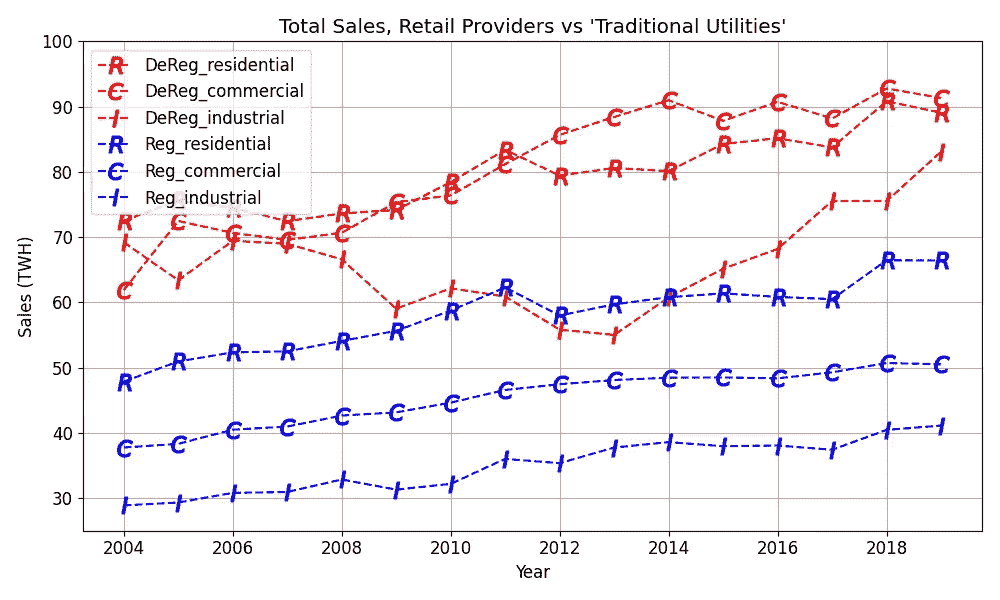

值得注意的是:

1.  尽管业内的一般经验法则是*每个细分市场的销售额的 1/3*，但您可以观察到，对于“传统公用事业”(市政公用事业、合作社和受监管的投资者所有的公用事业)，*住宅细分市场主导着它们的服务负载*。
2.  对于“零售供应商”而言，负荷增长更快，与“传统公用事业”提供的负荷相比，商业和工业负荷在“零售供应商”负荷中所占份额更大。

为什么消费者应该关心商业和工业定价？

我们列出三个主要原因:

1.  当地商业电价是消费者为当地商品和服务(如干洗店、牙医诊所、杂货店、政府服务)支付的每笔账单的组成部分。
2.  有竞争力的商业和工业电价是当地经济健康发展、就业增长和服务质量的重要组成部分。
3.  最后，如果开始比较“传统”公用事业和“解除管制”市场之间的价格差异，重要的是*包括所有部分*，因为管制模式有[交叉补贴](https://en.wikipedia.org/wiki/Cross_subsidization)的趋势。在缺乏市场力量(通常也缺乏透明度)的情况下，受监管的电价至少在某种程度上变成了*的政治问题。只考虑一个细分市场会忽略交叉补贴的潜在影响。*

## 如果我们分析**整个市场**，而不仅仅是住宅市场，会发生什么？

**分析:**我们重复上一篇文章中的图表，显示其他两个细分市场的加权平均*和*供应商价格中位数；因此，该面板中有 3 个图表，固定窗口大小为 7/kwh，但选择了不同的端点*来反映数据范围。这种可视化设计产生了以下[ [3](https://github.com/dkfurrow/eia-retail-analysis/blob/master/eia_retail_analysis2.py) ]:*

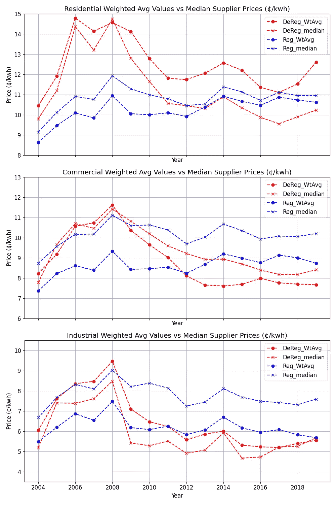

我们的评论首先指出，住宅价格通常高于商业价格，而商业价格又通常高于工业价格，这是我们所预期的，原因在于:

1.  客户负荷的波动性、形状和天气敏感性。
2.  管理、结算和计费成本。
3.  消费者或企业信贷成本(这些成本对于固定价格合同尤为重要)。

如果我们检查加权平均与中间供应商价格的关系，我们也注意到零售供应商价格与“传统效用”的关系，我们观察到以下情况。

1.  在数据集的时间跨度内，零售供应商价格*不会*低于“传统公用事业”价格的唯一价格系列是住宅部分的*加权平均价格。*在*所有其他领域*，无论是比较供应商中值还是加权平均价格，随着时间的推移，零售供应商的价格都低于“传统公用事业”的价格，住宅领域*供应商中值价格也是如此*。
2.  仅关注*零售供应商领域*[‘DeReg’图形标签】我们观察到加权平均价格和供应商价格中值之间存在显著差异的唯一领域是*住宅*领域——对于其他两个领域，这两个指标的追踪更加紧密。
3.  我们在“传统公用事业”*商业*客户中发现了显著的价格偏差，但与“零售供应商”*住宅*价格分布相比，这种价格偏差指向了*相反的方向*。因此，虽然中值住宅零售供应商的客户支付的费用远低于加权平均值，但中值商业供应商的客户支付的费用却要高得多。

我们在上一篇文章中研究了住宅客户的价格分布；在这里，我们将深入探讨商业客户的价格分布。让我们看看 2010 年的分布，在此期间，我们看到解除管制的商业价格开始急剧下降[ [3](https://github.com/dkfurrow/eia-retail-analysis/blob/master/eia_retail_analysis2.py) ]:

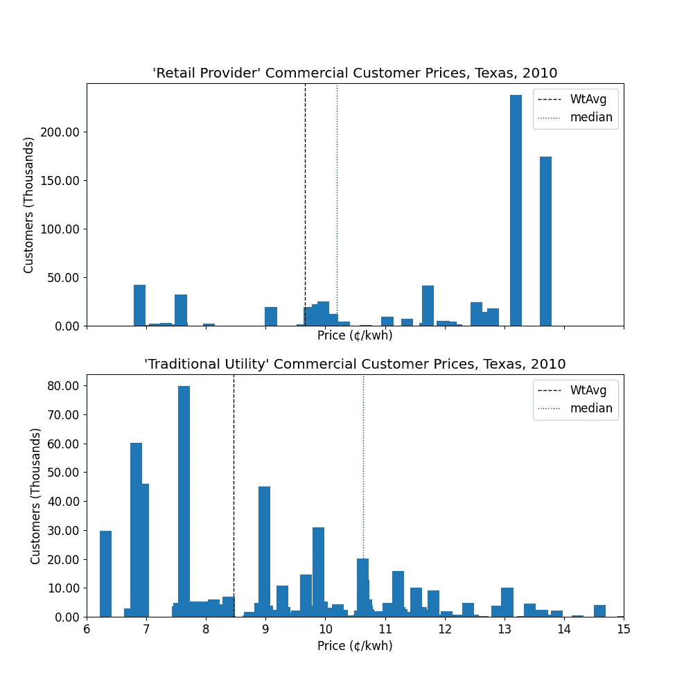

对于零售供应商(上图)，我们看到两个主要的传统供应商(TXU 和 Reliant)，价格也远高于中值或加权平均价格。对于受监管的实体，我们看到少数大型公用事业公司(如圣安东尼奥市、西南公共服务、奥斯汀市、Entergy Texas)的价格较低。但这 144 家公用事业公司中的中等供应商的客户在价格方面表现不佳:举两个例子，德克萨斯州泰勒[距离奥斯汀 35 英里]的平均价格为 11.28 美元，而奥斯汀能源公司的客户支付 8.98 美元。自由城从 Entergy Texas 系统获得电力，但其价格为 11.15 英镑，而 Entergy 自己的客户为 6.94 英镑。同样，在比较这两种监管制度时，使用加权平均值进行比较会产生失真的结果，并遗漏了许多价格与加权平均值相差很大的客户。

但是这个图表提出了一个很好的问题——看看上面的图表:零售供应商的加权平均值是怎么回事？传统提供商的大量高价客户似乎没有像我们预期的那样增加加权平均值。答案当然是，按销量计算的加权平均值是*，这张图表显示的是按客户计算的定价*。*但是与住宅相比，商业客户在数量上的差异要大得多；因此，如果我们按量来看价格，我们可以看到正在发生的事情:*

*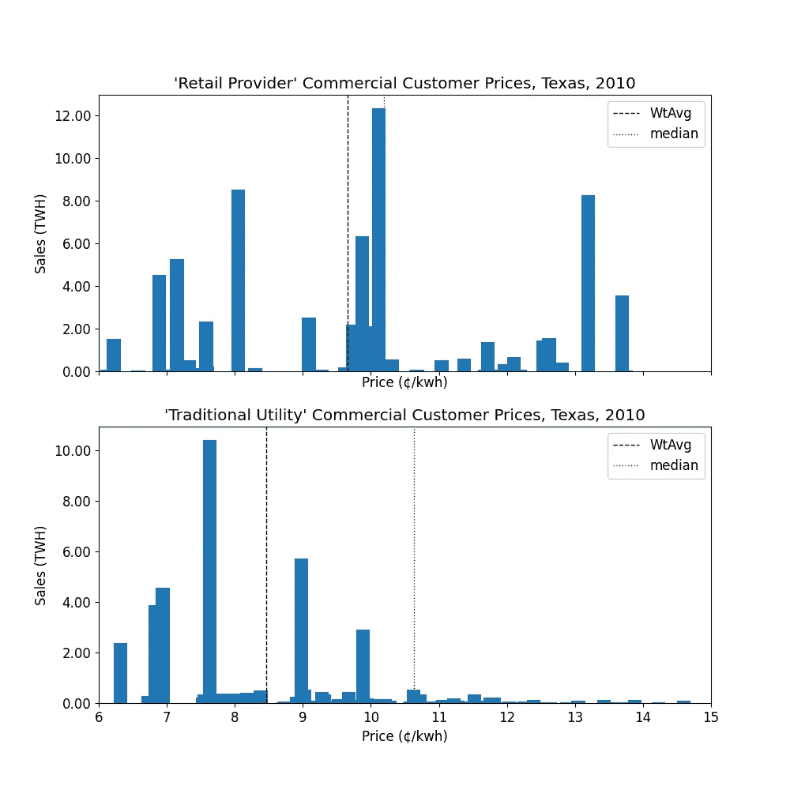*

*将此图与之前的图进行比较:*

1.  *在零售提供商领域，我们看到数量相对较少的大客户群转向了非传统提供商，从而使数量加权平均价格和供应商价格中值相对接近，尽管传统提供商保持了*大量*小客户*。**
2.  **在传统的公用事业领域，我们看到*价格较高的公用事业*拥有相对*大量的小客户*。**

**这个练习的目的是强化[中的信息:电力的价格，第一部分](https://dkfurrow.medium.com/the-price-of-power-part-1-805f512d4c94)；*对零售供应商和传统公用事业公司之间价格差异的分析*的结果高度依赖于*所选择的集中趋势的度量。*我们已经讨论并展示了使用数量加权平均价格和供应商价格中位数的影响，但还有其他潜在的衡量标准；例如，可以通过客户数量而不是数量来加权平均值，或者使用客户的中间价格(与*中间价格提供商*相对)。我们在此认为，供应商价格中值是比数量加权平均值更好的选择，因为价格分布(无论如何加权)存在显著的偏斜，并且因为分析的目的仅仅是*比较高度不同情况下的监管模型*:**

1.  **快速增长的零售提供商空间，客户可以在传统提供商和新进入者之间进行选择，所有这些提供商都在一个共同的批发市场中运营，以及**
2.  **增长较慢的传统公用事业空间，在位置、气候、批发市场、实体类型(市政、合作、投资者拥有的公用事业)和规模方面高度多样化。**

**因此，这种情况需要一个中间值，但是*哪个中间值？*在这里，供应商价格中值更具代表性——在上面的图表中，TXU 的零售供应商价格中值为 13.19，奥斯汀能源公司的传统公用事业价格中值为 8.98。因此，对于零售提供商领域，在新进入者获得足够的市场份额之前，*传统提供商服务于中间客户*。因此，我们再一次回到了供应商中位数，它是我们的最佳(但仍不完美)衡量标准。这里重要的部分是权衡的讨论:*任何对中心趋势(或其他统计度量)的*选择都应该伴随着有力的讨论和分析。**

**我们通过隔离精选住宅部分的影响来结束这一部分，以比较定价:*使用评论文章的加权平均*方法——如果将*整个市场*考虑在内，上面的标题图会如何出现？[ [3](https://github.com/dkfurrow/eia-retail-analysis/blob/master/eia_retail_analysis2.py)**

**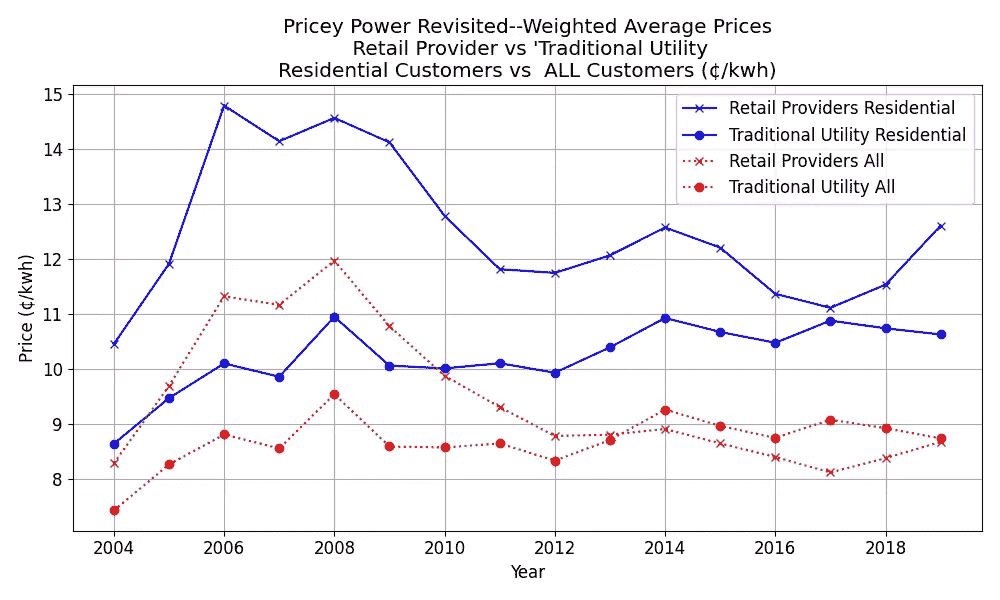**

**因此，总而言之，获得评论文章引人注目的标题图和 280 亿美元标题数字的唯一方法是(1)使用加权平均价格衡量标准*和* (2)仅选择住宅市场，以便获得零售提供商似乎提供持续较差替代方案的价格系列。**

## **如果我们分析*整个市场*并使用*供应商价格中位数*会得到什么结果？**

**比较如上所述的中间价格差乘以零售商销售量，得出以下以美元计价的条形图(记住这里的惯例是*传统公用事业价格减去零售商价格* ) [3](https://github.com/dkfurrow/eia-retail-analysis/blob/master/eia_retail_analysis2.py) :**

**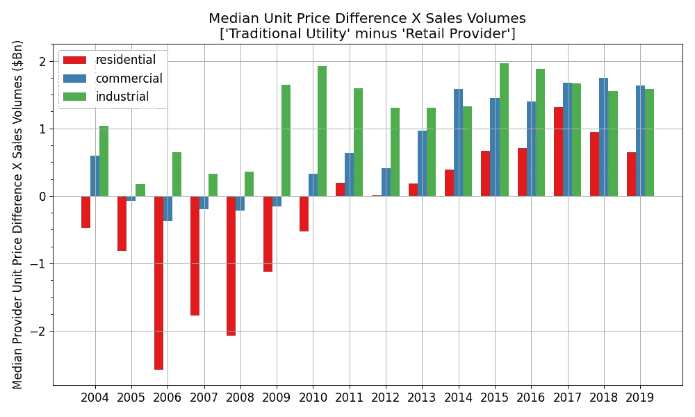**

**因此，这篇评论文章使用了相同的过程来计算标题中的“280 亿美元”价值(价格差异乘以销量)，但在这里，我们的结果有很大不同。在上图中对时间求和得出:**

**因此，通过使用*供应商*中值价格对比*整个零售市场*，我们计算出一个几乎与文章中断言的完全相反的*结果，我们发现一个趋势，表明在该分析的时间跨度内，解除管制的住宅和商业客户的收益不断增加。更重要的是，*在这里*我们改进了文章标准，清楚地陈述了我们的*假设及其背后的含义，并公开了我们的分析和数据集*。***

## *我们分析完了吗？*

***不**我们在这里(以及在评论文章中)的分析缺乏*上下文。十亿美元*可能会成为一个不错的标题，但就对普通消费者的影响而言，这个数字没有任何意义。因此，让我们添加上下文！首先，在此研究期间，典型的月账单是什么样的？对于零售供应商领域的客户，我们对多年的平均月消费总量、总账单和单价进行汇总，得出以下结果 [3](https://github.com/dkfurrow/eia-retail-analysis/blob/master/eia_retail_analysis2.py) :*

*这张图表给出了上述单价图的背景。将条形图(以十亿美元计，如上)重新绘制成一个计算每月账单影响的条形图，得出以下结果[ [3](https://github.com/dkfurrow/eia-retail-analysis/blob/master/eia_retail_analysis2.py) ]:*

*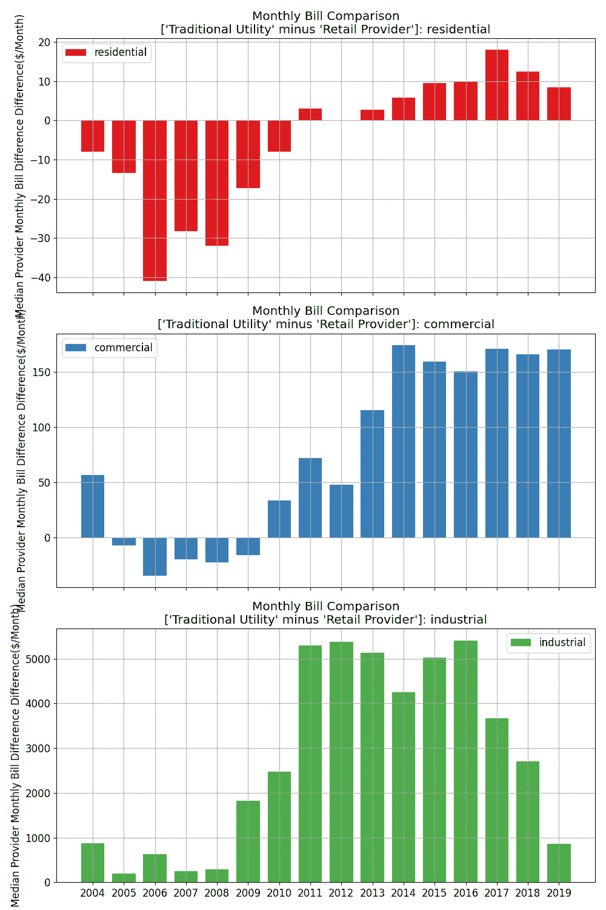*

**现在*我们有了一个有意义的结果；我们知道中间价格差对每月客户账单的价格影响，以及这些客户的平均账单——简而言之，*上下文。**

## *从这些数据中还可以获得什么其他见解？*

*在消费者教育和潜在的其他政策影响方面，最有趣的见解可能是消费者与传统供应商合作的*成本。*我们在本文和[之前的](https://dkfurrow.medium.com/the-price-of-power-part-1-805f512d4c94)中多次提到这一点；在这一部分，我们将量化成本。*

***谁是遗产提供商？***

*我们的第一个任务是识别数据中的遗留公司，我们马上会遇到一个实际问题，即我们的数据缺少通用的公司名称和母公司标识。天真地在`Entity`字段中搜索“TXU”和“信心”，我们找到[ [3](https://github.com/dkfurrow/eia-retail-analysis/blob/master/eia_retail_analysis2.py) ]:*

*检查这些实体的销售和持续时间，我们发现一些似乎是有限持续时间的特殊目的提供者。除去这些，我们将遗留提供商定义为以下任何一种，以每年获得一个信赖实体和一个 TXU 实体[ [3](https://github.com/dkfurrow/eia-retail-analysis/blob/master/eia_retail_analysis2.py) ]:*

*因此，现在我们希望将这些提供商的价格与众多非传统提供商的价格进行比较。一个有趣的方法是用[盒须图](https://datavizcatalogue.com/methods/box_plot.html)(每个图底部的金色非遗提供者的数量)[ [3](https://github.com/dkfurrow/eia-retail-analysis/blob/master/eia_retail_analysis2.py) :*

*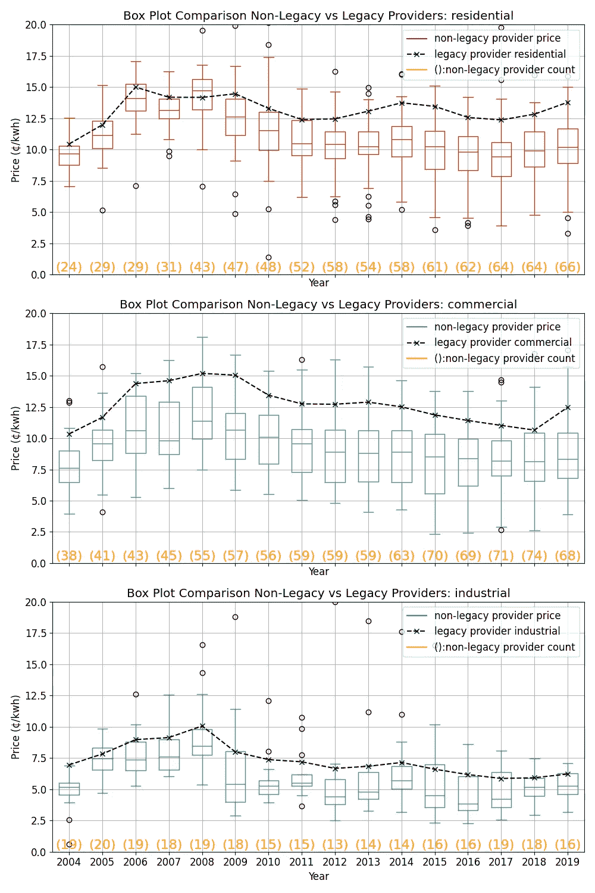*

*我们在传统提供商的这些销售量的背景下检查这些单价:*

*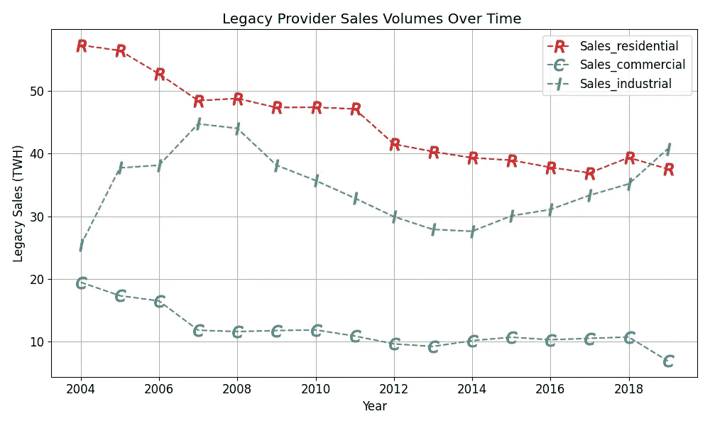*

*我们看到:*

1.  *传统提供商的价格几乎总是超过提供商的中间值，并且始终超过第 75 百分位提供商。*
2.  *令人不安的是，在过去几年中，住宅传统供应商的价差相对于中位数有所增长(尽管传统市场份额有所下降)。*

*这可以说是这个数据集中最重要的故事:与上面讨论的“传统公用事业”的反事实不同，这里我们有证据表明一群客户*持续处于价格劣势，但他们完全有能力做出不同的选择*。我们可以像以前一样量化这个选择的影响；从传统销量乘以中间差价开始(传统-非传统)[ [3](https://github.com/dkfurrow/eia-retail-analysis/blob/master/eia_retail_analysis2.py) ]:*

*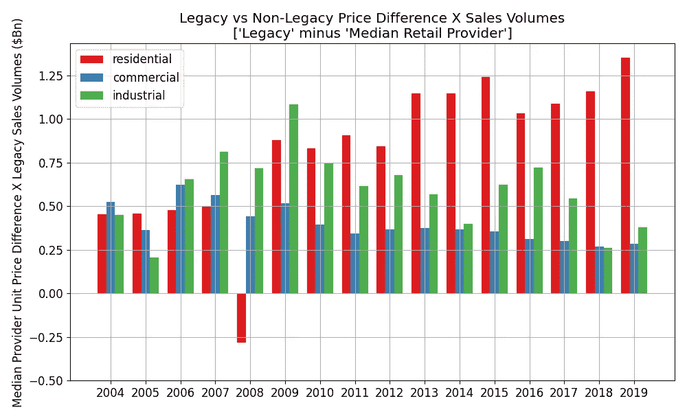*

*跨年度汇总，我们有以下以十亿美元计的总影响:*

*和以前一样，我们根据美元/客户月来估计计费影响:*

*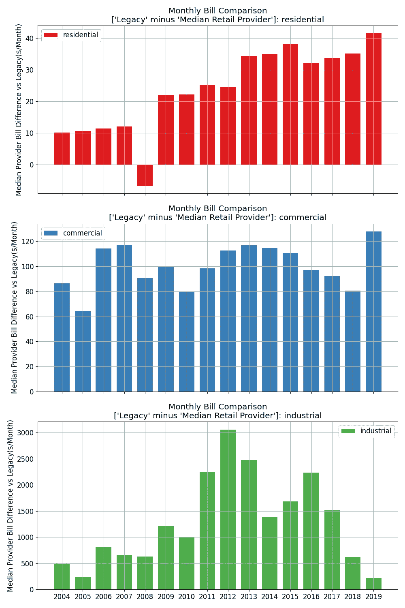*

***摘要:**在这个由两篇文章组成的系列文章中，我们研究了德克萨斯州的零售电价，这是对流行商业报刊上一篇研究相同数据的文章的评论的一部分。我们发现使用加权平均值作为该数据集中趋势的衡量标准存在问题，使用零售市场(住宅)的子集而不是分析整个市场也存在问题。我们提出了一种替代分析来纠正这些缺陷，并扩展该分析来检查数据揭示的一个可操作的问题，即拒绝从传统提供商转换的客户所支付的持续高价格。*

***下一步:**我写这些文章的目的是(1)展示比我在评论文章中看到的更好的分析实践，(2)提供与数据*和*一致的替代分析，以我自己作为德克萨斯电力市场 12 年住宅零售客户的个人经验为例，以及(3)强调[能源信息管理局零售价格数据集](https://www.eia.gov/electricity/data/eia861/)用于消费者和政策用途。我计划通过给德克萨斯公共事业委员会写信来跟进这个分析，敦促他们在他们面向消费者的网站 powertochoose.org 上使用这个数据集。PowertoChoose.org 已经发布了零售供应商的消费者评论，而市场参与者的历史价格表现的发布将是互补和直接的。我鼓励身为德克萨斯州居民的读者加入到我的倡议中来——这个数据集影响着消费者的决策，它是由纳税人出资维护的公共数据集，而且数据似乎没有得到充分利用——解决方案是更广泛地发布它，让消费者受到更好的教育。我希望其他感兴趣的读者可以利用这些数据在其他地区进行适当的分析。*

## *参考*

1.  *主代码库:[github.com/dkfurrow/eia-retail-analysis](https://github.com/dkfurrow/eia-retail-analysis)*
2.  *文章图转载:[wsj _ graph _ reproduction . py](https://github.com/dkfurrow/eia-retail-analysis/blob/master/wsj_graph_reproduction.py)*
3.  *主要分析，可视化: [eia_retail_analysis1.py](https://github.com/dkfurrow/eia-retail-analysis/blob/master/eia_retail_analysis2.py)*