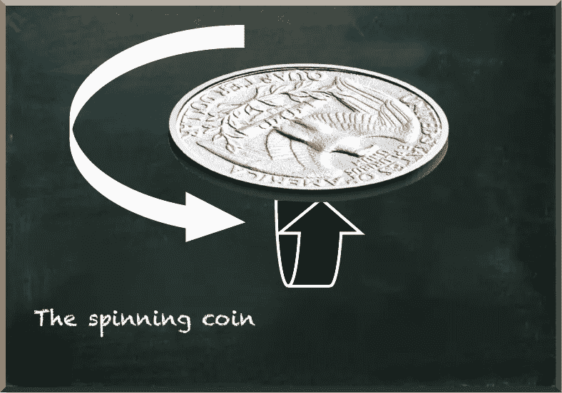
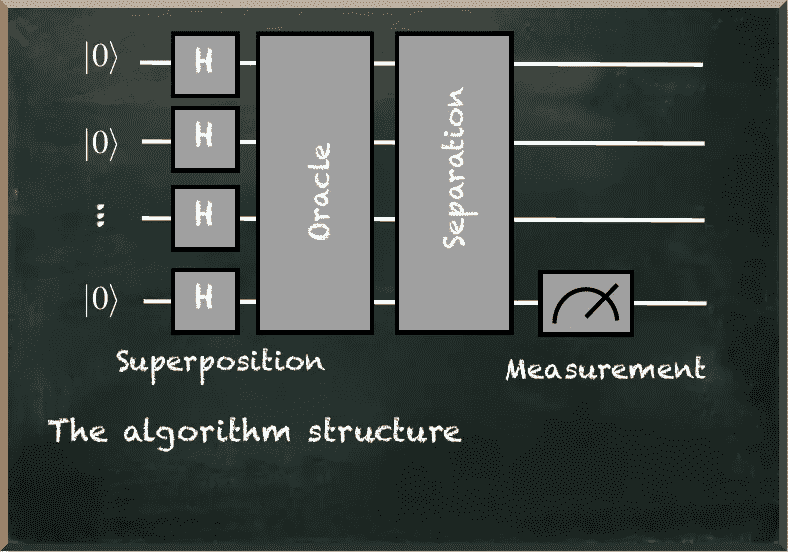
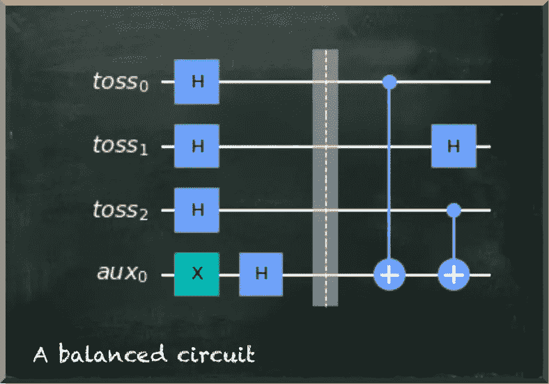
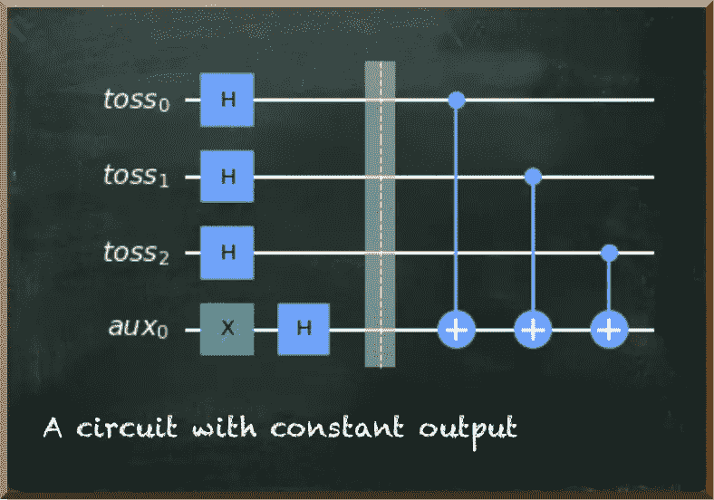
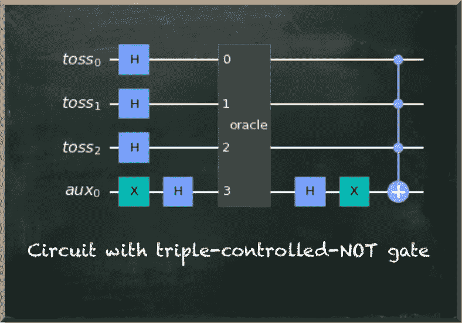
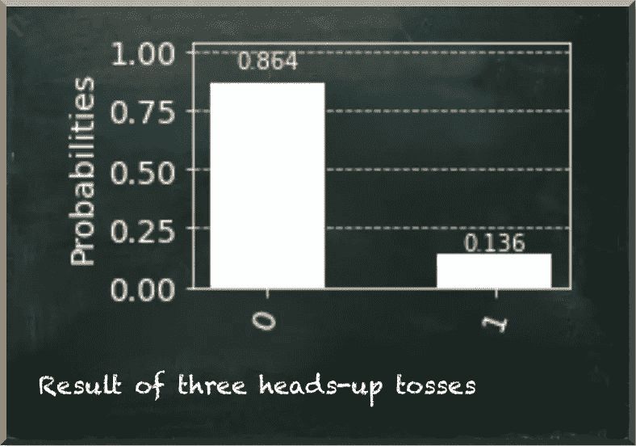
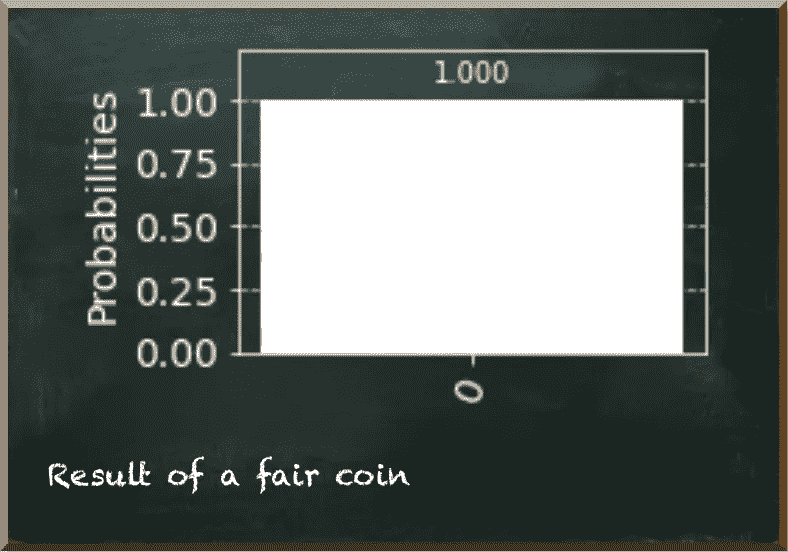
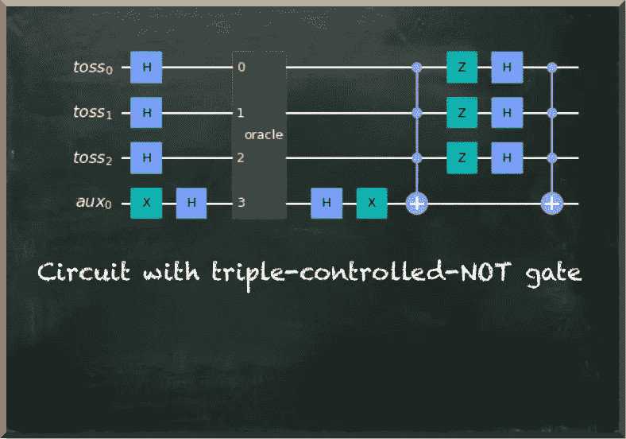
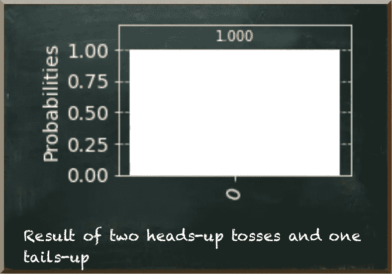
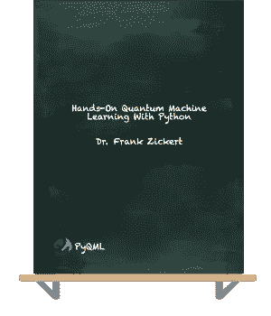

# 概率 Deutsch-Jozsa 量子算法

> 原文：<https://towardsdatascience.com/the-probabilistic-deutsch-jozsa-quantum-algorithm-b01a6c7c4b31?source=collection_archive---------29----------------------->

## 利用量子位的概率性质

量子机器学习要不要入门？看看[用 Python 动手量子机器学习。](https://www.pyqml.com/page?ref=medium_prob&dest=/)

在之前的一系列帖子(“[量子优势的例证](/an-illustrative-case-of-quantum-advantage-6dd1a0168a73)”和“[改进 Deutsch 和 Jozsa 量子算法](/improving-the-deutsch-and-jozsa-quantum-algorithm-760b2dab12b3)”)中，我们看到了第一批量子算法中的一个，它被证明比其经典算法快得多。大卫·多伊奇开发了这种算法，后来和理查德·乔萨一起推广了这种算法。

这些算法都是关于确定输入函数是常数还是平衡的。首先想到的类比是硬币。

作者图片

硬币可能被欺骗，因此总是落在一边。或者，这可能是公平的，降落在任何一方的可能性相等。

Deutsch 的第一个算法只包括两次投掷。后一种概括考虑任意次数的投掷。但是大 ***但是*** 来了:它假设平衡函数在一个特定的边界内是平衡的。例如，如果边界是两个(如在 Deutsch 的第一个算法中)，那么该算法假设一次投掷导致正面朝上，另一次导致反面朝上。

这个假设是不现实的。因此，Deutsch 和 Jozsa 将该算法推广到任何投掷次数。

那么，如果我们说边界是四呢？一枚公平的硬币会恰好两面落地两次吗？也许是的。也许不是。如果你看到四次同一边呢？你能确定这枚硬币是被骗的吗？

八次投掷怎么样？一百次投掷怎么样？一枚公平的硬币能连续一百次落在同一边吗？

不管你说什么数字，你都不能肯定地说硬币被骗了。如果一枚被骗的硬币总是产生相同的结果，而一枚公平的硬币以相同的概率落在两边，你永远不能确定这枚硬币是被骗的。当你看到双方至少一次，你就知道这是公平的。但当你反复看到同一面时，只会强化你对一枚被骗硬币的信念。但这并不确定。

这个问题很主观。就看你自己决定什么时候不折腾了。

那么，我们为什么不创建一个量子电路，产生一个硬币是公平还是欺骗的客观评估？

与 Deutsch 和 Jozsa 的算法相似，我们的算法由四部分组成:叠加态量子位、预言、分离算法和测量。

作者图片

我们从第一个简单的量子比特开始，叠加态的量子比特。每次抛硬币我们使用一个量子位。假设我们有三次投掷，因此三个量子位代表这些投掷。

我们用哈达玛门把它们叠加起来。因为奇斯基特在|0⟩状态初始化量子位，哈达玛门把它们放在|+⟩.状态在这种状态下，量子位被测量为 0 或 1 的概率相等。

在我们的电路中，我们使用一个辅助量子位。我们把它放在|−⟩.我们通过应用一个 X 门和一个哈达玛门来实现这一点。在这种状态下，量子位被测量为 0 或 1 的概率是相等的。但是这个州在相位上与|+⟩不同。虽然相位并不影响我们测量量子位的值，但当我们对量子位应用门时，它确实很重要。例如，哈达玛门将|+⟩态的一个量子位变回|0⟩态，将|−⟩态的一个量子位变回|1⟩.态

考虑到这一点，我们来看看神谕。量子先知不是一个提供预言的神秘人。它是转换门的占位符。

与前一篇文章类似，我们没有为一枚公平的硬币使用一个整体的神谕，而为一枚被欺骗的硬币使用另一个。虽然这甚至会使剩下的工作变得非常简单，但我们需要知道当我们选择正确的甲骨文时，硬币是公平的还是被欺骗的。但这是我们还不知道的。对硬币进行分类是我们量子电路的首要目的。我们不希望算法依赖于只有在我们已经知道解决方案的情况下才能创建的先知。

因此，我们分别处理每一次投掷的硬币。从 Deutsch 和 Jozsa 的算法中，我们知道如何使用受控非门将量子位从|+⟩翻转到|−⟩.当受控非门对处于|1⟩状态的控制量子位的目标量子位应用 x 门时，它也对控制量子位应用目标量子位的相位。我们把这种现象称为相位反冲。

因此，对于每一次正面朝上的投掷，我们应用一个受控的非门，将辅助量子位作为目标。因为这是在|−⟩，它不改变它的状态。X 门通过 X 轴反映量子位状态。但是由于|−⟩位于这个轴上，x 门对目标量子位没有影响。

但是受控非门影响代表投掷的控制量子位。它改变了它的相位，因此，它变成了|−⟩.状态

对于每一次正面朝上的投掷，我们应用哈达玛门。

我们创建一个助手函数来为我们创建 oracle。

例如，下面的电路描述了头-尾-头的初始化和预言。

作者图片

下一幅图表示迄今为止连续三个头的电路。

作者图片

与最初的算法相反，我们没有使用另一系列的哈达玛门将量子位带回基态。取而代之的是，我们将辅助量子位带回到|0⟩态，我们应用一个三重受控非门，用抛量子位作为控制，辅助量子位作为目标。

作者图片

如果所有的量子位都代表正面朝上(它们处于|−⟩状态)，当所有其他量子位也处于|1⟩状态时，我们将辅助量子位翻转到|1⟩。当我们运行电路时，我们看到这种状态的概率是 1/2 =1/8=0.125。这是硬币公平的确切概率，给出了连续三个头的证据。

作者图片

不准确是由于我们使用的模拟的经验性质。

当一次投掷显示为反面时，三重受控非门不适用，因为我们应用哈达玛门的量子位处于|0⟩.态然后，辅助量子位停留在代表公平硬币的|0⟩状态。因此，我们总是将辅助量子位测量为 0。

作者图片

***挑战*** *:我们要辅助量子位的状态* |1⟩ *来代表硬币公平的概率。我们需要如何改变电路？*

然而，我们的电路并不完整。如果所有三个量子位元都代表向上抛，我们目前测量的辅助量子位元也是 0。这将意味着一枚公平的硬币。但它更有可能是一枚被骗的硬币。

因此，我们在电路中增加了一个元件。在这一部分的最后，我们还想应用一个三控制非门，用三个抛量子位作为控制，辅助量子位作为目标。

因此，我们需要将处于|0⟩状态的量子位(代表尾数向上)放入|+⟩状态，因为我们测量|+⟩状态的量子位为 1/2 的情况。如果所有三个量子位都处于这种状态，三控制非门适用于 1/2 的情况。

同时，我们需要将处于|−⟩状态(代表抬头)的量子位放入|0⟩状态，这样，如果单个量子位处于该状态，三重受控非门就完全不适用。

我们通过对每个量子位应用一个 Z 门和一个哈达玛门来实现这些转换。

Z-gate 将抬头量子位从|−⟩转回|+⟩，但它对|0⟩.状态的尾数量子位没有影响接下来的哈达玛门将|+⟩的抬头量子位变成了|0⟩，将|0⟩的尾数量子位变成了|+⟩.结果，我们把代表朝上抛的量子位变成了|+⟩，把代表朝上抛的量子位变成了|0⟩.当所有三个量子位都代表尾朝上状态时，三重受控非门在 1/2 的情况下将辅助量子位置于|1⟩状态。这是给出连续三条尾巴的证据的公平硬币的概率。

作者图片

让我们用一个连续代表三条尾巴的神谕来运行电路，看看结果。

作者图片

同样，我们看到公平硬币的概率约为 0.1250.125。

但是，一旦在电路中有一个单挑投掷，三重控制非门不适用一个控制是在|0⟩.

作者图片

当有正面朝上和反面朝上的投掷时，我们知道我们有一枚公平的硬币。

# 结论

Deutsch 和 Josza 的算法告诉我们如何使用相位反冲来翻转量子位，使其从|+⟩变成|−⟩.

然后，他们巧妙地创建了一个电路，利用这个微小的差异来确定一个函数是平衡的(公平硬币)还是恒定的(欺骗硬币)。

然而，他们假设平衡函数在特定的边界内是平衡的。但这是一种不必要的简化。量子位本质上是概率性的。正如我们所见，我们可以用它们来表示在给定证据的情况下，公平硬币的概率。

当我们经典地思考时，我们希望我们的程序是确定性的。我们提供一些清晰的输入，并期待一个明确的输出。然而，我们生活的世界并不是决定论的。我们的量子电路也不是。

因此，量子电路自然适合我们处理的日常问题。但是我们太习惯于把我们的问题放在一个确定性的框架中，以至于错过了这项令人兴奋的新技术提供的机会。

最后，还有改进的空间。当我们的电路包括正面朝上和反面朝上的投掷时，我们确信硬币是公平的。然后，我们总是把辅助量子位测量为 0。

但是当我们的电路只包括一次投掷时，测量量子位为 1 表示硬币是公平的。当然，我们希望用相同的测量值来代表硬币的公平性。

你能相应地编辑电路吗？

量子机器学习要不要入门？看看 [**用 Python 动手量子机器学习。**](https://www.pyqml.com/page?ref=medium_prob&dest=/)

免费获取前三章[点击这里](https://www.pyqml.com/page?ref=medium_prob&dest=/)。