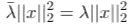

# 对称矩阵性质及其应用

> 原文：<https://towardsdatascience.com/the-properties-and-application-of-symmetric-matrice-1dc3f183de5a?source=collection_archive---------2----------------------->

## 带几何解释

对称矩阵是沿对角线对称的矩阵，这意味着 aᵀ= a-矩阵的转置等于其自身。是一个具有自伴性质的**算子**(把一个矩阵想成一个算子，研究它的性质，确实是一件大事)。虽然我们不能直接从对称性中读出几何性质，但我们可以从对称矩阵的**特征向量**中找到对对称矩阵最直观的解释，这将使我们对对称矩阵有更深刻的理解。


图片来自 [Unsplash](https://unsplash.com/photos/slgtMF8EjYE)

一个简单的例子是单位矩阵。一个重要的例子可能是这样的:


对称矩阵的一个例子

然而，尽管定义如此简单，但它们有很大的概率，并且意味着很多事情。在本帖中，我们将看看重要的属性，直观地解释它们，并介绍它们的应用。

埃尔米特矩阵是对称矩阵的复数扩展，这意味着在埃尔米特矩阵中，所有元素都满足


定义 0.1

对称矩阵就是厄米矩阵，其共轭转置与自身相同。因此，它具有对称矩阵的所有性质。


埃尔米特矩阵的一个例子

在这篇文章中，我们将主要讨论真实的情况，对称矩阵，为了使事情变得简单一点，在数据科学中，我们主要遇到具有真实条目的矩阵，因为我们正在处理真实世界的问题。

# 对称矩阵最重要的性质

本节将介绍对称矩阵的三个性质。它们被认为是最重要的，因为它们涉及这些矩阵的特征值和特征向量的行为，这是区分对称矩阵和非对称矩阵的基本特征。

## 物业 1。对称矩阵有实特征值。

这可以很容易地用代数方法证明(一种正式的、直接的证明，与归纳、矛盾等相反)。).首先，快速获取特征值和特征向量。矩阵 A 的特征向量是应用 A 后方向不变的向量。方向不变，但矢量可以缩放。这表明了这一性质的非平凡性——实特征值给了我们线性变换中**拉伸**或缩放的信息，不像复特征值*没有*的“大小”。

向量缩放的比例是特征值，我们用λ表示。因此，我们有关系式 Ax = λx(方程式 1.1)。证明相当简单，但是有一些线性代数的重要知识，所以我们还是会一步步来

从这里开始，我们通过 x、xᴴ的共轭转置得到方程 1.1


等式 1.2

我们如何继续前进？需要注意的一点是，λ是标量，这意味着涉及λ的乘法是可换的。因此，我们可以把它移到 xᴴ的左边


等式 1.3

xᴴx 是欧几里德范数(或 2-范数)，它被定义为


等式 1.4 2-标准

在二维欧几里得空间中，它是带有坐标(x₁，…，xₙ).)的向量的长度我们可以将等式 1.3 写成


等式 1.5

由于共轭转置(算符 h)的工作方式就像普通转置(算符 t)一样，我们可以利用 xᴴA = (Ax)ᴴ.)的性质


等式 1.6

(Ax)ᴴ等于什么？这里我们将再次使用关系式 Ax = λx，但这一次(Ax)ᴴ将留给我们λ的复共轭，我们用杠表示它λ。


等式 1.7

我们以前在等式 1.3 中见过 xᴴx，在 2-范数中代入后(我们可以这样做，因为λ_bar 和 xᴴx 都是标量)，我们得到



等式 1.8

这导致λ和它的复共轭相等


情商。1.9

只有在一种情况下，方程 1.9 才有效，即λ为实数。这样我们就完成了证明。

## 房产 2。对应于特征值的特征向量是正交的。

证明也是直接的形式证明，但是很简单。首先，我们需要认识到我们的目标，这是如下


等式 1.10

考虑一个对称矩阵 a，其中 x₁和 x₂是对应于不同特征向量的 a 的特征向量(我们需要这个条件的原因将在稍后解释)。通过特征值和对称矩阵的定义，我们可以得到以下方程


等式 1.11、等式 1.12

现在我们需要逼近方程 1.10。让我们试着把 x₁和 x₂放在一起——我们乘以(Ax₁)ᵀ乘以左边的 x₁ᵀ:


等式 1.13

在等式 1.13 中，除了对称矩阵的性质之外，还使用了另外两个事实:(1)矩阵乘法是结合的(向量是 n 乘 1 的矩阵)(2)矩阵标量乘法是可交换的——我们可以自由移动标量。因为点乘是可交换的，这意味着 x₁ᵀx₂和 x₂ᵀx₁是一样的东西，我们有


等式 1.14

其中 **x₁∙x₂** 表示点积。如果λ₁ ≠ λ₂，那么必然是 **x₁∙x₂** = 0，这意味着这两个特征向量是正交的。如果λ₁ = λ₂，有两个不同的特征向量对应于同一个特征值(这是可能发生的，想想对手的例子——单位矩阵)。由于特征向量在(A-λI)(记为 N(A-λI))的零空间中，当一个特征向量对应多个特征向量时，N(A-λI)具有大于 1 的维数。在这种情况下，对于这些特征向量，我们有无限多的选择，我们总是可以选择它们是正交的。

显然，存在实矩阵具有复特征值的情况。这发生在旋转矩阵中。为什么会这样呢？设 Q 是一个旋转矩阵。我们知道特征向量被 Q 应用后不改变方向，但是如果 Q 是旋转矩阵，x 怎么可能不改变方向，如果 x 是非零向量？结论是特征向量一定是复数。

二维空间中的旋转矩阵 R(θ)如下所示。


旋转矩阵

R(θ)将向量逆时针旋转θ角。它是具有复数特征值和特征向量的实矩阵。

## 房产 3。对称矩阵总是可对角化的。(谱定理)。

这也和对称矩阵的另外两个性质有关。这个定理的名字可能会令人困惑。事实上，矩阵的所有特征值的集合称为谱。同样，我们可以这样想:

> 特征值-特征向量对告诉我们，在给定的线性变换之后，向量在哪个方向上是失真的。

如下图所示，经过变换后，在 v₁方向上，这个数字被拉长了很多，但在 v₂方向上并不太多。


图 1.15

可对角化的矩阵意味着存在对角矩阵 d(对角线之外的所有元素都是零)使得 **P⁻ AP = D** ，其中 p 是可逆矩阵。如果一个矩阵可以写成 A = PDP⁻的形式，我们也可以说这个矩阵是可对角化的。

分解通常不是唯一的，但是直到 D 中对角线上的元素的排列和 p 中特征向量的标量乘法才是唯一的。我们还需要注意，对角化等价于寻找特征向量和特征值，不管矩阵是否对称。然而，对于非对称矩阵，D 不必是正交矩阵，

这两个定义是等价的，但是可以有不同的解释(这种分解使得矩阵的幂非常方便)。第二个，A = PDP⁻，告诉我们如何分解 a，同时，第一个，P⁻ AP = D，告诉我们 a 可以**对角化**。它告诉我们，可以将标准基(由单位矩阵给出)与特征向量对齐。这是通过特征向量的正交性实现的，如属性二所示。

这种“将标准基与特征向量对齐”听起来非常抽象。我们需要思考这个:矩阵变换对基做了什么？由基α = {v₁，…，vₙ}(那些向量在列中)组成的矩阵将向量 x 从标准基变换到由基α形成的坐标系，我们用 Aα表示这个矩阵。所以在对角化 P⁻ AP = D 的过程中，p 从标准基向特征向量发送一个向量，a 对其进行缩放，然后 P⁻将向量发送回标准基。从矢量的**角度看，坐标系*与具有特征矢量*的标准基对齐。**


图 1.16 基础的对齐

这种排列如图 1.16 所示，本例中使用的矩阵为


等式 1.17

其中 V 是以长度为 1 的特征向量为列的矩阵，每个特征向量对应于对角矩阵中的特征值。至于计算，我们可以让 Matlab 中的`eig`来做。

这个性质直接遵循**谱定理**，它说

> 如果 A 是厄米的，则存在由 A 的特征向量组成的 V 的标准正交基，每个特征向量都是实数。

该定理直接指出了对称矩阵对角化的一种方法。为了直接证明该性质，我们可以在矩阵的大小(维数)上使用归纳法。详细的证明可以在[这里](https://people.math.carleton.ca/~kcheung/math/notes/MATH1107/wk10/10_orthogonal_diagonalization_proof.html)找到。

这个证明的最基本的想法是:基本情况，其中 A 是一个接一个的矩阵，是微不足道的。假设 n-1 乘 n-1 矩阵是可对角化的(有 n-1 个独立的特征向量)，我们可以在 n 维空间中找到另一个与那 n-1 维特征向量正交的特征向量。因此，n 乘 n 矩阵也是可对角化的。

# 矩阵的定性

那些属性什么时候有用？甚至在矩阵的正式研究之前，它们已经被用于求解线性方程组很长时间了。将矩阵视为运算符，线性方程的信息存储在这些运算符中，矩阵可用于研究函数的行为。

除了对称，矩阵更好的特性是**正定性**。如果一个对称(或埃尔米特)矩阵是正定的，那么它的所有特征值都是正的。如果它的所有特征值都是非负的，那么它就是一个*半定*矩阵。对于一个正定的矩阵来说，由于性质 1，要求它是对称的是显而易见的，因为只有当它是实数时，询问一个数是正还是负或者它有多大才有意义，如前所述。

## 特征值、特征向量和函数行为

一个很好的应用是**海森**矩阵，我们将以此为例演示如何使用矩阵来分析函数行为。当我们试图寻找一个局部极值时，发现 Hessian 是正定的总是好消息。海森矩阵是由一个实函数的二阶偏导数组成的矩阵。形式上，让 f: ℝⁿ ➝ℝ是一个函数，黑森定义为


Def 2.1Hessian(紧凑表示)

我们称 H(x)为 f 的 Hessian，它是一个 n 乘 n 的矩阵。在 Def 1.18 中，黑森被写得非常简洁，这和


Def 2.2 黑森

这对函数行为有什么影响？我们将看一个超级简单的例子。考虑函数 f(x，y)= y-x。Hessian 计算如下


等式 2.3

也可以使用 Matlab 中的函数`hessian`来计算。因为它是一个对角矩阵，迹(对角线上的元素之和)等于特征向量之和，我们可以立即看到其中一个特征值是 2，另一个是-2。它们对应于特征向量 v₁ = [1，0]ᵀ和 v₂ = [0，1]ᵀ.这个矩阵是对称的，但不是正定的。因此，在整个ℝ上不存在局部极值，我们只能在点 x=0，y=0 上找到一个鞍点。这意味着在 v₁方向，特征值为正，函数增加，但在 v₂方向，特征值为负，函数减少。该函数的图像如下所示


图 2.4

该图像是使用 Matlab 生成的，代码如下

```
clc; clear; close allxx = -5: 0.2: 5;
yy = -5: 0.2: 5;[x, y] = meshgrid(xx, yy);zz = x.^2 - y.^2;figure
mesh(x, y, zz)
view(-10, 10)
```

现在我们翻转符号，把函数改成 f(x，y) = x + y，特征向量不变，但所有特征向量都变成正的。这意味着，在 v₁方向和 v₂方向，函数都在增长。因此，可以找到局部最小值—在 x=0，y=0，f(x，y) = 0。这也是全球最小值。图表看起来像


图 2.5

*总结*

矩阵在许多领域都有广泛的用途。在处理矩阵时，经常会遇到正定、特征向量、特征值、对称矩阵等概念。在这篇文章中，介绍了对称(厄米)矩阵的三个最重要的性质，它们与矩阵的特征向量和特征值有关。这些性质解释了几何，但一些代数证明也包括在内。最后，介绍了一个用矩阵分析函数行为的例子。

资源:

[1] Weisstein，Eric w . .[埃尔米特矩阵。来自 MathWorld——一个 Wolfram 网络资源。](https://mathworld.wolfram.com/HermitianMatrix.html)

[2] [对称矩阵](https://www.doc.ic.ac.uk/~ae/papers/lecture05.pdf)，访问 2021 年 9 月 19 日

[3]霍恩，R. A .，&约翰逊，C. R. (2012 年)。 [*矩阵分析*](https://books.google.cz/books?hl=cs&lr=&id=O7sgAwAAQBAJ&oi=fnd&pg=PR11&dq=matrix+analysis&ots=lWNbwlfuf6&sig=SADhwZxdyh0dmuNis4wAs8om0jI&redir_esc=y#v=onepage&q=matrix%20analysis&f=false) 。剑桥大学出版社。