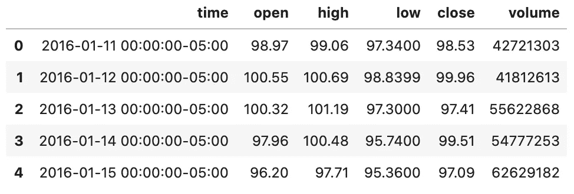
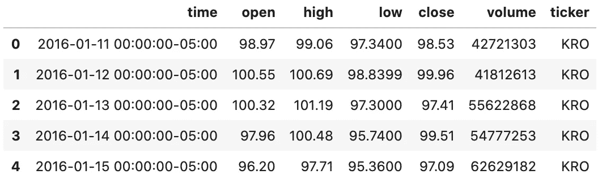

# Python Glob 模块

> 原文：<https://towardsdatascience.com/the-python-glob-module-47d82f4cbd2d?source=collection_archive---------2----------------------->

## Python 中文件名匹配的教程

里卡多·维亚纳在 [Unsplash](https://unsplash.com/s/photos/glob?utm_source=unsplash&utm_medium=referral&utm_content=creditCopyText) 上拍摄的照片

`glob`模块是 [Python 标准库](https://docs.python.org/3/library/glob.html)的有用部分。`glob`(global 的缩写)用于返回所有匹配特定模式的文件路径。

我们可以使用`glob`来搜索特定的文件模式，或者更有用的是，通过使用通配符来搜索文件名匹配特定模式的文件。

根据[维基百科](https://en.wikipedia.org/wiki/Glob_(programming))，“`glob`模式指定了带有通配符的文件名集合”。

这些模式类似于正则表达式，但要简单得多。

*   星号(*):匹配零个或多个字符
*   问号(？)只匹配一个字符

虽然`glob`可以用来搜索一个有特定文件名的文件，但我发现它在阅读几个同名文件时特别方便。识别这些文件后，可以将它们连接成一个数据帧，以供进一步分析。

这里我们有一个输入文件夹，其中有几个包含股票数据的 csv 文件。让我们使用 glob 来标识文件:

全局示例

这里，我们读入输入文件夹中的所有 csv 文件，并将它们连接成一个数据帧。

在下面的示例输出中，我们可以看到一个小问题——我们不知道该行属于哪个文件。股票代码只是每个文件的名称，并不包含在我们的连接数据帧中。

球状数据帧

我们可以通过添加一个带有股票代码的附加列来解决缺少股票代码的问题。

我们用文件名创建一个新列，然后使用`replace`清除数据，删除不需要的文件扩展名:

具有从文件名创建的列的 Glob 示例

这样看起来好多了！我们现在可以知道每一行属于哪个股票了！

添加了跑马灯的数据帧

现在我们有了一个包含所有股票数据的有用的数据框架。这可以用于进一步的分析。

`glob`模块对于在文件中查找文本也非常有用。我广泛使用`glob`来识别具有匹配字符串的文件。

许多(许多，许多)次，我知道我已经写了我需要的代码，但是不记得在哪里找到它，或者我需要找到包含需要删除或更新的特定电子邮件地址或 h̵a̵r̵d̵-̵c̵o̵d̵e̵d̵值的每个程序。

首先，我们可以使用 glob 来查找目录及其子目录中与搜索模式匹配的所有文件。然后，我们将文件作为字符串读取，并搜索匹配的搜索模式。

例如，我知道我以前画过一个 KDE 图，但是我不记得在哪里找到了。

让我们找到所有的`.ipynb`文件并搜索字符串“kdeplot”:

查找字符串匹配的 Glob

我们找到了两个包含字符串“kdeplot”的文件！这个文件，`superhero_exploratory_analysis.ipynb`应该就是我们要找的。

另一个文件— `glob_tutorial.ipynb`是这个例子所在文件的名称，所以它肯定不是我们要寻找的创建 KDE 图的例子。

这个例子中有两个项目与上面的不同:我们指定了`recursive=True`，并且使用了`iglob`而不是`glob`。

添加参数`recursive=True`告诉`glob`搜索所有子目录以及`ml_guides`目录。如果我们不确定我们的搜索词将在哪个文件夹中，这将非常有帮助。

当没有指定`recursive`参数，或者将其设置为`False`时，我们只在搜索路径中指定的文件夹中进行搜索。

搜索大量目录可能需要很长时间，并会占用大量内存。对此的解决方案是使用`iglob`。

`iglob`与`glob`的不同之处在于，根据[文档](https://docs.python.org/3/library/glob.html)，它返回一个迭代器“产生与`glob`相同的值，而不是同时存储它们”。与`glob`相比，这将提供更好的性能。

## 结论

在这里，我们回顾了 Python 的`glob`模块和这个强大的 Python 标准库资产的两个用例。

我们演示了如何使用`glob`来查找目录中匹配给定模式的所有文件。然后将这些文件连接成一个数据帧，用于进一步分析。

我们还讨论了使用`iglob`递归搜索包含给定字符串的文件的目录。

本指南只是简要介绍了`glob`模块的一些可能用途。我想看看你想出的使用它的方法！

快乐环球！