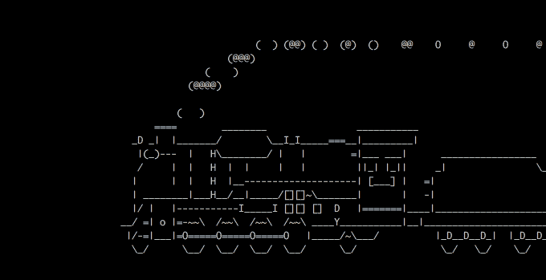
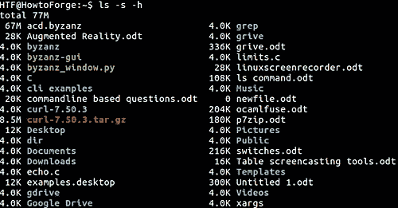

# python 模块将彻底改变您的命令行技能

> 原文：<https://towardsdatascience.com/the-python-module-that-will-revolutionise-your-command-line-skills-8ee5956bd202?source=collection_archive---------26----------------------->

## *节省时间，避免初学者在使用 CLI 时常见的错误*



如果你花了 5 分钟的时间在电脑上，你很有可能用过 CLI(命令行界面)。您遇到了一些问题，比如不能使用键盘快捷键(Control-C、Control-V)进行拷贝和粘贴，或者不能轻松地存储上一个命令的输出，等等。
如果您计划在将来使用命令行，使用 python 脚本来帮助跟踪您的 CLI 是一项很好且容易掌握的技能。

如果您还不是会员，请在这里获得您的中级会员资格[！](https://medium.com/@alejandra.vlerick/membership)

# Python 操作系统模块

这个 python 模块允许自动执行操作系统任务。它提供了创建和删除目录(文件夹)、获取其内容、更改和识别当前目录等功能。

> 更重要的是，OS 模块允许您与 Python 可能运行的任何底层操作系统(Windows、Mac 或 Linux)进行交互。

# 创建您的脚本

第一步是导入操作系统模块

```
import os
```

## 列出当前工作目录中的文件:

这可以通过许多方式来实现，最直接的两种方式包括使用 **os.system** 调用和传入命令“dir”。

```
files = os.system("dir")
```

否则，我们可以使用内置函数“listdir ”,它打印路径指定的目录。

```
files = os.listdir("/user/directory/name")
```



打印目录中的文件

# 导航到您的根目录

一个非常有用的方法是从根目录或主目录开始。这可以通过调用

```
from pathlib import Path
home = str(Path.home())
```

输出如下所示:*用户\你的名字*

例如，如果您想导航到您的下载文件夹，唯一需要做的事情是添加文件夹名称。使用' **chdir** '改变目录功能。

```
home + "\Downloads" = "User\yourname\Downloads"
a = os.chdir(home + "\Downloads")
```

这将执行一个字符串连接，创建一个从主目录到下载文件夹的路径。

# 将命令的输出保存在文件中

如果你要生成一个秘密令牌，或者检查一个目录中文件的状态，等等，能够快速地将输出保存在你所在的本地目录的一个文本文件中是很有用的。

这将创建一个空的文本文件，我们将在其中追加最近一次运行的输出。

```
log = open('output.txt', 'a')
```

子进程模块允许您生成新的进程，连接到它们的输入/输出/错误管道，并获得它们的返回代码。

```
c = subprocess.Popen(['dir', '/p'], stdout = log, shell = True)
```

在本例中，我将“dir”命令的输出保存在 output.txt 文件中(保存在本地变量 log 中)。因此，output.txt 文件将包含我工作的目录中的文件和文件夹列表。

如果我想分析我的文件的内容，我只需要在我的 python 脚本中将它作为一个字符串打开:

```
f = open(home+"\Downloads\output.txt", "r")
mystr = f.read()
```

# 非常感谢你的阅读！

更多类似的文章，请在 Medium [这里](https://towardsdatascience.com/medium.com/@alejandra.vlerick)找到我！

如果你有任何关于如何改进的**问题**、**建议**或**想法**，请在下面留下评论或通过 LinkedIn [这里](https://www.linkedin.com/in/alejandra-g-283595b8)取得联系。