# 量子位阶段

> 原文：<https://towardsdatascience.com/the-qubit-phase-b5fea2026ea?source=collection_archive---------11----------------------->

## 量子世界不是一个圆盘

本帖是本书的一部分: [**用 Python 动手做量子机器学习**](https://www.pyqml.com/page?ref=medium_phase&dest=/) **。**

> 霍雷肖，天地万物比你的哲学所梦想的要多得多 
> 
> (哈姆雷特(1 . 5 . 167–8)，哈姆雷特对荷瑞修)

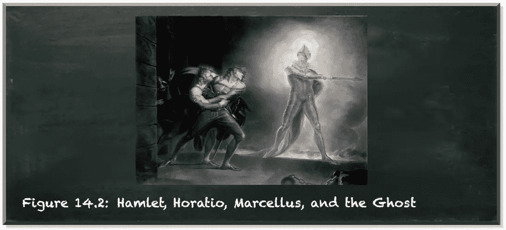

改编自考夫曼 1789 年的一幅画，公共领域

你还记得我们介绍的量子硬币的例子吗？硬币有两种状态，正面或反面。在空气中，我们的量子硬币处于两种状态的叠加状态。

让我们仔细看看这枚硬币。它不断地在正面和反面之间翻转。一旦硬币落地，这个旋转决定了我们看到的是正面还是反面。

再仔细看看。这枚硬币也沿着它的边缘旋转。

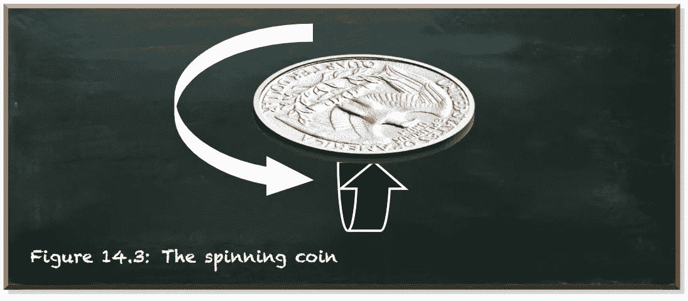

作者弗兰克·齐克特的图片

乍一看，旋转对于头和尾的方向并不重要。但它会影响硬币在空中的轨迹。这关系到硬币落地后的方向，不是吗？

在量子力学中，粒子也有这样的自旋。就是这个阶段。在物理术语中，量子力学阶段源于这样一个概念，即每个量子实体不仅可以描述为粒子，也可以描述为波。

关于光本质上是粒子还是波的争论可以追溯到三百多年前。在十七世纪，艾萨克·牛顿宣称光是由一系列粒子组成的。大约两百年后，在十九世纪，托马斯·杨反驳光是由波组成的。他设计了双缝实验来证明他的主张。

在这个实验中，一束光对准一个有两个垂直狭缝的屏障。光线穿过狭缝，产生的图案被记录在照相底片上。

如果一个狭缝被盖住，就会有一条光线，与打开的狭缝对齐。直觉上，如果两个狭缝都打开，我们会看到与狭缝对齐的两条线。但是其他的事情发生了。照相底片被完全分成不同程度的多条明暗线。

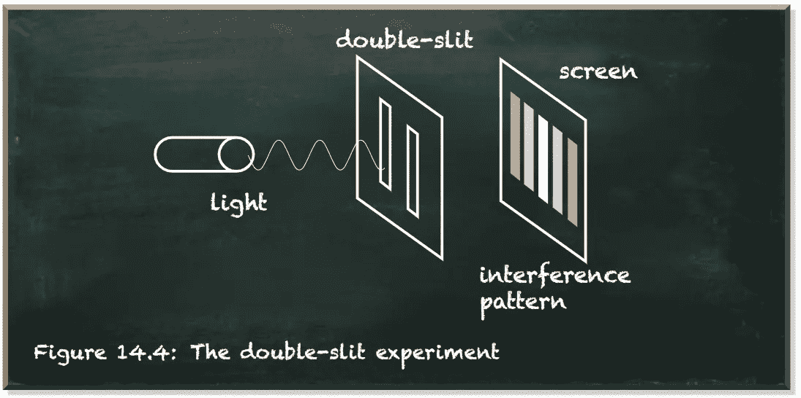

作者弗兰克·齐克特的图片

如果你把光看成是一束粒子，那么杨的实验的含义是反直觉的。但是一旦你开始把光想象成一种波，这就非常有意义了。

波浪的主要特征是它在运动时上下起伏。这需要多种其他特征。

*   波长是波的形状重复的距离。
*   波的振幅是波的中心和波峰之间的距离。

下图描述了这些特征。

作者弗兰克·齐克特的图片

波的另一个明显特性是它们会互相干扰。简单来说，它们加起来。如果有两个波在同一介质中传播，它们会形成第三个波，代表每个点的振幅之和。

例如，如果有两个相同的波，它们的波峰在同一点，那么产生的波就有更大的振幅。

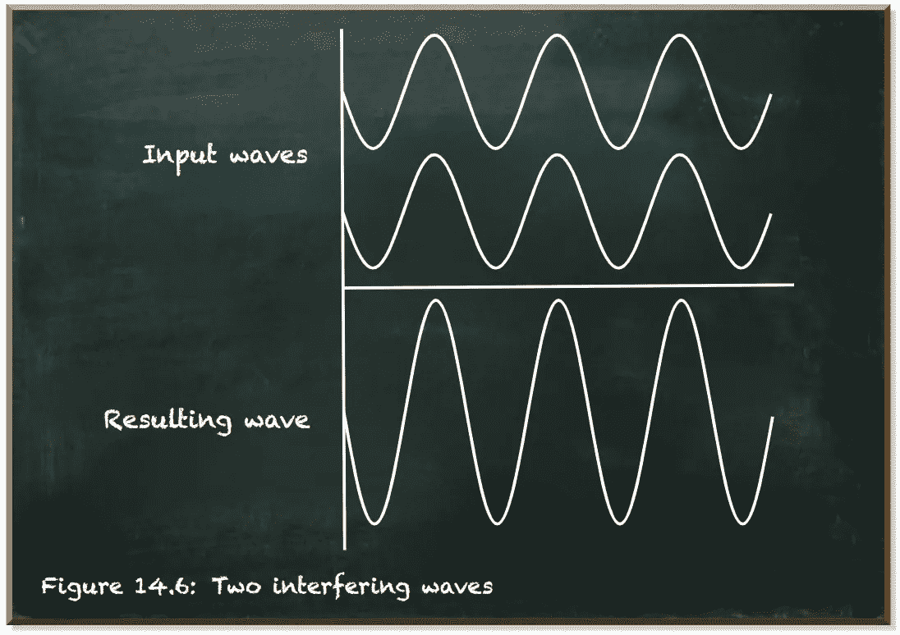

作者弗兰克·齐克特的图片

但是，如果波浪移动，使得一个波浪的波峰与另一个波浪的波谷重叠，它们就相互抵消了。

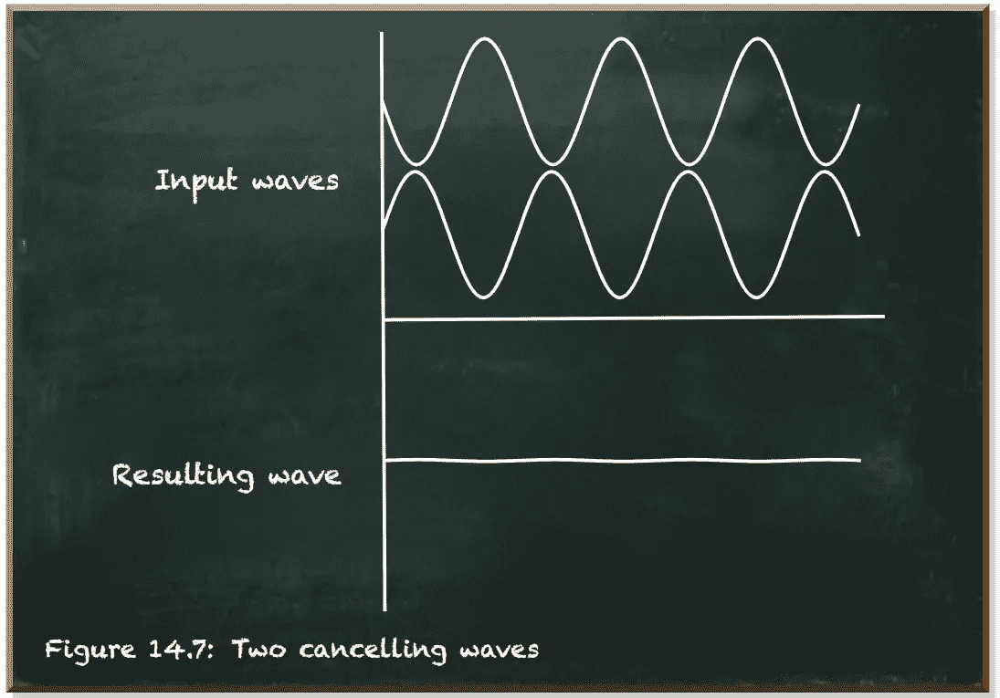

作者弗兰克·齐克特的图片

这两种波具有相同的振幅和相同的波长。但是它们的波峰和波谷的相对位置不同。这个相对位置就是波的相位。

对于外界来说，波的相位是不可观测的。单独观察，这两个波看起来是一样的。但是一旦波相互干涉，相位就很重要了。

让我们回到双缝实验，看看两个波是如何从狭缝传播到屏幕的。这两个狭缝到屏幕上任何给定点的距离都不同。由于一种波比另一种波传播的距离更长，所以屏幕上每一点的相对位置都不同。在某些时候，它们以相同的相位击中屏幕。它们建设性地干涉并照亮了这个区域。在其他点，一个波在波峰，而另一个在波谷。它们相消干涉，该区域保持黑暗。

作者弗兰克·齐克特的图片

量子位(qubit)是一种量子力学实体，我们可以将其描述为波。它也有一个阶段。

量子位处于|0⟩态和|1⟩态的叠加态，α和β是相应的振幅。数学上，叠加被定义为|ψ⟩=α|0⟩+β|1⟩.观察时量子位产生`0`的概率等于α^2 和β^2 产生`1`。因此，α^2+β^2=1 是因为所有可能状态的概率总和必须等于 1 (100%)。

振幅的符号对于最终的测量概率并不重要。与波类似，振幅为负的量子位与原始量子位具有相同的测量概率。

从图形上看，量子位状态是一个矢量。矢量是有方向的。矢量和负矢量(方向相反)是有区别的。但是测量概率被定义为量子位状态向量的头部和标准基向量|0⟩和|1⟩.之间的距离距离没有方向。

例如，美国

具有相同的测量概率。任何一对状态|ψ⟩和
|ψ′⟩也是如此，它们的状态向量镜像在 z 轴上，如下图所示。

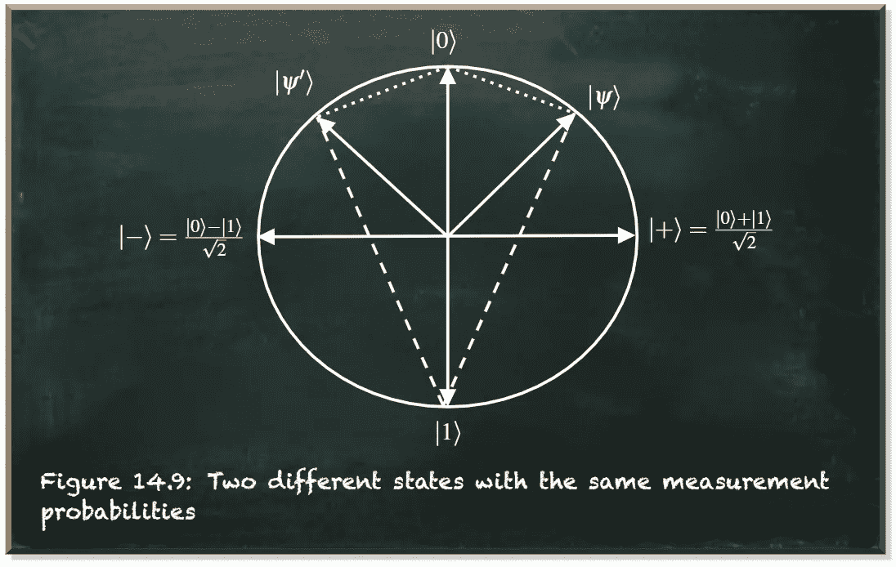

作者弗兰克·齐克特的图片

作为波，两种状态|ψ⟩和|ψ′⟩表示两个波长移动了一半的波。一方的顶峰是另一方的低谷。

量子位的概念让我们能够区分两个相反的相位。但是一个量子位可能存在的所有其他相位呢？与波类似，相位可以是任意值。我们能制定的唯一有意义的限制是，一旦相位超过波长，它就会重复。它可能会提醒你我们用来旋转量子位状态向量并改变其振幅的角度θ(见[这篇文章](https://medium.com/better-programming/if-you-want-to-gamble-with-quantum-computing-e327c11f97e5))。

事实上，我们可以将量子位相位表示为一个角度ϕ(希腊字母“phi”)，它跨越一个围绕中心的圆，并且与振幅的圆正交。这个圆使用了另一个维度。

在下图中，角度θ描述了量子位产生|0⟩或|1⟩的概率，角度ϕ描述了量子位所处的相位。

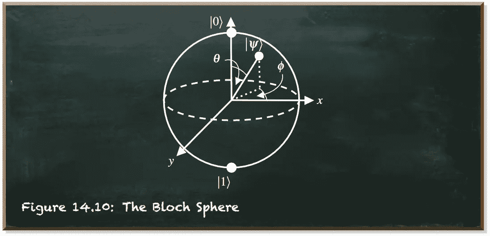

作者弗兰克·齐克特的图片

这两个圆围绕中心形成一个球体。这个球面被称为布洛赫球面。

布洛赫球提供了测量量子位的相位和概率的视觉参考，作为|0⟩或|1⟩.的基态在这个球体中，决定测量幅度的角度θ围绕 Y 轴旋转。相应地，我们到目前为止使用的 RY-gate 围绕这个轴旋转量子位状态向量。它在基础状态|0⟩和|1⟩.中切割 z 轴如果我们不应用相移，它就“躺”在 X 轴跨越的平面上。但是一旦量子位状态有了不同的相位，它就从这个平面上升起。

确定相位的角度φφ围绕 Z 轴旋转。因此，量子位相位的任何变化都不会影响 z 轴或 z 轴上任何点的接近度，例如表示 z 轴顶部和底部的基态|0⟩和|1⟩。

因此，相位不影响测量概率。

从数学上来说，我们可以使用三维向量来创建三维球体，例如

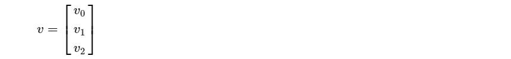

然而，第三个维度对测量概率很重要。量子位相位将等同于其他两个维度。

相反，我们用二维向量实现了一个三维球体

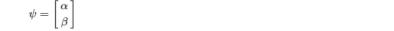

因为α和β是复数。复数是一个可以用 *a+b⋅i* 的形式表示的数，其中 *a* 是实部 *b⋅i* 是虚部。 *i* 表示满足等式 *i^2=−1* 的虚数单位。因为没有实数满足这个等式，所以部分 *a* 和 *b⋅i* 彼此独立。因此，我们不把一个复数表示成一条线，比如我们表示实数。但是复数形成一个平面。复数是二维的。

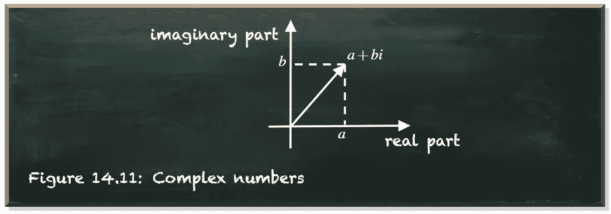

作者弗兰克·齐克特的图片

复数扩展了测量概率α和β的概念。但是为了对我们的目的有用，我们仍然要求α和β之间的关系用|α|^2+|β|^2=1.方程来归一化

因为α和β是复数(α，β ∈ C)，所以在对它们的平方求和之前，必须取绝对值。简单的正方形已经不够了，因为 i^2=−1.

在[的这篇文章](/do-you-struggle-with-the-quantum-superposition-86d0f2147bfb)中，我们介绍了量子比特状态的极性形式，其中角度θ控制测量量子比特在状态`0`或`1`的概率。

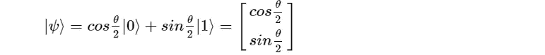

我们只需要将相位应用于两个振幅中的一个。以|−⟩为例。我们可以用两种方式来表示它。

如果我们将-加到两个参数上，我们将得到|+⟩.态

按照惯例，我们把相位放在状态|1⟩.的振幅上

但是我们如何表达阶段呢？我们知道它是ϕ.角的函数让我们把这个插入到函数中。

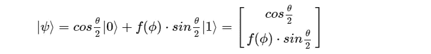

事实上，我们知道 f(ϕ).的一些特点对ϕ=0 来说，我们预计不会有任何变化。因为我们用β=sinθ/2 乘以 f(ϕ，所以在这种情况下，f(ϕ必须等于 1。因此，f(0)=1。

此外，随着一个完整波长的移动，我们最终处于相同的相位。由于归一化，量子位的波长是 2π——一个圆的周长。因此，f(2π)=1。偏移半个波长，我们就有效地抵消了原来的波。因此，f(π)= 1。

下图用图形描绘了 f(ϕ。我们可以看到它的输出是 f(ϕ)=cos(ϕ)+i⋅sin(ϕ).

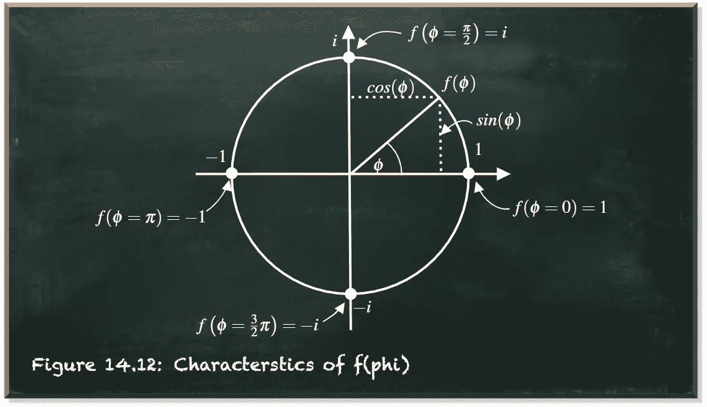

作者弗兰克·齐克特的图片

莱昂哈德·欧拉发现我们可以用 f(ϕ)=cos(ϕ)+i⋅sin(ϕ)=e^iϕ来描述这样一个函数。这个方程被称为欧拉公式。

这给了我们精确的量子位状态向量

***“但是*** e^iϕ ***对测量概率不重要吗？”***

振幅 e^ix 的部分使它成为一个复数。它有一个实部和一个虚部。当我们计算测量概率时，我们平方振幅的绝对值。

那么，我们来看看复数绝对值的平方是什么意思。假设我们有一个复数 c=a+bi

复数 c 的绝对平方通过将其乘以其复共轭来计算。复数的共轭(记为 c∫)是虚部符号反过来的数。在我们的例子中，这是 c∑= a bi。这就是所谓的平方范数。它被定义为| c | 2 = c∫c

通过应用第三个二项式规则并插入 I2 = 1 的定义，我们可以将该公式转换如下。

现在，如果复数是由 c=e^ix=cos(ϕ)+i⋅sin(ϕ给出的)，我们可以看到 a=cos(ϕ)和 b=sin(ϕ).

按照毕达哥拉斯的“恒等式(用直角三角形表示)，sin(ϕ和 cos(ϕ的平方和)是 1。因此，我们可以声明

# 结论

所以不管相位是什么，它的绝对平方都是 1。1 是乘法的中性元素。我们乘以 1 的数保持不变。

复数允许我们在不接触测量概率的情况下增加量子位相位的维度。虽然这会影响量子位状态的振幅，但不会影响测量概率。

在这篇文章中，我们了解了量子位的相位。尽管我们不能直接测量相位，但我们展示了如何将它添加到量子态中。

角度θ描述了量子位产生|0⟩或|1⟩的概率，ϕ描述了量子位所处的相位。

本帖是本书的一部分: [**用 Python 动手做量子机器学习**](https://www.pyqml.com/page?ref=medium_phase&dest=/) **。**

在这里免费获得前三章。