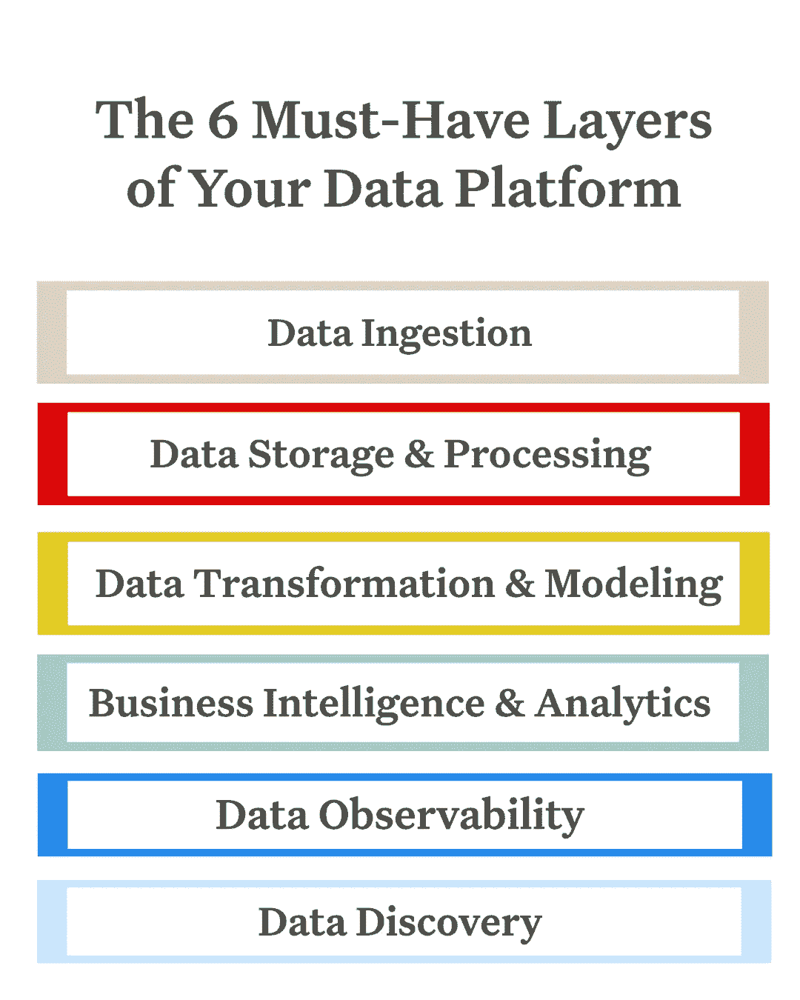
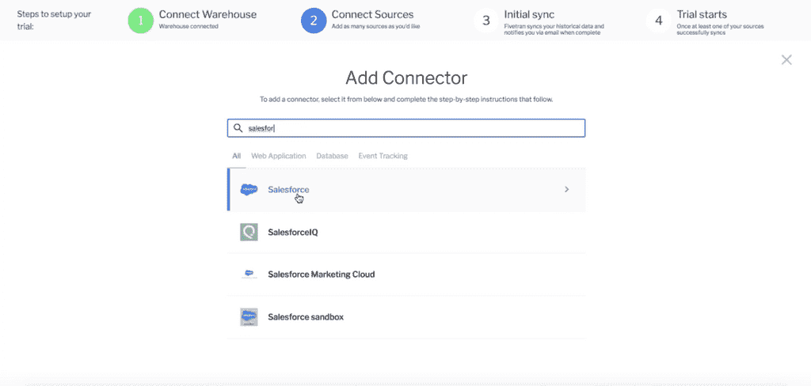
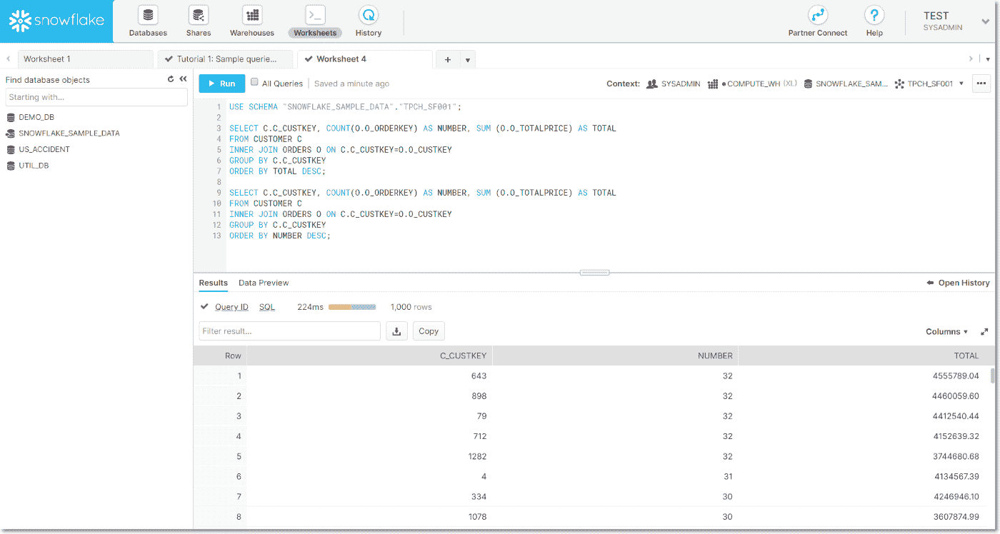
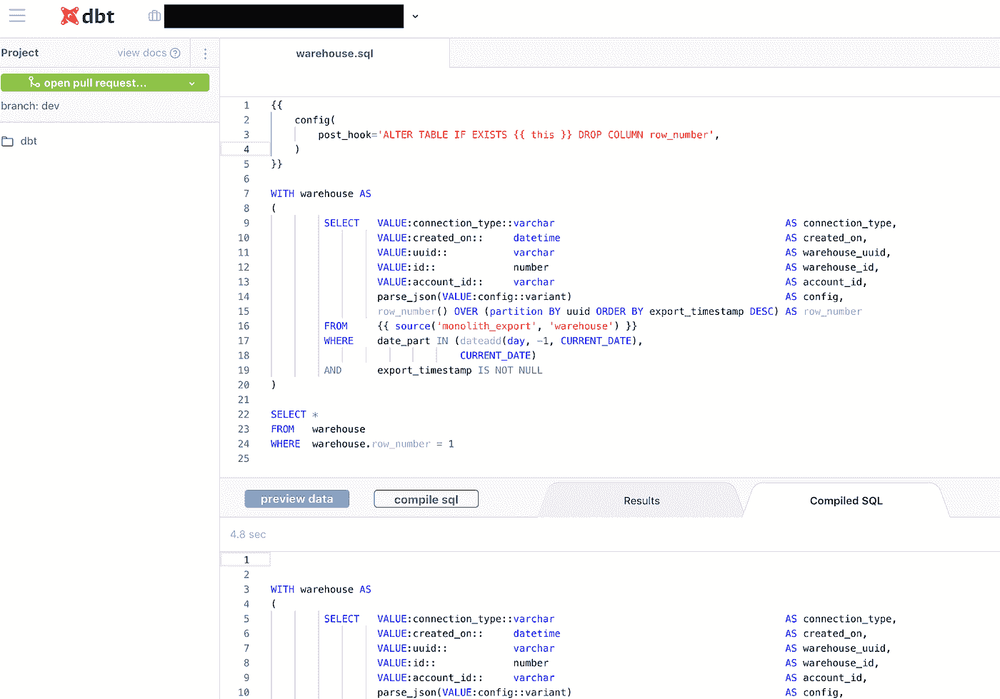
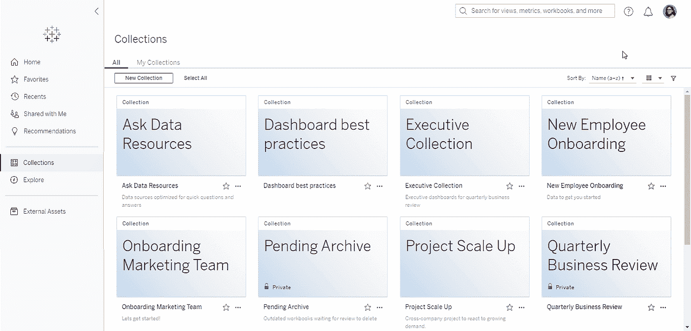
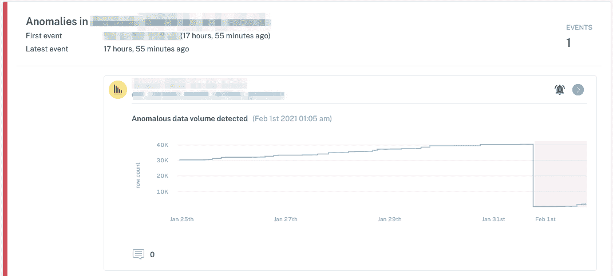
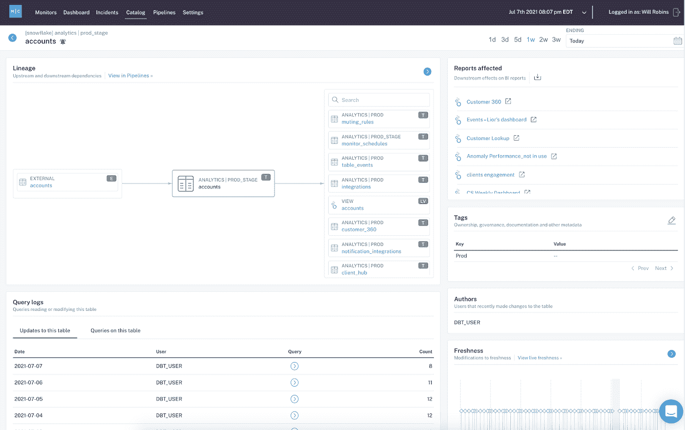

# 构建数据平台的快速指南

> 原文：<https://towardsdatascience.com/the-quick-and-dirty-guide-to-building-your-data-platform-2f21dc4b7c94?source=collection_archive---------7----------------------->

## 有很多技术可以用来构建数据平台，但是您真正需要的是什么呢？

图片由 [Unsplash](http://www.unsplash.com) 上的 [Max Duzij](https://unsplash.com/@max_duz) 提供。

我们从客户那里得到的最常见的问题之一是“**我如何构建我的** [**数据平台**](https://www.montecarlodata.com/announcing-the-2021-data-platform-trends-report/) **？**

对于大多数组织来说，构建数据平台不再是一件好事，而是一件必须要做的事情，许多公司基于从数据中收集可行见解的能力，在竞争中脱颖而出。

尽管如此，证明从头开始构建数据平台所需的预算、资源和时间表说起来容易做起来难。每家公司都处于其数据之旅的不同阶段，因此更难确定首先投资平台的哪些部分。像任何新的解决方案一样，您需要 1)围绕产品能提供什么和不能提供什么来设定预期，2)为长期和短期投资回报做好计划。

为了让事情变得简单一点，我们列出了您需要在数据平台中包含的 6 个必备层，以及许多最佳团队选择实施它们的顺序。

# 介绍:6 层数据平台

仅次于“我如何构建我的数据平台？”，我得到的最常见的问题是“我从哪里开始？”

> 不言而喻，构建数据平台不是一种一刀切的体验，我们讨论的层(和工具)只是触及了当今市场上可用的表层。一家拥有 5000 名员工的电子商务公司的“正确”数据堆栈，与一家拥有 200 名员工的金融科技初创公司的“正确”数据堆栈会有很大不同，但所有数据平台都必须有一些核心层。

**谨记:**就像你不能建造一个没有地基、框架和屋顶的房子一样，归根结底，没有这 6 层中的每一层，你也无法建造一个真正的数据平台。但是你如何选择建立你的平台完全取决于你自己。

下面，我们分享了“基本”数据平台的样子，并列出了每个领域的一些热门工具(您可能正在使用其中的几个):

*现代数据平台由六个基础层组成，包括数据摄取、数据存储&处理、数据转换&建模、商业智能&分析、数据观察和数据发现。图片由蒙特卡洛提供。*

# 数据摄取

第一层？数据摄取。

除非首先被吸收，否则数据无法被处理、存储、转换和应用。几乎所有现代数据平台都需要从一个系统向另一个系统接收数据。随着数据基础架构变得越来越复杂，数据团队面临着从各种来源获取结构化和非结构化数据的挑战。这通常被称为提取转换加载(ETL)和提取加载转换(ELT)的提取和加载阶段。

*像 Fivetran 这样的数据摄取工具使得数据工程团队可以很容易地将数据移植到他们的仓库或湖泊中。图片由*[five tran提供](https://fivetran.com/)

下面，我们概述了该领域的一些流行工具:

*   [**Fivetran**](https://fivetran.com/) —领先的企业 ETL 解决方案，管理从数据源到目的地的数据交付。
*   [**Singer**](https://www.singer.io/) —一个开源工具，用于将数据从任何来源移动到任何目的地。
*   [**Stitch**](https://www.stitchdata.com/) —一个基于云的开源平台，让你可以快速地将数据从任何来源移动到任何目的地。
*   [**Airbyte**](https://airbyte.io/)——一个开源平台，让你轻松同步应用程序中的数据。
*   [**Apache Kafka**](https://kafka.apache.org/)—一个开源[事件流](https://kafka.apache.org/documentation/#intro_streaming)平台来处理流分析和数据摄取

尽管当今市场上普遍存在摄取工具，但一些数据团队选择构建自定义代码来从内部和外部来源摄取数据，许多组织甚至构建自己的自定义框架来处理这项任务。

编排和工作流自动化，包括像 [Apache Airflow](https://airflow.apache.org/) 、 [Prefect](https://www.prefect.io/) 和 [Dagster](https://dagster.io/) 这样的工具，也经常被合并到摄取层。编排通过获取孤立的数据，将其与其他来源结合起来，并使其可用于分析，使接收更进了一步。

> 不过，我认为，在处理存储、处理和商业智能层之后，编排可以(也应该)被编织到平台中。毕竟，没有功能数据的管弦乐队，您就无法进行编排！

# 数据存储和处理

构建完摄取层后，您需要一个存储和处理数据的地方。随着公司将其数据环境迁移到云，云原生[数据仓库](https://www.montecarlodata.com/how-to-build-your-data-platform-choosing-a-cloud-data-warehouse/)、[数据湖](https://www.montecarlodata.com/how-to-build-your-data-platform-choosing-a-cloud-data-warehouse/)，甚至[数据湖库](https://databricks.com/blog/2020/01/30/what-is-a-data-lakehouse.html)的出现已经占领了市场，为存储数据提供了相对于许多内部解决方案来说更容易访问且更经济实惠的选择。

您是选择数据仓库、数据湖还是两者的组合，完全取决于您的业务需求。最近，在构建数据堆栈时，围绕是使用开源还是闭源解决方案有很多讨论(在 [Snowflake](https://www.snowflake.com/blog/choosing-open-wisely/) 和[data bricks’](https://www.youtube.com/watch?v=dNjy_B7A414)营销团队之间的对话真正揭示了这一点)。

无论你站在哪一边，你都会发现在不投资云存储和计算的情况下构建一个可扩展、灵活的数据平台是一项挑战。

*在快速扩展数据平台方面，云数据仓库 Snowflake 是数据团队的热门选择。图片由* [*雪花*](https://community.snowflake.com/s/article/First-Data-Warehouse-Experience-with-Snowflake) 提供

下面，我们重点介绍当今云仓库、湖或[在此插入您自己的变化]环境中的一些领先选项:

*   [**雪花**](https://www.snowflake.com/) —最初的云数据仓库，雪花为数据团队提供了灵活的支付结构，用户为计算和存储数据支付单独的费用。
*   [**谷歌 BigQuery**](https://cloud.google.com/bigquery) —谷歌的云仓库 BigQuery 提供了一种无服务器架构，由于并行处理，允许快速查询，以及可扩展处理和内存的单独存储和比较。
*   [**亚马逊红移**](https://aws.amazon.com/redshift/?whats-new-cards.sort-by=item.additionalFields.postDateTime&whats-new-cards.sort-order=desc) —亚马逊红移是使用最广泛的选项之一，位于亚马逊网络服务(AWS)之上，可以轻松与该领域的其他数据工具集成。
*   [**Firebolt**](https://www.firebolt.io/)**—一个基于 SQL 的云数据仓库，据称其性能比其他选项快 182 倍，因为由于采用了新的压缩和数据解析技术，该仓库处理数据的方式更轻松。**
*   **[**微软 Azure**](https://www.google.com/search?q=microsoft+azure&rlz=1C5CHFA_enUS905US905&oq=microsoft+azure&aqs=chrome..69i57j0i433j0j0i433j0j0i433j0l2j0i433i457j0.4251j1j4&sourceid=chrome&ie=UTF-8#:~:text=Microsoft%20Azure%3A%20Cloud,us)%3A%20389/55.49K)**——微软的云计算参赛者在这个名单中常见于利用大量 Windows 集成的团队。****
*   ****[**亚马逊 S3**](https://aws.amazon.com/s3/)**——结构化和非结构化数据的对象存储服务，S3 给你计算资源，让你从零开始构建数据湖。******
*   ******[**data bricks**](https://databricks.com/)—data bricks 是 Apache Spark 即服务平台的先驱，它为用户提供了利用结构化和非结构化数据的选项，并提供了数据湖的低成本存储功能。******
*   ******—dre mio 的数据湖引擎为分析师、数据科学家和数据工程师提供了一个集成的自助式数据湖界面。******
*   ******[**starbrust**](https://www.starburst.io/)**—starbrust 提供 PrestoSQL(现在的 Trino)作为托管服务，让你的湖中数据的分析和访问变得更加容易。********

# ******数据转换和建模******

******数据转换和建模经常互换使用，但它们是两个非常不同的过程。当您转换数据时，您正在获取原始数据并用业务逻辑对其进行清理，以便为分析和报告准备好数据。当您对数据建模时，您正在创建数据的可视化表示，以便存储在数据仓库中。******

************

*******dbt 是一个充满活力的开源社区，它为精通 SQL 的数据分析师提供了轻松转换和建模数据的能力，以供平台的商业智能层使用。图片由蒙特卡洛提供。*******

******下面，我们分享一个常用工具列表，数据工程师可以利用这些工具对数据进行转换和建模:******

*   ******[**dbt**](https://www.getdbt.com/)——data build tool 的缩写，是在[将数据](https://blog.getdbt.com/what--exactly--is-dbt--2/)加载到您的仓库后对其进行转换的开源领导者。******
*   ****[**数据表单**](https://dataform.co/) —现在[是谷歌云](https://dataform.co/blog/dataform-is-joining-google-cloud)的一部分，数据表单允许你将仓库中的原始数据转换成商业智能和分析工具可用的东西。****
*   ****[**【SSIS】**](https://docs.microsoft.com/en-us/sql/integration-services/sql-server-integration-services?view=sql-server-ver15)【Sequel Server Integration Services(Sequel Server Integration Services)——由微软托管，SSIS 允许您的企业从各种来源提取数据并进行转换，然后您可以使用这些数据加载到您选择的目的地。****
*   ******自定义 Python 代码和**[**Apache air flow**](https://airflow.apache.org/)**——在 dbt 和 Dataform 这样的工具兴起之前，数据工程师一般都是用纯 Python 编写自己的转换。虽然继续使用定制代码来转换数据可能很诱人，但它确实增加了出错的机会，因为代码不容易复制，而且每次执行过程时都必须重写。******

******数据转换和建模层将数据转化为更有用的东西，为其旅程的下一阶段做好准备:分析。******

# ******商业智能(BI)和分析******

******如果您的员工不能使用您收集、转换和存储的数据，那么这些数据对您的业务毫无用处。******

******如果数据平台是一本书，BI 和分析层将是封面，充满了引人入胜的标题、视觉效果和数据实际上试图告诉您的内容的摘要。事实上，当最终用户描绘数据平台时，他们通常会想到这一层，这是有充分理由的:它使数据具有可操作性和智能性，没有它，您的数据就没有意义。******

************

******Tableau 是一款领先的商业智能工具，为数据分析师和科学家提供了构建仪表盘和其他可视化工具的能力，从而为决策提供支持。图片来自 [*画面*](https://www.tableau.com/about/blog/2021/6/tableau-release-ask-data-explain-data-viewers-collections) *。*******

******下面，我们概述了一些在顶级数据团队中流行的 BI 解决方案:******

*   ******[**Looker**](https://looker.com/) —一个针对大数据优化的 BI 平台，允许您的团队成员轻松协作构建报告和仪表盘。******
*   ****[**Tableau**](https://www.google.com/aclk?sa=l&ai=DChcSEwjVh760gqzxAhUGrsgKHfO8DYYYABAAGgJxdQ&sig=AOD64_2nK_YvIHT962la-NW-lgEySYsO2g&q&nis=1&adurl&ved=2ahUKEwjW6bS0gqzxAhXumuAKHdxZBI4Q0Qx6BAgCEAE) —通常被称为 BI 行业的领导者，它有一个易于使用的界面。****
*   ****[**模式**](https://mode.com/) —一个协作式数据科学平台，将 SQL、R、Python 和可视化分析整合在一个 UI 中。****
*   ****[**Power BI**](https://powerbi.microsoft.com/en-us/) —一款基于微软的工具，可轻松与 Excel 集成，并为团队中的每个人提供自助式分析。****

****此列表并不全面，但它将帮助您开始为您的堆栈寻找合适的 BI 层。****

# ****数据可观察性****

********

*****数据可观察性为团队提供了数据信任的整体视图，涵盖了可观察性的五个关键支柱，包括新鲜度、模式和沿袭(如上图所示)。图片由蒙特卡洛提供。*****

****随着数据管道变得越来越复杂，组织越来越依赖数据来推动决策制定，对获取、存储、处理、分析和转换这些数据以使其值得信赖和可靠的需求变得前所未有。简而言之，组织再也承受不起 [**数据宕机**](https://www.montecarlodata.com/the-rise-of-data-downtime/) 的后果，即不完整、不准确、缺失或错误。****

****通过将相同的应用程序可观察性和基础架构设计原则应用于我们的数据平台，数据团队可以确保数据可用且可操作。在我们看来，基于糟糕的数据做出决策往往比根本没有数据更糟糕。****

****您的数据可观测性图层必须能够针对以下可观测性支柱进行监控和警报:****

*   ******新鲜度**:数据是最近的吗？最后一次生成是什么时候？包含/省略了哪些上游数据？****
*   ******分布**:数据是否在可接受的范围内？格式是否正确？完成了吗？****
*   ******卷**:数据都到了吗？****
*   ******模式**:什么是模式，它是如何改变的？谁做了这些改变，原因是什么？****
*   ******沿袭**:对于给定的数据资产，受其影响的上游来源和下游资产是什么？谁是生成这些数据的人，谁是决策的依据？****

********

****数据可观察性将提醒数据工程团队注意影响关键数据集的异常情况，减少白噪声并根据历史数据绘制事件图。图片由蒙特卡洛提供。****

> ****一个有效、主动的数据可观察性解决方案将快速、无缝地连接到您现有的堆栈，提供端到端的沿袭，允许您跟踪下游的依赖关系。此外，它将自动监控您的静态数据，而无需从您的数据存储中提取数据。这种方法可确保您满足最高级别的安全性和合规性要求，并扩展到要求最苛刻的数据量。****

# ****数据发现****

********

*****最佳数据发现解决方案将提供表和资产所有者、链接、查询日志和其他元数据的自动化动态概览，从而提供对数据的丰富理解和联系。图片由蒙特卡洛提供。*****

****在构建数据平台时，大多数领导者会选择(或构建)一个数据目录，在我们看来，这种方法已经不够了。****

****不要误解我的意思:数据目录很重要，现代数据团队需要一种可靠的、可扩展的方法来记录和理解关键数据资产。但是，随着数据变得越来越复杂和实时，底层平台的流程和技术也需要发展。****

****传统的 [**数据目录往往达不到**](https://www.montecarlodata.com/data-catalogs-are-dead-long-live-data-discovery/) (即手动、扩展性差、缺乏对非结构化数据的支持等。)，数据发现收拾残局。如果说传统数据目录是一张地图，那么数据发现就是您智能手机的导航系统，它会根据最新的见解和信息不断更新和完善。****

****至少，数据发现应该满足以下需求:****

*   ******自助式发现和自动化:**数据团队应该能够轻松利用他们的数据目录，而无需专门的支持团队。针对数据工具的自助服务、自动化和工作流编排消除了数据管道各阶段之间以及流程中的孤岛，使理解和访问数据变得更加容易。更好的可访问性自然会导致更多的数据采用，从而减轻您的数据工程团队的负担。****
*   ******随着数据发展的可扩展性:**随着公司接收越来越多的数据，非结构化数据成为常态，扩展以满足这些需求的能力对于您的数据计划的成功至关重要。数据发现利用机器学习来获得数据资产扩展时的鸟瞰图，确保您的理解随着数据的发展而变化。通过这种方式，数据消费者可以做出更加明智的决策，而不是依赖过时的文档或更糟糕的基于直觉的决策。****
*   ******数据运行状况的实时可见性:**与传统的数据目录不同，数据发现提供了数据当前状态的实时可见性，而不是其“编目”或理想状态。由于发现包括消费者如何接收、存储、聚合和使用您的数据，因此您可以收集一些见解，例如哪些数据集已经过时，可以废弃，给定的数据集是否符合生产质量，或者给定的表上次更新的时间。****
*   ******对治理和仓库/湖泊优化的支持**:从治理的角度来看，在湖泊中查询和处理数据经常使用各种工具和技术(Spark on Databricks for this，Presto on EMR for that，等等)。)，因此，通常没有一个单一的、可靠的读取和写入的真实来源(就像仓库提供的那样)。一个合适的数据发现工具可以作为事实的中心来源。****

****数据发现使数据团队能够相信他们对数据的假设与现实相符，从而跨您的数据基础架构实现动态发现和高度可靠性，而不管域如何。****

# ****构建或购买您的 6 层数据平台？看情况。****

****构建一个数据平台并不是一件容易的事情，在此过程中，有很多不可忽视的东西需要考虑。我们的客户面临的最大挑战之一是，他们是否应该只在内部构建某些层，投资 SaaS 解决方案，或者探索开放源代码的广阔世界。****

****我们的答案？除非你是 Airbnb、网飞或优步，否则你通常需要包括这三者。****

****这些解决方案各有利弊，但您的决定将取决于许多因素，包括但不限于:****

*   ******您的数据团队的规模。**数据工程师和分析师已经够忙的了，要求他们[开发一个内部工具](https://www.montecarlodata.com/announcing-the-2021-data-platform-trends-report/)可能会比你想象的花费更多的时间和金钱**。**简单地说，精益数据团队没有时间让新的[团队成员使用内部工具来提高速度](https://www.montecarlodata.com/why-hiring-a-data-analyst-wont-solve-your-business-problems/)，更不用说构建它们了。在非优步/Airbnb/网飞数据团队中，投资于易于配置、自动化或流行的解决方案(即开源或低代码/无代码 SaaS)正变得越来越普遍。****
*   ******您的组织存储和处理的数据量。**在选择解决方案时，选择一个能够随您的业务扩展的解决方案非常重要。如果您需要的只是几行代码来完成工作，那么对于一个 20 人公司的独狼数据分析师来说，采用每年$10K 的转换解决方案是没有意义的。****
*   ******您的数据团队的预算**。如果您的团队预算有限但人手很多，那么开源选项可能非常适合您。但是，请记住，在跨数据堆栈设置和实现开源工具时，您通常是独自一人，经常依赖社区的其他成员或项目创建者自己来构建和维护功能。当你考虑到只有大约 2%的项目在头几年后有所增长时，你必须小心你的分叉。****

****无论您选择哪条道路，构建这些核心层都将为您提供发展和扩展的基础，最重要的是，提供您的公司可以信赖的见解和产品。****

****毕竟有时候最简单的方法就是最好的方法。****

****我们错过了什么吗？向 [***巴尔摩西***](https://www.linkedin.com/in/barrmoses/) ***或*** [***利奥加维什***](https://www.linkedin.com/in/lgavish/) ***提出任何意见或建议。*******

*******如果你有兴趣学习更多关于数据可观察性的知识，请联系其余的*** [***蒙特卡洛团队***](https://www.montecarlodata.com/request-a-demo/) ***。*******

*****本文由 Lior Gavish 合著。*****

********