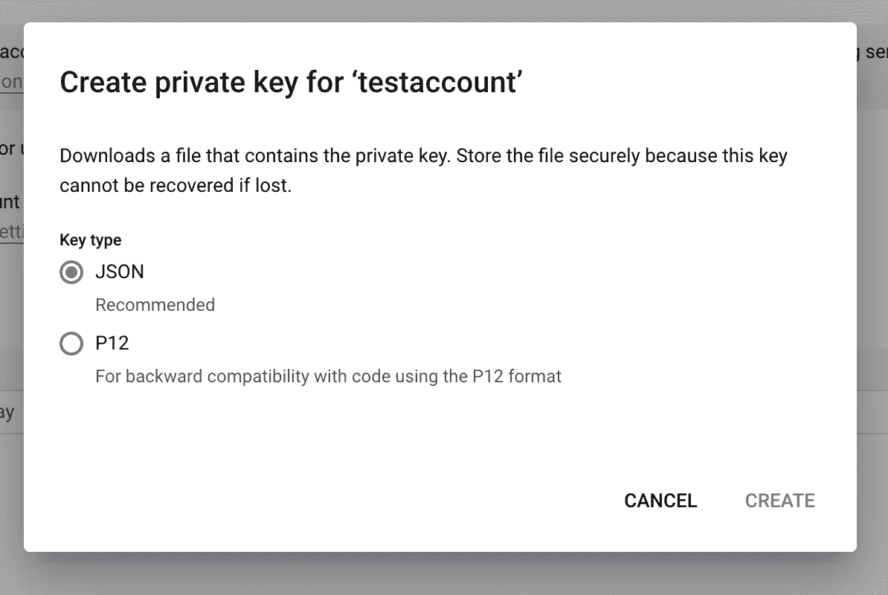

# 使用 Python 制作自己的数据集的快速指南

> 原文：<https://towardsdatascience.com/the-quick-guide-to-making-your-own-dataset-with-python-a28ae9f7f488?source=collection_archive---------15----------------------->

## 使用 Google Sheets API 和 Streamlit 从您的用户那里收集和存储数据


由[马库斯·洛克](https://unsplash.com/@marcusloke?utm_source=medium&utm_medium=referral)在 [Unsplash](https://unsplash.com?utm_source=medium&utm_medium=referral) 上拍摄的照片

## 你有没有想过从你的用户那里收集数据并试图建立你自己的数据集有多难？

在本文中，我介绍了一个简单的数据收集过程，您可以将它应用到您自己的用例中，并轻松地收集和存储数据，所有这些都在一个小时之内完成。

我们使用 [**Streamlit**](https://streamlit.io/) 构建网页来托管我们的数据收集用户界面，然后使用[**Google Sheets API**](https://developers.google.com/sheets/api/reference/rest?apix=true)以及一个很酷的 Python 包来存储用户输入的数据。

我们开始吧👇

# 第一步—构建用户界面

Streamlit 是一个简洁的 Python 工具，可以轻松启动交互式、美观大方的 web 应用程序。您可以用一行代码安装:

```
pip install streamlit
```

现在，我们可以开始制作一个脚本，在我们的网页中包含一些文本和其他数据收集部件！

> 如果你是 Streamlit 的新手，我有一个简单的入门指南，可以帮助你快速上手。文章在这里。你可以在读完那篇文章后再来看这篇文章，或者你也可以跟着这里，因为它不会太高级。

在创建一个新文件`app.py`之后，让我们开始为我们的页面添加一个标题:

```
st.title(‘My Wholesome Data Capture Project’)
```

然后，你可以包括一些你想为你的用户做的事情的描述:

```
st.write("My app wants to collect data from you about...")
```

接下来，您可以开始使用简单的小部件收集用户输入，例如:

```
st.subheader('Add a new item') 
name = st.text_input('Enter the item name') # to collect text input
```

*你有各种各样的小部件可以选择，比如选择框、文本区、滑块、文件选择器等等，我在我的文章* [*中已经提到了其中的大部分。*](/a-guide-to-streamlit-frontend-for-data-science-made-simpler-c6dda54e3183)

一旦您满意地构建了它们，就可以开始启动您的 streamlit 服务器了:

```
streamlit run app.py
```

现在，您应该能够通过导航到`localhost:8000`在浏览器中看到输出！

# 将 Google Sheets API 连接到我们的应用程序

将应用程序连接到 Google Sheets 以收集数据有两个步骤。

1.  从您的 Google Cloud 控制台启用 API:[转到此链接](https://console.cloud.google.com/marketplace/product/google/sheets.googleapis.com)并选择启用 Google Sheets API。

窗口应该如下所示:


启用工作表 API

1.  点击**启用**。如果你还没有在谷歌云控制台中创建新项目，现在就开始吧。
2.  接下来，点击**凭证**，然后**创建一个 API 密钥**。
3.  按下服务账户上方的**管理服务账户**。
4.  点击最近创建的服务账户旁边的 **⋮** 按钮，选择**管理密钥**，然后点击**添加密钥** → **创建新密钥**。
5.  选择 **JSON** 键类型，点击**创建**。



为您的服务帐户创建 JSON 密钥

您现在可以下载一个 json 文档，其中包含您连接到 Streamlit Python 应用程序到 Google Sheets 应用程序的所有服务帐户凭据。

暂时将其保存在您的项目文件夹中。

# 最后一步—安装 gspread

[这个很酷的 python 库](https://docs.gspread.org/en/v4.0.1/index.html)使得 Google Sheets 更容易集成到我们的 Python 应用程序中。安装简单:

```
pip install gspread
```

你可以在浏览器中打开一个新的谷歌表单，并启用链接共享。这很重要，因为它允许 sheets API 将数据写入电子表格。

现在，我们可以将电子表格与我们的 streamlit 应用程序连接起来。

进入 **app.py** ，写一个名为'`**save_into_csv**`'的新函数！

```
import gspreaddef save_into_csv(name, author, link, pair, summ):    
    gc = gspread.service_account(filename='credentials.json')     
    sh = gc.open_by_url('your google sheet url')    
    worksheet = sh.get_worksheet(0)
```

在这里，确保您的来自 Sheets API 的 **credentials.json** 与您的 **app.p** y 文件在同一个目录中。

现在，您可以开始将用户捕获的输入数据写入电子表格:

```
worksheet.append_row([your user input items])
```

> 如果你愿意，在使用这个应用程序之前，确保先在你的电子表格中设置列标题！这样，所有捕获的用户数据都将保存到您定义的列标题下的相应列中。

另外，向用户显示提交的信息可能也是一个好主意。您可以使用 Streamlit 键入一条消息，如下所示:

```
st.write('Submitted to database!')
```

# 结束…

这就是全部的代价！您已经准备好收集您的用户数据并创建自己的数据集了！:D

我希望这篇教程是有用的，并且你现在能够更深入地研究 Sheets API 和 gspread 库的一些细微差别。如果你想探索的话，还有很多，在这个初学者项目之后，你应该准备好去做了！

喜欢我的文章吗？成为 [*中等会员*](https://ipom.medium.com/membership) *继续无限制学习。如果你使用那个链接，我会收取你一部分会员费，不需要你额外付费。这将帮助我支持我的写作努力:)*

如果你喜欢读我的书，也可以考虑跟着我读。

在这个库中还有我从我的文章[中收集的令人惊叹的数据科学资源。去看看！](https://github.com/yashprakash13/data-another-day)

我的几篇文章你可能也想看看:

[](/the-reusable-python-logging-template-for-all-your-data-science-apps-551697c8540) [## 适用于所有数据科学应用的可重复使用的 Python 日志模板

towardsdatascience.com](/the-reusable-python-logging-template-for-all-your-data-science-apps-551697c8540) [](/the-nice-way-to-use-docker-with-vscode-f475c49aab1b) [## 将 Docker 与 VSCode 结合使用的好方法

towardsdatascience.com](/the-nice-way-to-use-docker-with-vscode-f475c49aab1b)