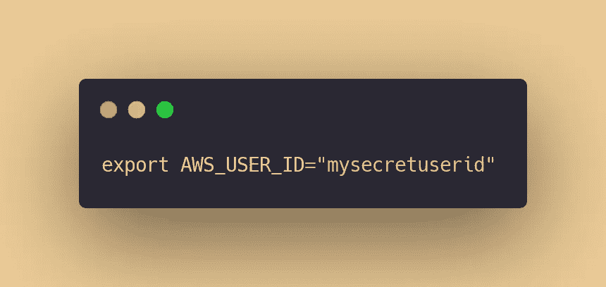
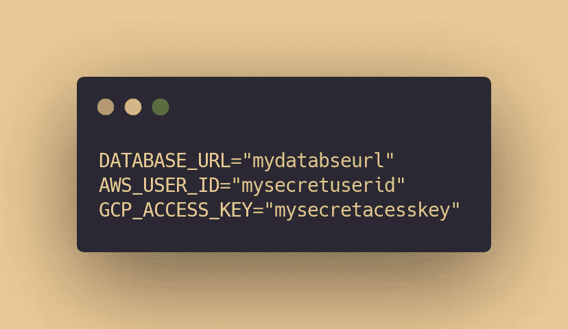
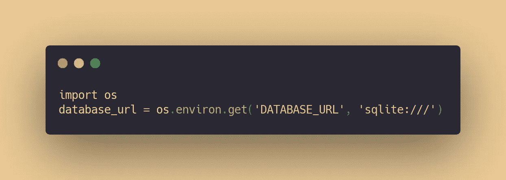
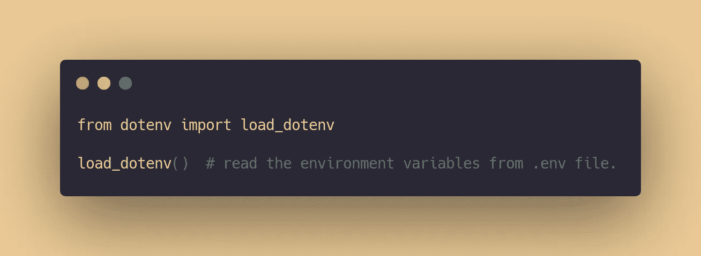

# 在 Python 中使用环境变量快速指南

> 原文：<https://towardsdatascience.com/the-quick-guide-to-using-environment-variables-in-python-d4ec9291619e?source=collection_archive---------5----------------------->

## 在您的数据科学应用中轻松设置应用机密、加载和检索它们。


[贾罗德·里德](https://unsplash.com/@jarrodreed?utm_source=medium&utm_medium=referral)在 [Unsplash](https://unsplash.com?utm_source=medium&utm_medium=referral) 上拍照

在我们的日常工作中，我们都遇到过在公共版本控制系统(如 **Git** )上共享特定内容之前，对我们的应用程序隐藏这些内容的需求。

你可能会处理你的 SQL 数据库名称和网址，它们的密码，一些与 AWS 或谷歌云平台用户组相关的密钥，API 秘密，等等。

> 每个应用程序都有自己的怪癖，总有一段时间**我们不喜欢将这些应用程序的秘密**直接硬编码到我们的代码库中。

幸运的是，我们有了**环境变量的概念，**为我们提供了一种配置 Python 应用程序的好方法，在处理这种秘密时，不需要对我们的源代码做任何修改。

在这篇小文章中，我将分享我在自己的数据科学项目中使用环境变量的方式。

我们开始吧👇

# 直接将它们提供给当前的 bash 会话

这是在 Python 或其他语言中配置环境变量的最简单的方法之一。

您只需导出它们，使它们在您当前的 bash 会话中可见，这意味着在您使用终端而不关闭之前，您将能够通过您的代码访问您设置的所有变量。

它就像键入和输入一样简单:



**请注意，必须完全按照我显示的那样输入，两边的等号之间不能有空格，双引号内的密钥也不能有空格。**

好的，太好了！这看起来很简单，对吗？

接下来，让我向您展示另一种方法，但这种方法会稍微持久一些。

# 在应用程序中使用. env 文件

老实说，在 bash 中逐个设置每个环境变量会变得非常不方便，当您关闭 terminal 选项卡时就会丢失它们。

此外，您还需要知道如何在您的操作系统上正确地这样做——显然，它在 Windows 上的工作方式与基于 Unix 的系统不同。

因此，我通常做的是通过一个**管理我所有的环境变量。env** 文件，可以保存在我的 app 里面。

**它在各种操作系统下的工作方式完全相同，并且易于安装和使用我们的 Python 应用程序。**

做一个新的。env 文件，并在其中设置所有变量，然后保存，例如:



就是这样！您所有的变量都可以设置一次，您可以完全忘记它们与 bash 的关联。

> 另外，不要忘记在您的**中添加这个文件名。gitignore** 文件，为了保护它不受你无所不知的版本控制系统的影响！

# 访问代码中的环境变量

到目前为止，我们已经看到了如何以两种方式设置我们的秘密变量——通过我们的 bash 会话和作为一个单独的文件。现在，让我们看看如何在 Python 代码中访问它们。

1.  **`os.environ.get()`**功能****

**如果在 bash 会话中设置变量，可以通过如下代码片段轻松访问它们:**

****

**取回环境变量！**

**在这里，我们获得了环境变量`**DATABASE_URL**`的值，并将其默认值指定为:`**‘sqlite:////’**`。**

**如果您将默认值保留为空，它将返回`**None**`，如果您还没有用这个名称设置变量的话。**

**如果您采用了第二种方法，并通过。env 文件，您可以在代码中使用不同的方法来访问它们。**

## **2.使用 dotenv 包**

**[在您的虚拟环境中简单地通过这个命令安装软件包](https://pypi.org/project/python-dotenv/):**

```
pip install python-dotenv
```

**接下来，我们可以从。env 文件通过它。**

****

**从目录中的. env 文件加载变量**

**接下来，我们可以很容易地使用`**os.environ.get()**`函数，通过变量的名称获取变量，就像上一步一样。**

# **结束…**

**在你的应用程序中设置环境变量可以让你省去很多麻烦(也可能是心脏病:P)，因为它们有助于隐藏你的*中的敏感信息。env* 文件，如 URL、密码和 API 密钥。**

**我希望这篇文章对你在自己的应用程序中使用它们有所帮助。**

**[在这里跟随我](https://medium.com/@ipom)每周阅读更多这样的文章！我经常写关于编程的文章，还有我作为数据科学家的经历。:)**

**你也可以在这里查看与我所有文章相关的代码和资源。**

**我的另外几篇文章，你可能想看看:**

**</the-nice-way-to-use-docker-with-vscode-f475c49aab1b> [## 将 Docker 与 VSCode 结合使用的好方法

towardsdatascience.com](/the-nice-way-to-use-docker-with-vscode-f475c49aab1b) </how-to-use-bash-to-automate-the-boring-stuff-for-data-science-d447cd23fffe> **