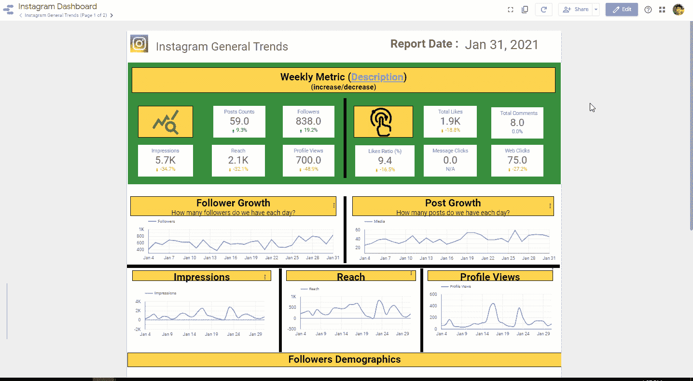

# 建立 Instagram 业务的最快分析方法

> 原文：<https://towardsdatascience.com/the-quickest-analytics-to-build-your-instagram-business-b7b3c5d68056?source=collection_archive---------21----------------------->

## 供个人使用的社交媒体分析技巧

## 快速抓取和分析 instagram 数据的最佳方式


来源( [Unsplash](https://unsplash.com/photos/KWZa42a1kds) )

> 我的追随者增长一直停滞不前。为什么？
> 
> 我应该做些什么来吸引我的追随者？

# 问题陈述

假设你是一个开了一家花店的企业主。为了宣传您的新企业，您激动地注册了 Instagram 企业帐户。

仅仅一个月，你的追随者就增加到了 200 人。你确信你的帖子非常吸引人。所以你推动自己创造更多的内容，期待类似的增长。

但到了下一季度，你并没有获得你预期的高增长。看起来，你不再推送吸引人的内容了。

那么问题是什么呢？你会怎么解决？你将如何有效地与你的追随者互动？

> 输入 Instagram 分析

# 解决方案:挖掘并跟踪你的 Instagram 指标

**然后用谷歌数据工作室自由可视化。**



样本仪表板，我创建了 YMH 使用谷歌数据工作室。出于隐私考虑，这些数字是随机的(来源于作者)

# 我为什么要写这个？

我是 [Yayasan Merajut Hati (YMH)](https://www.instagram.com/yayasanmerajuthati/) 的志愿者，这是一个非营利组织，旨在提高印尼年轻人的心理健康意识，特别是在疫情期间。

为 YMH 社交媒体开发数据分析管道使他们能够实时衡量参与度，并挖掘见解以创造更好的帖子。随着时间的推移，每个帖子都是新见解的试验场，以监督更好的内容创作。

> 同样，这将有助于企业/组织/影响者快速、自由地获得洞察力

# **开发 Instagram 商业报表**

> *“没有目标的人生，就像没有终点的赛跑；你只是无处可逃”——未知*

> 让我们定义我们的关键绩效指标(KPI)

我为你的营销分析 KPI 提出了五个关键指标。必要时可以随意调整。


营销指标示例

# 设置脚本以提取 Instagram 数据

## **免责声明**

> 请负责任地使用该技术，并遵守[脸书法规](https://www.octoparse.com/blog/5-things-you-need-to-know-before-scraping-data-from-facebook)。我还建议使用 Instagram Business 提供的[脸书图形 API](https://developers.facebook.com/docs/graph-api/) 。

## 数据架构图解


数据架构图解(来源于作者)

## 说明

我们使用***Google app script****进行数据抓取自动化，***Google spread sheet****进行数据存储，而***Google Data Studio****用于交互式仪表盘。***

***使用这些工具是因为:***

1.  ***免费:你只需要一个谷歌账户来建立你的管道。***
2.  ***在线分享和协作:就像谷歌文档一样。***
3.  *****带自动触发器的简单脚本**:***Google app script***支持带每日/每周/每月触发器的脚本***
4.  ****易于调试** : ***谷歌电子表格*** 用于存储数据，不需要脚本来查询，这对于与非技术人员(客户、研究人员、营销人员等)协作非常重要**
5.  ****自动报告** : ***谷歌数据工作室*** 自动向利益相关者发送报告。**

# **提取 Instagram 数据**

## **用户元数据**

**Instagram 运行在 REST 服务上，您可以使用这种模式提取用户元数据值**

```
**[**https://www.instagram.com/{USER_ID}/?__a=1**](https://www.instagram.com/{USER_ID}/?__a=1)**
```

**USER_ID 表示 Instagram 账户。例如，您可以使用 vincent.tatan(我的用户 ID)提取特定于用户的数据。**

```
**e.g (my own): [**https://www.instagram.com/vincent.tatan/?__a=1**](https://www.instagram.com/{USER_ID}/?__a=1)**
```

**当你浏览这个 URL 时，你会收到下面的 [JSON 字符串](https://www.w3schools.com/js/js_json_syntax.asp)。**

****

**这个 JSON 字符串显示了 Instagram 的所有公共指标，例如:赞、评论、帖子、关注者等。**

**如果你的浏览器将信息显示为“原始数据”，你可以点击 JSON 标签(像 Mozilla Firefox 一样)或者使用一个[外部 JSON 查看器](http://jsonviewer.stack.hu/)将文本作为 JSON 输出返回。**

****

**仔细观察，你会发现 Instagram 在这些特定路径中的这些功能。**

****

## ****访问谷歌应用脚本****

****要访问提取使用的脚本，您应该遵循以下步骤:****

1.  **创建此[电子表格](https://docs.google.com/spreadsheets/d/15yr8N1X2DBeP1b6YwqSAPTsGJqra_vyll-fC-31F4fY/edit#gid=44552427)的副本。**
2.  **转到工具**
3.  **单击脚本编辑器**

## **提取 Instagram 账户数据**

**运行以下命令，从某个用户 id 提取并解析 JSON 字符串。**

```
**var url = "https://www.instagram.com/vincent.tatan/?__a=1";
var source = UrlFetchApp.fetch(url, opt).getContentText();
var data = JSON.parse(source);**
```

> ****注意:**如果卡死，它返回“意外令牌<”。这意味着你在 Instagram 中遇到了防爬机制。如果您遇到此问题，您应该构建自己的 web cookie 以使爬网合法。cookie 设置语法可以在我的脚本中引用。[更多信息](https://gist.github.com/nickboyce/06c0ff48a2892311bd9a6601baed55b0)。**

## **识别趋势和发布数据**

**一旦我们可以访问 JSON 文件，我们就可以在这些文件中使用以下函数:**

*   ****General.gs** :读取一般用户信息**
*   ****Post.gs** :读写帖子信息。**

**一个简单的提取如下所示**

```
**var follower_counts = parseInt(json_file[‘graphql’][‘user’][‘edge_followed_by’][‘count’]);
var get posts_info= json_file[‘graphql’][‘user’][‘edge_owner_to_timeline_media’];**
```

**有了这些代码片段，您可以将这些功能写入电子表格。**

```
**var ss = SpreadsheetApp.getActiveSpreadsheet();
var general_trends = “General Trends”;
var general_sheet = ss.getSheetByName(this.general_trends);function appendGeneral(current_date, followers, medias, following, engagement, general_sheet)
{
  general_sheet.appendRow([current_date, followers, following, medias.count, engagement.totalLikes, engagement.totalComments, engagement.EngagementRatio]);
}**
```

****

> **恭喜你，你已经自动提取了自己的 Instagram 数据。**
> 
> ****注意:**默认情况下，Googlescript 类似于通常用于 web 开发交互语言的 Javascript 符号。如果您仍然不熟悉，请随意查看 [AppScript 文档](https://developers.google.com/apps-script)。**

# **提取数据的自动化每日触发器**

**在 Appscript 界面中，你可以在左边的菜单栏中选择“触发器”。**

**你可以设置它运行“InsertGeneralAndPostData”功能，每天在你给定的时间运行。**

**就是这样！现在请高枕无忧，因为 Google Server 会自动运行脚本来生成新数据，即使您不在线。**

****

# **用谷歌数据工作室构建可视化。**

**一旦完成，你就可以使用 ***谷歌数据工作室*** 来设置你的可视化。我鼓励你阅读我关于快速构建仪表板的博客文章，并启动一个简单的项目。**

****

**样本仪表板，我创建了 YMH 使用谷歌数据工作室。为了保密，这些数字是随机的**

# **结论**

**在 Instagram 中提取数据是一种以可靠的方式获取数据的有益方式。它可以节省您的时间，并帮助您在每天刷新统计数据时了解趋势。**

**在这篇文章中，你学到了:**

1.  **如何制定营销指标和 KPI**
2.  **提取 Instagram 数据的脚本**
3.  **为每日提取创建自动触发器**

**利用这个仪表板，我成功地为 YMH 的内容创作提供了建议。在一月份，我们的关注者增加了约 23%,从 361 人增加到 446 人，并对影响者驱动的帖子和可读性产生了深刻的见解。我真诚地希望您能为您的企业/个人帐户运行此分析。**

> ****注意**:在未来，我希望分享您如何使用脸书图形 API 扩展字段/指标**

**感谢[阿尔伯特·宾基](https://medium.com/u/fcf6ad08f12d?source=post_page-----b7b3c5d68056--------------------------------)和[拉农·西姆](https://medium.com/u/3b62f7285717?source=post_page-----b7b3c5d68056--------------------------------)对这篇文章的修改。**

**索利·德奥·格洛丽亚**

# **来自作者的更多提示:**

*   **[如何构建您的终极数据科学投资组合](/how-to-build-your-ultimate-data-science-portfolios-ea0414d79a72)**
*   **[如何在 10 分钟内构建一个令人惊叹的交互式仪表盘](/how-to-build-a-great-dashboard-ee0518c3d3f7)**
*   **[谷歌数据工作室的基础](/the-basic-of-google-data-studio-72081f247220)**
*   **[写作分析的隐藏宝石](/the-hidden-gems-of-writing-analytics-6db78fad5a51)**

# **关于作者**

**我用 ML @ Google 对抗网络钓鱼。**

**我热爱我的工作是因为我使用先进的 ML 算法和 MLOps 来保护 Chrome、Gmail 和 Android 用户免受网络钓鱼攻击，这些攻击每周都可能窃取弱势群体的生活积蓄。**

**我也是一名面向数据科学媒体的作家，为全球 50 多万观众的有志 ML 和数据从业者提供指导。**