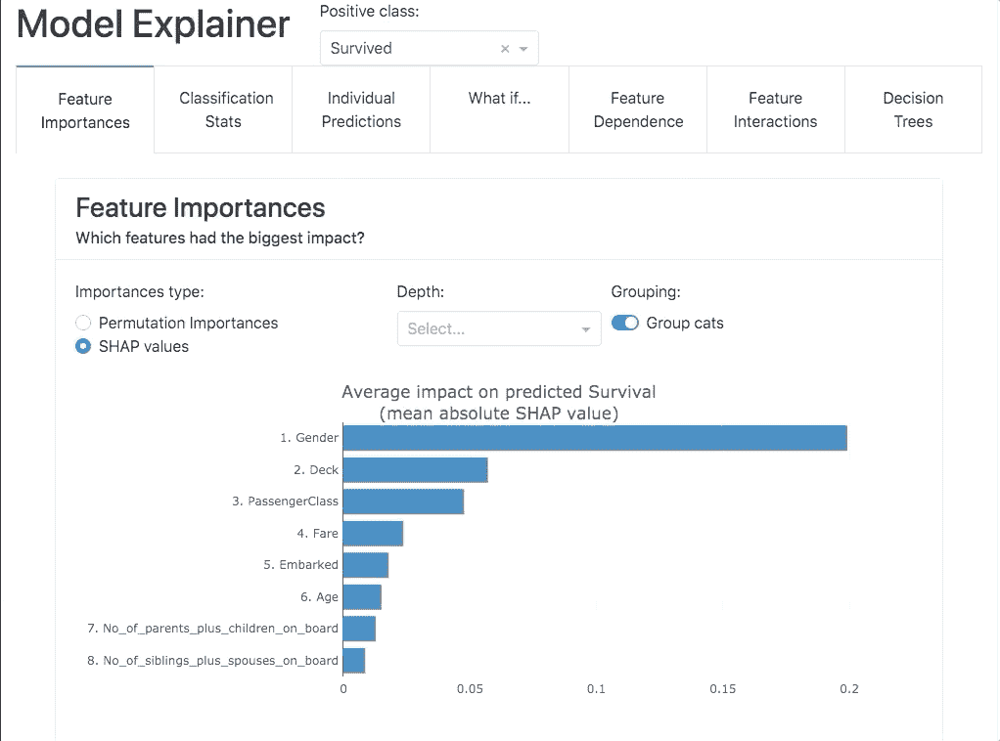

# 为机器学习模型构建仪表板的最快方法

> 原文：<https://towardsdatascience.com/the-quickest-way-to-build-dashboards-for-machine-learning-models-ec769825070d?source=collection_archive---------26----------------------->

使用 explainerdashboard 库快速构建交互式仪表板，用于分析和解释机器学习模型的预测和工作方式


由[卢克·切瑟](https://unsplash.com/@lukechesser?utm_source=medium&utm_medium=referral)在 [Unsplash](https://unsplash.com?utm_source=medium&utm_medium=referral) 拍摄的照片

# 介绍

数据科学家的大部分工作都围绕着收集数据和为业务问题创建机器学习模型。虽然建立复杂的机器学习模型很难，但将经过训练的机器学习模型的预测传达给没有技术背景的 stake holder 就更麻烦了。这就是像 Tabpy 和 explainerdashboard 这样的 python 包派上用场的地方。在我之前的文章中，我解释了如何使用 Tabpy 包将经过训练的机器学习模型直接与 tableau 集成。

</integrating-machine-learning-models-with-tableau-b484c0e099c5>  

在本文中，我将讨论实现一个名为 explainerdashboard 的优秀 python 包。explainerdashboard 包通过创建交互式可视化仪表盘来帮助分析机器学习模型。试图进入数据科学的初学者或希望更好地理解其模型的不同属性的有经验的数据科学专业人员可以使用此包，只需 2 行额外代码即可创建基本的仪表板。

# 履行

就像大多数其他 python 包一样，这个包可以通过使用命令`pip install explainerdashboard`来安装。

这里使用了著名的 Titanic 数据集，以交互式仪表板格式展示随机森林分类模型的特征。

创建机器学习模型后，使用 sci-kit 包中的 Randomforestclassifier。我们可以使用`classifierexplainer`定制我们想要在仪表板中显示的特性。

下图是我们使用代码行`ExplainerDashboard(name).run()`启动仪表板后得到的样本仪表板



来源:[文档](https://explainerdashboard.readthedocs.io/en/latest/explainers.html)

要在 jupyter 笔记本等嵌入式笔记本中运行仪表盘，我们可以使用`inlineexplainer`

现在，我们可以使用仪表板中的自定义指标来分析特性重要性和各个决策树，以更好地了解 ML 模型的性能。关于创建定制仪表板的更多信息可以在 explainerdashboard 的官方文档中找到[这里](https://explainerdashboard.readthedocs.io/en/latest/explainers.html)。

# 部署

在分析了机器学习模型之后，将它们部署到生产中也是非常容易的。官方文档中建议使用健壮的生产服务器，如`gunicorn`或`waitress`来部署仪表板，而不是内置的 flask 开发服务器。

使用命令`pip install gunicorn`或`pip install waitress`安装 gunicorn 或服务员。

在启动仪表板和部署模型之前，我们应该将解释器模型保存到磁盘上，这可以通过转储模型来完成。

将模型保存到磁盘后，我们可以从文件中加载 explainer 模型，然后启动仪表板，然后我们可以将 flask 服务器公开为`app`:

在这里，我将文件保存为`[flaskserver.py](http://localhost:8050)`，现在我们可以使用以下命令启动 gunicorn 服务器:

```
$ waitress-serve --port=8050 dashboard:app
```

本文中使用的代码和图片摘自库的[官方文档](https://explainerdashboard.readthedocs.io/en/latest/explainers.html)和 [Github](https://github.com/oegedijk/explainerdashboard) 库。

希望那有用！感谢您阅读我的文章。如果你对这篇文章有任何疑问，或者想要联系和交流，请随时在 LinkedIn 上给我发消息。我将非常乐意与您联系，并尽我所能提供帮助。