# Quora 问题对相似性问题

> 原文：<https://towardsdatascience.com/the-quora-question-pair-similarity-problem-3598477af172?source=collection_archive---------18----------------------->

## 一个初学者在 Kaggle 上经历一个问题的不同生命周期的旅程。


照片由 [Me](https://www.instagram.com/sanjaychouhansc/) 拍摄。

这是我的第一个案例研究，所以你可以期待一个初学者友好的数据分析和模型构建。对于这个问题，我只使用了经典的机器学习模型。然而，参与这个案例研究对我来说是一次很好的学习经历。在这篇博客中，我会尽可能地与你分享。

在博客里，我只会写摘要。你可以在这里查看完整的笔记本[，也可以在](https://nbviewer.jupyter.org/github/scsanjay/case-studies/blob/main/01.%20Quora%20Quesion%20Pair%20Similarity/quora-duplicate-questions.ipynb) [github](https://github.com/scsanjay/case-studies/tree/main/01.%20Quora%20Quesion%20Pair%20Similarity) 上查看代码。

对于所有有经验的人，我希望你们能对未来的案例研究提出反馈意见。🤝🤓

# 目录

1.  介绍
2.  业务目标和约束
3.  数据概述
4.  业务指标
5.  基础 EDA
6.  数据清理
7.  特征抽出
8.  具有特性的 EDA
9.  SentenceBERT
    i. EDA 关于 SentenceBERT 的新特性
10.  数据预处理
11.  训练模型
    一、支持向量分类器
    二。随机森林
    三。XGBoost
    四。另一个 XGBoost🏆
12.  最后的想法
13.  参考

# 介绍

Quora 是一个问答的平台，就像 StackOverflow 一样。但 quora 更像是一个通用的问答平台，这意味着没有像 StackOverflow 那样的代码。

quora 面临的众多问题之一就是问题重复。重复提问会破坏提问者和回答者的体验。由于提问者在问一个重复的问题，我们可以只给他/她看前一个问题的答案。并且回答者不必为基本相同的问题重复他/她的答案。

例如，我们有一个问题，比如“我怎样才能成为一个好的地质学家？”这个问题有一些答案。后来有人问了另一个问题，比如“要成为一名伟大的地质学家，我应该做些什么？”。
我们可以看到，这两个问题问的是同一个问题。尽管问题的措辞不同，但两个问题的意图是相同的。
所以这两个问题的答案是一样的。这意味着我们可以只显示第一个问题的答案。这样，提问题的人会立即得到答案，已经回答了第一个问题的人也不必重复。

这个问题在 Kaggle 上可以作为竞赛。[https://www.kaggle.com/c/quora-question-pairs](https://www.kaggle.com/c/quora-question-pairs)

给定两个问题，我们的主要目标是找出它们是否相似。所以让我们用 ML 变变魔术吧。🪄

# 业务目标和约束

*   没有严格的等待时间要求。
*   我们希望有可解释性，但这不是绝对强制性的。
*   误分类的代价中等。
*   这两个类(重复或不重复)同等重要。

# 数据概述

可用列: **id，qid1，qid2，question1，question2，is_duplicate**
类标签: **0，1**总训练数据/行数: **404290**
列数:**6**
**is _ duplicate**为因变量。
非重复数据点数为**255027**重复数据点数为 **149263**

我们有 **404290** 训练数据点。而只有 **36.92%** 为阳性。这意味着它是一个不平衡的数据集。

# 业务指标

这是一个二元分类。

*   我们需要尽量减少这次挑战的日志损失。

# 基础 EDA


照片由[安德鲁·尼尔](https://unsplash.com/@andrewtneel?utm_source=medium&utm_medium=referral)在 [Unsplash](https://unsplash.com?utm_source=medium&utm_medium=referral) 上拍摄

测试数据没有问题 id。所以自变量是**问题 1** ，**问题 2** 因变量是 **is_duplicate** 。

3 行有空值。所以我们删除了它们，现在我们有了用于训练的 **404287** 问题对。

*   **36.92%** 的问题对是重复的，而 **63.08%** 的问题对是非重复的。
*   在 **808574** 个问题(包括问题 1 和问题 2)中， **537929** 是唯一的。
*   大多数问题重复的次数很少。只有少数是多次重复的。
*   一个问题重复 **157** 次，这是最大重复次数。

有一些问题字符很少，没有意义。稍后将通过数据清理来解决这个问题。

# 数据清理

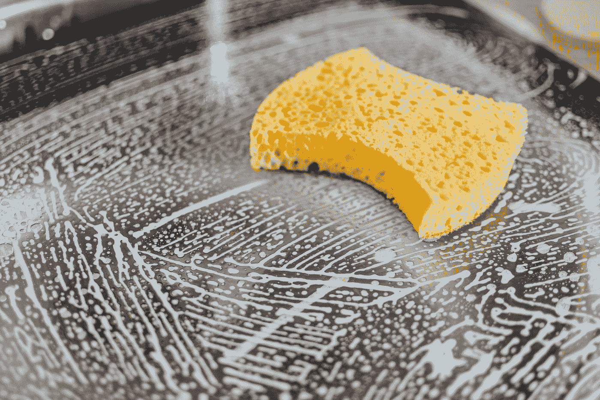

照片由[皮勒 r .普里斯克](https://unsplash.com/@pillepriske?utm_source=medium&utm_medium=referral)在 [Unsplash](https://unsplash.com?utm_source=medium&utm_medium=referral) 上拍摄

*   我们已经将所有内容都转换成小写。
*   我们已经消除了宫缩。
*   我们已经用货币名称代替了货币符号。
*   我们还删除了超链接。
*   我们已经删除了非字母数字字符。
*   我们已经用单词 lemmatizer 去掉了词形变化。
*   我们还删除了 HTML 标签。

# 特征抽出


斯蒂芬·罗德里格兹在 [Unsplash](https://unsplash.com?utm_source=medium&utm_medium=referral) 上的照片

我们从问题中创建了 **23 个**特征。

*   我们已经为这两个问题创建了特征 q1_char_num、q2_char_num 以及字符数。
*   我们已经为这两个问题创建了特征 q1_word_num、q2_word_num 以及字符数。
*   我们已经创建了 total_word_num 特征，它等于 q1_word_num 和 q2_word_num 之和。
*   我们已经创建了 differ_word_num 特征，它是 q1_word_num 和 q2_word_num 之间的绝对差。
*   我们已经创建了 same_first_word 功能，如果两个问题的第一个单词相同，则该功能为 1，否则为 0。
*   我们已经创建了 same_last_word 功能，如果两个问题具有相同的最后一个单词，则该功能为 1，否则为 0。
*   我们已经创建了 total_unique_word_num 功能，它等于两个问题中唯一单词的总数。
*   我们创建了 total _ unique _ word _ without top word _ num 功能，该功能等于两个问题中不含停用词的唯一单词总数。
*   总唯一单词数比率等于总唯一单词数除以总单词数。
*   我们已经创建了 common_word_num 功能，它是两个问题中总的常用词的计数。
*   common_word_ratio 特性等于 common_word_num 除以 total_unique_word_num。
*   common_word_ratio_min 等于 common_word_num 除以问题 1 和问题 2 之间的最小字数。
*   common_word_ratio_max 等于 common_word_num 除以问题 1 和问题 2 之间的最大字数。
*   我们已经创建了 common _ word _ withoutstopword _ num 功能，它是两个问题中除停用词之外的所有常用词的计数。
*   common _ word _ without top word _ ratio 特性等于 common _ word _ withoutstopword _ num 除以 total _ unique _ word _ without top word _ num。
*   common _ word _ without top word _ ratio _ min 等于 common _ word _ withoutstopword _ num 除以问题 1 和问题 2 之间的最小字数，不包括停用词。
*   common _ word _ without top word _ ratio _ max 等于 common _ word _ withoutstopword _ num 除以问题 1 和问题 2 之间的最大字数，不包括停用词。
*   然后用 fuzzywuzzy 字符串匹配工具提取了 fuzz_ratio、fuzz_partial_ratio、fuzz_token_set_ratio 和 fuzz_token_sort_ratio 特征。参考:[https://github.com/seatgeek/fuzzywuzzy](https://github.com/seatgeek/fuzzywuzzy)

# 具有特性的 EDA


艾萨克·史密斯在 [Unsplash](https://unsplash.com?utm_source=medium&utm_medium=referral) 上拍摄的照片

*   如果第一个单词或最后一个单词相同，则问题对很有可能是重复的。

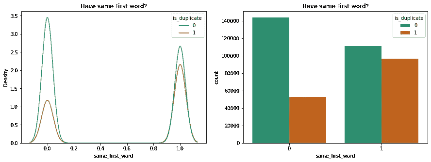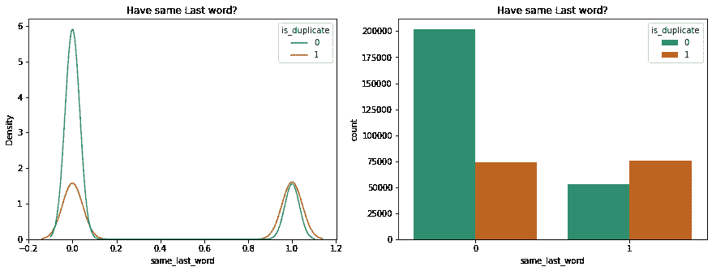

*   如果问题对是重复的，那么包含和不包含停用词的唯一单词总数(q1 和 q2 的总和)会减少。

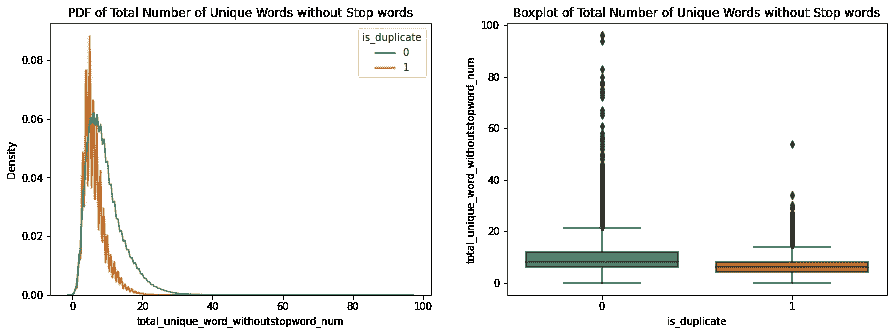

*   对于重复问题对，总的唯一单词与总单词的比率通常较小。


*   重复的问题对往往在两个问题之间有更多的常用词。因此，与常用词相关的提取特征也显示出分布的差异。

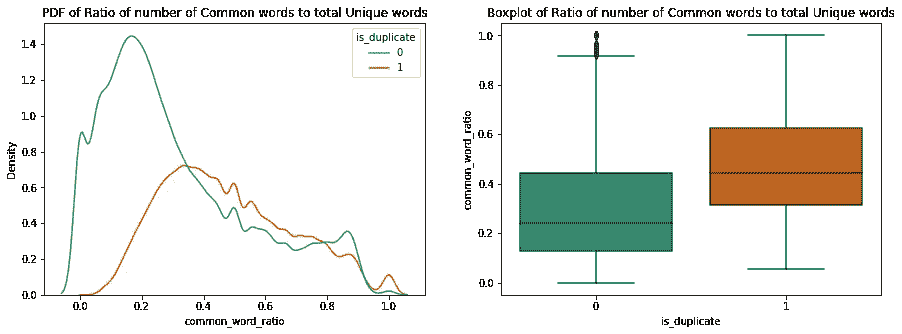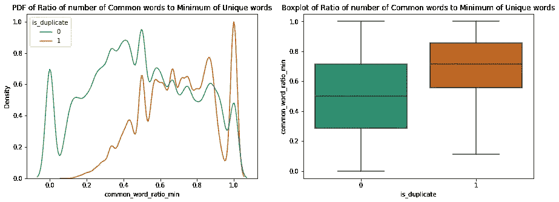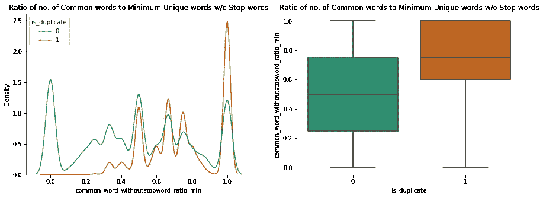

*   对于重复的问题对，模糊比率通常更高。

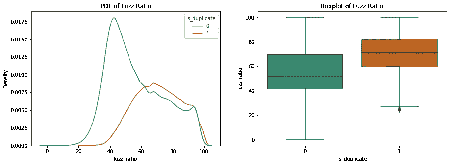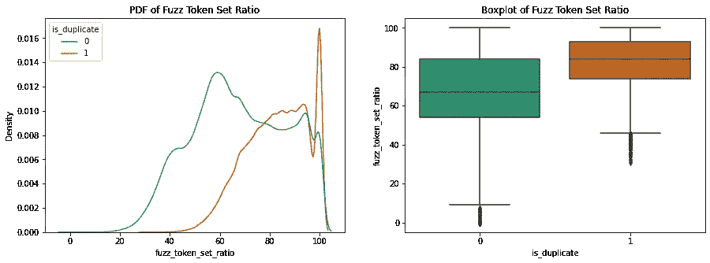

# 句子的特征化


照片由[米卡·鲍梅斯特](https://unsplash.com/@mbaumi?utm_source=medium&utm_medium=referral)在 [Unsplash](https://unsplash.com?utm_source=medium&utm_medium=referral) 上拍摄

我们需要将问题转换成某种数字形式，以应用机器学习模型。有各种各样的选择，从基本的单词包到通用的句子编码器。

我试着推断句子嵌入。但它返回 4096 维表示。应用后，训练数据变得巨大。所以我丢弃了它。这个问题我选择了 SentenceBERT。

句子 BERT 是一种基于 BERT 的句子嵌入技术。我们将使用预先训练好的 SentenceBERT 模型 *paraphrase-mpnet-base-v2* ，这是质量最好的推荐。句子伯特产生 768 个维度的输出。[https://www.sbert.net/](https://www.sbert.net/)

我们又创建了两个特征**余弦 _ 相似性 _ 伯特**和**欧几里得 _ 距离 _ 伯特**，它们用句子伯特表示来测量两对问题之间的相似性和距离。

到目前为止，特征总数为 **25** 。

## EDA 关于与 SentenceBERT 相关的新功能

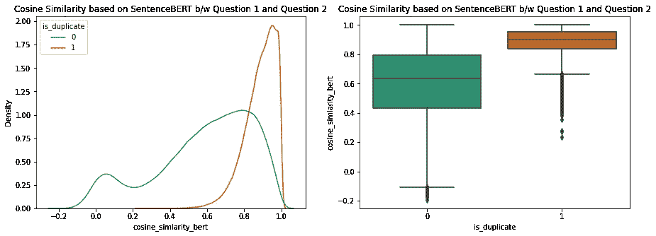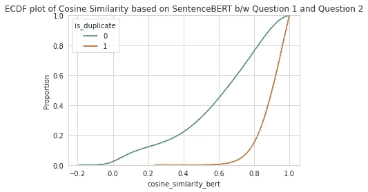

*   **余弦相似度**对于重复对更大。
*   80%的非重复问题对和只有 20%的重复问题对具有余弦相似度<= .815

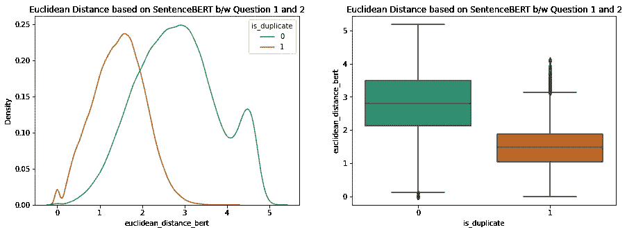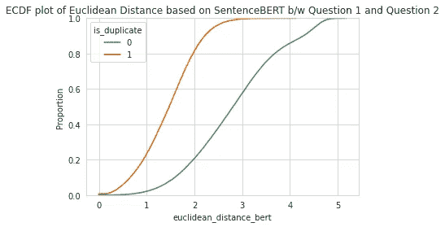

*   **对于重复问题对，欧几里德距离**更小。
*   20%的非重复问题对和大约 80%的重复问题对具有< = 2 的欧几里德距离。

它展示了帕累托原则(80-20 法则)。

# 数据预处理


布拉登·科拉姆在 [Unsplash](https://unsplash.com?utm_source=medium&utm_medium=referral) 拍摄的照片

我们归一化(最小-最大缩放)提取的特征。我们没有规范化嵌入，因为不推荐这样做。

我们有 **1561** 特色(25 + 768 + 768)。

*   **25** 是提取的特征。
*   **768+768** 用于问题 1 和问题 2 的句子嵌入。

因为数据集是不平衡的。我们通过从少数类中采样来进行**过采样**。
现在我们有 **510048** 数据点用于训练。每个班 255024 。

请注意，我没有留出任何数据用于本地测试。因为我们的主要目标是在 Kaggle 上取得好成绩。

# 培训模型


照片由[卡斯滕·怀恩吉尔特](https://unsplash.com/@karsten116?utm_source=medium&utm_medium=referral)在 [Unsplash](https://unsplash.com?utm_source=medium&utm_medium=referral) 上拍摄

## 支持向量分类器

在用参数网格训练对半网格搜索 CV 时，

```
svc_param_grid = {‘C’:[1e-2, 1e-1, 1e0, 1e1, 1e2]}
```

我们使用 LinearSVC 是因为它被推荐用于大型数据集。我们使用了 L2 罚函数，损失函数是铰链损失的平方。此外，建议对大型数据集使用原始公式。对于 C 的某些值来说，它是不可转换的，所以我将 max_iter 增加到 3000。

```
svc_clf = LinearSVC(penalty='l2', loss='squared_hinge', dual=False, max_iter=3000)
```

为了交叉验证减半网格搜索 cv，我使用了 1 次洗牌和 70:30 的分割。另外，对选择的评分是准确性。

```
svc_clf_search = HalvingGridSearchCV(svc_clf, svc_param_grid, cv=splits, factor=2, scoring='accuracy', verbose=3)
```

等分网格搜索 cv 发现 **C=100** 是最佳参数。而最好的准确率是 **85.79%** 。所以最好的估计是这样的，

```
LinearSVC(C=100.0, dual=False, max_iter=3000)
```

既然我们需要尽量减少比赛中的木材损耗。我们需要一个好的预测概率。校准的分类器可用于获得良好的预测概率。

```
svc_calibrated = CalibratedClassifierCV(base_estimator=svc_clf_model, method="sigmoid", cv=splits)
```

在对概率模型进行校准之后。我预测了测试数据的概率，并在 Kaggle 上提交。Kaggle 提交的公共领导委员会分数为 **0.36980** 。考虑到模型假设线性可分性，非常好。

## 随机森林

你知道 Quora 本身使用随机森林来解决这个问题。或者至少他们在 2017 年 6 月第一次在 Kaggle 上发布比赛时是这样做的。

与之前相同，我们使用以下参数网格对分网格搜索 cv:

```
rf_param_grid = { 'n_estimators':[200, 500, 800], 'min_samples_split':[5, 15], 'max_depth': [70, 150, None]}
```

其余的参数是随机森林分类器的默认值。

```
rf_clf = RandomForestClassifier()
```

我们已经像以前一样使用了非常相似的等分网格搜索 cv，

```
rf_clf_search = HalvingGridSearchCV(rf_clf, rf_param_grid, cv=splits, factor=2, scoring='accuracy', verbose=3)
```

等分网格搜索 cv 发现 **{'max_depth': 150，' min_samples_split': 5，' n_estimators': 800}** 是最佳参数。而最好的准确率是 **90.53%** 。因此与 SVM 相比，精确度提高了 5%。最佳估计看起来是这样的，

```
RandomForestClassifier(max_depth=150, min_samples_split=5, n_estimators=800)
```

现在，在这一点上，我应该使用校准，但因为它已经花了很多时间，我跳过了它。我应该使用贝叶斯优化技术😞。

Kaggle 提交的公共领导委员会得分为 **0.32372** ，略高于 SVC。我期望对数损失少一点，但请记住，我们还没有进行校准(由于时间限制)。我们将尝试使用 XGBoost——ka ggle 竞赛中 ml 模型的圣杯——做得更好。

## XGBoost

由于时间和系统配置的限制，我决定使用 200000 个数据点来估计一些参数。
起初，我使用 Optuna 进行超参数调优，但它有一些问题，因为它在试用后没有释放内存。所以系统试了几次就崩溃了。
后来，我决定使用远视进行调优。

用 HyperOpt，我只调了 **max_depth** 和 **learning_rate** 。这不是一个微调，因为我只用了 5 次试验。但它给出了一个粗略的概念。

最后，我选择以下参数对整个数据进行模型训练，

```
params = dict( objective = "binary:logistic", eval_metric = "logloss", booster = "gbtree", tree_method = "hist", grow_policy = "lossguide", max_depth = 4, eta = 0.14)
```

**目标= "二进制:逻辑"**因为我们试图得到概率。我使用了 **tree_method = "hist"** 进行快速训练。**grow _ policy = " loss guide "**灵感来自 LightGBM，精度更高。

**num_boost_round** 设置为 600， **early_stopping_rounds** 为 20。

Kaggle 提交的大众领先板得分为 **0.32105** ，略好于其他车型。我期待比这更好的结果。这可以通过对超参数进行更多的微调来实现。XGBoost 有大量的超参数[https://xgboost.readthedocs.io/en/latest/parameter.html](https://xgboost.readthedocs.io/en/latest/parameter.html)

## 另一个 XGBoost

我对 XGBoost 模型的结果不满意，所以我决定凭直觉调整参数。

我做的第一件事是通过删除重复行来消除过采样数据。

这一次我添加了一些参数来更好地概括，

```
params = dict( objective = "binary:logistic", eval_metric = "logloss", booster = "gbtree", tree_method = "hist", grow_policy = "lossguide", max_depth = 4, eta = 0.15, subsample = .8, colsample_bytree = .8, reg_lambda = 1, reg_alpha = 1)
```

另外，我把助推回合数减少到了 500。


照片由 [Fauzan Saari](https://unsplash.com/@fznsr_?utm_source=medium&utm_medium=referral) 在 [Unsplash](https://unsplash.com?utm_source=medium&utm_medium=referral) 上拍摄

🥁瞧！我们有赢家了。**本次提交的公众 LB 分数为 0.28170** 。
这似乎是一个非常好的结果。

# 最后的想法

我从这个案例中学到了很多。我走了一些捷径，要么是因为系统配置限制，要么是时间限制。

我还亲身经历了机器学习不仅仅是建立模型，在此之前的步骤需要更多的时间。超参数调整可以自动进行，但像特征提取或决定使用什么特征这样的事情需要手动完成。

我花了将近两周的时间😅有一半的时间我在等待一些执行的完成。所以我认为，如果你有资源密集型任务，使用亚马逊 SageMaker 这样的东西是个好主意。

未来可以尝试一些基于深度学习的模型。

# 参考

a.[https://appliedroots.com/](https://appliedroots.com/)