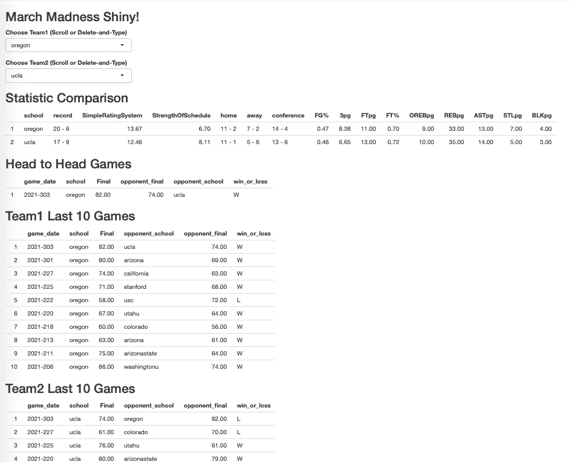

# 简化三月疯狂预测的闪亮应用

> 原文：<https://towardsdatascience.com/the-r-shiny-app-i-built-to-streamline-march-madness-predictions-e5e00c3a3691?source=collection_archive---------20----------------------->

## 一个简单的应用程序，旨在消除体育网站上查看统计数据的数百次点击

马库斯·斯皮斯克在 [Unsplash](https://unsplash.com?utm_source=medium&utm_medium=referral) 上的照片

# 疯狂三月:美国大学篮球锦标赛

首先，我想分享一下，我并不擅长预测三月份美国 NCAA 男子和女子篮球锦标赛的冠军。如果你在寻找关于*选择谁*作为你的支架的专家建议，不幸的是我没有具体的建议给你。

也就是说，试图预测赢家很有趣。在[https://www.ncaa.com/](https://www.ncaa.com/)上填写你的*预测括号*是一个很容易在线玩的游戏，与朋友分享很有趣，有时也是一种赌博形式——主要是与同事或朋友。

这个 R Shiny 应用程序的目的是将多个篮球统计数据汇集到一个易于阅读的视图中。当我想到对我的选择有重大影响的因素时，这五点非常重要。

1.  团队的记录/排名
2.  如果两个队在本赛季已经进行过比赛，那么这两个队之间的比赛结果
3.  球队在过去的十场比赛中是否发挥得特别好
4.  球队统计数据，如场均助攻数、场均三分出手数、场均防守盖帽数等等
5.  主场比赛、客场比赛和会议比赛的团队记录

# 篮球统计分析自动化工具

为了将所有数据汇集到一个屏幕上，我首先从[体育参考](https://www.sports-reference.com/cbb/seasons/2021-school-stats.html)和[体育书评在线](https://www.sportsbookreviewsonline.com/scoresoddsarchives/ncaabasketball/ncaabasketballoddsarchives.htm)下载了比赛和赛季统计数据。我对数据做了一些修改，以便合并数据集，并更容易地在一个屏幕上解释数据。

有了 RStudio 的 [Shiny，我可以在我的电脑上运行一个应用程序，让我选择两支球队并立即查看比赛数据。您可以从](https://shiny.rstudio.com/) [GitHub](https://github.com/wpbSabi/basketball) 查看、下载和使用我的代码(以及修改后的运动数据)。如果您还不是 R 程序员或 R 用户，R 是免费的，可以下载。要运行你的第一个 R 程序，我推荐以下步骤开始。

1.  从[曲柄](https://cran.r-project.org/)下载 R 并安装 R。
2.  下载并安装 [RStudio](https://rstudio.com/products/rstudio/download/) 。
3.  使用 RStudio 来读取、写入和运行 r。

# 比赛统计屏幕

在运行应用程序时，这个界面出现在我选择我想要比较的两个团队的地方。基于这种比较，我将选择我认为哪个队会赢得这场比赛。

在我从列表中选择了 Team1 和 Team2 之后，从导入的数据源中填充了统计比较、两个队的面对面比赛和最后 10 场比赛。这个应用消除了我通常在体育网站上进行的数百次点击，在关于每个球队的不同网页之间来回切换。我仍然阅读体育网站来了解球员，但很容易获得球队的统计数据令人耳目一新。

括号 R 闪亮的应用程序(图片作者)

# r 闪亮的应用代码

现在您已经看到了结果，让我分两部分来分享代码。第一部分是数据和一般文档的设置。数据争论为 Shiny 准备数据，并根据我的喜好重命名统计类别。

第二部分是闪亮的 App。main 函数启动应用程序，而其他函数创建交互式选项来选择团队，然后显示这些团队的统计数据。让我借此机会感谢 [RStudio](https://rstudio.com/) 的团队开发了这个闪亮的应用程序，并感谢所有其他为 R 做出贡献的人，是他们让这个 R 开源项目成为可能。

既然我已经分享了我的括号秘密，祝我今年好运吧！我祝你好运！

如果你喜欢这篇文章，并想阅读(和写)更多这样的文章，请考虑使用我的推荐链接成为中等会员:[https://sabolch-horvat.medium.com/membership](https://sabolch-horvat.medium.com/membership)

*请注意，来自数据源的数据可用性存在延迟。如果你在周日阅读这篇文章，数据可能会在几天后用最新的锦标赛结果更新。*

*【2021–03–16 数据更新】:虽然**[*体育参考*](https://www.sports-reference.com/cbb/seasons/2021-school-stats.html) *数据现已更新，但* [*体育书评在线*](https://www.sportsbookreviewsonline.com/scoresoddsarchives/ncaabasketball/ncaabasketballoddsarchives.htm) *数据(包括比赛历史和最近 10 场比赛的结果)似乎不会在比赛前及时更新。截至今天，Kaggle 为参加其挑战的人提供了最新赛季的比赛，包括男子***和女子***比赛。由于这些数据不是公开的，因此在此不共享这些数据。请注册参加免费的 Kaggle 挑战赛来查看这些数据。****