# 啤酒节啤酒价格的大幅上涨创造了 9000 万欧元的生意

> 原文：<https://towardsdatascience.com/the-radical-rise-of-oktoberfest-beer-prices-created-a-90-million-euro-business-261da252c827?source=collection_archive---------42----------------------->

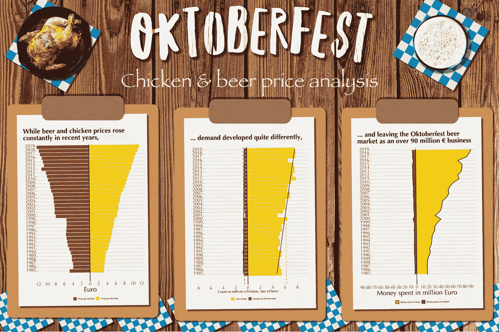

作者创建的图像；基于来自 Pixabay [的木板特写](https://www.pexels.com/photo/close-up-of-wooden-plank-326311/)和 [Frank Luca](https://unsplash.com/@frankluca?utm_source=unsplash&utm_medium=referral&utm_content=creditCopyText) 在 [Unsplash](https://unsplash.com/s/photos/beer?utm_source=unsplash&utm_medium=referral&utm_content=creditCopyText) 上的照片和 [Anshu A](https://unsplash.com/@anshu18?utm_source=unsplash&utm_medium=referral&utm_content=creditCopyText) 在 [Unsplash](https://unsplash.com/photos/Xt4yZUIpRTo?utm_source=unsplash&utm_medium=referral&utm_content=creditCopyText) 上的照片

## [动手操作教程](https://towardsdatascience.com/tagged/hands-on-tutorials)，教程— R —啤酒节

## 关于如何使用 R 和 ggplot2 分析和可视化啤酒节数据以及如何预测价格信息的分步教程

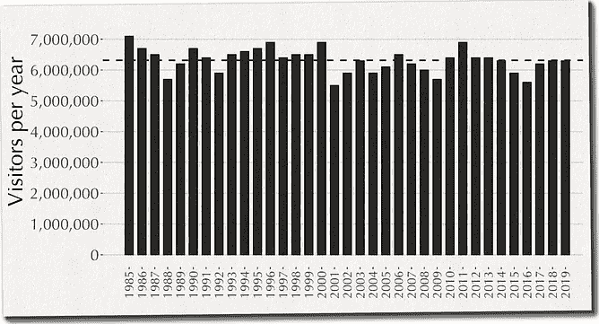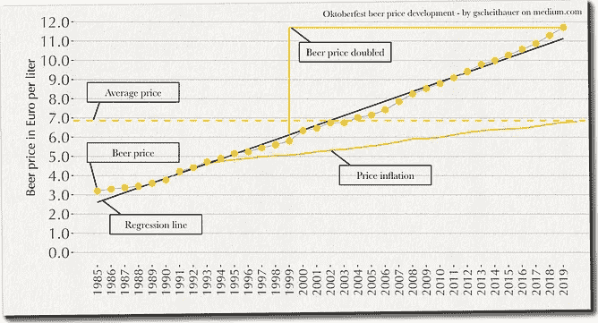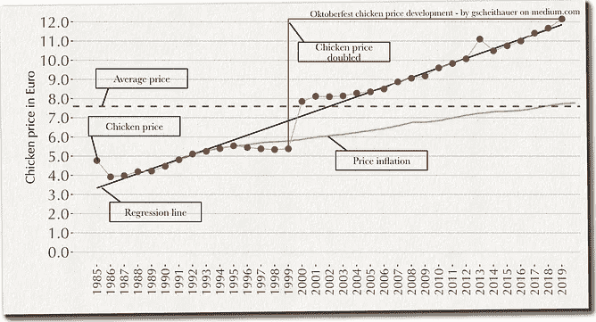

啤酒节游客和价格发展；作者提供的图片

慕尼黑最著名的事情之一当然是我们的啤酒节，这是世界上最大的啤酒节。自 1810 年以来，它每年都会举行，只是在战争和你猜对了，流行病期间会取消。2020 年的啤酒节被取消了，至于 2021 年的[，目前还不清楚它是否会举行](https://www.abendzeitung-muenchen.de/muenchen/oktoberfest/oktoberfest-2021-auf-der-kippe-auch-wiesn-chef-baumgaertner-ist-skeptisch-art-718766)。

由于这是一个如此重要的事件，从社会和经济的角度来看，我试图找到关于它的信息，并了解更多关于它的数字。我发现了一个有趣的数据集，它跨越了 35 年，提供了关于啤酒量、价格、游客、鸡肉需求和价格的信息。

在这篇文章中，我将向您展示如何使用 [R 和 ggplot2](/data-visualization-in-python-like-in-rs-ggplot2-bc62f8debbf5) 来分析一个有趣的数据集，即啤酒价格在过去 20 年中翻了一番，而鸡肉销售停滞不前，啤酒总销售额在 2019 年达到 9000 多万欧元。

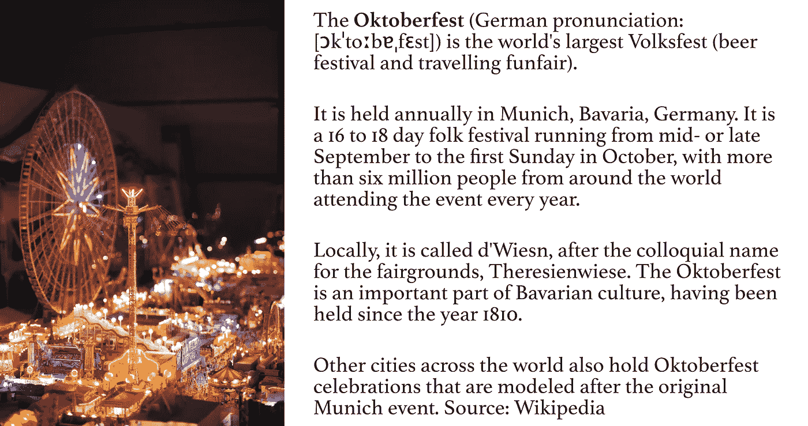

Joshua Humpfer 在 [Unsplash](https://unsplash.com?utm_source=medium&utm_medium=referral) 上的照片

## 1.设置和概述

数据是来自[慕尼黑开放数据门户](https://www.opengov-muenchen.de/dataset/oktoberfest/resource/e0f664cf-6dd9-4743-bd2b-81a8b18bd1d2)的开放数据集。该数据集跨越 35 年(35 次观察)和 10 个变量，包括:

*   啤酒节的**年**
*   节日持续的天数( **duration_days** )
*   每年的游客(**游客 _ 年**)
*   每年每天的平均访客数(**访客日**)
*   每年一瓶啤酒(1 升)的平均价格( **beer_price**
*   每年销售的啤酒总量，单位为升( **beer_sold** )
*   每年一只鸡的平均价格( **chicken_price**
*   每年售出的鸡的总量(**鸡 _ 售出**)
*   *计算:*花在鸡肉上的钱总数(**moneypentonchicken**)
*   *计算:*花在啤酒上的钱总数(**moneypentonbeer**

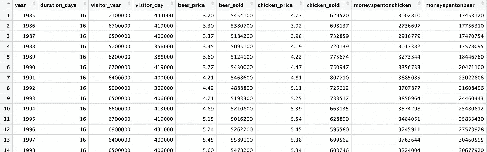

数据概述；作者图片

## 2.数据可视化

我研究了上面提到的一些变量的观察结果，以便更好地理解这些数据。通常，*直方图*是探索数据分布和发现有趣细节的完美工具。在此分析中，我使用*条形图*展示了数据在 1986 年*至 2019 年*期间的进展情况。

**每年的游客量会随着时间的推移略有变化，而游客量下降主要是受恐怖袭击的影响**

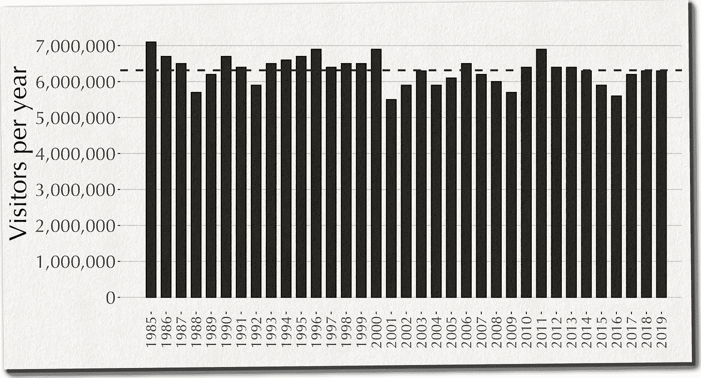

每年的啤酒节游客；虚线平均值；作者图片

35 年来，平均每年有 6，314，286 人参观啤酒节。1985 年，参观啤酒节的人最多。然后，游客数量急剧下降，1988 年跌至谷底，游客数量比平均水平少 60 万。从那以后，游客的数量不断增加，直到 2001 年 9 月 11 日之后达到了一个新的低点——啤酒节通常在每年的九月底开始。从 2014 年到 2016 年，欧洲发生的恐怖袭击导致游客减少。然而，从 2017 年起，游客人数有所增加。2020 年，因为疫情，啤酒节取消了。2021 年的陪审团还在外面。

**啤酒价格的增长快于通货膨胀，在过去的二十年里，啤酒价格翻了一番**

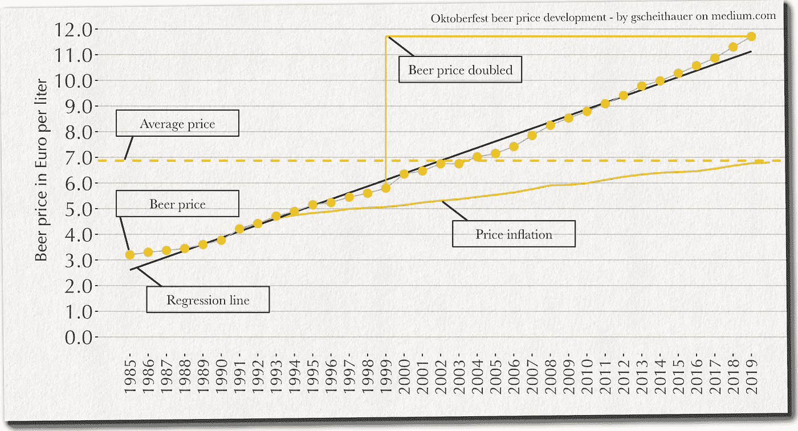

啤酒节啤酒价格发展；虚线平均值；作者图片

2019 年，一升啤酒的价格为 11.71€，而 1985 年仅为 3.20€。1999 年，价格是 5.80€，因此，在过去的 20 年里翻了一番。平均而言，啤酒价格每年上涨 0.25€，几乎是通货膨胀率(0.084€)的三倍。

有趣的是，与 1990 年相比，1991 年每升啤酒增加了 0.44€。为什么会这样？在随后的几年中，增长率趋于平稳，直到 1996 年才再次上升，2000 年与 1999 年相比出现了 0.55€的大幅增长，比一段时间以来的平均增长率高出一倍多。

**鸡肉价格在过去 20 年里也翻了一番，2020 年价格出现大幅调整**

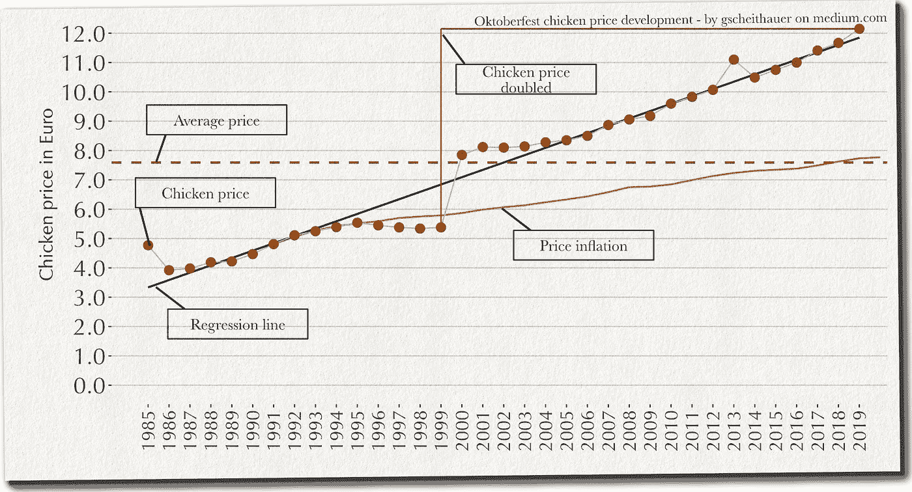

啤酒节鸡肉价格发展；虚线平均值；作者图片

鸡肉价格逐年上升，直到 1995 年才略有下降。然而，2000 年出现了大幅增长。价格上涨了 2.47€，是平均价格涨幅的 12 倍多。从 1985 年的 4.77€开始，到 2016 年的 11.00€和 2019 年的 12.15€。因此，在过去的二十年里，一只鸡的价格翻了一倍多。令我惊讶的是，在 1999 年**，一只鸡比一升啤酒**还便宜！难怪 2000 年有这样的价格调整。

**啤酒和鸡肉需求发展**

虽然一只鸡和一升啤酒的价格在价值和增长上非常相似，但这与售出的鸡和一升啤酒的数量非常相似。平均售出 6，222，337 升啤酒，而仅售出 571，921 只鸡(尽管这仍然是一个巨大的鸡肉数量)。

> 平均来说，每只鸡卖出了 10.8 升啤酒，每个游客平均喝了 1 升啤酒，吃了 0.09 只鸡！

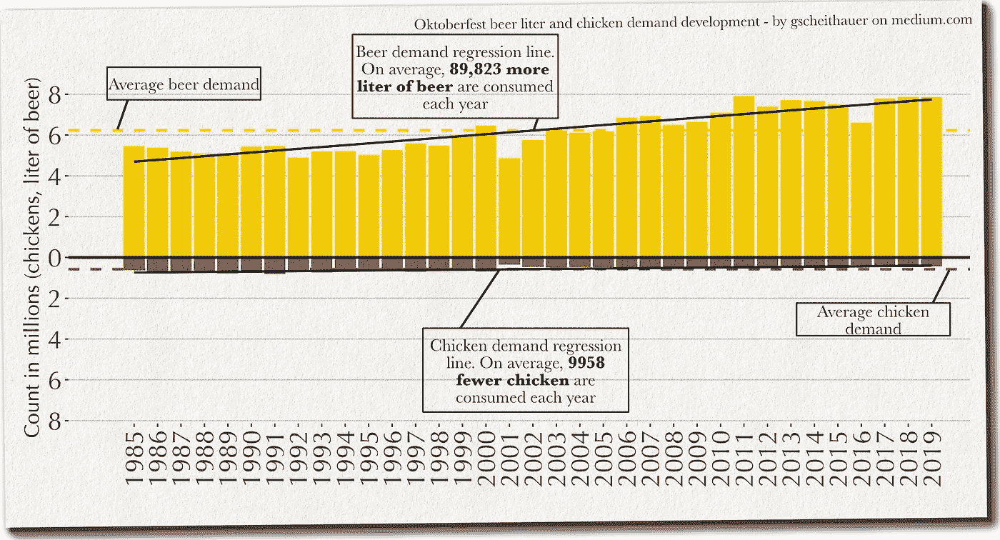

啤酒节鸡肉和啤酒需求发展；虚线平均值；作者图片

**多年来花在啤酒和鸡肉上的钱总数**

在最后这张图中，我比较了每年花在啤酒和鸡肉上的钱。这是通过将金额乘以价格得出的。有趣的是，啤酒和鸡肉的价格在过去的二十年里翻了一番。然而，尽管啤酒需求稳步增长，鸡肉需求却逐年下降。

1999 年，花在啤酒上的钱是 34，831，320€，2019 年是 91，925，842€。增幅超过 260%。

1999 年，花在鸡肉上的钱是 3，279，976€，2019 年是 5，285，226€。这仅仅增加了 161%

> 1999 年，游客在啤酒上的花费是鸡肉的 10 倍以上，而在 2019 年，游客在啤酒上的花费是鸡肉的 17 倍以上！

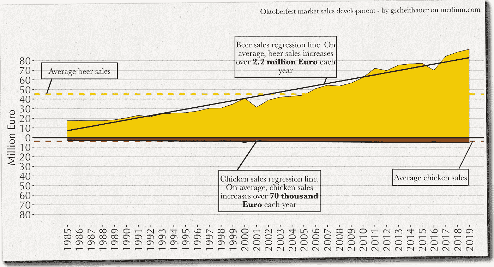

啤酒节鸡肉和啤酒销售发展；虚线平均值；作者图片

## 3.价格预测显示 2030 年每升啤酒价格为 13.89€

让我们尝试使用啤酒价格信息来训练模型并预测未来几年的啤酒价格。这个模型非常简单:[线性回归](https://en.wikipedia.org/wiki/Linear_regression)。

> 在[统计](https://en.wikipedia.org/wiki/Statistics)中，**线性回归**是一种[线性](https://en.wikipedia.org/wiki/Linearity)方法，用于模拟[标量](https://en.wikipedia.org/wiki/Scalar_(mathematics))响应与一个或多个解释变量(也称为[因变量和自变量](https://en.wikipedia.org/wiki/Dependent_and_independent_variables))之间的关系。—来源:[维基百科](https://en.wikipedia.org/wiki/Linear_regression)

首先，让我们用 1985 年到 2019 年的*啤酒价格*来训练一个模型。然后，我们可以使用这个训练好的模型`model` 对 1985 年到 2030 年进行预测(而我们只使用 2020 年到 2030 年的数据)。该预测数据集`pre`仅包含预测价格，而不包含我们必须在`pre_data`数据集中再次添加的年份信息。最后，我们创建另一个变量，将价格信息四舍五入到两位小数之后。

训练模型并预测啤酒价格

接下来，我们可以使用预测价格(`pre_data`)和本文前面的啤酒价格图表。

啤酒节啤酒价格预测；作者图片

## 4.结论

这是慕尼黑开放数据门户对啤酒节可用数据的分析。简而言之，我了解到

*   直到 2016 年，游客总数一直在下降，但总体上没有显示出真正的趋势。
*   2001 年，就在 911 事件之后，游客数量大幅下降。从 2014 年到 2016 年，欧洲的恐怖袭击影响了游客数量。
*   啤酒的销售总量增加了，而鸡肉的销售总量减少了，因此，人们吃的鸡肉少了，但喝的啤酒多了。
*   令人担忧的是，每位游客的啤酒量在 1997 年后也增加了；2019 年，平均一名游客每天喝超过 1.2 升啤酒。
*   鸡肉和啤酒的价格比 1999 年翻了一番。一升啤酒的价格上涨，尤其是。2000 年增加了 0.55€。2000 年，一只鸡的价格上涨了 46%!
*   2019 年整体啤酒销售额超过 9000 万欧元。
*   使用简单的线性回归模型，我们可以预测 2030 年的啤酒价格为每升 13.89€。虽然许多因素可能会影响价格决策，而且我们只关注过去的价格，但这一预测显示的是方向，而不是实际的价格预测。

当然，这种分析受到可用于这种分析的数据量的限制。对已经汇总的数据进行平均只能获得有限的见解，需要仔细解读统计数据！

> 你怎么想呢?你有什么反馈给我吗？

如有任何问题和意见，请随时联系我。谢谢你。**点击此处查看我的更多文章**:

1.  [了解我如何计划和管理我的文章创意](https://medium.com/technical-excellence/article-pipeline-management-with-notion-app-template-13e83635ed1)
2.  [学习如何从你的个人资料中创造美丽的艺术作品](/create-beautiful-art-from-your-personal-data-9dc0abfeeaf)
3.  [了解我如何获得和分析我的 Garmin 跑步数据](/how-to-visualize-your-runners-high-with-python-and-altair-45dde7803141)
4.  [了解如何为您的 Python 代码设置日志记录](/how-to-setup-logging-for-your-python-notebooks-in-under-2-minutes-2a7ac88d723d)
5.  [了解如何使用链接(或管道)在 Python 中编写干净的代码](/the-flawless-pipes-of-python-pandas-30f3ee4dffc2)
6.  [学习如何使用 R 分析你的 LinkedIn 数据](/nine-years-on-linkedin-in-data-b34047c77223)
7.  [学习如何使用图形语法在 Python 中以描述性的方式创建图表](/data-visualization-in-python-like-in-rs-ggplot2-bc62f8debbf5)

Gregor Scheithauer 是一名顾问、数据科学家和研究员。他专门研究流程挖掘、业务流程管理和分析。你可以在 [**LinkedIn**](https://www.linkedin.com/in/gscheithauer/) 、 [**Twitter**](https://twitter.com/gscheithauer) 上与他联系，或者在 [**Medium**](https://gscheithauer.medium.com/) 上与他联系。谢谢大家！