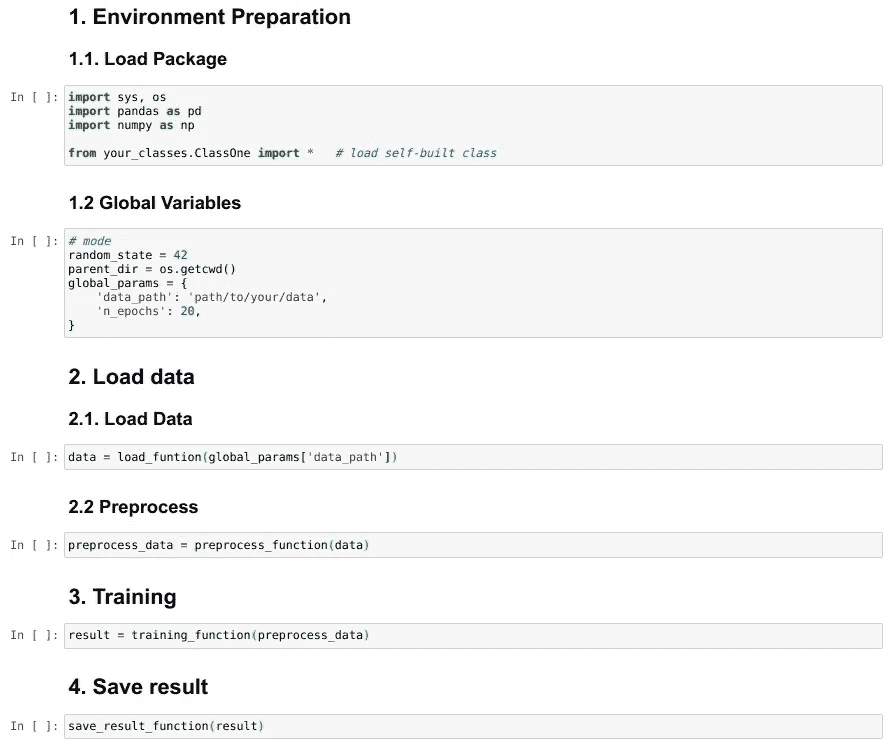
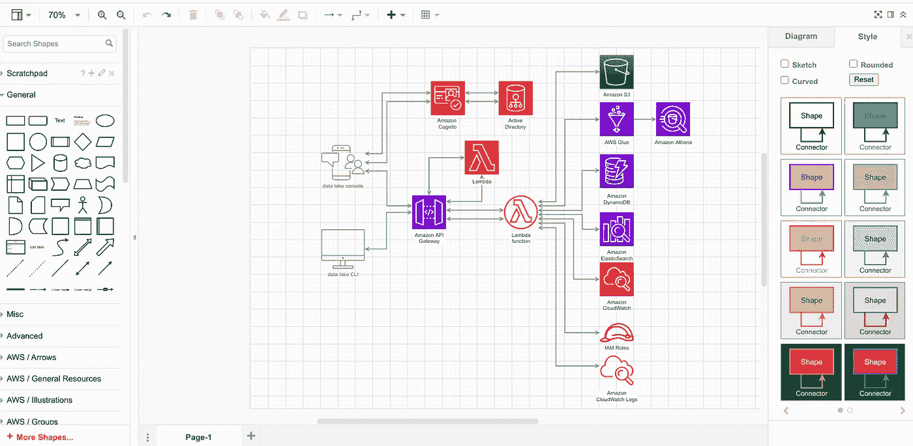

# 数据科学家必须掌握的现实生活技能

> 原文：<https://towardsdatascience.com/the-real-life-skill-set-that-data-scientists-must-master-8746876d5b2e?source=collection_archive---------29----------------------->

## 数据科学职业生涯中有哪些软技能？数据科学是一个融合了商业和技术专业的工作，那么编码、通信、统计等等……对于这份工作来说足够了吗？让我们探索一下对你来说还有什么是至关重要的。

来源:克里斯多夫·高尔在 [Unsplash](https://unsplash.com/photos/m_HRfLhgABo) 上的

D ata 科学家是一个预先要求具备多种理论和实践技能的职位。出于这个原因，成为数据科学专业的大三学生是毕业后的第一份工作，这是一个挑战。而要拥有这些技能，就要向公司学习。这就像是先有鸡还是先有蛋的因果困境。显然，你可以问你的数据科学家熟人，但分享这一点被他们大多数人低估了，因为这对这些极客来说太明显了。

这就是为什么我想分享我在一家硅谷类型的初创公司担任数据科学家/人工智能开发人员的经历。

# 数据科学家与管道合作

## 什么是管道？📔

来源:由[昆腾德格拉夫](https://unsplash.com/@quinten149)在 [Unsplash](https://unsplash.com/photos/L4gN0aeaPY4)

**经验定义:**将原始数据转化为商业问题可操作答案的一组过程[1]。

**真实世界定义**:一组将过程从原始数据转换为最终结果的代码/文档文件。这些文件以多种目的和格式扩展，例如主代码、支持包、代码注释、文档、管道流程图……从名称中，您可能会了解它们是什么以及它们如何支持您。

## 为什么数据科学项目需要管道？🔬

项目管道有多种形式，它可以是一个服务于整个过程的漫长而复杂的管道，也可以存在于文件的子任务集中。鉴于经验，我更喜欢后者。原因如下:

*   维护代码很简单。当需要修改时，确保子管道的相同输入和输出是您唯一需要关心的事情，而您可以自由地更改其中的任何其他内容，而不必担心重写整个过程代码。
*   调试和优化代码或文档会更快，因为您可以毫不费力地跟踪管道组件以及它们之间的关系。
*   更有利于可视化:对于数据科学家来说，查看长代码并上下滚动是最糟糕的事情。

现在，让我们跳到管道组件

1.  **主代码管道**

一般来说，这个文件包含所有的代码，并作为项目中特定步骤的执行点。这可以是一个. py 文件，也可以是一个 Jupyter 笔记本，具体取决于该文件与运行它的主服务器的集成。

根据我的经验，这个文件应该只包含关键部分代码，全局对象的数量越少越好。支持函数和类应该在单独的。py 文件并作为局部变量运行(最好避免使用全局对象)。为什么？如果你运行几个任务，改变一个同时运行的变量，使用局部变量将创建它自己的实例，不会影响其他的结果。此外，将太多变量声明为全局变量会导致*内存不足*的问题，因为这些变量会保留在内存中，直到程序执行完成，而一旦函数结束，局部变量就会被删除，并释放它所占用的内存空间。

Jupyter 笔记本格式的主要代码管道示例(图片由作者提供)

**2。支持包**

其中包括熊猫、Tensorflow、Pytorch 等开源包……以及你要在主代码管道中调用的可重用的自建类，我相信你跟这些相当类似。

在 Python 中创建类和函数可以通过各种课程和文章访问，如果你谷歌它，所以我会通过它。

**3。代码注释**

或者叫做代码解释。这对于理解函数/类是如何工作的，什么是输入和输出，以及易于维护和进一步开发是必不可少的。我认为这是至关重要的，但几乎被数据科学家遗忘，当他们试图维护或开发代码时，这是浪费时间，他们必须从头开始查看代码，做一些数学来确定他们的理解。你应该从一开始就避免这个错误，这可以为你的工作节省时间。

在最佳实践中，注释应该放在每个函数的编码之前，就像几个包的源代码一样。

**4。文件**

如果您经常在数据科学任务中使用开源 API 包，您会清楚地知道文档的重要性。没有它，没有人指望你理解你的管道/包在做什么。代码文档和代码注释的区别在于，前者只包含函数/类用途、参数、运行函数/类的例子等解释信息，后者停留在代码文件中，直接支持代码解释。

需要记住的一点是，尽管代码注释应该在任何可能的时候为每一个自己创建的函数/类进行，但是文档应该在你定义了 90%的代码将运行的内容、流程如何流动以及输入/输出的来源之后编写。

**5。管道工艺流程图**

这和文档是每个项目的基本文件之一。这不是你用的，而是你的同事、上司、客户的 IT、团队…它显示了代码的流程，这个步骤如何与其他步骤交互

这个任务最好的应用之一是 [draw.io](https://app.diagrams.net/) 。它们有浏览器、桌面和平板电脑支持版本，更容易在 Windows、macOS 和 Linux 中使用和安装，最重要的是，该应用程序完全免费。此外，它可以连接到第三方存储云服务，如 Google Drive、One Drive、Dropbox、Github 或在线设备。

它的功能不可思议。各种任务的模板，你需要的大部分图标，形状，颜色，还有一个保存你经常使用的形状的地方叫做**便签本**都在一个地方。

使用 draw.io 创建的图表示例(来源:图片由作者提供)

除了主要的数据科学技能之外，一些公司甚至在他们的工作描述中要求这种图表技能。

## 结论🏆

以上 5 点是一个数据科学管道的核心。还有更多的组件，如 PowerPoint 演示文稿、仪表板、业务报告等，这取决于您组织的需求。

许多人认为数据科学项目管道仅仅提到了代码、系统集成等方面的项目流程，但这是一种稀疏的思维。数据科学项目不仅需要从数据收集、预处理到模型训练和预测的自动化，还需要向业务合作伙伴解释和展示的文档。

即使你有优秀的代码产生良好的结果，但没有人能够重新创建你的结果，你的工作将失去 50%的价值。关于项目管道的知识肯定会让你在数据科学家的职业生涯中受益匪浅。

## 参考

[1]来源:[https://www . snow flake . com/blog/three-business-reasons-a-modern-data-pipeline/](https://www.snowflake.com/blog/three-business-reasons-for-a-modern-data-pipeline/)