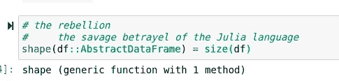
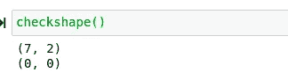
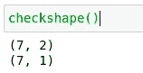
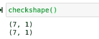

# 背后的真正含义！在方法调用中

> 原文：<https://towardsdatascience.com/the-real-meaning-behind-in-method-calls-b10772f0e30b?source=collection_archive---------48----------------------->

## 当一个方法在一个解释点结束时意味着什么？


(图片由作者提供)

在Julia 编程的奇妙世界中，看到以解释点结尾的方法其实是相当常见的。这是一个对所有计算机程序员来说并不陌生的概念，但可能会让那些以前没有见过它的人感到困惑。有许多语言实现了这一特性，其中一些语言用完全不同的定义描述了这一特性。然而，今天我想回顾一下这在大多数高级声明式编程场景中通常意味着什么。

我将要提供的例子展示了这种方法是如何在 Julia 编程语言中实现的，但是当然还有更多适合的选项。这种泛型编程概念对于那些处理各种类型的科学家来说非常有价值，他们既想操作这些类型，又想避免操作这些类型。

# 一个例子

理解和解决计算和计算机编程中的许多问题的一个很好的方法是分析可重复使用的例子。记住这一点，我们将实际查看两个函数的调用和输出，并将它们与我们传递的类型进行比较，而不是首先查看两个函数之间的区别。对于这个例子，我将使用我最喜欢的编程语言，Julia，但是，这个概念肯定不是 Julia 特有的发明，所以肯定有其他语言可以使用，它们可能对以解释点结束的方法有相同的约定。话虽如此，也有一个简短的小笔记本，你可以看看，也许你可以自己看看。笔记本在这里:

[](https://github.com/emmettgb/Emmetts-DS-NoteBooks/blob/master/Julia/Methods%20ending%20in%20!.ipynb) [## emmett GB/Emmetts-DS-笔记本电脑

### 各种项目的随机笔记本。通过创建帐户，为 emmettgb/Emmetts-DS 笔记本电脑的开发做出贡献…

github.com](https://github.com/emmettgb/Emmetts-DS-NoteBooks/blob/master/Julia/Methods%20ending%20in%20!.ipynb) 

为了演示有和没有解释点的方法之间的区别，我们将使用 select！()并从 Julia 的基础包中选择()方法。我们将在一个数据框中使用这两个数据框，因此让我们继续预编译该依赖项并创建一个新的数据框:

```
using DataFrames
df = DataFrame(:A => [5, 10, 15, 20, 25, 30, 35], :B => [5, 10, 15, 20, 25, 30, 35])
```

接下来，我们需要检查数据框的形状。如果您想加入反叛，您可以快速将 shape()分派给 size()方法，并根据周围的生态系统进行调用，这似乎更明智(需要说明的是，独一无二没有错，我只是想搞笑。):



(图片由作者提供)

```
shape(df::AbstractDataFrame) = size(df)
```

现在，我将创建一个空数据框类型，这样我们就可以创建一个函数来反复调用，以便一次检查两个数据框的形状:

```
dfnoB = DataFrame()
```

或者，您可以为两个数据框的 shape()添加调度行:

```
shape(df::AbstractDataFrame, df2::AbstractDataFrame) = println(size(df)); println(size(df))
```

这将使您不必定义 dfnoB..不过我还是要写一个函数:

```
function checkshape()
 println(shape(df))
 println(shape(dfnoB))
end
```

现在让我们来看看数据框的形状，请务必记下这方面的尺寸:



(图片由作者提供)

```
checkshape()
```

现在我们将使用不带解释点的 select()方法。我们还将创建一个反向数组，这是 Not()函数的返回，它将告诉我们的 select()函数，我们希望选择反向数组中除 dim 之外的所有内容:

```
dfnoB = select(df, Not(:B))
```

现在让我们检查一下我们新的 dfnoB 的外形:



(图片由作者提供)

```
checkshape()
```

正如您所看到的，我们现在有了第二个数据框，其中包含了 single:一个与预期相符的特性。问题是；如果我们使用 select 会发生什么！()而不是 select？让我们试试这个:

```
dfnoB = select!(df, Not(:B))
```



(图片由作者提供)

```
checkshape()
```

# 摘要

每当我们使用 select！()方法而不是 select()方法，我们的原始数据框也应用了更改。直到我们考虑它在高级声明式函数编程中的使用，这才真正有意义。精选！()方法可用于在没有断言的情况下改变类型。本质上，这两个函数的区别在于，一个会复制我们的类型，而另一个不会。根据包内部通常的情况，select()函数将被分派到 select！()方法中添加了函数 copy()，就像这样；

```
select(df::AbstractDataFrame, x::Array{Any}) = select!(copy(df), x::Array{Any})
```

基本上，这个函数的意思是，我们可以在不添加断言操作符的情况下在类型上调用它，并且在不创建新类型的情况下改变类型。这既可以节省内存，也可以在利用简单的函数调用清理数据时节省一些时间:

```
select!(df, Not(:B))
```

上面的代码实际上会从 df 中删除:B 列。

# 结论

我认为这些类型的函数在语言中使用时肯定是一个有趣的方面。他们可以显著地改变语言的用法，我认为这是相当激进的。只需键盘上的一个符号，我们就可以决定通过支持这种技术的语言中的任何方法传递的类型的可变性。感谢您的阅读，它对我来说真的很重要——祝您白天和/或晚上休息愉快！