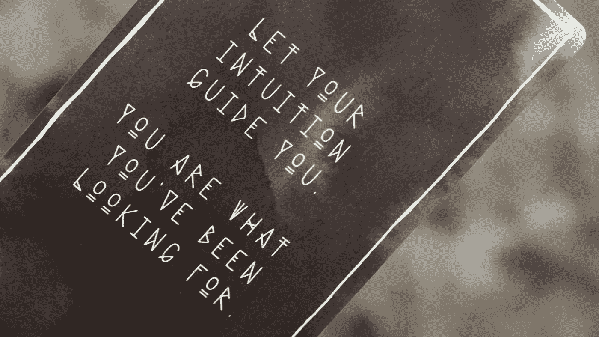
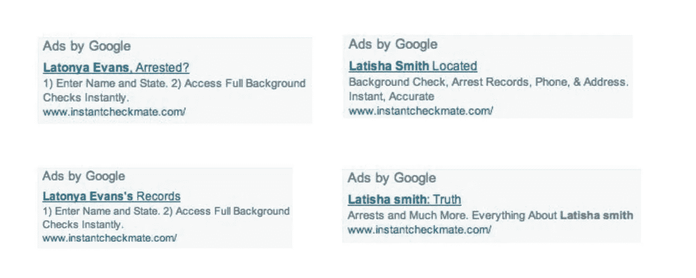

# 社会意识机器学习的现实

> 原文：<https://towardsdatascience.com/the-realities-of-socially-conscious-machine-learning-c3d86363afe4?source=collection_archive---------39----------------------->

## 为负责任的人工智能开发直觉

詹·西奥多在 [Unsplash](http://unsplash.com/) 上的照片

当 Latanya Sweeney 博士作为客座教授第一次来到哈佛时，她已经发表了关于数据匿名化和隐私的开创性研究。她在定义 K-匿名性方面发挥了重要作用，创作了 DataFly 算法，并揭示了如何简单地使用选民登记数据对医疗记录进行去匿名化。因此，当斯威尼博士在谷歌上搜索自己，希望与哈佛大学的同事分享她的一篇文章时，她最不希望看到的是一则暗示她有被捕记录的广告。一种算法似乎决定了斯威尼博士的名字——拉坦亚——更有可能被赋予一个有色人种。随后，广告应该使用类似“被捕”或“记录”的话模板

针对黑人识别名称的负面信息。“Latonya Evans”、“Latisha Smith”的广告示例(Sweeney，2013)

接下来发生的事情是人们对计算机科学家的期望。Sweeney 博士解构了该算法，并发现一个黑人识别的名字有 25%的可能引发一个暗示逮捕记录的广告，只有不到 0.1%的可能性可以被偶然解释(Sweeney，2013)。

谷歌描述其广告预测算法的论文解释说，当有人点击进入的概率较高时，系统会更频繁地显示广告(McMahan et al .，2013)。起初，所有组合(查询和相应的广告文案)的权重都是相同的，但随着时间的推移，该算法学会倾向于点击次数更多的组合(Sweeney，2013)。也就是说，这种歧视可能不是由算法引起的，而是由观看算法的人群引起的。

从数学上讲，算法正在做我们期望它做的事情。它越来越青睐更受欢迎的广告。理论上，反向偏置算法以偏好较少观看的广告纠正了这种行为，但这可能对广告的有效性有其他影响。毫无疑问，广告的语言成功地迎合了社会偏见，广告商将最终决定是否利用这一事实。那么，参与创建算法的从业者的责任是什么？更直接地说，重视公平的人如何定位自己以抵消歧视性的结果？

> **“对技术的追求也不能避免我们在社会其他领域发现的同样的弊病。”**
> 
> Latanya Sweeney 博士-2019 年在拉德克利夫学院关于种族、技术和算法偏见的讨论

正如斯威尼博士所说，“对技术的追求也不能避免我们在社会其他领域发现的同样的弊病。”尽管如此，由于诸多原因，决定何时(以及如何)遏制不公平结果是一项挑战。做出明智的决定来抵制歧视行为涉及法律、经济学、个人价值观和组织价值观。这篇文章利用了算法偏差研究、联邦指导、法律先例和其他研究来帮助解决这个难题。它旨在帮助从业者(在所有阶段)开始发展一种直觉，以检测、理解并尽可能纠正嵌入到机器学习应用中的有害行为。

# 偏差≠偏差≠偏差

让我们快速区分偏见的社会学和统计学定义。在机器学习中，偏见并不总是负面的，因为这个术语通常与学习偏见(也称为归纳学习)相关联。归纳学习是统计学习理论的核心部分，简而言之，就是机器学习模型如何从数据中学习，而不仅仅是记忆模式(Hellströ等人，2020)。这种类型的偏差本身是无害的，并且符合更广泛的学习偏差类别(例如，超参数偏差、不确定性偏差)。

我们正在寻找的偏见在法律语言中有一个确定的含义。它指的是“基于先入为主的观念或偏见的判断，而不是对事实的公正评价(Campolo 等人，2018)”。在机器学习中，这可以以各种形式表现出来。为了更加清晰，我们可以从机器学习的偏见中借用一些有用的分类——它有什么好处？由托马斯·赫尔斯特伦、弗吉尼亚·迪格纳姆和苏娜·本施撰写。

## 数据生成偏差

机器学习算法通过摄取大量信息来收集关于世界的观察结果。数据准备过程为偏差的渗入提供了几个机会(例如，采样偏差、注释偏差、测量偏差)。

当来自一个群体部分的观察值存在低代表性或高代表性时，就会出现抽样偏倚(Lane，2014)。研究人员 Joy Buolamwini 和 Timnit Gebru 发现了这种偏见的一个惊人的例子(现在已经广为人知)。他们发现，用于训练计算机视觉应用程序(如面部识别软件)的数据集绝大多数由肤色较浅的男性受试者组成。这种不平衡导致了对深色皮肤女性的错误分类(错误率高达 34.7%) (Buolamwini，Gebru，2018)。

幸运的是，解决抽样偏差绝不是不可克服的。例如，作为其研究的一部分，Buolamwini 和 Gebru 公布了[试点议会基准(PPB)数据集](https://www.ajl.org/connect/request-dataset-for-research)，以实现基于性别和皮肤类型的更好的交叉代表性(Buolamwini，Gebru，2018 年)。尽管如此，即使是完全一致的抽样也无法纠正历史数据中的隐含偏差。

## 历史偏见

当数据本身具有被视为有偏差的不需要的属性时，就会出现历史偏差。即使数据被正确测量和采样，历史偏差也会出现。从本质上说，这些数据是世界的快照，这不可避免地导致一个模型产生不想要的结果(Suresh 和 Guttag，2019)。

虽然历史偏见在许多应用中出现，但它在语言算法中通常很明显。用于理解语言的算法(例如 Google Translate)将单词表示为向量空间中的点(Bengio 等人，2006)。单词之间的向量差异通常表示术语之间的隐含相关性。例如，如果我们让一个算法来解决一个难题，“男人是国王，就像女人是 x，”它会相对快速地求解 x，发现 x 等于“女王”然而，同样的载体暴露了隐含的性别歧视。例如，它发现“男人对于女人就像电脑程序员对于家庭主妇一样”(Bolukbasi 等人，2016 年)。

当然，抽样不充分不会引入刻板印象。它只是揭示了它们是我们交流方式的一部分。许多流行的语言算法在从社交媒体或维基百科挖掘的数据集上进行训练(Devlin et al .，2018)。在这种特殊情况下，在算法看来，建立职业应该是性别中立的，这破坏了错误的假设，并有效地实现了去偏置。例如，我们可以确保像*护士*这样的词与像*何*和*她*这样的性别对具有相等的相关性(Bolukbasi et al .，2016)。不幸的是，这种解决方案不能处理非二进制代词。一个提议的解决方案是从向量中完全删除性别(Schmidt，2015)。这样做将创造更多的包容性，但也带来更多的复杂性，证明了问题的多面性。

# 法律视角

歧视性的结果是通过许多镜头看到的。因此，算法偏差也是多维的。虽然了解所有方面可能很困难，但我们可以从美国反歧视法中寻求一些指导。一系列美国法律禁止歧视受保护阶层，包括种族、族裔、宗教和少数民族；女性；学长；以及有遗传缺陷、残疾或已有疾病的人。[平等法案](https://www.congress.gov/bill/116th-congress/house-bill/5/text)将扩大受保护的阶层，以包括性取向和性别认同(MacCarthy，2019)。

更进一步，2019 年的[算法问责法案](https://www.congress.gov/bill/116th-congress/house-bill/2231)将要求特定组织对可能存在歧视的高风险机器学习系统进行评估。“具体而言，高风险自动化决策系统包括那些(1)可能导致不准确、偏见或歧视的系统”(美国参议院法案 1108，2019)。立法将要求评估衡量对公平和偏见的影响，但它并不试图明确定义术语。这种类型的监管模糊性让组织和个人来确定如何定义机器学习中的公平和偏见。

# 公平的结果与无偏的算法

2020 年 2 月，Rayid Ghani 教授应邀在国会作证，描述优化算法以实现公平和公正。加尼教授作证说，“简单地”开发更好地解释公平和偏见的人工智能算法通常不足以实现更公平的决定或结果”(加尼，2020 年)。相反，开发人员应该针对特定的结果进行优化。这种情况迫使开发人员明确定义算法应该遵循的值。

美联储州长莱尔·布雷纳德在 2021 年人工智能学术研讨会的发言中进一步阐述了这一点；“……如果人工智能模型建立在反映种族偏见的历史数据基础上，或者经过优化以复制过去可能反映偏见的决定，这些模型可能会放大而不是改善获得信贷方面的种族差距……确保我们在创新时建立适当的护栏和保护以防止这种偏见，并确保人工智能旨在促进公平的结果，这是我们的集体责任”。她引用了 Ghani 教授的话，强调应制定指导方针，以最大限度地增加积极影响的机会，同时保护那些传统上被边缘化的人。对一些人来说，这种类型的指导可能会显得激进。然而，对许多人来说，捍卫公平的理念是我们既定社会价值观的一部分，符合法律平等保护的法律标准，是我们的集体责任。

# 打击歧视

我们已经确定了是什么和为什么；让我们在某种程度上定义如何做。我们可以将反歧视方法应用于许多机器学习问题，在不同的发展阶段进行干预(即，先验的，事后的)。

也许，最关键的干预在任何工作开始之前就开始了。女性和有色人种在计算机和数学职业中的代表性不足(Statista，2019)。多元化的团队确保以平衡的视角解决问题。此外，在决定算法应该关注哪些属性之前，量化数据中的多样性和包容性至关重要。玛格丽特·米歇尔和谷歌的一个研究团队提出了[多样性和包容性指标](https://arxiv.org/abs/2002.03256)，在子集选择的早期促进多样性的表现(Mitchell et al .，2020)。

作为事后分析的一部分，南加州大学的一个研究小组提出了新型的[数据中毒攻击](https://github.com/Ninarehm/attack)，其中对手故意以系统的公平性为目标(Mehrabi 等人，2020)。实际上，这是对模型结果公平性的一种敏感性分析。

谷歌与人工智能伙伴关系合作，为算法审计定义了一个端到端的[框架](https://dl.acm.org/doi/10.1145/3351095.3372873)。提供建立政策和原则的机制，包括内部和外部道德期望(Raji et al .，2020)。

这些只是这个新兴研究领域中的几个亮点。

# 实现社会意识

机器学习从业者在遏制社会偏见和防止歧视方面的功能不是一条直线。应该仔细考虑法律、经济、社会和伦理方面的影响。尽管如此，我们不应该要求个人忽视他们的个人价值，而应该用社会和组织价值来衡量他们。采取预防措施，意识到机器学习解决方案可能对社会产生的影响，并了解算法偏差是如何发生的，以及我们如何解决它。

对于那些可能对使机器学习成为可能的所有复杂性着迷的人，让我们增加另一种魅力——优化公平的结果。建议如下:从一开始就确保算法本质上是公平和公正的，并揭露那些不公平的算法，让机器和人类做出更好的决定。这样做不会治愈社会弊病或纠正历史不公。尽管如此，它可能在许多方面提供了一个新的开始，让决策者在允许歧视和不平等继续存在之前停下来。

## 参考

Bolukbasi T，Chang K-W，Zou J，Saligrama V，Kalai A。男人对于电脑程序员就像女人对于家庭主妇一样？去偏置词嵌入。arXiv [csCL]。[http://arxiv.org/abs/1607.06520](http://arxiv.org/abs/1607.06520)。

性别阴影:商业性别分类的交叉准确性差异。MLR . press .[2021 年 2 月 27 日访问]。[http://proceedings . MLR . press/v81/buolamwini 18a/buolamwini 18a . pdf](http://proceedings.mlr.press/v81/buolamwini18a/buolamwini18a.pdf)。

拉坦亚·斯威尼博士，简历。Latanyasweeney.org。[2021 年 3 月 8 日访问]。【http://latanyasweeney.org/cv.html. 

公平算法:研究减少金融服务中人工智能偏见的方法。Congress.gov。[访问日期:2021 年 2 月 18 日]。[https://www . congress . gov/116/meeting/house/110499/witness/HHRG-116-BA00-Wstate-GhaniR-2020 02 12-u1 . pdf](https://www.congress.gov/116/meeting/house/110499/witnesses/HHRG-116-BA00-Wstate-GhaniR-20200212-U1.pdf)。

hellstrm T，Dignum V，Bensch S. 2020。机器学习中的偏见——它有什么好处？arXiv [csAI]。[http://arxiv.org/abs/2004.00686](http://arxiv.org/abs/2004.00686)。

麦卡锡 M. 2019 年 12 月 6 日。算法决策的公平性。布鲁金斯。[访问日期:2021 年 2 月 18 日]。[https://www . Brookings . edu/research/fairness-in-algorithmic-decision-making/](https://www.brookings.edu/research/fairness-in-algorithmic-decision-making/)。

McMahan HB、Golovin D、Chikkerur S、Liu D、Wattenberg M、Hrafnkelsson AM、Boulos T、Kubica J、Holt G、Sculley D 等，2013 年。广告点击预测:来自战壕的观点。收录于:1913 年 KDD 第 19 届 ACM SIGKDD 知识发现和数据挖掘国际会议论文集。美国纽约，纽约:ACM 出版社。

梅赫拉比 N，纳维德 M，莫施塔特 F，高尔斯蒂安 A. 2020。通过公平性攻击加剧算法偏差。arXiv [csLG]。[http://arxiv.org/abs/2012.08723](http://arxiv.org/abs/2012.08723)。

种族、技术和算法偏见|视觉与正义||拉德克利夫学院。2019 年 5 月 7 日。[访问日期:2021 年 3 月 8 日]。https://www.youtube.com/watch?v=Y6fUc5_whX8[。](https://www.youtube.com/watch?v=Y6fUc5_whX8)

Raji ID，Gebru T，Mitchell M，Buolamwini J，Lee J，Denton E. 2020。保全面子:调查面部识别审计的伦理问题。摘自:AAAI/美国计算机学会人工智能、伦理和社会会议录。美国纽约州纽约市:ACM。

Raji ID，Smart A，White RN，Mitchell M，Gebru T，Hutchinson B，Smith-Loud J，Theron D，Barnes P. 2020。弥合人工智能责任差距:为内部算法审计定义端到端框架。arXiv [csCY]。【http://arxiv.org/abs/2001.00973】T4。

布雷纳德行长关于支持在金融服务中负责任地使用人工智能和公平结果的讲话。Federalreserve.gov。[访问时间:2018 年 2 月 21 日 b]。[https://www . federal reserve . gov/news events/speech/brain ard 2021 01 12a . htm](https://www.federalreserve.gov/newsevents/speech/brainard20210112a.htm)。

斯威尼湖 2013。在线广告投放中的歧视:谷歌广告、黑人名字和白人名字、种族歧视和点击广告。ACM 队列。11(3):10–29..