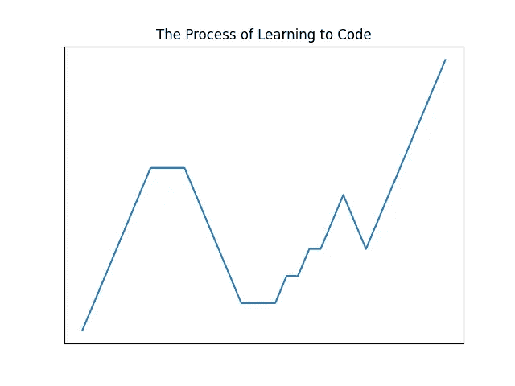

# 你似乎无法学习编码的原因可能与天资或努力无关

> 原文：<https://towardsdatascience.com/the-reason-why-you-cant-seem-to-learn-to-code-likely-has-nothing-to-do-with-aptitude-or-effort-7ff55c71aeaa?source=collection_archive---------13----------------------->

## 虽然没有足够的努力你什么也学不到，但事情可能没那么简单。

在 [Unsplash](https://unsplash.com?utm_source=medium&utm_medium=referral) 上由 [Carlos Deleon](https://unsplash.com/@dlionphotography?utm_source=medium&utm_medium=referral) 拍摄的照片

只要你愿意付出努力，你有没有天资并不重要——你可以学会做任何事情。

然而，当涉及到学习如何编码时，你经常会遇到这样的情况:无论你付出多大的努力，你似乎都无法抓住一个概念或者理解一段代码是如何工作的。当投入的时间与保留的知识量的成本效益分析似乎不能相加时，多写一行代码(或试图多写一行代码)的想法就像用奶酪刨丝器刮你的额头。

在这一点上，你可能会问自己，“这有这么难吗？”。

而且理由很充分。

你已经对编码失去了所有的热情，这也没有帮助，你已经建立起来的日常习惯现在被推到了一边，因为其他不太费力就能产生即时满足感的事情变得更重要了。

虽然这个历史悠久的故事(或者至少是编程历史悠久的故事)注定会随着新一轮想要学习编程的受启发的人的到来而重演，但自学如何编程可能有更多的原因。

# 学习编码的旅程。

首先，我们需要了解学习编码实际上是什么样子。

对于那些在六个月内学会编码，然后立即被谷歌聘用的人来说，学习过程可能是相当无缝和线性的，路上很少有颠簸。因为让我们面对现实吧，那些能在六个月内学会编码(我指的是为谷歌构建部署就绪的软件，因为学会“编码”并不足以在白金级公司找到工作)的人，都是才华横溢的人，他们可能从娘胎里出来就已经能说六种语言，并能完成微积分问题。

然而，对于我们这些普通人来说，学习过程可能看起来更像这样:

由[作者](https://madison13.medium.com/)绘制的图表(我用 matplotlib 绘制的第一张图表！！很难看，我知道，但这是个开始。你知道就像他们说的，如果你找不到有用的东西，就自己做。)

差不多吧。

关键是，这个过程远远不是线性的。

正如 Thinkful 在这篇[相关的博客文章](https://www.thinkful.com/blog/why-learning-to-code-is-so-damn-hard/)中所描述的，学习编码有四个阶段。像任何事情一样，你从蜜月期开始，在这个阶段你仍然充满活力，你需要学习的范围从基本语法开始到结束。你自我感觉良好，因为你学到了很多东西，而且有大量的资源供你支配。

然而，所有的蜜月都必须结束。学习如何编码的第二阶段包括当你开始意识到你实际上还不能完全靠自己做任何事情时，从悬崖上痛苦地头朝下跳下去。当您在 IDE 中打开一个干净的页面，并试图在没有源代码的情况下从头构建一个项目时，通常会发生这种情况。在这一点上，你需要扩展你的能力，超越你所学的基本语法，并试图把它变成实际做一件事的东西。第二阶段是一条漫长而曲折的道路，充满了调试和试图理解 StackOverflow 的代码片段。

[的博客帖子](https://www.thinkful.com/blog/why-learning-to-code-is-so-damn-hard/)相当准确地证明了这种陷入绝望和对两个因素一无所知的巨大落差:资源密度和知识范围。简而言之，在学习编码的第一阶段，您可以获得大量的资源，这使得学习基本语法变得很容易。然而，在第二阶段你需要学习的量要大得多。这样做的问题是，包含这些知识的可用资源数量少得多，也更难理解。换句话说，你需要获得的知识量和你可利用的资源量成反比。

当你进入被恰当地命名为[【绝望的沙漠】](https://www.thinkful.com/blog/why-learning-to-code-is-so-damn-hard/)的第三阶段时，情况只会变得更糟。您需要了解的内容甚至比第二阶段还要多，在第二阶段，像面向对象编程、模块化、框架等概念变得必不可少。然而，你需要获得的知识量和你可用的资源量之间的反比关系变得更加糟糕。这甚至可能是你开始为 MOOCs 或训练营付费的时候，希望找到沙漠的尽头。

但是，如果你坚持下来，你可能会幸运地进入第四个也是[最后一个阶段](https://www.thinkful.com/blog/why-learning-to-code-is-so-damn-hard/)。在这里，你开始看到你作为一个开发人员的信心和能力的上升。您的代码远非完美，甚至可能相当糟糕，但您至少可以构建一个东西，并相对确定地知道您的代码如何以及为什么工作。在这一点上，你可以自信地说你知道如何编码！

# 为什么你似乎不能学习编码。

当有人说他们正在努力学习编码时，我从来没有想到两件事:他们付出的努力，或者他们的能力。

虽然让自己对学习编码所付出的努力负责是很重要的，但这并不是为什么有人可能在奋斗的全部原因。此外，一个人的编码天赋很少能表明他们学习如何编码的能力。因此，我们需要更深入地挖掘你似乎学不会编码的原因。

## 事情变得困难了，你的动力也消失了。

这可能是人们学习如何编码时最常见的问题。

学习如何编码的第二阶段和第三阶段之间的过渡，通常是人们开始缺乏继续下去的动力的时候。

这实际上发生在我上大学的时候。直到我们开始研究围绕面向对象编程、模块化和计算机科学基础的更复杂的主题时，一切都进行得很顺利。当然，当我们有一门关于所有这些更高级主题的课程时，我们被分配了一位讲师，他对经营自己的创业公司更感兴趣，而不是实际授课和给我们反馈。基本上，我不得不使用谷歌和 StackOverflow 勉强通过那门课程。到课程结束时，我已经筋疲力尽，缺乏信心，以至于我不再想从事科技行业。

**如何避免这种情况:**

*   花些时间提醒自己为什么最初对学习编码感兴趣。也许这意味着暂停学习新概念，转而专注于练习你已经熟悉的技能。通过回到基础，你的注意力可能会被重新点燃。
*   当面对一项困难的任务时，不要让自己不知所措。相反，打开白板，从将任务分解成简单的步骤开始。然后，问问自己每一步的结果应该是什么。用英语写下你要完成的目标，然后翻译成你熟悉的代码。如果不是完美的解决方案也没关系。如果你找到一个更好的做事方法，你可以回头修改它。
*   设定可衡量的目标。尽管这个缩写词让我畏缩，但在设定具体的、可衡量的、可实现的、现实的、及时的(SMART)目标背后还是有一些逻辑的。将你的学习目标分成可管理的小块将有助于你集中精力学习，并防止你被你最终将不得不吸收的大量知识淹没。

## 你试图学习使用不适合你的资源。

还记得你上学的时候，老师让你做一个测试来确定你的学习风格吗？也许是时候回顾一下你的成绩或者重新参加考试了。

学习编码时，发挥你的长处很重要。幸运的是，有许多不同类型的资源，几乎可以保证您会找到一种帮助学习编码更容易的资源。我的建议？在开始的时候，尽可能多地利用你可以利用的资源，然后把你的注意力集中到一两个你觉得特别有帮助的地方。这样，你会在学习过程中获得一些连续性。

对于那些已经挖掘出你的学习风格结果的人来说，这里有一些可以优化你的学习过程的想法:

*   如果你是视觉学习者:使用流程图、代码片段、思维导图和视频。在将想法写在代码中之前，不要害怕展开白板来描绘它们。
*   **如果你是一名听觉型学习者:**收听 Youtube 视频、视频在线课程或 MOOC 讲座，这样你就可以听导师指导你完成编码过程。此外，尝试教别人如何编码。可能是你的妈妈，你的狗，或者你的仙人掌。教学学习对听觉学习者很有用，他们通过分享知识来巩固概念。
*   **如果你是一名阅读/写作学习者:**阅读编程语言文档、博客文章、网站文章、代码片段或 GitHub 代码库。此外，试着写你自己的博客文章或方法文章来进一步实践你刚刚学到的东西。
*   如果你是一个动觉型学习者:在看视频或阅读博客时，跟着做，并在你自己的 IDE 中写下代码。此外，基于源代码创建自己的项目，尝试新的想法并通过实践来解决问题。

## 你正在学习的课程没有考虑到不同概念的难度。

Youtube 上的“4 小时学会这种编程语言”课程……令人沮丧。虽然这些课程对于那些已经熟悉编程的人来说是很好的提神剂，但是这些课程通常在不同的概念上花费相同的时间。你已经可以看到这个问题了。

问题是编程中的概念有不同的难度，这些难度通常与彻底教授概念所需的时间相对应。例如，关于如何写你的第一个“Hello World”的模块应该只需要 5 分钟。然而，如果面向对象编程的模块也只有 5 分钟长，那就有大问题了。5 分钟教不了面向对象编程。那是异端邪说。

**如何避免这种情况:**

使用费曼技术。[费曼技巧](https://blog.doist.com/feynman-technique/)是一个帮助你真正理解一个概念的四步过程。整个过程的目标是能够学习一个复杂的概念，然后能够用简单的术语解释它。你用来解释某事的术语和类比越简单，你对这个概念的理解就越好。这项技术可以分为四个步骤，您可以依次遵循:

1.  选择一个概念来学习。
2.  把这个概念教给自己或别人。
3.  如果你卡住了，回到原始材料。
4.  简化你的解释，创造类比。

## 你试图向其学习的导师正试图教授博士级别的初学者。

当学习如何编码时，你通常不是问题。你的教练才是问题所在。

[“知识的诅咒”](https://en.wikipedia.org/wiki/Curse_of_knowledge)实际上是一种记录在案的认知偏差，这种偏差发生在教师(或任何就此教其他人的人)假设学生有他们所教内容的背景，这样学生就能理解他们所说的一切。

换句话说，你不知道发生了什么。

**如何避免这种情况:**

*   使用 FreeCodeCamp 的课程，这些课程由现任和前任大学教授或其他自学成才的开发人员讲授。这些人可能是最好的学习对象，因为 a)他们有向初学者教授复杂概念的经验，b)他们曾经和你一样。
*   刚开始的时候，试着从尽可能多的资源中学习，直到你找到一个能让你“一拍即合”的老师。

# 最后的想法。

我能给的关于学习编码的最好建议是坚持不懈。坚持会帮你度过最糟糕的日子，那时什么都不管用，你不想再多写一行代码。

重要的是要记住，这是可以做到的，许多其他人已经和你在同一条船上。虽然许多人已经放弃了，但是你和他们之间的区别是，你现在对为什么学习编码如此困难以及如何最好地避免常见的学习陷阱有了一些了解。

所以请记住:坚持最终会有回报。相信我，当你看到隧道尽头的亮光时，你不会后悔几个月前你决定要学习如何编码时所做的决定。