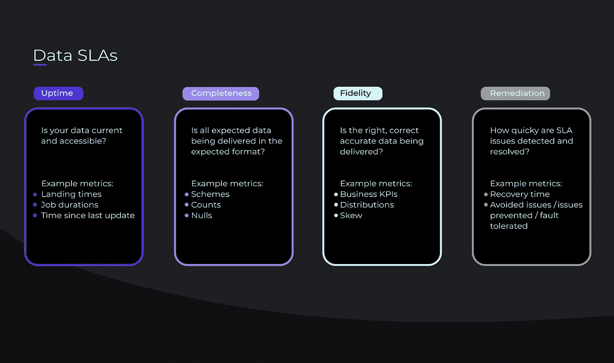
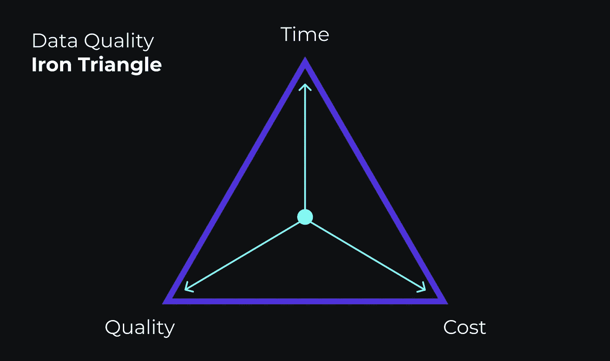
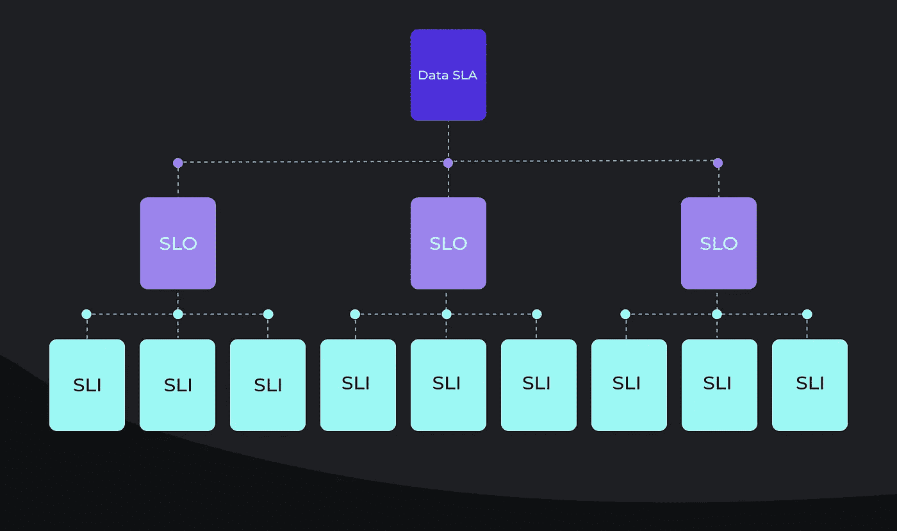

# 数据服务级别协议和数据产品之间的关系

> 原文：<https://towardsdatascience.com/the-relationship-between-data-slas-data-products-77207f876072?source=collection_archive---------19----------------------->

## 它们是如何关联的，为什么重要

[斯科特·格雷厄姆](https://unsplash.com/@homajob?utm_source=unsplash&utm_medium=referral&utm_content=creditCopyText)在 [Unsplash](https://unsplash.com/@homajob?utm_source=unsplash&utm_medium=referral&utm_content=creditCopyText) 上拍照

数据行业正在经历另一个[变革期](https://databand.ai/blog/modern-data-stack/)，行业领导者挖掘出一项未被充分利用的资产:他们的数据。数据不再是达到目的的简单手段，而是被我们与之交互的几乎每一个界面批量处理、流式传输、转换和收集。反过来，组织正在采用数据驱动的文化，并快速建立新的数据团队来挖掘这一新资源。你可能会问，终极目标？去以前没有数据去过的地方:高级分析。

然而，这些组织如何衡量他们从这些新生数据产品中创造价值的能力呢？输入数据 SLA。数据 SLA 是在这个新领域中为数据概念带来有形性的机制。数据 SLA 是在数据即服务框架内实现数据操作效率的实际应用。

在本文中，我们将探索数据产品和数据 SLA 之间的关系，并讨论在您的组织中实现现实的数据 SLA 可以采取的一些简单步骤。

# 什么是数据产品？

与大多数史诗般的旅程一样，我们的数据冒险从一个简单的问题开始:我们如何从我们存储的所有这些数据中创造价值？对于许多组织来说，没有一个简单的答案。大多数收集到的数据[最终都无法访问或被遗忘](https://databand.ai/blog/data-pipeline-architecture-leading-indicators/)，更不用说以有助于分析的方式进行分类了

绿地数据项目往往是一个昂贵的提议。在与收集、处理和存储数据相关的预计工程、基础设施和维护成本与可感知的高失败率之间，数据计划往往不会通过“Go”，也不会“Collect $200”。

[组织中的大多数高管认为](https://www.businesswire.com/news/home/20200106005280/en/NewVantage-Partners-Releases-2020-Big-Data-and-AI-Executive-Survey)“人员挑战”是解决这个问题的最大障碍，而不是“技术障碍”。虽然这些角色的专业人才短缺导致了这个“人”的问题，但这更多的是一个哲学(见:心态)问题。这些高管中最精明的人将开始权衡这些未来成本与目前的机会成本，而不是持续的数字运算，这些机会成本是指闲置的数十亿字节数据的机会成本，这些数据似乎有无穷无尽的潜力未被挖掘。

这种思维模式的转变是推动行业创新的关键。行业的最后一个转变[是技术上的转变](https://www.dataversity.net/brief-history-data-lakes/)，这支持了高管的观点，即问题更深层次。这一技术转变是增加了存储层；从处理存储和计算的数据仓库到与领域无关的数据湖。

举个例子，组织正在为所有不同类型的团队和用例收集大量数据。随着计算和存储在同一个地方发生，数据模式变得孤立，并且由于缺乏适当的治理，出现了大量重复工作。由于没有可扩展的方法来组织和利用这些数据，数据仓库变得拥挤不堪。

数据行业的领导者开始从数据仓库优先的方法转变为专用的海量存储层，即数据湖。最初的意图是让数据湖存储大量“原始的”与领域无关的数据。然后，数据工程师可以帮助团队和部门将数据从数据仓库转换成可用的形式。最终，数据湖遭遇了同样的问题。虽然计算可能不会在这一层发生，但在数据提供者和消费者之间仍然没有明确的“操作程序”。

谁会把数据从湖边传输到仓库？谁会将数据从仓库传输给消费者？谁将负责在不同阶段清理数据？谁负责调试管道的不同阶段？“更好的数据质量”对消费者意味着什么？根据提供商的说法，什么是实际可实现的？如果你想打破组织孤岛，你需要回答那些问题，而技术无法为你解答。

# 根据定义，数据产品需要数据 SLA

数据即产品模型旨在弥补数据湖留下的缺口。在这种哲学中，公司数据被视为一种产品，将被内部和外部的利益相关者消费。数据团队的角色是以提高效率、改善用户体验和做出正确决策的方式向公司提供数据。

因此，数据提供者和数据消费者需要合作来回答上面提出的问题。就这些条款达成一致并详细说明，这被称为数据 SLA。

SLA 代表服务水平协议。SLA 是双方之间的一份合同，定义并衡量给定供应商或产品将提供的服务级别，以及在他们未能提供服务时的补救措施。他们试图定义服务提供者和消费者对服务水平和质量的期望。

当一个组织向外部客户或利益相关者提供产品或服务时，它们是非常常见的，但是它们也可以在一个组织内部的团队之间使用。

类似地，数据 SLA 指的是组织数据的质量和可访问性。这充当了数据团队(不仅仅是数据工程)和消费者(内部或外部)之间的契约。这个 SLA 不需要写下来(但是[我们确实在这里提供了一个模板](https://databand.ai/blog/what-is-a-data-sla/))但是它会有所帮助。至少，不成文的 SLA 应该采取双方对话的形式，在对话中，双方概述对他们交付或消费的数据产品的明确和可衡量的期望。

SLA 不应该留有解释的余地。例如，他们需要提供一个具体的、可操作的需求，而不是“我们需要了解用户如何与我们的系统交互”，比如:“我们需要一个报告，显示用户查看了应用程序的哪些页面，用户在该页面停留了多长时间，用户在该页面采取了哪些操作，以及用户每天执行这些操作或查看的频率。”

这种详细程度为数据团队提供了一个目标，通过这个目标，他们可以度量进展，开始打破组织的孤岛，并引入数据治理的文化。

# 定义和设置您的数据 SLA

(图片由作者提供)

创建 SLA 对每个组织来说都是不同的。也就是说，数据 SLA 通常由四个要素组成:

**正常运行时间—我的数据是最新的且可访问吗？分析师每天都要依赖雪花银行的一个表格或 S3 的一个文件。数据是否按时到达正确的位置？**

**完整性——所有数据是否以正确的格式到达？**
数据集中的数据模式、记录计数、空计数需要在预期的范围内才能被认为是可行的。

**保真度—数据准确吗？**
这个仪表盘代表现实吗？计算的结果可能是正确的，但是数据是真实的还是出了什么问题(比如从错误的源传输数据)。

**补救—如果我们没有达到这些标准中的任何一个，我们需要多长时间才能恢复？**
工程识别一个问题，找到根本原因，并修复它需要多长时间？在进行某种惩罚之前，多长时间的窗口是可以接受的？

# 定义您的数据 SLA 就是妥协

根据组织的总体业务目标和个人消费者的需求，您需要优化数据 SLA 的元素会有所不同。在理想的情况下，您将能够保证 99.9999%的正常运行时间、保真度和完整性，并且如果事情确实出了问题，您将能够投入整个工程团队来解决它。

不幸的是，我们被数据质量铁三角所束缚。我这么说是什么意思？当您开始优化您的 SLA 的一个方面时，这将影响您维护其他方面的能力。

(图片由作者提供)

所以，当你在一个领域优化你的数据产品时，它会把你的数据产品从铁三角的中心拉出来。这改变了您的 SLA 对[“良好”数据质量](https://databand.ai/blog/what-is-good-data-quality-for-data-engineers/)的相互认可的定义。

例如，如果停机时间超过可接受的阈值，消费者可以接受每月 90%的更宽松的数据正常运行时间，只要保证他们有更慷慨的补救条款(即，在问题解决或预算重新分配之前的专门支持)。

# 如何找到合适的平衡点

这三个公理之间存在某种平衡，对你和你的消费者都有效。找到这种平衡意味着与你的消费者进行一次非常坦诚的对话，并找出如何平衡他们的需求与你实际能提供的东西。以下是一些开放式问题，用于指导您与客户之间的 SLA 对话:

## 我们的 SLA 的粒度是多少？公司范围的 SLA 还是特定于数据集的 SLA？

本文的目标是鼓励每个组织在提供者和消费者之间设置一个 SLA。也就是说，并不是每个数据集都需要定制的数据 SLA。就像在警报中一样，为交付的每个数据集设置唯一的 SLA 会分散数据工程的注意力，造成警报疲劳，并有可能使整个工作被视为理想化的(参见:不切实际),利益相关者将照常工作。

最好的起点是确定哪些数据交付需要专门的、更严格的数据 SLA。每条管道根据其传输的数据都有不同的重要性级别。这种重要程度可以帮助您缩小需要其数据 SLA 的数据集和消费者的范围。

## 我们的数据产品有哪些 KPI？

虽然您的每个消费者都希望“更好的数据质量”，但他们需要能够量化这对他们意味着什么。大多数团队的数据集都有不止一个 KPI，但是为了简单起见，一个团队的 KPI 可以是数据完整性。

一旦您了解了这一点，您就可以开始将这些数据 KPI 与您的架构的性能和数据健康指标对应起来。对于我们的示例，该目标的性能指标可以是数据健康指标，如空计数或记录计数。

(图片由作者提供)

您已经确定了形成数据 SLA 所需的第一个 SLI(服务级别指标)和粗略的 SLO(服务级别目标)。SLO 是您的绩效目标。在这种情况下，这就是数据完整性。sli 只是你用来衡量目标的工具。对于我们的例子，这是空计数或记录计数。

为了使 SLO 有用，我们需要进一步完善它。“好的”数据完整性是什么样的？交谈之后，您可能会发现 99.9999%的数据完整性对他们来说是最理想的。现在，有了一个具体的 SLO，您将能够准确地计算出您的空计数和记录计数的误差预算，以达到您的目标。

这个练习可以帮助你将一个模糊的要求，比如“更好的数据质量”，转化为可量化的、可测量的、可实现的东西。这些 SLO 和 sli 成为您更大的 SLA 的构建块。

## 您的数据消费者的期望有多现实？

创建 SLA 的目标不仅仅是让消费者满意。这是为了让数据提供者和消费者站在同一立场上，这样他们就可以一起工作来创造一个更好的数据产品。

以一定的质量标准交付数据涉及到许多移动的部分。如前所述，虽然每个人都喜欢完美的数据，但数据集清理的速度和方式是有限的。预算约束、技术限制和架构结构等工程控制之外的因素会影响数据产品的新鲜度、保真度和修复速度。

在这个阶段，沟通这些限制很重要。虽然 99.9999%的数据完整性对于我们的示例消费者来说可能是理想的，但您可能会根据某些限制因素提出一个更现实的 99.9%的数据完整性目标。你也可以列出一个 99.9999%可能实现的情况。然后，将由消费者来构建业务案例并将其提交给组织的领导层，以证明这些变更的成本。通常情况下，他们会接受你的妥协，而你可以回顾一下这个选择在未来是否仍然有必要。

## 如何实施数据 SLA？

建立一个数据 SLA 可能感觉有点理想化。当然，这很好，但这一协议在现实生活中会如何执行呢？弄清楚性能报告、审查和补救的流程是成功实施和吹嘘之间的区别。

首先，你需要一种方法来跟踪你的 sli。没有这一点，您就没有一个可验证的方法来表明您正在以可接受的质量水平交付数据。因此，您需要一个[数据可观察性工具](https://databand.ai/platform)，让您能够测量端到端的数据健康和管道元数据。这将为您提供静态数据和动态数据的全面覆盖，以便您可以跟踪影响您的数据产品的 KPI。

一旦有了[端到端数据可观察性](https://databand.ai/blog/a-data-observability-model-for-data-engineers/)，谁将向谁报告 SLA 性能？如果错过了 SLA 会怎么样？

这些问题没有对错之分。对于您的组织和外部消费者之间的数据 SLA，有一个明确的性能审查和补救过程:客户让您知道您的数据产品是否符合标准，您因此给予他们信用或退款。

当内部利益相关者之间存在 SLA 时，事情会稍微复杂一些。这里的目标不是惩罚性的，而是揭示究竟是什么导致组织内的数据健康状况下降。

SLA 失误可能会导致非常有成效的结果，如重新分配预算以创建专门的支持团队、增加员工人数或新技术。您将有一个记录在案的场景，显示您的业务中哪些领域受到了数据组织效率低下的影响，这使得展示新项目的业务案例变得更加容易。

# 后续步骤

设置 SLA 可能需要大量的工作。有时候你需要改变[你的组织结构](https://databand.ai/blog/dataops-org-structure/)，你的建筑结构，或者你的公司文化。这些问题可以作为在数据提供者和数据消费者之间建立一致性的基础框架。

一旦您知道了如何定义您的 SLA，下一个最好的步骤就是建立一个测量和执行 SLA 的系统，这样您就可以交付更好的数据产品。为端到端数据可观察性建立一个系统是最好的起点。一旦您能够衡量您的 KPI，您将获得所需的洞察力，以进行必要的文化或技术转变，从而更好地支持您的数据消费者。

***准备好开始跟踪你的数据质量 SLA 了吗？联系我们***[***databand . ai***](https://databand.ai)***了解详情！***