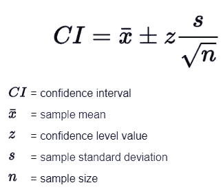
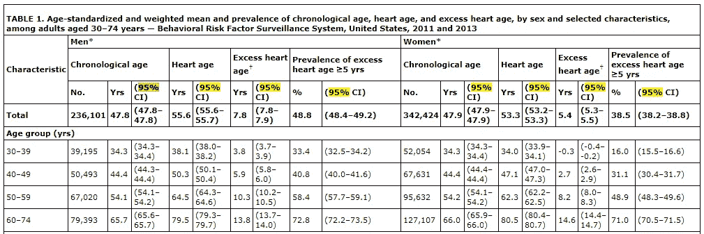
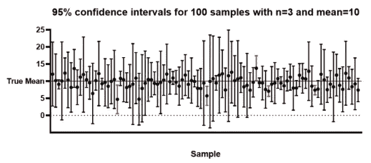
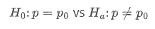
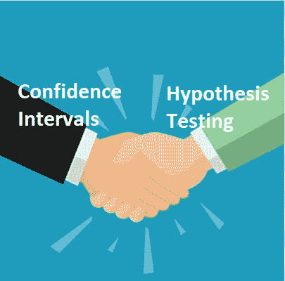

# 假设检验和置信区间的关系

> 原文：<https://towardsdatascience.com/the-relationship-between-hypothesis-testing-and-confidence-intervals-43196f1b44bf?source=collection_archive---------2----------------------->

## 看看这两个基本概念在广阔的统计世界中的交汇点

内森·杜姆劳在 [Unsplash](https://unsplash.com?utm_source=medium&utm_medium=referral) 上的照片

在我上统计学导论课的时候，我发现置信区间和假设检验之间的关系似乎总是有点模糊。这些概念通常是在单独的块中教授的——这是理所当然的。这是两个基本概念，肯定需要大量的时间，但往往不会重新审视，以帮助确定这两个概念实际上如何协同工作的重要性。

很多时候，当学习某些统计技术之间的关系时，起初可能很难看到它们之间的联系，但是在“啊哈！”伙计，这真是太值得了。当我了解到置信区间和假设检验之间的**密切关系**时，我尤其如此。现在，我希望通过写作来表达我的理解。

我的目的是给出我的观点，以便更好地理解置信区间和假设检验之间的关系，并了解它们如何一起帮助弥合这两个概念之间的差距。

# 快速浏览

## **什么是置信区间(CI)？**

给定一定程度的概率(置信度)，可能捕获未知参数的可能值范围。

使用这个公式，我们可以计算一个置信区间！

谷歌的置信区间公式

**置信水平% = 1α**

Alpha (α)被称为**显著性水平或可接受误差**；α = 0.05 通常是一个良好的可接受风险水平，但会因情况而异。

因此，通常情况下，您会看到类似于“95% CI”的内容和一系列值，如下例表所示。

*上表来自第一项确定 30-74 岁美国成年人实际心脏年龄的研究。这项研究可以在这里找到***。**

**40-49 岁的成年人很可能会有一个超出心脏年龄大约 6 岁的情况，并且有 95%的把握！**

**

*实际上，我们是说，如果我们进行多次采样，并计算某个参数(如平均值或回归系数)的置信区间，那么我们可以期望 100 个区间中有 95 个区间能够捕捉到真实的总体参数。*

## ***假设检验？***

*假设检验允许我们**使用人口样本数据得出关于某个假设有多可信的结论**。在现实中，我们看到的两个变量之间的关系或影响不仅仅是由于纯粹的运气或机会！*

**

*一个典型假设检验(双尾)的例子，其中“p”是一些参数*

***首先**，我们陈述我们的两种假设:*

***零假设(H0)** :“现状”或“已知/接受的事实”。说明两个变量之间没有统计学意义，这通常是我们想要反驳的。*

**举例:H0 = 0；锻炼前后心率有* ***无*** *差异。**

***&***

***替代假设(H1/哈)**:零的对立，也是我们正在检验的统计显著性。*

**例子:H1≠0；**有***有*有* 有*锻炼前后心率的差别。**

***其次**，根据问题，我们相应地选择一个测试，并从结果中观察一个**测试统计**。*

*假设我们的数据遵循标准正态分布，我们使用 z 检验统计，获得 p 值，并由此得出结论。*

*使用该测试统计或 p 值，我们可以将其与 0.05 的 **α进行比较。***

*如果更小，我们拒绝我们的零假设，并得出我们的替代假设。如果更大，我们无法拒绝我们的零假设，并得出零假设的结论。*

*但是打住，我们也可以因为 CI 和假设检验的关系，不仅用 p 值还可以用置信区间得出结论！*

# *好吧，那这有什么联系呢？*

*置信区间和假设检验有一个共同的特点，即它们都是**推断技术**，使用样本来估计总体参数或检验假设的强度和有效性。*

*这张图片是一个金块，我认为它对更好地概念化这种关系非常有帮助。(视频链接可以在下面找到！)*

**

*在这里找到*

*我们在这里看到，参考点是不同的。假设检验以**零假设参数**为中心，置信区间以样本参数的**估计为中心。***

## ***如何能一前一后地使用这两个概念？***

*如果在我们的置信区间中发现零假设值，那么这将意味着我们有一个坏的置信区间，我们的 p 值将会很高。通常我们的零假设值将是 0(无差异点)，如果我们在置信区间中发现 0，那么这将意味着我们有很大的机会实际发现**无差异，**，这通常与我们想要的相反。*

*换句话说，如果零假设值落在置信区间内，那么 p 值总是大于 5%。相反，如果零假设值落在我们的置信区间之外，那么 p 值将小于 5%。*

**

*图片由 Rumil Legaspi 提供*

> ***说到底这两个概念在我们的结论中应该总是一致的！***

# *一些外卖*

*   *就我们所知，如果我们在假设检验中使用 5%的 **α** ，反过来，我们也将使用 95%的置信区间**，因为α水平和置信区间**总是相互对应的。*****
*   *置信区间和假设检验都是从人口中抽取的数据样本来推断某种人口参数的方法。*
*   *置信区间给了我们**一个可能值的范围和参数值的精度估计值**。*
*   *假设检验告诉我们对从样本中得出总体参数的结论有多大的信心。*
*   *当 **0 包含在我们的置信区间**中时，这意味着我们很可能看到**我们的样本和总体参数之间没有差异**。此外，假设检验的 p 值可能比我们的 alpha 值高，我们很可能无法拒绝我们的零假设！*
*   *置信区间和假设区间都可以用于**串联，以帮助支持我们的结论**！*

## *参考资料:*

*   *[生命体征:预测心脏年龄和美国各州成年人心脏年龄的种族差异](https://www.cdc.gov/mmwr/preview/mmwrhtml/mm6434a6.htm?s_cid=mm6434a6_w)*
*   *[假设检验与置信区间|统计学教程# 15 | MarinStatsLectures 讲座](https://www.youtube.com/watch?v=J-yMiTaai4c&ab_channel=MarinStatsLectures-RProgramming%26Statistics)*