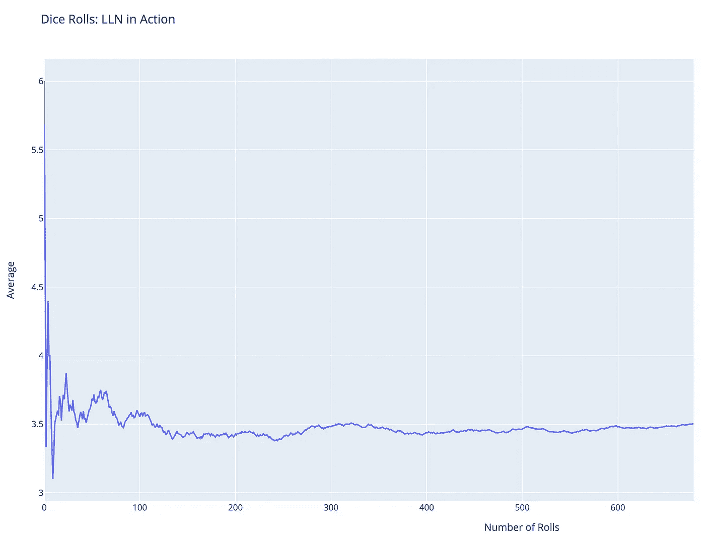
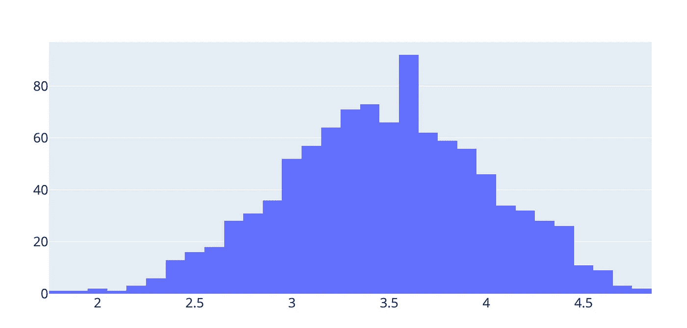
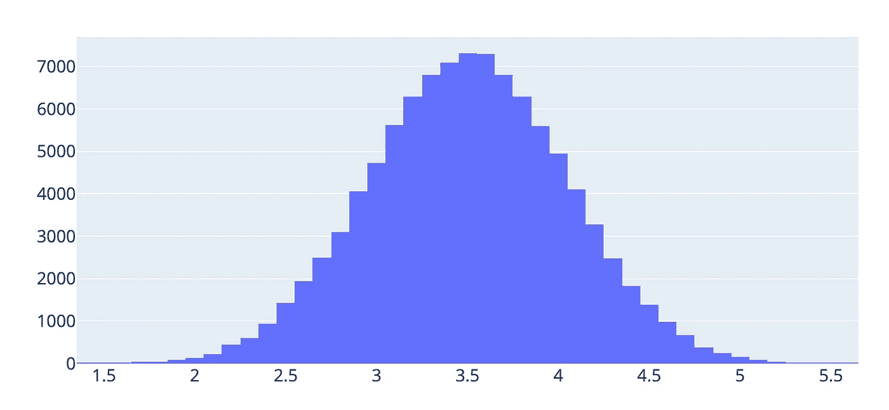

# 大数定律与中心极限定理的关系

> 原文：<https://towardsdatascience.com/the-relationship-between-the-law-of-large-numbers-central-limit-theorem-849907b189ad?source=collection_archive---------11----------------------->

## 每个数据科学家都应该知道的两条重要数学定律

俄罗斯圣彼得堡。图片来源: [Unsplash](https://unsplash.com/photos/t7mXVu-FpuU) (照片由 Elina Sitnikova 拍摄——感谢这张可爱的照片！❤)

在本文中，我将讨论每个数据科学专业人员都应该掌握的两条重要的数学定律。我喜欢用简单的方式解释抽象的概念，所以即使你没有特别强的数学背景，这篇帖子也会是一种脚踏实地的方法。

先从**大数定律** (LLN)开始，然后再来看**中心极限定理** (CLT)。一旦你完全掌握了 LLN 背后的直觉，CLT 就更容易理解了。

# 大数定律——简单解释

先说两个简单的例子。这是理解抽象概念的最好方法。

## 例子 1:扔硬币的🪙

想象一种情况，你掷两次公平的硬币。你认为会发生什么？你可能会期望得到 1 头 1 尾。然而，事情可能会有所不同，你可能会得到 2 头或 2 尾。后两种结果不太可能发生，但如果发生了，你可能不会太惊讶。你为什么要这么做？就两个硬币而已:)

现在，如果你扔同样的硬币 20 次，你会看到大约 10 个反面和 10 个正面。这都是假设硬币是公平的。同样，实际结果可能会有所不同，所以你可能会得到，例如，8 条尾巴和 12 个头。或者，你可能以 1 条尾巴和 19 个头结束，尽管这是一个极不可能的场景。如果发生这种情况，你应该怀疑硬币的公平性。

现在让我们想象把同一个硬币扔 1000 次。你希望得到多少条尾巴？大概 500 左右。也许是 450，也许是 510，但可能非常接近 500。你可能会得到 10 个正面和 990 个反面，但这是不太可能的。如果发生这种情况，你会很惊讶的。

因此，我们越是抛出相同的公平硬币，正面对反面的实际比例就越有可能接近预期比例。这是非常直观的。再说一次，这都是基于硬币是公平的假设。否则，如果你有一个偏向的硬币，有 90%的机会得到一条尾巴，当你扔硬币时，你会期望得到一条尾巴。

那么，这一切对我们意味着什么呢？

> 当我们不断增加实验次数时，现实会更接近预期。

让我们考虑另一个例子。

## 例子 2:掷骰子🎲

现在让我们抓住一个公平的骰子而不是硬币，并滚动它。

如果我们掷骰子很多次，这些掷骰子的期望平均值将是 3.5，即(1 + 2 + … + 6) / 6。我们掷骰子越多，这个预期就越稳定，平均值不会偏离 3.5 太多。在最开始，平均结果会很不稳定(见下图)，但后来会稳定在大约 *3.5* 左右。

LLN 在行动:我们掷骰子越多，平均结果越接近 3.5。图片作者:迪娜·扬科维奇(我)

现在我们明白了当我们越来越多地重复一个实验时会发生什么。现实开始符合预期。换句话说，**实际平均值**非常类似于**预期平均值**。

用一种更数学的方式来形式化这个概念，让 *X₁，X₂，…* 是一个有限或无限的随机变量序列，每个变量都有相同的期望*𝜇*:*e(x₁)=e(x₂)=…=𝜇*。在掷硬币的例子中，*这个条件确保掷硬币是公平的，具有相同的期望值。*

根据 LLN，样本平均值****x̄****=(x₁+x₂+……)/n*收敛于 *𝜇* 随着 *n* 收敛于无穷大(即随着试验次数的不断增加)。*

*现在你对大数定律对我们意味着什么有了直觉。它有许多现实生活中的应用——例如，一个赌场可能会从一个幸运的玩家那里输钱，但从长远来看，它会从许多不幸输钱的其他玩家那里赚钱。最终，在这个赌场工作的统计学家实际上完全了解 long 他们有意优化游戏规则，以便从长远来看，赢和输将围绕一个可预测的比率聚集。这样赌场的收益最大化。*

# *拓展到中心极限定理巷*

*好了，我们澄清了 LLN 是什么。这个概念现在可以进一步推广到另一个叫做**中心极限定理** ( *CLT* )的定律。*

*还记得胜负平均的 **X̄** 吗？ **X̄** 本质上是什么？这是一个数字。但是这个数字会根据样本大小和一点随机性而变化。因此， **X̄** 可以被视为一个随机变量。就像任何随机变量一样， **X̄** 在这个世界上有着特殊的地位——它有分布、均值和方差。*

*但是它有一个非常特殊的分布。 **X̄** 为**正态分布**，均值为𝜇，标准差为 *𝜎* 。如果我们从 ***X̄*** 中减去𝜇，再把这个除以西格玛，那么*z =(****x̄****—𝜇)/𝜎*有一个**标准正态分布**，均值为 0，标准差为 1。*

*如果我们将 CLT 应用到掷硬币的例子中，我们知道反面或正面的平均数将服从正态分布。为了向您展示这在实际中是什么样子，请查看下面的模拟。我用一个小的和一个大的 *n* 模拟了一次抛硬币，在增加 *n* 的时候得到了一个**近乎完美的钟形曲线**。*

****

*形状完美的正态分布，中心在 3.5。所有情节都是我自己的。*

*作为练习，我建议您编写代码来生成我分享的 LLN & CLT 图。请随意使用小样本和大样本，看看会发生什么。*

*有趣的事实:根据 [3-𝜎法则](https://en.wikipedia.org/wiki/68%E2%80%9395%E2%80%9399.7_rule)，我们可以预期 **X̄** 在 95%的时间里都在预期平均值 *𝜇* 的 2 个标准差之内。*

*就是这样！现在你理解了这两个重要定律背后的数学和直觉，你可以在未来的数据分析中使用这些概念。和 LLN 在一起，你会知道，随着你不断地尝试，你的期望会变成现实。嗯，不总是，但最终😉感谢 CLT，你会知道，如果你足够努力，你总会到达美丽的正态分布之地。*

*如果您喜欢这篇文章，请关注我，以便在新文章出现时得到通知。敬请关注更多内容！❤*