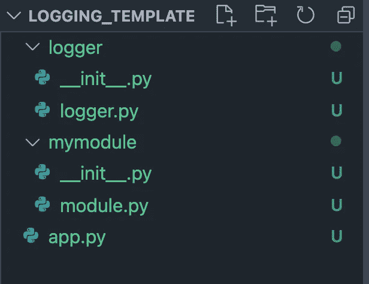
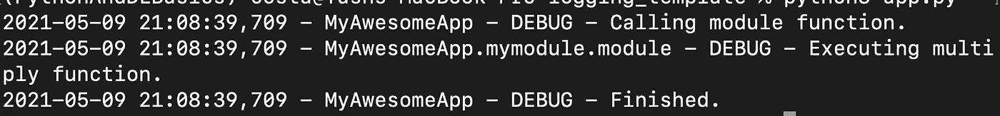
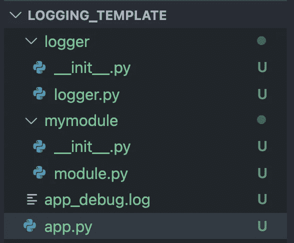

# 适用于所有数据科学应用的可重复使用的 Python 日志模板

> 原文：<https://towardsdatascience.com/the-reusable-python-logging-template-for-all-your-data-science-apps-551697c8540?source=collection_archive---------4----------------------->

## 不要使用 print()或默认的 root logger，像专业人士一样设置项目级日志记录。


汤姆·莫比在 Unsplash[上的照片](https://unsplash.com?utm_source=medium&utm_medium=referral)

调试和跟踪应用程序执行的最佳方式是通过定义明确、信息丰富且结构方便的日志。

它们是任何编程语言中的任何小型、中型或大型项目的基本组件，而不仅仅是 Python。

几年前我开始使用 Python 日志库，从那以后，我一直在网上查阅无数教程和文章，学习如何有效地使用它，并为我的项目提供最佳设置。

他们都擅长解释如何为单个 Python 脚本设置日志系统。然而，几乎不可能找到一个解释如何设置 Python 日志库以便在应用程序范围内使用，以及如何在所有项目模块中恰当地集成和共享日志信息的工具。

在这篇文章中，我将分享我的个人日志模板，你可以很容易地用于任何项目的多个模块。

> 我假设你已经了解了日志的基本知识。就像我说的，有很多好文章可以借鉴。

好吧，我们言归正传！👇

# 制作一个简单的 Python 项目

解释一个新概念时，首先应该用简单的术语，不要把注意力转移到背景信息上。记住这一点，现在让我们继续初始化一个简单的项目，好吗？

创建一个名为“ **MyAwesomeProject** 的文件夹。在其中，创建一个名为`app.py`的新 Python 文件。这将是我们应用的起点。我将使用这个项目来构建一个简单的工作示例的模板，我正在谈论。

继续在 **VSCode** (或者任何你喜欢的编辑器)中打开你的项目。

现在，让我们为应用程序级日志设置创建一个新模块。我们称它为**记录器**。

我们已经完成了这一部分。

# 创建应用程序级记录器

这是我们模板的主要部分。我们创建一个名为 **logger.py** 的新文件。

让我们定义一个根日志记录器，并用它来初始化我们的应用程序级日志记录器。是写代码的时候了！

一些导入和我们的应用程序名称:

```
*import* logging*import* sysAPP_LOGGER_NAME = 'MyAwesomeApp'
```

我们将在我们的 **app.py** 中调用的函数:

```
def setup_applevel_logger(*logger_name* = APP_LOGGER_NAME, *file_name*=None):     logger = logging.getLogger(logger_name) logger.setLevel(logging.DEBUG) formatter = logging.Formatter("%(asctime)s - %(name)s - %(levelname)s - %(message)s") sh = logging.StreamHandler(sys.stdout)
    sh.setFormatter(formatter) logger.handlers.clear()
    logger.addHandler(sh) *if* file_name: fh = logging.FileHandler(file_name) fh.setFormatter(formatter) logger.addHandler(fh) *return* logger
```

我们将使用预定义的**调试**级别来定义我们的日志记录器，并使用**格式化程序**来构造我们的日志消息。然后，我们将它分配给我们的流处理程序，以便将消息写入控制台。

接下来，我们还要确保包含一个文件，我们可以在其中额外存储我们所有的日志消息。这是通过日志**文件处理器**完成的。

最后，我们返回记录器。

需要另一个函数来确保我们的模块可以在需要时调用记录器。定义一个 **get_logger** 函数。

```
def get_logger(*module_name*): *return* logging.getLogger(APP_LOGGER_NAME).getChild(module_name)
```

此外，为了将这个模块作为一个包使用，我们可以选择创建一个名为 **logger** 的文件夹，并将这个文件放入其中。如果我们这样做，我们还需要包含一个 **___init__。文件夹中的 py** 文件并做

```
from .logger import *
```

以确保我们可以从包中导入我们的模块。

太好了！主设置完成！

# 设置我们的模块级日志记录

为了更好地理解模板，可以做一个简单的模块来测试我们的日志记录器。让我们将它定义为一个简单的 **module.py.**

```
*import* loggerlog = logger.get_logger(__name__)def multiply(*num1*, *num2*): # just multiply two numbers log.debug("Executing multiply function.") *return* num1 * num2
```

厉害！该模块现在可以访问记录器，并且应该显示带有适当模块名称的消息。

现在就来测试一下吧！

# 运行我们的脚本并测试记录器

现在，我们构造 **app.py.**

```
*import* loggerlog = logger.setup_applevel_logger(*file_name* = 'app_debug.log')*import* mymodulelog.debug('Calling module function.')mymodule.multiply(5, 2)log.debug('Finished.')
```

**注意我们如何在初始化记录器后导入模块*？是的，这是必要的。***

现在，验证您的目录包含这些文件:



项目的文件夹

最后，只需通过以下方式运行脚本:

```
python3 app.py
```

您应该得到如下输出:



您的目录结构也应该改变，以包含新的*日志*文件。继续检查它的内容！



日志文件出现！

# 最后的话

这就是如何在项目中轻松集成工作日志设置的方法。😄。

这很简单，你可以很容易地扩展它，以包括不同模块之间的许多层次结构，用日志记录器捕获和格式化异常，用 dictConfig 以更高级的方式配置它，等等。可能性是无限的！

代码库是[，位于这里](https://github.com/yashprakash13/data-another-day#python-cool-concepts-because-knowing-them-is-cool)。它也包含了我所有其他文章的资源。你可以继续⭐️和书签！

如果你喜欢这篇文章，每周我都会发布一个故事，分享一些来自数据科学和编程领域的小知识。[跟着我永远不要错过他们](https://medium.com/@ipom)！

我的另外几篇文章你可能会觉得有用:

[](https://pub.towardsai.net/7-awesome-jupyter-utilities-that-you-should-be-aware-of-f3afdb75c2b) [## 你应该知道的 7 个很棒的 Jupyter 工具

### 一些有用的技巧和窍门，我用在了几乎所有涉及 Jupyter 笔记本的数据科学项目中

pub.towardsai.net](https://pub.towardsai.net/7-awesome-jupyter-utilities-that-you-should-be-aware-of-f3afdb75c2b) [](/how-to-use-bash-to-automate-the-boring-stuff-for-data-science-d447cd23fffe) [## 如何使用 Bash 来自动化数据科学的枯燥工作

### 使用命令行为您的数据科学项目编写一些可重用代码的指南

towardsdatascience.com](/how-to-use-bash-to-automate-the-boring-stuff-for-data-science-d447cd23fffe)