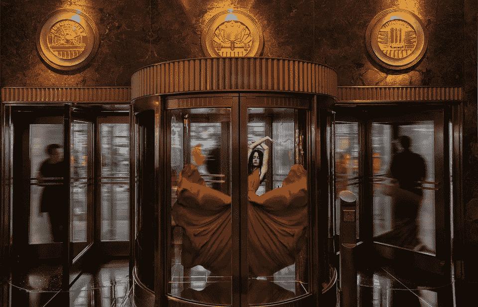

# 机器学习模型的旋转门

> 原文：<https://towardsdatascience.com/the-revolving-door-for-machine-learning-models-14bdfc870906?source=collection_archive---------34----------------------->

旋转门，ImaArtist， [Pixabay](https://pixabay.com/photos/dancer-empire-state-architecture-4645662/) 。

## 算法如何在非标准用例中重用。

众所周知，学者们会借用自然和其他领域的想法，同时以略微不同的方式将它们应用于新问题。这些天，在数据科学中，我们看到许多想法、技术和科学进步应用于三大领域(NLP、视觉、音频)。

我想论证一下，现在专攻某个领域，让你积累跨领域的工具，可以让你在领域间的转换变得轻松。一旦你掌握了统计学、概率论、信息论、数学、算法和机器学习的基础知识，你就会意识到你可以在各种用途和用例中重用几乎所有的算法。

我认为方法和技术并不直接附属于一个单一的研究领域，事实上，大量的方法可以在不同的研究领域中互换使用。

## 核心概念

1.  简化问题，以选择正确的工具。
2.  理解算法之间概念上的相似性，以及如何重用它们。
3.  借鉴其他领域的观点是数据科学家的基本特征。
4.  了解某些工具相对于其他工具的优势和劣势。

在接下来的部分，我将主要关注算法的相似性和再利用(第 2 点和第 3 点)，然而，这些点直接反映了借鉴思想和理解你的交易工具的重要性(第 1 点和第 4 点)。

## 再利用算法

似乎机器学习中的每个子领域都是其他领域的衍生物，然而，真实的“情况”要复杂得多。这个漂亮的模式可能应该有从每个子字段到其他子字段的连接边。让我们看看这些算法和想法是如何在不同领域之间传播的。

让我们从基础开始。几乎每个函数都可以用作预处理方法、特征工程、增强、模型或集成。

## 回归、分类和排名

回归算法可以用作分类或排序，反之亦然。这使我们能够变得灵活，通过降低复杂性来简化问题的解决。例如，您正在预测一个连续变量，但是，您可以简单地将其存储起来，并将解决方案转换为分类问题，而不是使用回归算法来解决它。

吴恩达已经很好地展示了逻辑回归是 SVM 的远亲。无独有偶，支持向量机可以用于[排序](https://www.cs.cornell.edu/people/tj/svm_light/svm_rank.html)、[回归](https://scikit-learn.org/stable/modules/generated/sklearn.svm.SVR.html)、[分类](https://scikit-learn.org/stable/modules/generated/sklearn.svm.SVC.html)、[聚类](https://scikit-learn.org/stable/modules/generated/sklearn.svm.OneClassSVM.html)，大概还有很多其他用法。巧合的是，内核不仅限于 SVM，我们还有 [Kernel-PCA](https://pydml.readthedocs.io/en/latest/dml.kda.html) 、 [Kernel-Kmeans](https://tslearn.readthedocs.io/en/stable/auto_examples/clustering/plot_kernel_kmeans.html) 和 [Kernel-LDA](https://pydml.readthedocs.io/en/latest/dml.kda.html) 。

排名可以用于[推荐](https://www.researchgate.net/publication/225139953_Recommender_Systems_Using_Support_Vector_Machines)，[概率](/using-snorkel-for-multi-label-annotation-cc2aa217986a)可以用于[推荐](https://medium.com/@m_n_malaeb/recall-and-precision-at-k-for-recommender-systems-618483226c54)，推荐算法可以用于排名，并不止于此。

## 概率与信息论

概率已被用于并整合到各种算法中，如朴素贝叶斯、贝叶斯信任网络、马尔可夫模型、[隐马尔可夫模型](https://hmmlearn.readthedocs.io/en/latest/tutorial.html)、条件随机场，以及可以说是利用了[移动窗口](https://arxiv.org/abs/1301.3781)和/或[注意力机制](https://arxiv.org/abs/1706.03762)的任何算法。巧合的是，这些算法是在借鉴前人思想的基础上发展起来的。此外，使用概率时最常提到的软与硬的概念可用于标注、逻辑图层、堆叠算法、预测、弱监督、注意力等。

[信息论](/entropy-cross-entropy-kl-divergence-binary-cross-entropy-cb8f72e72e65#:~:text=Cross%20Entropy%20is%20the%20expected,for%20a%20predicted%20distribution%20Q.&text=This%20is%20the%20Cross%20Entropy,true%20Entropy%20H%20for%20P.) &熵在实际中以各种形式和形态无处不在，如[特征选择](https://scikit-learn.org/stable/modules/generated/sklearn.feature_selection.mutual_info_classif.html#sklearn.feature_selection.mutual_info_classif)，在[神经网络](https://www.tensorflow.org/api_docs/python/tf/keras/losses/CategoricalCrossentropy)等。

## 密度、分布和聚集

以下算法可以归为一个算法家族，尽管它们并不都是直接相关的。比如 [PDF](https://docs.scipy.org/doc/scipy/reference/generated/scipy.stats.norm.html) ， [KDE](https://scikit-learn.org/stable/modules/density.html) ， [K-means，](https://scikit-learn.org/stable/modules/generated/sklearn.cluster.KMeans.html) [GMM](https://scikit-learn.org/0.16/modules/generated/sklearn.mixture.GMM.html) ，自组织映射( [SOM](https://medium.com/@abhinavr8/self-organizing-maps-ff5853a118d4) ，是自聚类的神经网络结构)。我们可以在各种看似相似但解决略有不同的问题的用例中使用它们，例如，我们可以将密度函数视为平均值、聚类、分布、生成模型和扩充。

## CRF vs 注意力

具有注意力的移动窗口可以被认为是条件随机场(CRF ),前者查看先前的隐藏状态，而后者查看先前的标签。 [CRF](https://github.com/keras-team/keras-contrib/blob/master/keras_contrib/layers/crf.py) 也被应用为神经层，并在[猜想](https://academic.oup.com/bioinformatics/article/34/8/1381/4657076)中被关注使用。

## 主题建模

在 NLP 中，我们可以使用通常与主题建模(TM)相关的算法、[算法](https://radimrehurek.com/gensim/models/ldamodel.html)，例如[潜在狄利克雷分配](https://jonathan-hui.medium.com/machine-learning-latent-dirichlet-allocation-lda-1d9d148f13a4)，但是我们也可以使用[搭配](https://radimrehurek.com/gensim/models/phrases.html)、[提取](https://medium.com/sciforce/towards-automatic-text-summarization-extractive-methods-e8439cd54715)、[和](https://medium.com/sciforce/towards-automatic-summarization-part-2-abstractive-methods-c424386a65ea) [抽象概括](https://medium.com/towards-artificial-intelligence/understanding-abstractive-text-summarization-from-scratch-baaf83d446b3)、K-Means 聚类中心以及无数其他方法。

## 神经网络

例如，在神经网络中，层是可以应用于任何算法的概念。例如，[卷积层](http://yann.lecun.com/exdb/publis/pdf/lecun-99.pdf)是[为卷积神经网络(CNN)开发的](https://blog.athelas.com/a-brief-history-of-cnns-in-image-segmentation-from-r-cnn-to-mask-r-cnn-34ea83205de4)。这种类型的层是第一个将算法编码为抽象神经层的抽象层之一。这个想法后来被应用于其他各种各样的领域，比如 2D & [3D CNN 的](https://keras.io/examples/vision/3D_image_classification/)，递归神经网络层 [RNN](https://blog.keras.io/a-ten-minute-introduction-to-sequence-to-sequence-learning-in-keras.html) ， [CRF 层](https://github.com/keras-team/keras-contrib/blob/master/keras_contrib/layers/crf.py)。

RNNs 可以使用有限状态自动机[近似](https://arxiv.org/abs/1711.09576)，并且自动机可以被采样以生成对手样本。

[Dropout](https://keras.io/api/layers/regularization_layers/dropout/) 图层可以被认为是随机森林。想象一下，一个深度网络包含迷你路径和一个中途退出，作为一种创建小树或树桩的方法，这些小树或树桩是在试图实现正则化以防止过度拟合时生成的。有趣的是，[的神话](https://jack-clark.net/2016/08/15/import-ai-issue-3-synthetic-pokemon-brain-like-ai-and-the-history-of-dropout/)是辍学的想法来自对银行的一次访问，而不是从随机森林中借来的。

## Word2Vec

每个人都喜欢的一个抽象概念是“[嵌入](https://arxiv.org/abs/1301.3781)”概念，它已经被应用于字符、单词、标记、句子、段落和文档之间的距离。这是一个很久以前就开始的想法，想想 Dummies、CountVec 或 TFIDF。然而，在 Word2Vec (W2V)发表后，立即出现了使用这种想法的算法的爆炸。基本上，如果你可以从你的数据中创建一个“句子”，你可以在那个句子上使用 W2V，并创建一个嵌入空间。

这个想法已经[蓬勃发展](https://github.com/MaxwellRebo/awesome-2vec)，W2V 现在到处都在使用，从实体到歌曲列表。W2V 是真正的先锋，有很多关于它的文章。然而，本文的重点是它如何与嵌入方法本身有如此多的联系。就分辨率而言，正如我提到的，你可以将任何东西推入嵌入算法，从字符、单词、句子、段落和文档等等。您可以对文本(NLP)、分类变量( [CAT2VEC](https://openreview.net/pdf?id=HyNxRZ9xg) )、图形( [GNN](https://www.singlelunch.com/2020/12/28/why-im-lukewarm-on-graph-neural-networks/) )进行建模，您也可以对像素进行建模。事实上，有一个[很棒的 repo](https://github.com/MaxwellRebo/awesome-2vec) 策划了许多*2vec 算法。

## 图形神经网络

[图形神经网络](/graph-embeddings-the-summary-cc6075aba007) (GNN)允许你将图形嵌入到嵌入空间中。GNN 是建立在 W2V 之上的，这是一个快速发展的领域，有许多算法和改进。然而，图可以被认为是邻接表，表可以被转换成关系图，图可以被转换成压缩嵌入空间。因此，我们可以使用经典和现代领域中都存在的算法，例如，一些最常见的例子是社区检测、页面排名、深度行走、node2vec。

## 信号处理

取自经典信号处理的[小波](https://pywavelets.readthedocs.io/en/latest/#)的思想可以用作神经网络层，即[小波](https://tslearn.readthedocs.io/en/stable/user_guide/shapelets.html)。

## 异常检测

[异常检测](https://pyod.readthedocs.io/en/latest/)可以使用传统的基于信号的异常检测算法、PCA、自动编码器、聚类、SVM 等等。

## 合奏

你可以用任何东西来创建集合，不仅仅是经典的模型，也可以是特征选择、工程、增强、公式、距离、深层功能，基本上是你能得到的任何功能。

## 变形金刚&注意

回到变形金刚&注意力作为一个概念，它现在正跨越到非 NLP 领域，如[计算机视觉](https://ai.googleblog.com/2020/12/transformers-for-image-recognition-at.html)，我们看到这种趋势正在向其他研究领域[发展](https://arxiv.org/abs/2006.03265)。

## 现实世界的例子:

以下是一些常见的问题，为了在解决问题时利用完全不同的工具，这些问题可以用不同的方式重新表述。

1.  以大脑 fMRI 图像为例，它们可以用作 4D 数据，即作为时间序列的 3D 数据(脑盒)、2D 数据(脑切片)，或者甚至作为 1D 信号的基于体素的数据。
2.  音频也可以转换成单个信号、声谱图或时间序列；与其他类型的方法一起使用，如二维[CNN](https://medium.com/@mikesmales/sound-classification-using-deep-learning-8bc2aa1990b7)、RNNs 等。
3.  自然语言处理模型，如 GPT,[可以用在图像上](https://openai.com/blog/image-gpt/)并且具有惊人的竞争力。
4.  你可以(试着)根据股票的(开盘价/收盘价)数据来预测股票，也可以根据 2D 用户界面来预测，也就是你在交易者屏幕上看到的东西。你可以使用[情绪](https://medium.com/better-programming/predicting-the-rise-of-gamestop-gme-in-20-lines-of-code-or-less-44810c19027a)分析基于文本预测股票。
5.  对于信号处理，您可以利用[傅立叶变换](https://en.wikipedia.org/wiki/Fourier_transform)将信号分解为子频率，这些子频率可以在以后用作特征工程技术。例如，考虑陀螺仪或加速度计信号，您可以使用它们来检测行走、跑步和骑行信号频率，或者作为分类任务的特征。

在这篇文章中，我想传达的是，我们有创造力的自由，并且有无限的方法以新的和创新的方式混合数据和算法。我分享了我对算法和机器学习世界的看法和想法，希望我已经成功说服你，我们不需要将我们的工作分成数据类型、算法家族和语言、视觉或音频等领域。

感谢[塔尔·佩里](https://medium.com/@TalPerry)、[纳塔内尔·达维多维茨](https://medium.com/@ndor123)、[菲利普·坦诺](https://medium.com/@ptannor)、[奥菲尔·比比](https://medium.com/@ofir.bibi)、[迪安·普莱班](https://medium.com/@dean_pleban)、[柳文欢·拉松](https://medium.com/@orenrazon)的宝贵意见。

Ori Cohen 博士拥有计算机科学博士学位，主要研究机器学习和脑机接口(BCI)。他在一家智能城市初创公司领导了一个数据科学团队，主要利用机器和深度学习进行自然语言处理(NLP)和理解(NLU)研究。目前，他是 TLV 新遗迹公司在 AIOps 领域的首席数据科学家。他定期在 Medium.com 上写关于管理、流程和所有数据科学的文章。

联系人: [LinkedIn](https://www.linkedin.com/in/cohenori/) | [中](https://medium.com/@cohenori)|【OriCohen.com】T4|[book.mlcompendium.com](https://book.mlcompendium.com)