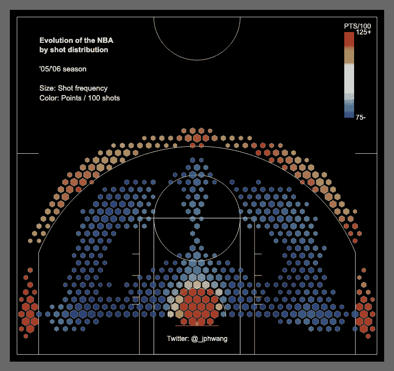
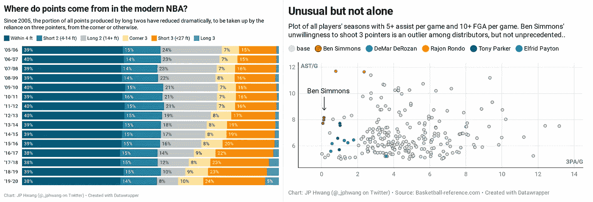
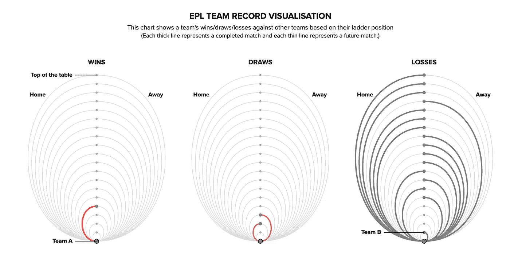
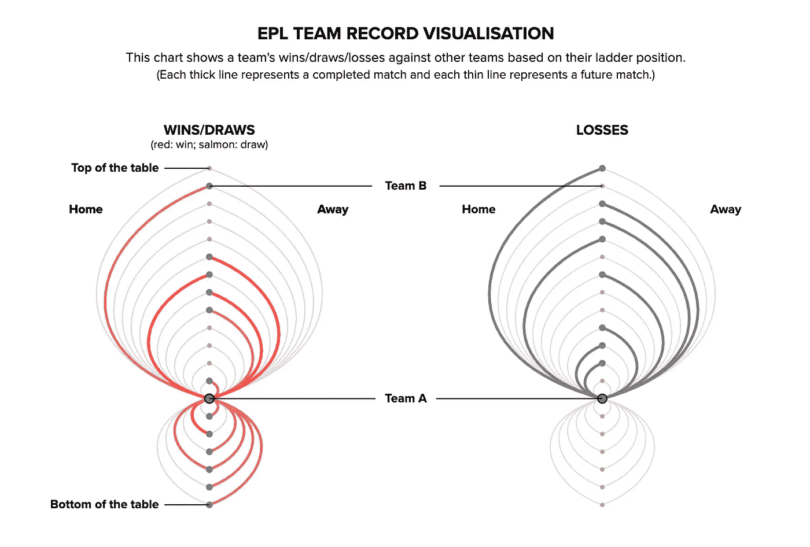

# 适合工作的数据可视化工具

> 原文：<https://towardsdatascience.com/the-right-data-visualisation-tool-for-the-job-8890c6bc8aff?source=collection_archive---------38----------------------->

## 对几种适用于所有技能水平的领先数据可视化工具的思考

在视觉化、代码行或文字之间，我专业创作的几乎所有东西都是无形的。然而，情况并非总是如此。我曾经是一名机械工程师，从事桥梁、高层建筑甚至(短暂地)赛车等工作。

虽然我现在只是一名正在恢复的工程师，但培训永远不会真正离开你。我对第一年工程课最生动的记忆之一是看到一个像这样的工具板。

一个工具板(由[塞萨尔·卡里诺·阿拉贡](https://unsplash.com/@carlevarino?utm_source=unsplash&utm_medium=referral&utm_content=creditCopyText)在 [Unsplash](https://unsplash.com/s/photos/tools?utm_source=unsplash&utm_medium=referral&utm_content=creditCopyText) 上拍摄)

我们被告知，存在大量可用的工具，几乎总是有适合工作的正确工具(和错误的工具)，使用错误的工具会使工作变得非常非常困难。

显而易见，但当你看到多面挂满工具的墙壁以及一些落地式工具时，这一信息确实切中要害。

数据可视化也是如此。随着该领域在过去十年左右呈指数增长，数据可视化工具也相应激增。看看这个库列表([源代码文章](https://medium.com/nightingale/navigating-the-wide-world-of-web-based-data-visualization-libraries-798ea9f536e7))，按照 API 设计和抽象级别排序。

来自 [*在数据可视化库的广阔世界中导航*](https://medium.com/nightingale/navigating-the-wide-world-of-web-based-data-visualization-libraries-798ea9f536e7) (作者 Krist Wongsuphasawat)

在我们开始包括用于 python istas(Matplotlib/Plotly/Bokeh)、R 用户(ggplot2)、非程序员桌面用户(Tableau/PowerBI)等的包之前，这只是用于基于 web 的可视化的包。

在这堆工具中找到合适的是一项艰巨的任务。当这些工具大多使用不到几年，而且关于它们的信息很少时，情况就更是如此了！

如果你读过我的作品，你可能知道 Plotly 是我常用的数据可视化软件包，它让我可以制作各种自定义图表和创建 web 应用程序。

我用 Plotly 制作了这个镜头图表动画(图片:作者)

以及[这个带有 Plotly Dash 的演示应用](https://dash-gallery.plotly.host/dash-cytoscape-lda/)(图片:作者)

但是我已经在我的工具箱里添加了一些其他的工具，它们确实对我的某些工作有所帮助。所以我想我应该在这里谈一谈我个人最喜欢的工具。

# 数据包装器

**对**有利:立即制作出漂亮的、可投入生产的图表

**对**不利:与他们的模板有任何不同

如果你想在尽可能短的时间内从数据到图表，DataWrapper 在我看来是最好的工具。我把音量调大了一些，这里有一些是我之前创作的。

这是我之前创作的一些(图片:作者)

这些图表更多的是在大约 10-20 分钟内完成的。DataWrapper 的图表一开始也是交互式的——无需进一步设置任何交互性(参见[第一个图表](https://www.datawrapper.de/_/WJWhh/)和[第二个图表](https://www.datawrapper.de/_/pbkHm/))。

DataWrapper 的风格语言是如此独特和不可错过，以至于你甚至可以从新闻媒体的许多图表中认出这种风格。

这可能也是它最大的局限性。

DataWrapper 基本上是可视化的 *mad libs* 等价物，允许用户填充空白，而*只允许*填充空白。虽然您可能会稍微偏离脚本，但是您会受到框架的结构和前提的约束。

因此，让我们换个角度来看看天平的另一端——D3。

# D3.js

**有益于**:基本上生产你想要的任何东西，数据驱动你的视觉化

**对**不好:我们这些赶时间的人

这是我上周为一个客户创作的草稿。它根据 A 队在积分榜上的位置(阶梯)、对手的位置以及比赛是在主场还是在客场进行来可视化 A 队的赢/输记录。

(可惜 A 队不太好。)

我的 DataViz 的草稿显示了 EPL 队的输赢记录(图片:作者)

我用 D3 做了这个，数据来自 FBref.com T21。在过去的几个月里，我一直试图断断续续地自学 D3，因为它允许你做这样的事情——创建只受你的想象力和数据限制的定制可视化。

与纯粹的图形设计包不同，D3 将数据绑定到可视化，因此改变数据会相应地移动组成组件，就像这样:

或多或少相同的代码，但具有不同的底层数据(图片:作者)

与第一张图表相比，我只做了一些改变，我把赢和输合并成一组。主要的视觉差异来自于数据的变化——这是由于车队在积分榜上的排名稍微靠前一些。

那太好了；除了——我有没有提到在过去的几个月里我是如何断断续续地自学 D3 的？实际上，可能接近一年*。有点艰难。我不是前端开发人员，任何 JavaScript(D3 是基于它构建的)都让我觉得自己好像是 Bletchley Park 的实习生，看着 Enigma 机器的输出。*

*Python 对我来说很有意义，而 JavaScript 只是感觉…武断。我肯定不是最快学会这种东西的人，所以你的里程数可能会有所不同，但谷歌快速搜索关于“D3 学习曲线”的结果表明我并不孤单。*

*但是 D3 是如此强大和灵活，以至于我不能退出它，我很高兴我没有。*

## *你最喜欢的*是什么*？*

*这两个是现有工具包的极端。*

*一个是最大化便利性和可用性，另一个是可定制性和抽象性。我很高兴我花时间找到了 DataWrapper(它似乎并不像*和*那样广为人知)，并且我花时间学习 D3，尽管我感觉有点像一个带着超级计算机的蹒跚学步的孩子。*

*我希望那是有趣的。我很想知道——你个人最喜欢的 DataViz 工具是什么？让我知道！*

*在你离开之前:如果你喜欢这个——[在 Twitter 上打招呼/关注](https://twitter.com/_jphwang)，并查看我的[免费简讯](https://visualnoise.substack.com/)，在那里我写了所有关于数据/数据可视化的事情。*

**原载于*[*https://visualnoise.substack.com*](https://visualnoise.substack.com/p/the-right-tool-for-the-job)*。**