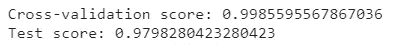
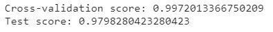
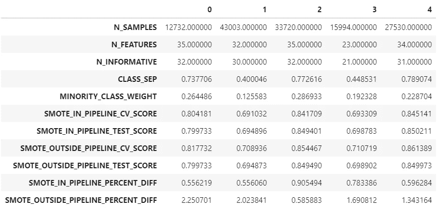
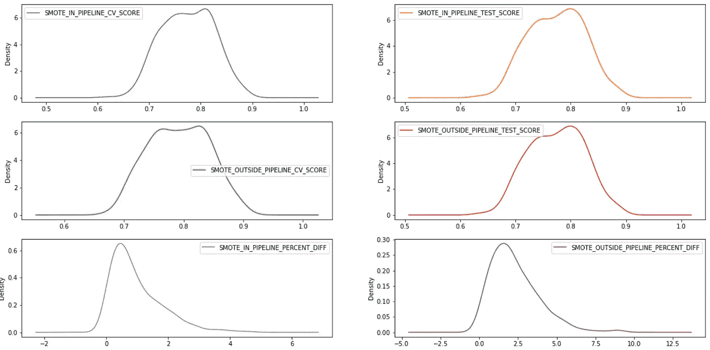
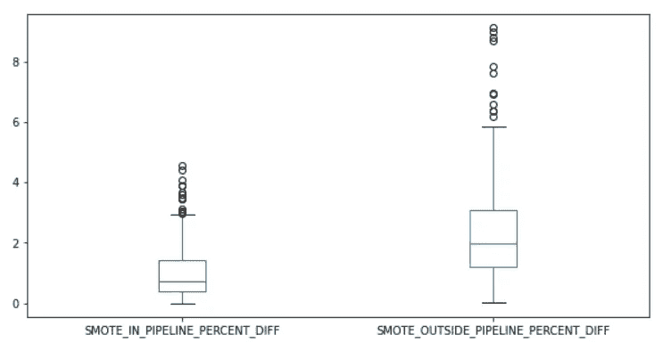
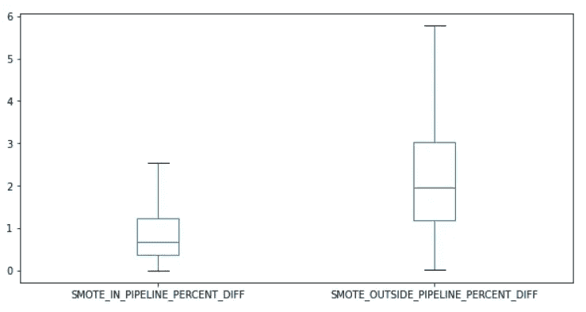
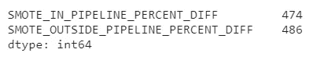
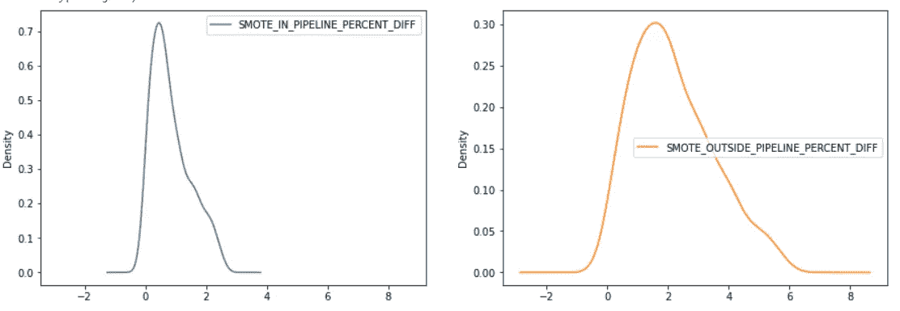
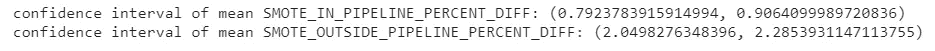

# 交叉验证 SMOTE 的正确使用方法

> 原文：<https://towardsdatascience.com/the-right-way-of-using-smote-with-cross-validation-92a8d09d00c7?source=collection_archive---------0----------------------->

## 本文讨论了在使用交叉验证时，使用 SMOTE 避免不准确的评估指标的正确方法


图片由[米切尔罗](https://unsplash.com/@mitchel3uo?utm_source=medium&utm_medium=referral)在[上挥洒](https://unsplash.com/?utm_source=medium&utm_medium=referral)

本文假设读者具备 SMOTE 的工作知识，SMOTE 是一种处理不平衡类问题的过采样技术。我们将讨论使用 SMOTE 的正确方法，以避免在使用交叉验证技术时出现不准确的评估指标。首先，我们将看看可能导致不准确的交叉验证指标的方法。我们将使用来自 Scikit 的乳腺癌数据集-了解哪些类别略有不平衡。



方法 1

在上面的代码片段中，我们将乳腺癌数据分成了训练集和测试集。然后，我们使用 SMOTE 对训练示例进行了过采样，并使用过采样的数据来训练逻辑回归模型。我们计算了交叉验证分数和测试集上的测试分数。上面的方法并不是使用 SMOTE 或‘imb learn’包中任何欠采样/过采样技术的正确方法。这种方法可能导致不准确的交叉验证分数，这可能与测试分数或看不见的数据上的分数有很大不同。让我们看看在使用交叉验证时使用 SMOTE 的正确方法。



方法 2

在上面的代码片段中，我们使用 SMOTE 作为管道的一部分。此管道不是“Scikit-Learn”管道，而是“imblearn”管道。因为 SMOTE 没有“fit_transform”方法，所以我们不能将它与“Scikit-Learn”管道一起使用。

从上述两种方法的结果来看，我们看不出这两种方法的交叉验证分数有什么大的不同。然而，与第一种方法相比，第二种方法产生的交叉验证分数非常接近测试分数。这可能只是偶然发生的，也可能是因为数据集不是高度不平衡的。

现在，我们将运行一个实验，使用“Scikit-Learn”包的“make_classification”方法生成 500 个具有类别不平衡的合成数据集。本实验旨在评估上述观察结果是否纯属偶然。由于我们使用的是逻辑回归，我们将确保生成的数据集中没有多重共线性。

在上面的代码片段中，我们定义了一个名为“model”的函数，它将输入要素(X)、类(y)和一个布尔值“smote”(指示 SMOTE 是否应该是管道的一部分)作为参数。我们首先将数据分为训练集和测试集，然后基于“smote”参数，我们将 smote 包括在管道中(如果“SMOTE”为真，SMOTE 将是管道的一部分)，并计算交叉验证和测试分数。

在上述代码片段中，我们一次生成一个合成数据集，将其传递给“模型”函数，计算管道中包含和不包含 SMOTE 的交叉验证和测试分数，并将结果存储在数据帧中。下面，我们可以看到转置输出数据帧的快照。



转置输出数据帧

```
N_SAMPLES:
Number of examples in the dataset.N_FEATURES:
Number of input features.N_INFORMATIVE:
Number of features carrying information.CLASS_SEP:
Magnitude of class separation. The higher the magnitude, the simpler would be the classification problem.MINORITY_CLASS_WEIGHT:
% of minority class samples. 0.26 means the minority class (1) forms 26% of the dataset.SMOTE_IN_PIPELINE_CV_SCORE:
CV score when SMOTE is included in the pipeline. This is the right way of using SMOTE.SMOTE_IN_PIPELINE_TEST_SCORE:
Test score or score on unseen data when SMOTE is included in the pipeline. This is the right way of using SMOTE.SMOTE_OUTSIDE_PIPELINE_CV_SCORE:
CV score when SMOTE is not included in the pipeline. This is the wrong way of using SMOTE.SMOTE_OUTSIDE_PIPELINE_TEST_SCORE:
Test score or score on unseen data when SMOTE is not included in the pipeline. This is the wrong way of using SMOTE.SMOTE_IN_PIPELINE_PERCENT_DIFF:
The difference between the cross-validation and test score when SMOTE is included in the pipeline. This is the right way of using SMOTE.SMOTE_OUTSIDE_PIPELINE_PERCENT_DIFF:
The difference between the cross-validation and test score when SMOTE is not included in the pipeline. This is the wrong way of using SMOTE.
```

从数据帧的上述几个记录可以看出，在大多数情况下，与“SMOTE _ OUTSIDE _ PIPELINE _ PERCENT _ DIFF”相比，“SMOTE_IN_PIPELINE_PERCENT_DIFF”非常低。我们将借助统计学来确保这些观察不是偶然的。



作者图片

上面的密度图显示百分比差异是偏斜的。这可能是由于数据集具有高度不平衡的类，并且模型(逻辑回归)无法正确拟合数据。现在让我们在百分比差异列中寻找异常值。



百分比差异列中的异常值

我们可以看到，当 SMOTE 被包括在流水线中时(‘SMOTE _ IN _ PIPELINE _ PERCENT _ DIFF’)，与 SMOTE 在流水线之外时(‘SMOTE _ OUTSIDE _ PIPELINE _ PERCENT _ DIFF’)相比，交叉验证和测试分数的百分比差异较低。现在，我们将删除离群值。



剔除异常值后的百分比差异



移除异常值后以百分比差异形式保留的记录

在四次拟合和变换“离群点去除器”之后，离群点被完全去除。我们可以看到，在剔除异常值的过程中，只有一小部分数据会丢失。



去除异常值后百分比差异的密度图

从上面的密度图中，我们可以看到百分比差异柱看起来相当高斯。我们将计算平均百分比差异的置信区间(置信水平为 95%)，并确保观察结果不是偶然的。



作者图片

## 调查的结果

进行该实验是为了确保来自乳腺癌数据集的结果不是偶然的。我们可以看到，当 SMOTE 在管道之外时，交叉验证和测试分数之间的百分比差异很大。这表明在管道中包括 SMOTE 会导致更准确的交叉验证分数。这个实验表明来自乳腺癌数据集的观察只是偶然的。

## 限制

所进行的实验有一些局限性。由于上述实验是在受控环境中进行的，因此其结果可能无法用于估计总体参数。只有在以下情况下，置信区间中的值才是准确的

1.  所选数据集具有用于进行实验的范围内的要素(即样本数量必须介于 10，000 和 50，000 之间，依此类推)。例如，你不能仅仅通过调查“20-30 岁”年龄段的“女性”来估计整个人口的参数。
2.  使用的模型是逻辑回归。在这个实验中没有评估其他算法对结果的影响。因此，我们不能将这些观察结果推广到所有的算法。例如，SMOTE 在管道中的位置可能不会对随机森林算法产生太大影响(如逻辑回归算法)。实验必须用多种算法进行，以排除一种算法对结果的影响。

## **对未来研究的建议**

1.  通过从当前的 500 个样本中增加样本量并使用更多样化的数据集，可以进行类似的实验。
2.  可以评估各种算法对结果的影响，以确保不同算法的观察结果不会不同。
3.  发现“少数 _ 类 _ 权重”和“SMOTE _ OUTSIDE _ PIPELINE _ PERCENT _ DIFF”之间的相关系数为-0.45，而“少数 _ 类 _ 权重”和“SMOTE_IN_PIPELINE_PERCENT_DIFF”之间的相关系数为-0.2。这表明，随着少数类的规模减小，当 SMOTE 在流水线之外时，交叉验证和测试分数之间的百分比差异增加。可以通过改变“MINORITY_CLASS_WEIGHT”并控制合成数据集的所有其他参数来执行类似的实验。这使我们能够在使用过采样/欠采样技术以及交叉验证技术时，直接找到少数类权重对交叉验证和测试分数之间的百分比差异的影响。