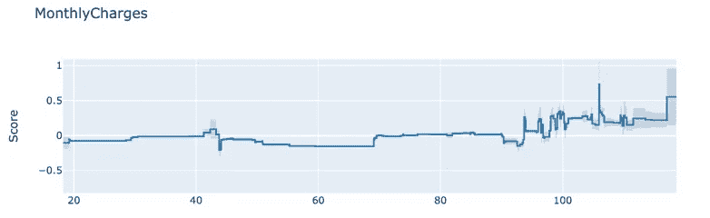
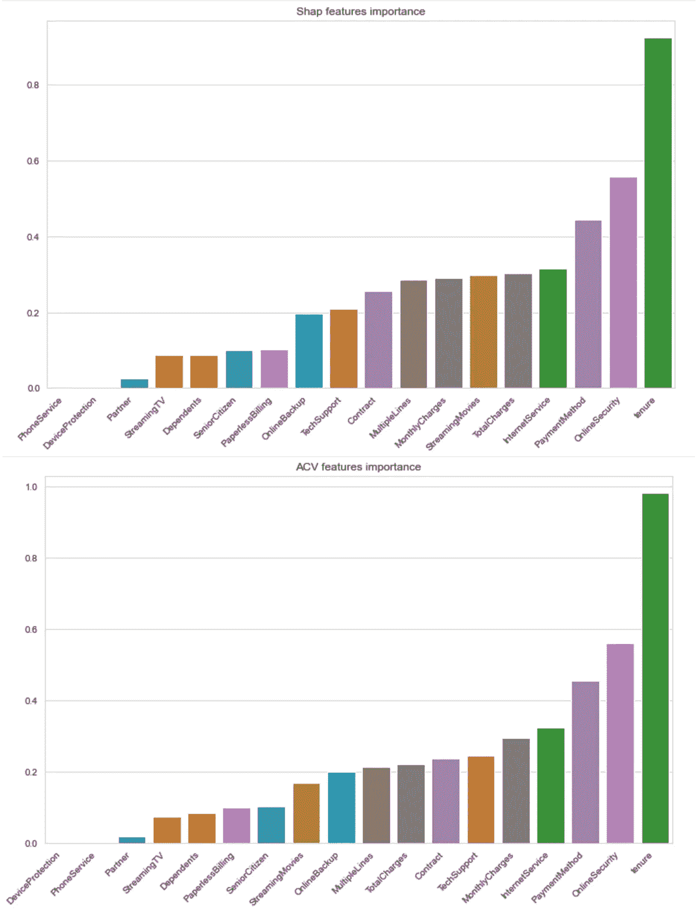
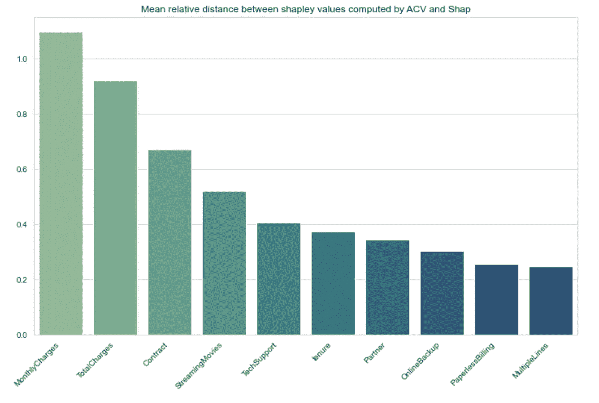
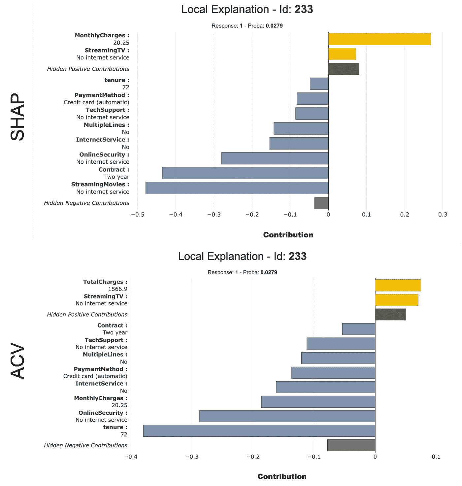
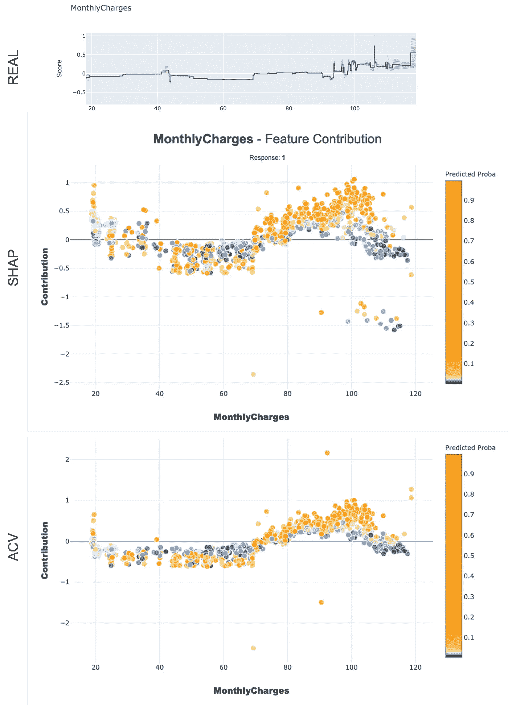
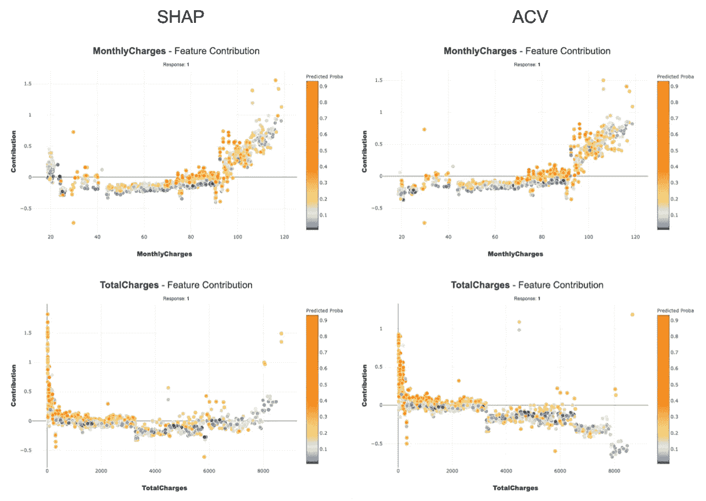
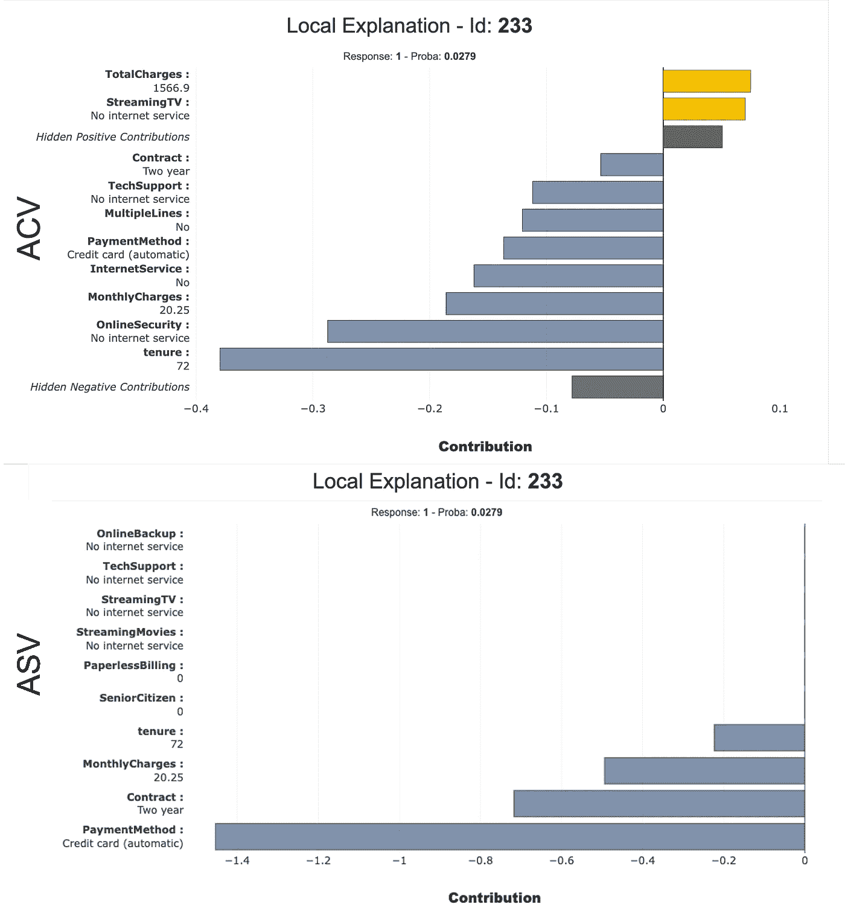

# 计算 Shapley 值的正确方法

> 原文：<https://towardsdatascience.com/the-right-way-to-compute-your-shapley-values-cfea30509254?source=collection_archive---------8----------------------->

## [提示和技巧](https://towardsdatascience.com/tagged/tips-and-tricks)

## *比较 SHAP 和 ACV 两个图书馆对传统机器学习用例提供的基于 Shapley 值的解释。*

*量子计量——MAIF*

照片由[丹伯顿](https://unsplash.com/@single_lens_reflex?utm_source=medium&utm_medium=referral)在 [Unsplash](https://unsplash.com?utm_source=medium&utm_medium=referral) 上拍摄

# 介绍

随着集成模型和深度学习的出现，人工智能进入了一个黄金时代，机器学习社区正在进入可靠人工智能的时代。在这种背景下，随着越来越多的工具被开发出来“打开黑盒”，人们对算法可解释性的兴趣越来越大[1]。在这些工具中，有一个似乎是至高无上的:SHAP。SHAP 是一种博弈论方法，使用 Shapley 值的有效计算来解释任何机器学习模型的输出[2]。简而言之，Shapley 值估计每个变量对模型预测的**贡献**。如果你曾经试图解释黑盒模型，我敢打赌你用过 SHAP…

尽管 SHAP 很受欢迎，但它也有一些局限性[3]:

*   对独热编码分类特征的不良处理导致错误的 Shapley 值:特征的贡献不是独热列的贡献的总和！
*   要素相关时 Shapley 值的有偏近似(甚至错误)。

当试图理解模型如何做出预测时，使用可靠的方法是很重要的。在这方面， [ACV 图书馆](https://github.com/salimamoukou/acv00) ( *主动变量联盟)*提供了一种计算 Shapley 值的新方法来解决这些问题，这得益于:

*   一种计算特征联盟贡献的严格方法，解决了一次性编码问题。
*   特征相关时计算 Shapley 值的稳健方法。

为了突出这两个库之间的差异，我们对[电信客户流失数据集](https://www.kaggle.com/blastchar/telco-customer-churn)进行了比较研究，该数据集已经在可解释的人工智能文献中使用[4]。

# 研究大纲

当在具有高比例的一次性编码分类要素和相关要素的数据集上训练模型时，SHAP 和 ACV 之间的差异将非常显著。由于 18 个特征中有 10 个是分类的，并且总体上具有很高的相关性，所以电信客户流失数据检查了这两个框。

现在我们已经讨论了这个问题，我们想训练一个黑盒模型并回答这个问题:“ACV 比 SHAP 对我的模型提供了更好的解释吗？”。根据定义，这是一个棘手的问题，因为不可能知道和理解黑匣子是如何工作的(这就是为什么我们首先需要 SHAP！).那么如何比较 2 种解释的质量呢？

在这项研究中，我们提出了一个简单的方法来回答这两个问题:如果我们不能看到黑盒内部，我们可以首先尝试控制我们的数据的生成关系。如果我们知道数据集 ***(X，y)*** 的“真实”生成函数***y= g(x)*** ，并且我们假设我们的黑盒模型***【yᵖʳᵉᵈ= f(x)***合理地忠实于***【g***，那么衡量对 ***f*** 的解释质量的一个好方法是

为了访问我们的数据的生成功能，我们训练了一个可解释的加法模型***g(x)= g***₁***(x***₁***)+g***₂***(x***₂**【t43)+⋯+g**ₚ***(x*对于这一步，我们使用了在 [InterpretML](https://github.com/interpretml/interpret) 库中实现的可解释增强机器(EBM)。由于它的附加性质，这个模型很容易解释，我们可以很容易地访问将预测与每个变量联系起来的函数。换句话说，由于 EBM，我们可以显示每个特征对预测的贡献***【gᵢ(xᵢ】***的图形表示。例如，变量*每月费用*的“实际”贡献如下图所示:**

月收费对循证医学预测的实际贡献。图片作者。

概括来说，下面是我们使用的协议的简要概述:

1.  在训练集***【xᵗʳ,yᵗʳ】***上训练 EBM(可解释助推机)获得 ***g*** 。
2.  用预测 ***替换***【yᵗʳ】***【yᵉᵇᵐ= g(x)+ϵ***(添加了一些噪声*以模拟真实情况)。*
3.  *在***【xᵗʳ,yᵗʳ】***(我们使用 Scikit Learn 的 GradientBoostingClassifier)上训练一个传统的黑盒梯度提升，得到 ***f*** (我们的模型在这个半合成数据集上表现异常好:ROC_AUC=0.94)。*
4.  *用 SHAP 和 ACV 解释梯度推进模型 f。*

# *沙普利价值观与 SHAP 和 ACV*

*训练模型后，我们计算了两组不同的 Shapley 值:*

1.  *使用来自 SHAP 的树解释器算法，将特征扰动设置为“树路径相关”,这被认为是处理变量之间的相关性。*
2.  *使用 ACV 的 ACV 树算法，该算法声称在处理相关特征方面比 SHAP 做得更好。*

*在详细验证这一说法之前，我们可以比较测试集(图 2)上 Shapley 值的平均值，看看 SHAP 和 ACV 是否同意变量的全局重要性:*

**

*SHAP 和 ACV 的要素重要性(每个要素的 shapley 平均值)。图片作者。*

*两个库似乎都同意哪个特性最重要。尽管如此，我们还是可以观察到一些差异，特别是*月度费用*和*总费用*的重要性，这是两个非常相关的数值变量(皮尔逊相关系数= 0.65)。为了以更精确的方式显示差异，我们可以计算每个特征的贡献分布之间的相对 L1 距离:*

**

*SHAP 和 ACV 计算的 Shapley 值之间的平均相对距离。图片作者。*

**月度费用*和*总费用*的分布差异最大，其次是*合同*、*流媒体*和*技术支持*，这是 3 个一次性编码的分类变量。*

# *SHAP 和 ACV 之间的本地解释差异*

*既然我们知道某些特征有不同的解释，让我们看看它对我们预测的实际解释意味着什么。为了测量解释之间的“差异”,我们可以计算每个观察值的 SHAP 和 ACV 贡献之间的肯德尔等级相关系数。为了研究“最不同”解释的预测，我们可以看看系数最低的解释。让我们来看看 SHAP 和 ACV 在其中一个预测上的区别:*

**

*在客户端 233 上预测 SHAP 和 ACV 的 10 个最重要的贡献。图片作者。*

*   **月度费用*对 SHAP 来说是最重要的正贡献(0.269)，但对 ACV 来说是负贡献(-0.186)。*
*   *任期对 ACV (-0.479)来说是最重要的贡献，但对 SHAP (-0.048)来说仅排在第十位。*
*   **合同*对 SHAP (-0.435)是第二重要的贡献，但对 ACV (-0.054)仅是第十重要的贡献。*

*我们可以看到，对某些人来说，ACV 给出的解释与 SHAP 给出的解释大相径庭。在模型用于可能影响个人的决策制定的情况下，这可能会产生一些现实生活中的后果。例如，如果你想改变模型的预测，知道像*月费*这样的变量是积极的还是消极的会导致相反的决定。类似地，知道像*任期*这样的变量对于模型来说是否是最重要的，可以极大地改变解释和随后的潜在决策。*

# *关注每月费用和总费用*

*对功能*每月费用*和*总费用*的解释差异特别有趣，因为它们的相关性很高。当特征相关时，ACV 声称能提供比 SHAP 更好更稳定的解释。让我们将*月度费用*的计算贡献(Shapley 值)分布与可解释的 Boosting 机器提供的数据生成图进行比较:*

**

*(上图):y 与月度费用的“实际”关系
(中图):SHAP 月度费用特征贡献分布
(下图):ACV 月度费用特征贡献分布。图片作者。*

*即使它们都大致遵循实际贡献的趋势，SHAP 和 ACV 的图表似乎在[20，40]和[100，120]中包含的*月费用*值的贡献符号上有一些错误(如果我们假设我们的模型大致符合实际贡献)。这可能会给我们一个错误的解释，我们的模型的行为可以制定如下:*

**“月电荷对我们预测的贡献通常随着其值的增加而增加，除了区间[20，40]当其贡献为正时，以及区间[100，120]当其贡献迅速减少时”**

*实际的解释应该是这样的:*

**“当月度费用值小于 70 时，其贡献为负，此时其贡献开始增加”**

*即使这两种方法都有错误，我们确实观察到 ACV 更稳定，更忠实于生成模式。在图的开始，很少有贡献是正的，而在结束时“减少”就不那么明显了。**为 ACV 点上！***

*现在让我们来看看 TotalCharges:*

**

*图 6:(上图):y 和 TotalCharges 之间的“真实”关系
(中图):SHAP 的 TotalCharges 特征贡献分布
(下图):ACV 的 TotalCharges 特征贡献分布。图片作者。*

*对于这个功能，SHAP 和 ACV 之间的区别是坚持。对于超过 6000 的*总电荷*的值，SHAP 的贡献开始急剧增加，并达到正值 2，此时生成函数保持恒定且为负。由于计算的复杂性，真的很难知道为什么 SHAP 会这样，但我们可以说它为数据集的重要部分提供了错误的解释。另一方面，ACV 贡献保持稳定，并与生成功能一致。**为 ACV 点上！***

*为了结束这种比较，让我们看看 SHAP 和 ACV 对直接在原始数据集上训练的黑盒模型的解释。换句话说，数据科学家会为标准的机器学习管道做什么。让我们看看在这种情况下总费用和每月费用的分摊情况:*

**

*每月费用和合计 SHAP(左)和 ACV(右)的费用分担。图片作者。*

*有意思！我们看到，对于这两个特征，ACV 似乎比 SHAP 更忠实于 EBM 所学习的功能(如图 5 和 6 所示)。由于黑匣子的性质，我们无法从这个结果中得出严格的结论。然而，这似乎表明，用 ACV 计算的沙普利值为该模型提供了更有力的解释。我认为这仍然值得 ACV 再得一分！*

# *主动联盟与主动 Shapley 值*

*Shapley 值通常用于查找模型的最重要特征。这种选择是在观察了解释之后做出的，保留的变量数量往往是任意的。为了解决这个问题，ACV 还引入了一种新的工具，称为*主动沙普利值*【5】，它通过计算贡献被认为可以忽略的变量的“零联盟”来为你做出选择。它通过将零贡献归因于“*无效联盟”*中的变量，并在*有效联盟*的变量之间公平地分配“支出”来提供更简洁的解释。*

*计算有效联盟和无效联盟的方法需要相同决策概率的概念，本文不涉及这一概念。如果你想了解更多关于这些花哨的方法，请访问 [ACV GitHub](https://github.com/salimamoukou/acv00) 或阅读 Amoukou 等人的 2021【5】。*

*下图显示了为客户端 233 计算的活动 Shapley 值:*

**

*客户端 23 上预测的活动 Shapley 值(ASV )(底部),将
与用 ASV 计算的“完整”Shapley 值(顶部)进行比较。图片作者。*

*最重要的变量中只有 4 个被保留，我们可以看到合同和支付方式的贡献显著增加。如果您的目标是找到最重要的变量，这是一种更容易理解的计算 Shapley 值的方法。在我们的例子中，我们直接看到付款方式、合同、月费和任期是这个预测的最重要的变量。*

# *结论*

*在本文中，我们已经表明，ACV 可以提供一种更可靠的方法来计算 Shapley 值，从而在特征相关/分类时导致更真实的解释。对于“更简单”的场景，两个库之间的差异并不总是那么重要，但是 ACV 仍然是一种更健壮的方式来提供基于 Shapley 值的解释。需要注意的是，ACV 并不是完全模型不可知的，它只适用于基于树的模型(Random Forest，XGBoost，LightGBM…)。最后，ACV 提供了其他工具，如相同的决策概率或积极沙普利值[5]来严格解释模型。访问 GitHub 页面了解如何使用它，并发现 Salim Amoukou 及其合著者的论文。*

*本文中的所有 Shapley 值图表都是使用 Shapash 获得的，Shapash 是一个非常好的用户友好的软件包，用于可视化 Shapley 值(由 MAIF 开发，Quantmetry 公司提供)。Shapash 可以使用 SHAP 或 ACV 作为计算 Shapley 值的后端。*

*MAIF 和 Quantmetry 在一个研究合作项目中对真实数据集和内部模型进行了类似的分析。类似的差异也有报道。我们都认为值得信赖的人工智能方法必须基于透明和可测试的计算技术，我们建议在使用可解释的工具作为黑盒本身时要持批评态度！这个实验可以用 ACV GithHub 上的[笔记本重现。](https://github.com/salimamoukou/acv00/blob/main/notebooks/shap_acv_comparison/ACV_vs_SHAP_TELCO_Churn.ipynb)*

# *加入*

*我在量子力学公司工作。Quantmetry 自 2011 年成立以来一直是先驱和独立的公司，是法国领先的纯人工智能咨询公司。在提供卓越的数据治理和最先进的人工智能解决方案的愿望的驱动下，Quantmetry 的 120 名员工和研究顾问将他们的热情投入到为所有行业的公司提供高业务成果的服务中。*

## *贡献者:*

*西里尔·勒梅尔、蒂博·雷亚尔、萨利姆·阿穆库、尼古拉·布鲁内尔*

# *参考*

*[1] Christoph Molnar，[制作可解释黑盒模型的指南](https://christophm.github.io/interpretable-ml-book/) (2021)*

*[2] Lundberg 等人，[解释模型预测的统一方法](https://arxiv.org/abs/1705.07874) (2017)，NIPS 17*

*[3] Amoukou 等，[变量联盟的 Shapley 值提供了更好的解释](https://arxiv.org/pdf/2103.13342.pdf) (2021)*

*[4] Nori 等人， [InterpretML:机器学习可解释性的统一框架](https://arxiv.org/pdf/1909.09223.pdf) (2019)*

*[5] Amoukou 等人，[用于解释预测和关注局部重要变量的精确和稳健的 Shapley 值](https://arxiv.org/pdf/2106.03820.pdf) (2021)*