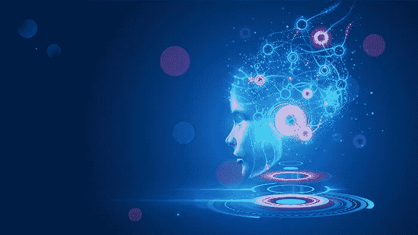

# 认知人工智能的兴起

> 原文：<https://towardsdatascience.com/the-rise-of-cognitive-ai-a29d2b724ccc?source=collection_archive---------7----------------------->

## [思想和理论](https://towardsdatascience.com/tagged/thoughts-and-theory)

## 结构化的、明确的和可理解的知识可以提供一条通向更高机器智能的道路

图片来源:丁玲·戈伊·stock.adobe.com

深度学习(DL)正在产生巨大的进步，并在生活的各个方面彻底改变整个行业，包括医疗保健、零售、制造、自动驾驶汽车、安全和欺诈防范以及数据分析。然而，为了构建人工智能(AI)的未来，有必要定义一系列目标和期望，这些目标和期望将推动新一代技术超越我们今天看到的部署。到 2025 年，我们很可能会看到人工智能所展示的能力出现绝对的飞跃，机器变得明显更聪明。

许多当前的 DL 应用处理与对象识别、自然语言处理(NLP)、翻译相关的感知任务，以及涉及数据的广泛相关性处理的其他任务，例如推荐系统。DL 系统基于差分编程和复杂的基于数据的关联提供卓越的结果，并有望在未来几年推动各行业的变革。与此同时，必须克服 DL 本身固有的一些基本限制，以便机器学习，或更广泛的人工智能，能够更接近实现其潜力。要实现非增量创新，需要在以下三个领域协同努力:

*   显著提高模型效率(例如，将参数数量减少两到三个数量级，而不损失准确性)
*   显著增强模型的健壮性、可扩展性和可伸缩性
*   分类提高机器认知

在其他发展中，[变形金刚](https://arxiv.org/abs/1810.04805)的创造和它们在语言建模中的应用使得[的计算需求在最近几年里大约每 3.5 个月翻一番](https://openai.com/blog/ai-and-compute/)，凸显了提高模型效率的紧迫性。尽管神经网络在加速和优化方面有所发展，但如果模型效率没有提高，[当前的模型增长趋势将无法长期持续](https://aiimpacts.org/interpreting-ai-compute-trends/)。

图 1 显示了基于 DL 的语言模型中参数数量的指数增长:

基于[https://www . Microsoft . com/en-us/research/blog/turing-NLG-a-170 亿-parameter-language-model-by-Microsoft/](https://www.microsoft.com/en-us/research/blog/turing-nlg-a-17-billion-parameter-language-model-by-microsoft/)

修剪、稀疏、压缩、提取和图形神经网络(GNNs)等技术在效率方面提供了有益的进步，但最终会产生增量改进。在不影响结果质量的情况下，模型规模的数量级缩减可能需要对获取和表示信息本身的方法以及 DL 模型内的学习能力进行更为根本的改变。[持续的进步将需要“显著”更高效的计算 DL 方法或转向其他机器学习方法。](https://arxiv.org/pdf/2007.05558.pdf) [一类很有前途的人工智能系统正在使用从辅助信息库中检索来取代嵌入非常大的事实和数据集合，这些系统正迅速获得牵引力。](https://www.linkedin.com/pulse/seat-knowledge-information-centric-classification-ai-gadi-singer-1c)使用集成了神经网络和按需注入的附加信息的人工智能系统可能会缓解一些语言模型的增长趋势。

与此同时，统计机器学习方法依赖于这样的假设，即训练样本的分布代表了推理过程中必须处理的内容，这在现实生活中造成了重大缺陷。特别地，当遇到在训练数据集中稀疏采样或者甚至在训练数据中不存在的情况时，DL 模型受到挑战。当应用预先训练的模型进行跨领域推理时，所谓的黑天鹅事件(不可预测且具有巨大影响的事件)的影响可能特别有害。

迁移学习和少击/零击推理的进步提供的结果仍然远不令人满意。模型的无效可扩展性阻碍了将人工智能扩展到数据集和数据科学家不丰富的许多领域。人工智能对更广泛的商业案例的适用性要求一种全新的方法，在基于 DL 的系统中集成信息和知识，以处理涵盖现实生活案例的长尾分布。DL 也非常容易受到数据变化的影响，并可能产生不可信的分类，这可以在提高健壮性和可扩展性时得到解决。

最后，在很大程度上，神经网络不能正确地提供认知、推理和解释能力。深度学习缺乏处理人类智能基础任务的认知机制，缺少抽象、上下文、因果关系、可解释性和可理解的推理等能力。

# 为认知人工智能辩护

有一股强大的推动力推动人工智能进入类似人类的理解领域。根据丹尼尔·卡内曼在他的书[思考，快与慢](https://en.wikipedia.org/wiki/Thinking,_Fast_and_Slow)中定义的范式，Yoshua Bengio 将当代 DL 的能力等同于他所描述的“系统 1”——直觉，快速，无意识，习惯性，和很大程度上的解决。相比之下，他规定[人工智能系统的下一个挑战在于实现“系统 2”的能力——缓慢、逻辑、顺序、意识和算法](https://slideslive.com/38922304/from-system-1-deep-learning-to-system-2-deep-learning)，例如规划和推理所需的能力。以类似的方式，Francois Chollet 描述了[人工智能能力发展中的一个新阶段，该阶段基于广泛的一般化](https://slideslive.com/38935790/abstraction-reasoning-in-ai-systems-modern-perspectives)(“灵活的人工智能”)，能够适应广阔领域内未知的未知事物。这两种特征都与 DARPA 的第三波人工智能[相一致，其特征是上下文适应、抽象、推理和可解释性，系统为现实世界的现象类别构建上下文解释模型。这些能力不能仅仅通过回放过去的经历来解决。实现这些能力的一个可能途径是通过将数字逻辑与符号推理和深层知识相结合。我将使用“认知人工智能”这个术语来指代人工智能的这个新阶段。](https://www.darpa.mil/attachments/AIFull.pdf)

虽然预计不会达到开放式人工通用智能(AGI)的目标，但具有更高认知能力的人工智能将在技术和商业中发挥更大的作用，既通过这一组共享的认知能力，也通过在人类和机器之间关系的基础上导航的共享价值观。一旦人工智能能够在不可预见的环境中做出可靠的决策，它最终将获得更高的自主权，并在机器人、自动驾驶交通以及物流、工业和金融系统的控制点等领域变得重要。最后，人机合作水平的提高是可以预期的，因为人工智能代表了一个积极和持久的代理，当它服务于人们并向他们学习时，它与人们进行交流和合作。

# 结构化知识在认知人工智能中的作用

在人工智能领域，有些人认为通过进一步发展人工智能可以实现更高的机器智能，有些人认为有必要加入更多的基本机制，这两种人之间存在分歧。我属于后一种阵营——让我解释一下原因。

DL 掌握从输入通过嵌入空间中的多维结构到预测输出的基本的基于统计的映射。这有助于 DL 在广泛和浅层数据的分类中表现出色(例如，图像中的一系列单词或像素/体素)。输入数据携带有限的位置信息(例如像素、体素或字符相对于其他元素的位置)和有限的结构深度。人工智能系统的任务是发现特征、结构和关系。DL 在索引非常大的来源(如维基百科)和从语料库中最匹配的地方检索答案方面同样有效——在基准测试中如 [NaturalQA](https://ai.google.com/research/NaturalQuestions) 或[efficient QA](https://efficientqa.github.io/)所示。如 Bengio 所定义的，系统 1 任务依赖于训练期间创建的统计映射函数。对于这些任务，DL 提供了。

相反，结构化的、明确的和可理解的知识可以提供一条通向更高的机器智能或系统 2 类型能力的途径。结构化的知识可以捕捉和表现与人类智能相关的全部丰富性，因此构成了更高智能的关键成分。一个基本的知识构造是捕获关于元素和概念的声明性知识以及编码抽象概念的能力，比如类之间的层次属性继承。例如，关于鸟类的知识，增加了雀形目物种的细节，加上麻雀的细节，提供了大量关于栗麻雀的隐含信息，即使没有具体说明。其他知识结构包括因果和预测模型。

这种结构依赖于明确的概念和明确的、公开定义的关系，而不是潜在空间中的机器嵌入，并且所得到的模型将具有更广泛的解释和预测潜力，远远超过统计映射函数的能力。通过捕捉因素和力量之间关系的潜在模型，可以对当前事件的因果关系进行逆向分析，或者对预测的结果进行正向分析。潜在动态的模型可以更丰富，包括上下文、内部状态和从未遇到过的模拟序列。

[人类大脑展示了“想象”的能力](https://icds.uoregon.edu/wp-content/uploads/2013/03/Harnessing-the-Imagination-Mental-Simulation-Self-regulation-and-Coping.pdf)，模拟和评估从未通过经验或观察遇到的潜在未来。这些能力为人类智能提供了进化优势。[在一个复杂的世界里，个人不得不在尚未经历过的场景中做出选择。](https://www.pnas.org/content/111/46/16550)在不受明确规则约束的环境中，对未来可能事件的心理模拟基于世界动力学的潜在模型，并在规划和解决问题方面提供了巨大的适应价值。由此产生的人类适应和做出选择的能力使用了其他哺乳动物所不具备的大脑的不同部分，其他哺乳动物的任务主要是快速和自动的现成映射功能。

对于高级认知来说，过程建模机制是必不可少的，它基于隐蔽的数学、物理或心理学原理，超越了输入到输出可观察的统计相关性。例如，物理模型可以捕捉打滑现象，并提供各种条件下汽车运动的简明预测。通过物理建模而不是(或除此之外)利用来自测量的训练数据的统计推断来解决滑水问题，可以有效地处理非分布情况和现实生活中可能发生的长尾现象。在更高的层面上，拥有一个陈述“E=mc”的狭义相对论模型抓住了阿尔伯特·爱因斯坦在表达元素之间的基本关系方面的天才，而不是从多次测试中提取的统计相关函数。这种过程模型可以与基于 DL 的方法相结合，以扩展当前的功能。

知识库可以捕获(否则是隐含的)常识性假设和底层逻辑，这些逻辑并不总是在 DL 系统的训练数据中公开呈现。这意味着对世界及其动态的“显而易见”的理解对于解决许多高级机器智能的任务非常有帮助。最后，在上下文化和聚合的内容中，结构良好的知识表示可以解决歧义的各个方面(将“俱乐部”的属性分离为球棒、武器、卡片类型或聚会场所)。

# 认知人工智能与知识时代

在未来几年，基于 DL 的 System 1 类型系统的主要进步是可以预期的，因为底层浅层映射函数变得更加精细和知识丰富，计算处理变得更加便宜和快速。认知人工智能将带来更多更复杂的能力。我们已经可以看到将结构化知识与 DL 集成以构建更具生成性和动态性的系统的早期努力(例如，通过[将常识问答等传统任务公式化为对动态生成的知识图的推理](https://arxiv.org/pdf/1911.03876.pdf))。

总的来说，对建立在公开、结构化知识基础上的基于符号的方法的关注让我相信，到 2025 年，一系列新的认知人工智能能力将会出现，释放出系统所需的能力，这些系统不仅更容易解释，而且能够应用比当前基于 DL 的系统更接近人类的自主推理水平。机器智能的下一个级别将需要对深层知识结构进行推理，包括事实和陈述性(知道)、因果性(知道为什么)、条件性/情境性(知道什么时候)、关系性(知道什么)和其他类型的模型的深层结构。深度知识的获取和使用可以解决人工智能的基本挑战，例如 DL 模型规模的爆炸以及模型鲁棒性、可扩展性和缩放性方面的差距所带来的困难。

我们在英特尔实验室建立了认知计算研究，以推动英特尔在机器智能和认知交叉领域的创新，并解决这些新兴的认知 AI 能力。我们的努力将深度学习的最新成果与知识结构和神经符号人工智能的集成相结合，以构建能够在复杂的背景丰富的情况下做出明智决策的自我学习人工智能。

深度学习使 AI 系统在识别、感知、翻译和推荐系统任务方面的效率令人难以置信。下一波机器学习和人工智能的新生技术将创造一种新的人工智能解决方案，具有更高的理解和认知。我们期待构建下一代人工智能系统，有一天它将理解这篇博客文章和其他信息丰富的内容，并为我们的生活带来更大的好处。

# 参考

*   雅各布·德夫林；张明伟；李，肯顿；克里斯蒂娜·图塔诺娃(2018 年 10 月 11 日)。“BERT:用于语言理解的深度双向转换器的预训练”。[https://arxiv.org/abs/1810.04805](https://arxiv.org/abs/1810.04805)
*   [AI 与计算](https://openai.com/blog/ai-and-compute/) —开放 AI(2018 . 5 . 16)。
*   凯里瑞安。“解读人工智能计算趋势”。[人工智能影响](https://aiimpacts.org/interpreting-ai-compute-trends/)(2021 年 3 月 23 日访问)
*   尼尔·c·汤普森、克里斯詹·格林沃尔德、李基贤、g·曼索(2020 年 7 月 10 日)。《深度学习的计算极限》。[https://arxiv.org/abs/2007.05558](https://arxiv.org/abs/2007.05558)
*   歌手，Gadi(2021 年 3 月 23 日)。《知识之座:人工智能中以信息为中心的分类— Class 2》，[LinkedIn](https://www.linkedin.com/pulse/seat-knowledge-information-centric-classification-ai-gadi-singer-1c/)[https://www . LinkedIn . com/pulse/Seat-Knowledge-Information-Centric-Class-AI-gadi-singer-1c/](https://www.linkedin.com/pulse/seat-knowledge-information-centric-classification-ai-gadi-singer-1c/)
*   歌手，加迪(2018 年 1 月 31 日)。《走向真正智能的 AI:从'识别'到'理解'》[LinkedIn](https://www.linkedin.com/pulse/toward-truly-intelligent-ai-from-recognition-gadi-singer/)[https://www . LinkedIn . com/pulse/forward-true-intelligent-AI-From-Recognition-gadi-singer/](https://www.linkedin.com/pulse/toward-truly-intelligent-ai-from-recognition-gadi-singer/)
*   丹尼尔.卡尼曼。[《思考的快慢》，](https://en.wikipedia.org/wiki/Thinking,_Fast_and_Slow)企鹅图书，2011 年。
*   yo shua beng io(2019 年 12 月 11 日)。“从系统 1 深度学习到系统 2 深度学习”。NeurIPS2019 上的演示。[https://slides live . com/38922304/from-system-1-deep-learning-to-system-2-deep-learning](https://slideslive.com/38922304/from-system-1-deep-learning-to-system-2-deep-learning)
*   弗朗索瓦·乔莱(2020 年 12 月 6 日)。:人工智能系统中的抽象和推理:现代观点”。在 NeurIPS2020 上的演示。[https://slides live . com/38935790/abstraction-reasoning-in-ai-systems-modern-perspectives](https://slideslive.com/38935790/abstraction-reasoning-in-ai-systems-modern-perspectives)
*   约翰·朗什伯里。“DARPA 对人工智能的看法”。DARPA，[https://www.darpa.mil/attachments/AIFull.pdf](https://www.darpa.mil/attachments/AIFull.pdf)(2021 年 3 月 23 日访问)
*   谢莉·e·泰勒；Lien B. Pham 因娜·d·里夫金；大卫. a .铠甲。“驾驭想象力”。美国心理学家，1998 年 4 月。[https://icds . uo regon . edu/WP-content/uploads/2013/03/having-the-Imagination-Mental-Simulation-Self-regulation-and-coping . pdf](https://icds.uoregon.edu/wp-content/uploads/2013/03/Harnessing-the-Imagination-Mental-Simulation-Self-regulation-and-Coping.pdf)
*   安托万·博瑟鲁特；罗南·勒布拉斯；叶筋·崔(2020 年 10 月 30 日)[https://arxiv.org/abs/1911.03876](https://arxiv.org/abs/1911.03876)

本文基于 LinkedIn 上发布的早期系列文章:

*   **知识时代来临:**

1.  [**第一部分:接下来，机器变得更聪明**](https://www.linkedin.com/pulse/next-machines-get-wiser-gadi-singer/?trackingId=OHnI%2Bah0Y5muigjBMRBQyQ%3D%3D)
2.  [**第二部分:效率、可扩展性和认知:绘制边界图**](https://www.linkedin.com/pulse/efficiency-extensibility-cognition-charting-frontiers-gadi-singer/)
3.  [**第三部分:深度知识是高等机器智能的关键**](https://www.linkedin.com/pulse/deep-knowledge-key-higher-machine-intelligence-gadi-singer/)

*   [**认知计算研究:从深度学习到高等机器智能**](https://www.intel.com/content/www/us/en/research/blogs/cognitive-computing-research.html)

Gadi Singer 是英特尔实验室的副总裁，认知计算研究总监。