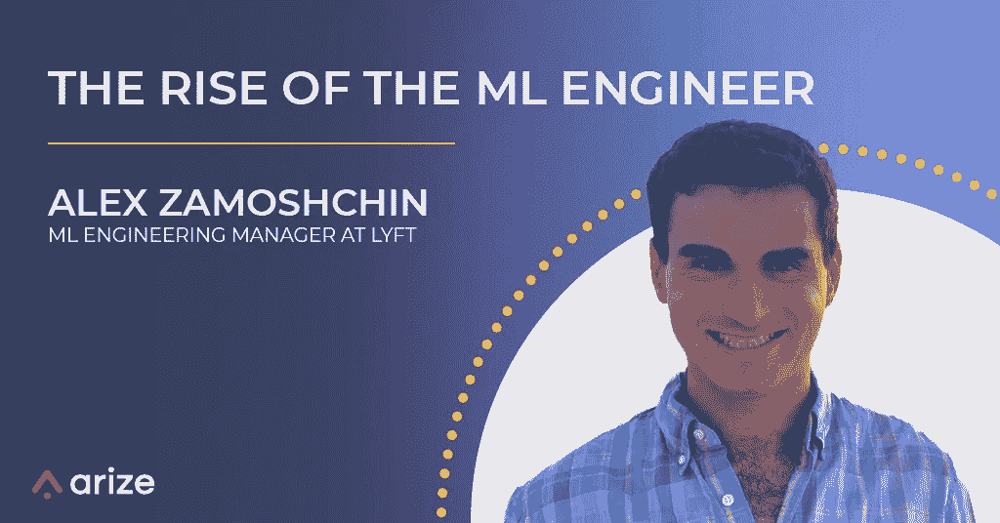

# 机器工程师的崛起:来自 Lyft 的亚历克斯·扎莫什钦

> 原文：<https://towardsdatascience.com/the-rise-of-the-machine-engineer-alex-zamoshchin-from-lyft-fcc7f2491069?source=collection_archive---------31----------------------->

Alex Zamoshchin，作者图片

如今，公司投入大量资源来实现 ML 模型，却在部署时发现了无数意想不到的性能下降问题。

为了克服这些挑战，数据组织越来越多地转向 ML 工程师，以帮助弥合构建模型的数据科学家和实施模型的团队之间的差距。

虽然 Lyft 是一个家喻户晓的名字，但普通的骑手可能不知道该公司已经在全球范围内促成了超过 10 亿次骑行。

Lyft 应用的主干是一个最先进的 ML 基础设施，用于提供从地图绘制和欺诈检测到定价优化和 ETA 估计的各种解决方案。

我们最近采访了 Lyft 的工程经理 Alex Zamoshchin，以了解 ML 工程师如何发展以满足公司关键 ML 计划的需求。

“在最高水平上，Lyft 依靠 ML 工程师帮助将研究模型应用到现实世界，同时确保他们实现商业目标，”Zamoshchin 说。“他们参与了所有事情，从在业务环境中构建 ML 问题，将模型转换为工作管道，到分析实验和观察数据，以确保模型部署后的质量和性能。”

Zamoshchin 之前在 Palantir Technologies 担任 ML 工程师，现在管理 Lyft 的司机调度团队，负责每天在 Lyft 市场上匹配超过 100 万名乘客和司机的模型。

“决定如何调度每辆车的基础系统非常复杂，并且依赖于多元化的团队，”Zamoshchin 补充道。“识别需求、将其转化为数学框架并实施、观察和确保最终模型的性能的过程，通常意味着该过程中有不同技术语言的参与者。”

根据 Zamoshchin 的说法，ML 工程师在弥合研发团队和负责将其投入生产的团队之间的差距方面发挥着重要作用。

在一个没有 ML 工程师的假设世界中，Zamoshchin 描述了一个场景，数据科学团队有一个想法，建立一个模型，然后依靠生产团队来实现它。由于数据科学家脱离了生产环境及其局限性，他们的模型可能需要不存在的功能，或者不值得花力气将它们上线。因此，如果模型被部署，它将回到绘图板或不能按计划执行。

Zamoshchin 说，实际上，ML 工程师帮助解决模型实现前后的潜在问题，避免模型无法实现或在野外失败的不良情况。

虽然 ML 工程师可能来自不同的背景，但他们是 ML 团队中所有贡献者的共同点。

“我们有 ML 工程师，他们是受过统计学训练的数据科学家，还有一些人有计算机科学背景。我们的团队成员是深度学习方面的专家，其他人专门负责维护和调试模型。他们来自各个领域，”Zamoshchin 说道。“说到底；然而，ML 工程师拥有构建 ML 工作流程和基础设施所需的全套技能，能够顺利地将项目从初始阶段转移到生产阶段。”