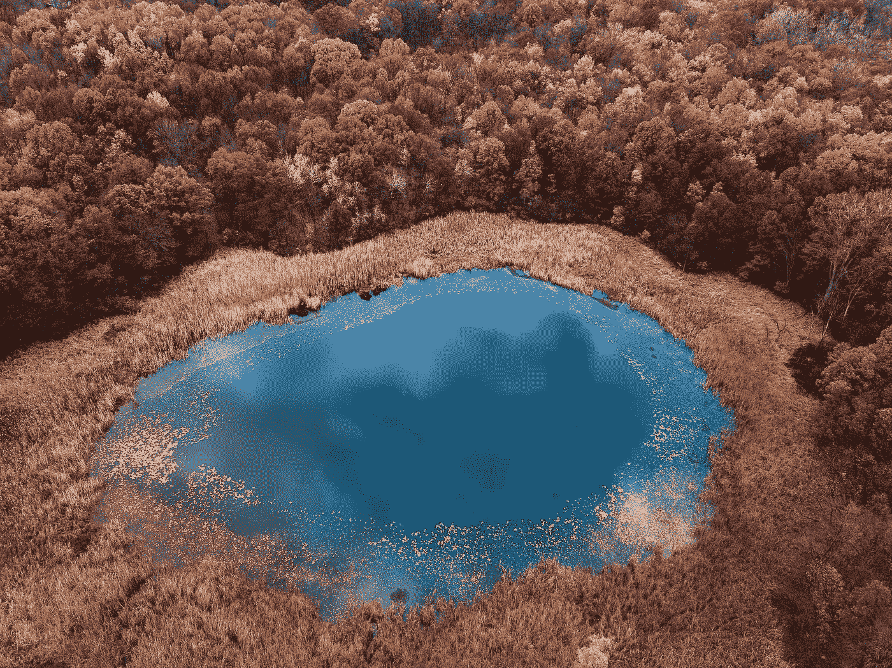
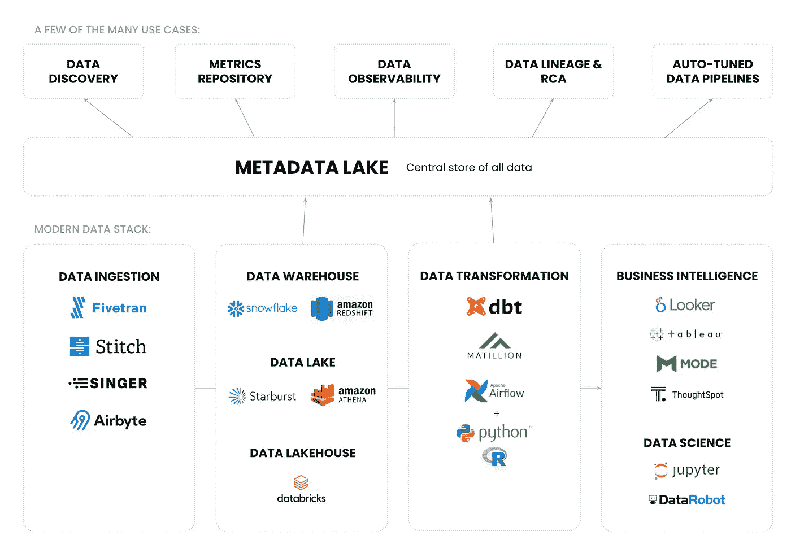

# 元数据湖的兴起

> 原文：<https://towardsdatascience.com/the-rise-of-the-metadata-lake-1e95127594de?source=collection_archive---------10----------------------->

## 介绍一种存储元数据的新方法，适用于当今无限的用例，如数据发现、沿袭、可观察性和结构

照片由 [Aaron Burden](https://unsplash.com/@aaronburden?utm_source=unsplash&utm_medium=referral&utm_content=creditCopyText) 在 [Unsplash](https://unsplash.com/?utm_source=unsplash&utm_medium=referral&utm_content=creditCopyText)

数据呈爆炸式增长。

数据团队比以往更加多样化——数据工程师、分析师、分析工程师、数据科学家、产品经理、业务分析师、公民数据科学家等等。

他们使用的数据工具和基础设施非常复杂。这些包括数据仓库、湖泊、湖边小屋、数据库、实时数据流、BI 工具、笔记本、建模工具等等。

所有这些导致了前所未有的混乱。

> *“这个栏目名称是什么意思？”*
> 
> *“我能信任这个数据资产吗？它从哪里来？”*
> 
> *“啊…我在哪里可以找到我们客户主数据的最新清理数据集？”*

这些是数据团队现在每天都要处理的消息类型。

在过去的 5 年中，随着现代数据堆栈的成熟和成为主流，我们在数据基础架构方面取得了巨大的进步。然而，现代数据堆栈仍然缺少一个关键的组件:上下文。这就是元数据发挥作用的地方。

# 元数据的承诺

在这个日益多样化的数据世界中，元数据掌握着通往难以捉摸的应许之地的钥匙——真理的单一来源。在团队的数据基础设施中，总会有无数的工具和技术。通过有效地收集元数据，团队可以最终统一所有工具、过程和数据的上下文。

但是你会问，元数据到底是什么？简单来说，**元数据就是“关于数据的数据”。**

今天，元数据无处不在。现代数据堆栈的每个组件和其上的每个用户交互都会生成元数据。除了像技术元数据(例如模式)和业务元数据(例如分类法、术语表)这样的传统形式之外，我们的数据系统现在创建了全新形式的元数据。

*   云计算生态系统和编排引擎每秒都会生成日志，称为**性能元数据。**
*   与数据资产和其他人交互的用户生成**社交元数据。**
*   来自 BI 工具、笔记本和其他应用程序以及 Slack 等通信工具的日志会生成**使用元数据。**
*   用于创建数据资产的编排引擎和原始代码(例如 SQL)生成**出处元数据。**

# 新兴的元数据，新兴的用例

所有这些新形式的元数据都是由实时数据系统创建的。这导致了元数据的大小和规模的爆炸式增长。

> 元数据本身正在成为大数据。

不仅比以往任何时候都更多的元数据被生成和捕获，而且像[雪花](https://www.snowflake.com/)和[红移](https://aws.amazon.com/redshift/)这样的计算引擎的基本进步(即弹性)现在使得从元数据中获取智能成为可能，这种方式甚至在几年前都是不可想象的。

例如，查询日志只是当今可用的一种元数据。通过解析 Snowflake 中查询日志的 SQL 代码，可以自动创建列级血统，为每个数据资产分配流行度分数，甚至推断每个资产的潜在所有者和专家。

随着元数据的增加，我们可以从中获得的智能也在增加，元数据可以支持的用例的数量也在增加。

今天，即使是最受数据驱动的组织也只是触及了元数据的皮毛。但是最大限度地利用元数据可以从根本上改变我们数据系统的运行方式。

例如，想象这样一个世界，其中这些情况是正常的:

*   当在源表中检测到数据质量问题时，系统**自动停止下游管道**以确保不正确的数据不会到达仪表板。或者更好的是，该系统使用过去关于数据质量故障的记录来准确预测出了什么问题，并在没有任何人工干预的情况下修复它。
*   该系统利用过去的使用日志来**自动调整数据管道**，并通过将负载转移到更多使用的数据资产和优化数据管道运行的时间表来优化计算性能。

在过去的几个月里，数据网格、数据结构和数据操作等概念获得了越来越多的支持，在 Zhamak Dehghani 的文章[中得到广泛推广。然而，所有这些概念基本上都是基于能够收集、存储和分析元数据。](https://martinfowler.com/articles/data-monolith-to-mesh.html)

# 为什么我们需要一个元数据湖？

在 2005 年,“数据”的地位类似于今天元数据的地位。收集的数据比以往任何时候都多，使用数据的方式也比单个项目或团队想象的多。

> “问题是，在大数据的世界里，我们并不真正知道数据有什么价值……我们可能知道一些我们想要回答的问题，但还没有到关闭回答以后出现的问题的能力的程度。”
> 
> 2011 年，丹·伍兹登上《福布斯》杂志

数据有无限的潜力，但是如何为无限的不同用例和用户建立数据系统呢？

这导致了一个**数据湖**的诞生。数据湖不是以“某种‘最佳’形式存储数据以备后用”，而是一个存储各种数据(结构化和非结构化数据，以及最原始和已处理形式的数据)的单一大型存储库。然后，这种灵活的数据可以用于驱动从分析到数据科学到机器学习的各种用例。

我相信我们在元数据方面也处于类似的关头。今天，收集的元数据比以往任何时候都多，它的潜在用例和用户比任何人想象的都多。

## **这就是我认为需要元数据湖**的地方:一个统一的存储库，以原始和进一步处理的形式存储各种元数据，这些元数据可用于驱动我们今天和明天已知的用例。

现代元数据湖的架构。(图片由 Atlan 提供。)

# 元数据湖的 3 个特征

## 1.开放式 API 和接口

元数据湖需要易于访问，不仅仅是作为数据存储，而是通过开放的 API。这使得在现代数据堆栈的每个阶段利用“单一真实来源”变得异常容易。

> 例如，从元数据湖中提取元数据并将其集成到 Looker 仪表板上的 hover 中应该非常容易。或者利用血统和出处元数据来提高数据的可观察性。**或者承担数百个元数据活跃起来的用例中的任何一个**。

就像我在关于 2021 年数据趋势的文章中提到的那样，元数据正在走向成熟。在接下来的几年中，许多数据团队将开始利用元数据，但他们可能会从一个单一用例的解决方案开始，如数据发现、数据可观察性或沿袭。

然而，当他们决定采用什么元数据产品或解决方案时，重要的是这些客户要超越一个用例。重要的是要考虑解决方案的灵活性和架构，并检查基础 metastore 是否开放，以及将来是否可用于各种用例及应用。

## 2.以知识图表为动力

当数据资产之间的所有连接都活跃起来时，元数据的真正潜力就被释放出来了。例如，如果一列被标记为“机密”，则该元数据可以与沿袭关系一起用于将从该特定列派生的所有其他列标记为机密。

知识图是存储这些相互联系的最有效的方式。

## 3.为人类和机器提供动力

元数据湖可用于增强人类(如发现数据和理解其上下文)和机器或工具(如上文提到的自动调整数据管道)的能力。这种灵活性是需要在基础架构中反映出来的现实。

# 展望未来

随着我们对元数据的深入研究，我认为很明显，元数据湖将成为数据管理领域下一波创新的基石。未来几年，新一代元数据解决方案将进入市场，这并不奇怪。在此之后，元数据湖甚至可能推动整个类别的公司，这些公司将在元数据之上添加一层数据科学和分析。

**向我的联合创始人 Varun 致敬，他首次提出了“元数据湖”这个术语。**

**觉得这个内容有帮助？在我的时事通讯《元数据周刊》上，我每周都写关于活动元数据、数据操作、数据文化和我们的学习建设的文章** [**Atlan**](https://atlan.com/) **。** [**在此订阅。**](https://metadataweekly.substack.com/)