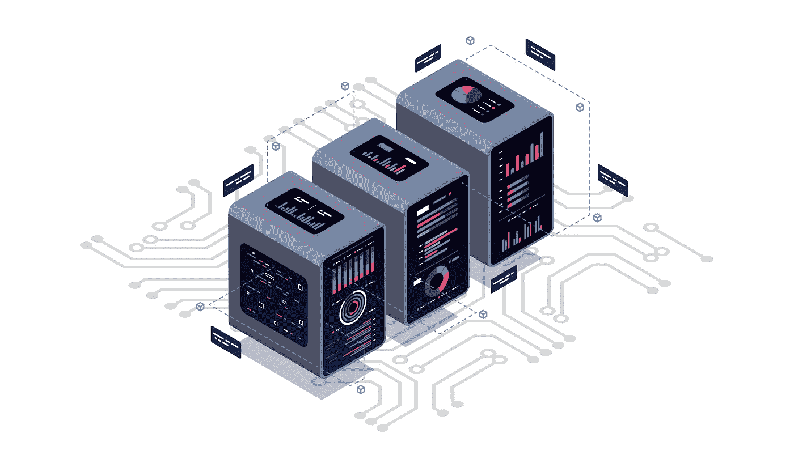
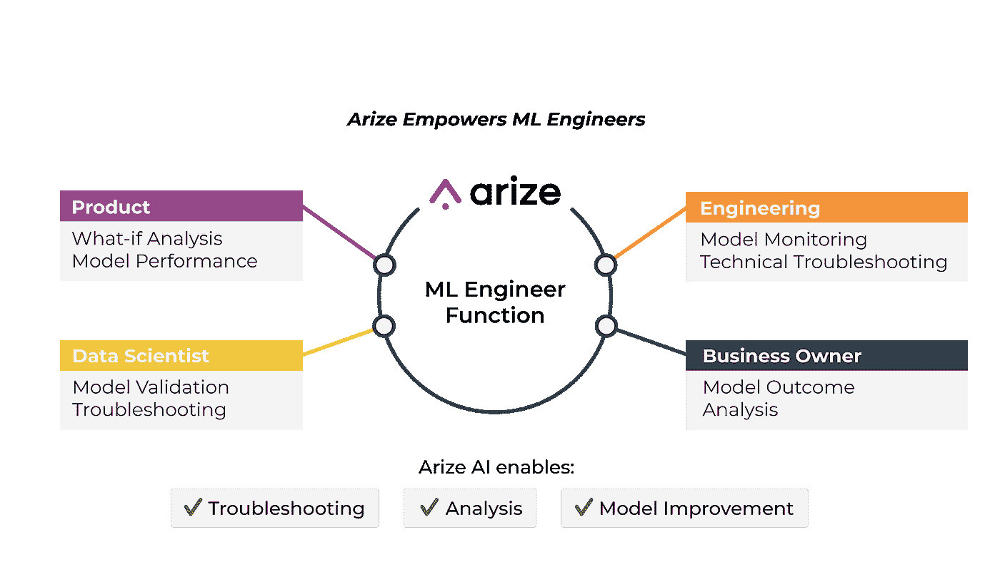
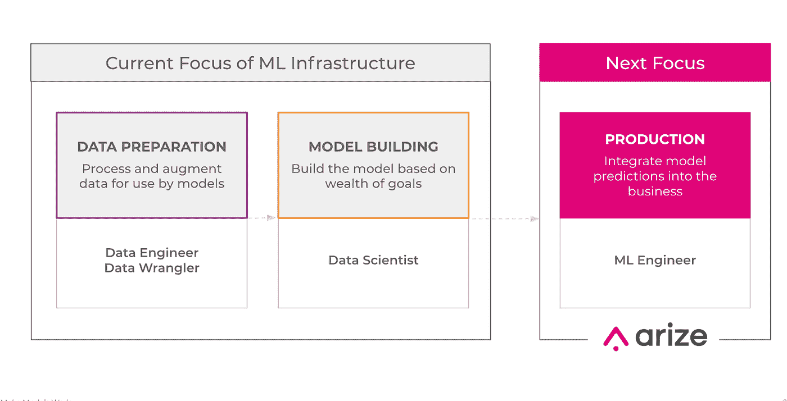

# ML 工程师的崛起

> 原文：<https://towardsdatascience.com/the-rise-of-the-ml-engineer-fdecb62bcec0?source=collection_archive---------7----------------------->

## 对不断演变的角色的新观点

作者图片

就在五十年前，机器学习还是一个新概念。今天，它是社会不可或缺的一部分，帮助人们做各种事情，从开车、找工作到获得贷款和接受新的医疗。

当我们想到未来 50 年的 ML 会是什么样子时，这是不可能预测的。从芯片和基础设施到数据源和模型可观察性，一切领域中新的、不可预见的进步都有能力在一夜之间改变行业的轨迹。

也就是说，我们知道长期只是短期运行的集合，在当前运行中，有一组新兴的工具和功能正在成为几乎每个 ML 计划的标准。我们已经写过 [3 个最重要的 ML 工具](/the-only-3-ml-tools-you-need-1aa750778d33):一个[特性商店](https://arize.com/blog/feature-store/)，一个模型商店和一个评估商店。点击[深入了解。](/the-only-3-ml-tools-you-need-1aa750778d33)

除了推动 ML 计划的工具，塑造数据团队的角色也在快速发展。

正如我们在 [ML 生态系统白皮书](https://arize.com/wp-content/uploads/2021/04/Arize-AI-Ecosystem-White-Paper.pdf)中概述的那样，机器学习工作流程可以分为三个阶段——数据准备、模型构建和生产，在流程的每一步，技能和要求都是不同的:

*   建模是数据科学家的领域。他们是数学和统计方面训练有素的专家，并应用这些学科来设计、构建和优化模型，以解决特定的业务挑战。
*   ML ops 隶属于一组工程师，他们负责集成 ML 基础设施的开发和操作方面的工作流。

在许多方面，数据科学家和 ML ops 团队之间的关系类似于左脑-右脑划分，一边是逻辑(模型)，另一边是创造力(操作)。我们知道，大脑半球之间的差异会影响大脑解决重要问题的能力，并且存在一条厚厚的神经纤维带，使大脑一侧处理的信息能够与另一侧共享。

在 ML 中，公司已经认识到需要一种新的专业知识，类似于这些神经纤维，可以弥合构建模型的数据科学家和操作模型的团队之间的差距。进入 ML 工程师。

作者图片

在最高层，ML 工程师负责从研究中获取模型到现实世界，并确保它们实现商业目标。我们与几位领先的 ML 从业者进行了交谈，以了解这一不断发展的角色如何适应不断发展的 ML 计划的需求。让我们开始吧:

**优步罗汉·艾扬格**

Rohan Iyengar 是优步大学的软件工程师，专注于利用人工智能、人工智能和数据来解决挑战性问题。

艾扬格说:“*在像优步这样的公司，你需要对每个模型有具体的了解，以了解一旦这些模型投入生产，你所定义的成功标准是否得到满足。”。“这就是 ML 工程师的作用所在。当复杂性很高时，如优步的 ML 基础设施，规模，可靠性，以及寻找和观察正确的度量标准是非常复杂的。你需要一个介于模型构建者和运营团队之间的角色，以确保你实现了你的业务目标。*

**朱家骅**

Harrison Chu 最近从 Lyft 加入 Arize，在那里他领导调度和匹配团队，这是一个由数据科学家和工程师组成的跨职能团队，致力于实施和优化系统，以更有效地匹配乘客和司机。

"*根据我在 Lyft 和之前的 ML 职位的经验，很明显，行业需要一种新的角色，介于构建管道的数据科学家和部署模型的工程师之间，以便团队可以了解模型在现实世界中的作用。许多组织在两个半球之间没有清晰的交流，所以他们从来不知道离线工件和生产环境中的模型之间的区别。*”

**谢亚森，土坯**

Jason Xie 是 Adobe 的高级研究科学家，他在 Adobe 为该公司的视频广告网络开发 ML 解决方案，该解决方案采用自助式 DSP(需求侧平台)，使客户能够基于复杂的算法根据上下文购买和发布广告。

*“为了应对不断变化的技术和隐私趋势，我们一直在调整我们的 ML 模型，以适应隐私安全广告的未来，”谢指出。“这种方法的最大挑战之一是，随着行业的发展，我们现在正在探索各种新的隐私安全协议，如谷歌 Chrome 的 FLoC 和微软 Edge 的 PARAKEET，而不是消费者在购买过程中遇到的接触点。最终，我们相信这一重大转变将为消费者带来最隐私安全的生态系统，但这需要一种全新的方法来实现 ML。”*

在我们的案例中，ML 工程师变得比以往任何时候都更重要，因为不断发展的广告服务方法需要新的复杂层次来解决模型投入生产后的问题。在一天结束时，他们坐在模型的处理和服务之间，确保我们解决客户的业务挑战。

作者图片

今天，公司花费数百万美元开发和实现 ML 模型，却看到无数意想不到的性能下降问题出现。代码发布后无法运行的模型很难排除故障，并且会对业务运营和结果产生负面影响。

为了克服这些挑战，数据团队既需要在生产中观察模型的工具，也需要了解如何在模型离开实验室后让它们发挥作用的团队。虽然随着新挑战的出现，使 ML 计划成功所需的角色将继续变化，但现在，公司应该投资 ML 工程师，以确保他们的投资得到回报。

## 联系我们

如果这个博客引起了你的注意，并且你渴望了解更多关于[机器学习可观察性](https://arize.com/platform-overview/)和[模型监控](https://arize.com/model-monitoring/)，请查看我们的其他[博客](https://arize.com/blog/)和 [ML 监控](https://arize.com/ml-monitoring/)上的资源！如果您有兴趣加入一个有趣的 rockstar 工程团队，帮助模型成功生产，请随时[联系](https://arize.com/contact/)我们，并在此[找到我们的空缺职位](https://arize.com/careers/)！