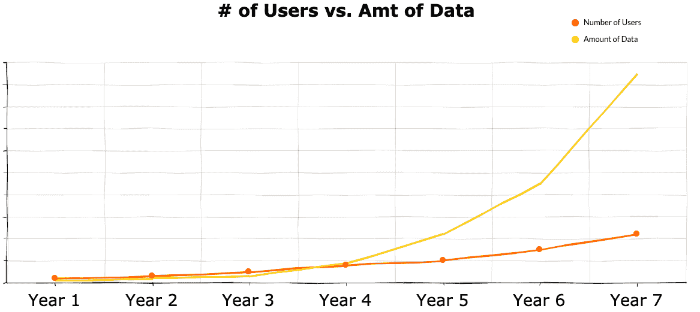

# 运营数据目录的兴起

> 原文：<https://towardsdatascience.com/the-rise-of-the-operational-data-catalog-c89a88cbe992?source=collection_archive---------26----------------------->

来自 Unsplash 的法比奥拍摄的照片

长久以来，数据目录过度关注数据用户，而忽略了软件工程师，尤其是数据工程师的需求。所有数据目录中的核心功能—元数据捕获、标记、沿袭等等—都倾向于基于 UI 的搜索和发现模式。从根本上说，这些功能支持数据*用户*，但为数据*创建者*提供的价值相对较少，这导致了数据目录的两个主要问题:

*   数据目录已经变成了纯粹的反动软件
*   数据目录的增值与用户数量*成线性比例*

数据目录是时候进化了。目录已经可以访问您的数据生态系统的丰富的横截面视图。下一个前沿领域是重新调整这些信息的用途，以使数据创建者能够更高效地创建和维护数据。**最有价值的用例是将数据目录集成到 CICD 管道中。**

# 为什么要将数据目录与 CICD 管道集成在一起？

您的数据目录应该有一组丰富的元数据，以确保数据管道的连续性。例如，在生产中发生变更之前，目录应提醒您注意以下场景*:*

*   使用沿袭来了解删除字段是否会影响业务关键或外部报告的仪表板
*   将沿袭与数据质量测试结果结合起来，以确定 Avro 文件中新的“非空”约束是否会导致记录无法插入到数据库中
*   检查查询日志和仪表板视图计数，以确定在删除表之前的三个月内没有使用过表

CICD 管道是代表数据的形状和语义发生变化的时刻的控制点。这是插入您的数据目录的正确位置，因为它在实际数据改变之前。下图提供了一个简单的 CICD 流程示例，该流程在部署前使用数据目录验证元数据更改。

CICD 进程中的数据目录(图片由作者提供)

由于数据目录位于部署的前面，it 现在可以*主动*做出决策。这对于一些特性有很大的好处，比如数据沿袭，标准的、反应式的方法是从 SQL 日志中构建沿袭，这些日志只能在数据发生变化后*读取。*

这种方法的另一个好处是，它具有保持数据目录最新的副作用。

# 这为什么有价值？

在将数据目录用于运营用例时，您可以利用您拥有的*数量的数据*来扩展您的目录所提供的价值。传统上，您可以使用类似于以下公式的公式来衡量 ROI:

*(数据用户数)*(每个用户节省的平均时间)*(平均工资)*

虽然这是一个很好的基线，但它是片面的，没有考虑到数据创建者在生成新数据资产上花费的全部时间，特别是在数据依赖问题发生后跟踪和修复它们所花费的大量时间。当生产中发生重大变化时，请考虑以下任务:

*   找到根本原因
*   修复根本原因
*   规划和执行手动数据清理和回填

这里的时间成本是巨大的；更不用说当数据质量问题进入生产时，会对您的用户产生切实的影响！拥有大量数据的公司可以从运营其数据目录中获得更多好处。

用户增长与数据增长(图片由作者提供)

# 随着数据扩展

为了让目录随数据扩展，它们必须迎合数据创建者:软件工程师。工程师与数据目录的交互将不同于人们对分析师或数据科学家的期望。特别是，工程师需要:

*   一组健壮的编程接口，适合它们的开发生命周期
*   将数据目录集成(或部署)到开发、试运行和生产环境中

虽然为工程师提供一个 API 来告诉他们血统*存在*将对一些组织起作用，但那些拥有更大数据集、严格变更控制、更复杂管道和更大团队的组织将发现这是不够的。为了赢得大多数公司的支持，catalog 需要简明扼要地总结它所拥有的关于 API 中相关数据资产的所有知识，这些知识可供工程师使用:

*   数据是否用于运营目的或分析？
*   正在删除的特定列是否用于业务关键型报表？
*   数据最后一次使用是什么时候？

# 结论

将您的数据目录与您的 CICD 管道集成将使您能够主动利用您的元数据来识别您的数据管道中的重大变化，并使您的团队能够随着您的数据进行扩展，同时支持不断增长的数据集的不断增长的需求。

在 [Stemma](https://stemma.ai) ，我们将所有这些整合在一起，重新想象数据目录可以做些什么来回答这个屡试不爽的问题:

*更改该数据资产会对我的业务产生影响吗？*