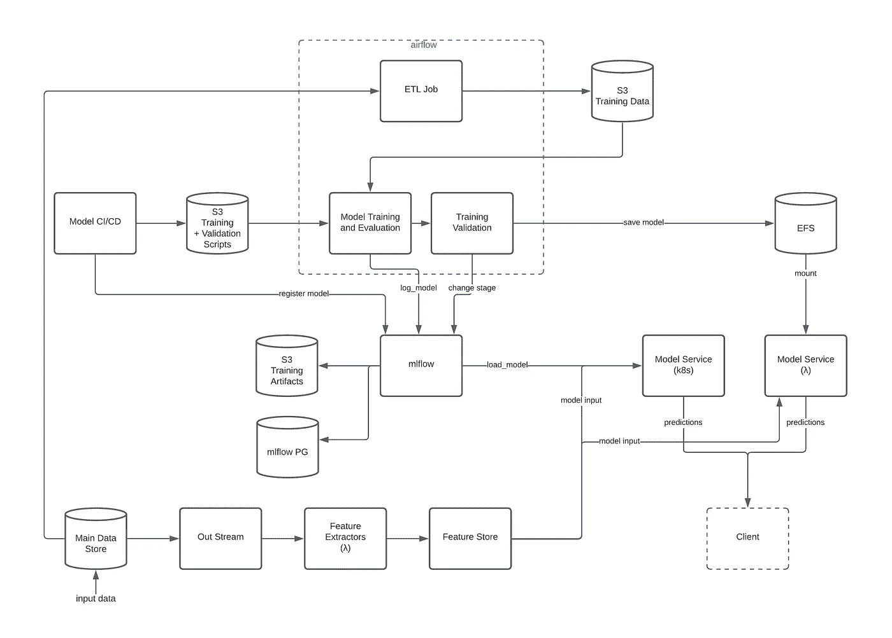

# 走向生产中的无服务器 ML 管道——第一部分

> 原文：<https://towardsdatascience.com/the-road-to-a-serverless-ml-pipeline-in-production-part-i-893f3bf0062a?source=collection_archive---------14----------------------->

## Nutrino 如何在生产中设计无服务器 MLOps 堆栈

迪诺·瑞奇穆斯在 [Unsplash](https://unsplash.com?utm_source=medium&utm_medium=referral) 上拍摄的照片

今天将 ML 模型引入生产是复杂的——不同的公司对 ML 栈有不同的需求，并且有许多工具，每个工具试图解决 ML 生命周期的不同方面。这些工具仍在开发中，没有一个针对 MLOps 的“明确”解决方案。在本文中，我想分享我们在创建自己的 MLOps 堆栈时所经历的过程，包括我们团队在该过程开始之前的工作方式，我们对不同 MLOps 工具所做的研究，以及我们如何决定适合我们非标准模型的解决方案。

有关详细的解决方案，包括更多的技术解释，请查看本文的[第二部分](https://medium.com/@galshen/the-road-to-a-serverless-ml-pipeline-in-production-part-ii-e065cf4caa93)。

***TL；DR***——我们设法运行不同类型的模型(我们自己的 Python 模型)，每种模型都有多个生产版本——所有这些都在一个无服务器的环境中！

# 我们的 ML 堆栈预重构

这是我们开始重构之前的 ML 堆栈:

作者图片

## *研究环境*

我们使用了一个 datalake 环境，该环境中有一个 ETL 流程，可以将生产数据传输到 parquet 文件，再传输到 S3。数据科学家们在该环境中使用运行在 EMR 集群上的 Zeppelin 笔记本电脑进行研究(因此利用了 Spark 的分布式能力)。

## *特征提取*

使用 AWS lambdas 完成特征提取，每次新数据到达我们的集中式数据存储时，由 Kinesis 流触发，并使用无服务器框架进行部署。

## *培训*

1.  一旦某个模型的研究完成，数据科学家就为该模型创建一个培训笔记本(在相同的 datalake 环境中)。
2.  我们使用 Apache Airflow 定期运行培训的笔记本(并利用它在运行计划作业方面的优势)。为此，我们为每个模型的培训笔记本创建了一个 DAG(有向无环图)。
    Airflow 的 Dag 会在每次推送到主分支时立即部署。
3.  Dag 创建了一个运行培训笔记本的 EMR 集群。笔记本连接到 GitHub 存储库，因此笔记本中的每次提交基本上都是训练代码的自动“部署”。

## *推论*

一些模型被开发为具有预测端点的 Flask 服务。这些模型在服务的初始化部分加载了训练工件。其他模型是使用无服务器框架作为无服务器 lambda 处理程序开发的，它每次都直接从 S3 路径加载训练工件。我们的 Kubernetes 集群部署了烧瓶模型。无服务器模型在每次更改时都作为 HTTP lambdas 部署到 AWS lambda 服务。

***如果我们的 MLOps 流程有效，并且培训已经自动运行笔记本中编写的相同代码，为什么要改变它？***

它运行得很好，但是随着我们的成长和有更多的模型要开发，我们遇到了两个主要问题:

首先，我们的模型被归类为医疗软件，需要符合联邦药品管理局(FDA)的开发法规。这意味着我们需要能够在某个批准的时间点“冻结”我们的代码，并且从那时起，没有正式的批准，我们不能更改它(这个过程可能需要几个月！).
这意味着我们不能在一个模型的生产中处理一个版本，而是必须在生产中支持同一个模型的许多不同版本。

第二，我们的生产部署流程部分是手动的；在气流中运行训练并将工件保存到 S3 之后，评估是手工完成的。只有在获得批准后，我们才将文件复制到 S3 的另一个地方，然后必须删除 Kubernetes 集群中的相关 pod，以便服务加载新文件(没有宕机)。
此外，我们没有任何模型部署标准，每个模型的处理方式也不一样。

# 开始探索 MLOps！

给定基线和需求，我们开始探索哪些解决方案已经存在，哪些是行业中常用的。在选择 ML 产品时，我们需要考虑的一个主要要求是，我们的模型是内部编写的，而不是从任何常见的 ML 类库(如 scikit-learn 等)继承而来。).这使得将我们的模型结合到许多 ML 产品中的过程变得更加复杂。

我们的研究集中在三种服务上；在下一节中，我将提供一个简短的总结，说明我们选择或不选择使用该服务的原因。

** ***注:*** 我们在 2020 年 7 月进行了这项研究，所以你需要考虑到这个领域的事情变化和发展相当快。然而，你可能会发现我的研究和决策过程仍然有用。

## ***Kubeflow***

Kubeflow 为整个 ML 生命周期提供了完整的解决方案——从笔记本电脑中的研究到在生产中部署模型。因此，我认为这是一个很好的整体解决方案，尤其是如果你刚刚开始；然而，对于生命周期的更具体的方面，有一些产品掌握了生命周期的每个方面，并且做得更好。

我当时对 Kubeflow 的研究表明，使用 Kubeflow 有两大好处:

*   他们的管道产品，支持使用 Dag 运行计划的作业
*   他们在 Kubernetes 上使用 Dockerized 容器的概念，可以很容易地部署在任何云提供商上

然而，对我们来说，这两个好处都没有那么有用，原因如下:

*   我们已经在为我们的预定工作使用气流，它比 Kubeflow 的管道更成熟，更适合生产。
*   我们的推理服务已经在 Nutrino 的 Kubernetes 集群上工作了。
*   我们在使用 Zeppelin 笔记本，而在 Kubeflow 上工作需要我们使用 Jupiter 笔记本，这意味着我们需要迁移和改变我们的笔记本平台。
*   迁移笔记本和做额外的工作来改变我们开发和部署 Docker 容器的方式是非常耗时的工作——这只是开始——我们仍然不确定这是否会给我们的产品带来任何显著的好处。

此外，在将我们的模型结合到许多 ML 产品中时，我上面提到的复杂性也适用于尝试将我们的模型与 Kubeflow 结合时。

## ***MLFlow***

MLFlow 侧重于模型库，并不是一个完整的生命周期解决方案。使用 MLFlow，我们可以使用自己的 Python 模型(使用 [pyfunc 模块](https://www.mlflow.org/docs/latest/python_api/mlflow.pyfunc.html)，这使我们能够轻松地将自己的模型合并到 MLFlow 中。

我应该解释说“容易”是一种轻描淡写的说法:启动并运行 MLFlow 服务器需要几分钟时间，并且需要一个简单的库从您的脚本与该服务器进行交互。

有了 MLFlow，我们最大的需求得到了满足——我们现在可以通过模型名称和版本(使用它的模型方案:' models:/ <model_name>/production ')来处理所有培训的工件；我将在[技术解决方案部分](https://medium.com/@galshen/the-road-to-a-serverless-ml-pipeline-in-production-part-ii-e065cf4caa93)对此进行详细阐述。
MLFlow 还用于通过 it 服务模型，而不仅仅是管理存储库，但是我们不想从 MLFlow 服务器服务模型。这意味着，对于每个模型，我们都需要在该服务器的不同端口上创建一个服务端点，这不是一件可以轻松部署、访问和监控的事情(我们不想为不同的模型访问不同的端口，我们希望通过模型的名称来访问模型，并在生产中支持具有许多版本的许多模型，因此这是不可伸缩的)。</model_name>

因此，我们决定在训练期间使用 log_model 函数记录我们的模型，并在推理服务中调用 load_model。然而，MLFlow 的一个大缺点是 load_model 函数的性能——它花费了 4-30 秒或更长时间(取决于模型大小和网络，如果我们在本地或从服务器测试它——但无论哪种方式，它仍然太长了)。

## **T5【Sagemaker】T6**

由于我们已经将 AWS 用于我们的许多服务，我们喜欢使用托管 AWS 服务及其所有内置监控的想法。

我们创建了一个 flask 服务的 Docker 映像，带有两个必需的端点(ping 和调用；参见 [AWS 的使用您自己的推理代码](https://docs.aws.amazon.com/sagemaker/latest/dg/your-algorithms-inference-code.html)了解更多信息)。这非常类似于我们自己在 Kubernetes 上运行的推理服务。我们希望使用 Sagemaker，结合 MLFlow 来缩短推理时间。我们在 flask 应用程序初始化过程中调用 load_model，并将结果(模型实例)保存在内存中。

通过这种方式，当 Sagemaker 端点启动并运行时，我们可以确定模型已经被加载，而不必等待几秒钟来进行预测。

不幸的是，从 Sagemaker 端点获得预测仍然需要 1.5-2 秒，尽管在 Docker 中调用模型的 predict 函数只需要几毫秒。
sage maker 的另一个主要缺点是端点总是开启的——这意味着即使没有要预测的调用，我们也要为实例付费。

这些问题使我们决定不追求 Sagemaker，而只是在我们现有的推理服务中实现相同的逻辑(无论如何，这个 pod 只是一个大型 Kubernetes 集群使用中的一个 pod——因此它更具成本效益，并且预测更快地发送回客户端)。

## ***AWS EFS***

虽然 AWS EFS 不是 MLOps 产品，但我们希望使用 EFS 来进一步降低成本，实现完全无服务器。正如我在第一节中提到的——我们堆栈中的一些推理服务是在 lambda 函数中实现的，因此它更具成本效益；然而，我们不能在每次调用时都调用 load_model，因为这会花费很长时间。

这就是为什么我们开始关注 AWS 的 EFS 服务，并将推理 lambda 安装到它上面，而不是从 S3 加载(这是 load_model 的工作方式)。lambda 只需用本地安装的路径调用 *mlflow.pyfunc.load_model* ，而不是使用 mlflow 的 models 方案。

# 于是 MLOps 架构诞生了…

诺帝诺的 MLOps 架构(图片由作者提供)

如前所述，我们选择使用 MLFlow 作为模型库和工件库，并使用 AWS EFS 来提高性能。这种结合产生了一种解决方案，它在不到一秒钟的时间内将预测传递给了位于*的客户。*

下一步是什么？在本文的[下一部分](https://medium.com/@galshen/the-road-to-a-serverless-ml-pipeline-in-production-part-ii-e065cf4caa93)中，我将深入探讨这个解决方案的技术方面，包括一些代码示例。

*感谢您花时间阅读本文！欢迎在下面评论问题或开始讨论。*