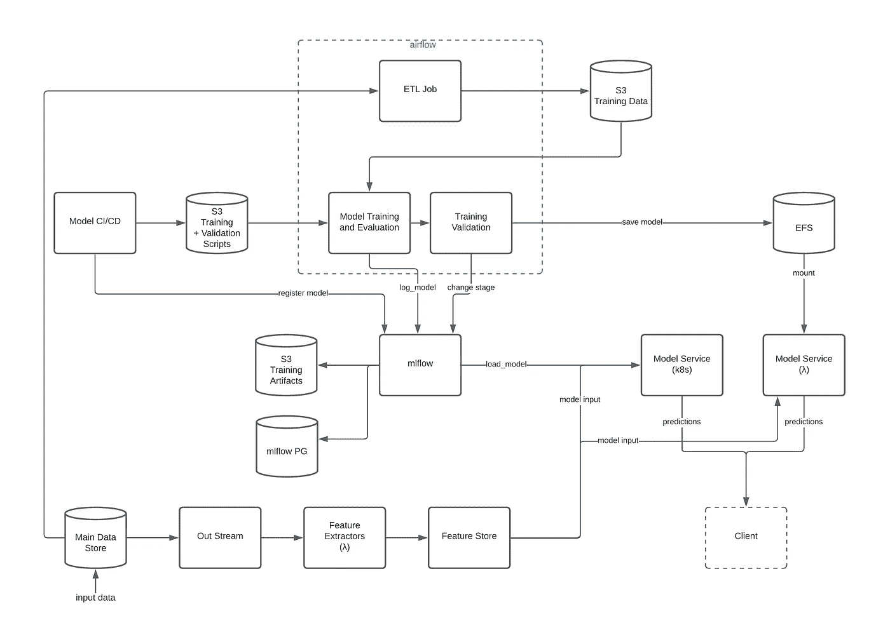

# 生产中无服务器 ML 流水线之路——第二部分

> 原文：<https://towardsdatascience.com/the-road-to-a-serverless-ml-pipeline-in-production-part-ii-e065cf4caa93?source=collection_archive---------23----------------------->

## 我们设计的 MLOps 架构及其实施方式

马特·邓肯在 [Unsplash](https://unsplash.com?utm_source=medium&utm_medium=referral) 上的照片

在[第 1 部分](https://medium.com/@galshen/the-road-to-a-serverless-ml-pipeline-in-production-part-i-893f3bf0062a)中，我解释了我们创建全自动 MLOps 架构的过程，以及我们的决策过程，考虑了我们的需求和我们已经在使用的堆栈。

在这篇文章中，我将向您展示我们最终的解决方案，包括如何自己实现这个解决方案的代码示例。

# 让我们再来看看架构…

诺帝诺的 MLOps 架构(图片由作者提供)

## 新管道是如何工作的？

数据科学家在他们的笔记本(我们使用 Zeppelin)上的研究环境中工作，以探索和开发他们的模型。一旦他们想出了他们想要编写的模型，他们就进入我们的源代码控制中的模型项目，并开始开发所需的脚本——模型的推理服务、训练脚本和验证脚本。

使用 Pycharm，数据科学家可以在本地(使用本地 Spark)或在远程 EMR 集群前工作，使用他们在研究环境中习惯使用的所有数据运行和测试他们的脚本。他们还可以很容易地为任何模型部分编写单元测试(服务、培训、验证等)。).

我们选择使用 git 标记来触发模型的 CI/CD，因此当他们放置一个带有新版本号的标记时，它将触发 CI/CD 流程，该流程运行以下内容:

1.  运行项目中的所有测试。
2.  如果通过——将训练和验证脚本复制到特定的 S3 存储桶(以下称为 models_bucket)中，路径为*/<model _ name>/<version _ from _ tag>。*
3.  部署模型服务。
4.  调用*ml flow . create _ registered _ model*，将模型的名称作为*<model _ name>_ v<version _ from _ tag>*(即 my_model_v1)。

## 培训渠道

定期调度的 Airflow DAG 将为 models_bucket 下的每个模型及其每个底层版本运行，并将使用 *EmrAddStepsOperator* 运行脚本，以便为这些脚本运行 spark-submit 命令。

我不会深入研究数据处理，但这里会提到，Airflow 也有运行 ETL 作业的 Dag，扫描出主数据存储并将记录以训练脚本所要求的格式保存到 S3。

训练本身将把它的工件记录到 MLFlow 中，并为它创建一个新版本，这意味着训练为模型创建一个次要版本。例如，具有主要版本 1(取自 git 标记)的 my_model 被注册到 MLFlow 作为 my_model_v1，现在训练在 MLFlow 中为它创建了版本 1(ml flow 中的版本自动递增)，从而为 my_model 创建了语义版本 1.1。接下来的训练将在 MLFlow 中创建版本 2，这将使新创建的训练模型成为 my_model 的版本 1.2。

然后，验证脚本将决定新训练的模型是否比当前处于生产阶段的模型更好。如果是，它会将旧模型移至归档阶段，将新模型移至生产阶段，并将 MLFlow 中的模型文件保存在 EFS 的 models 目录中。

# 现在让我们看一些代码！

## 培训脚本

首先，我们需要用 MLFlow PythonModel 包装我们的模型:

然后，在将模型记录到 MLFlow 时，我们可以在培训脚本中使用它:

## 验证脚本

## 服务于 lambda 代码的模型

服务于 lambda 的基本模型将具有以下结构:

在您的 serverless.yml 中，您必须将处理程序挂载到 EFS 挂载目标，并将端口 2049 的入站权限也给予 lambda 处理程序:

瞧——我们有无服务器推理服务和训练管道，仅在需要时启动集群。

# 我们的下一步

我们仍然需要进一步将我们的 MLOps 堆栈转换为完全自动化，并涵盖 MLOps 中完成 CT 管道所需的一切。这些步骤包括:

*   对模型进行性能监控，如果需要，将触发管道
*   ML 元数据存储更容易监控管道本身
*   自动化数据验证(目前只有我们的数据提取和准备是自动化的)
*   处理大型模型(需要超过 250MB 的部署 lambda 限制)—我们认为我们也可以使用 EFS 来处理，并预加载所有大型库(如 TensorFlow)，但仍然没有尝试过

随着我们继续成长和开发更复杂的模型，我相信我们还会遇到更多的问题…

感谢您花时间阅读这篇文章！希望你喜欢:)
欢迎在下面留言提问或开始讨论。