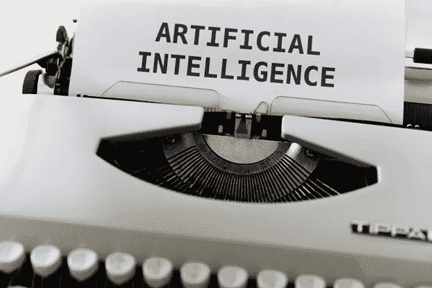
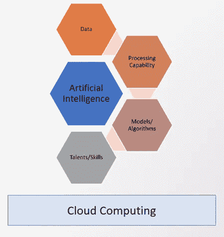

# 云计算在人工智能中的作用

> 原文：<https://towardsdatascience.com/the-role-of-cloud-computing-in-artificial-intelligence-507ffd68ca46?source=collection_archive---------9----------------------->

## 虽然人工智能比云计算早得多，但云计算及其技术极大地改善了人工智能。

马库斯·温克勒在 [Unsplash](https://unsplash.com/s/photos/artificial-intelligence?utm_source=unsplash&utm_medium=referral&utm_content=creditCopyText) 上的照片

1956 年，约翰·麦卡锡在[达特茅斯学院](https://en.wikipedia.org/wiki/Dartmouth_workshop)的一个研讨会上首次使用了人工智能(AI)这个术语。1951 年开发了第一个用于玩跳棋和国际象棋的人工智能应用程序。50 年代之后，人工智能一直处于上升和下降状态，直到 2010 年代。多年来，已经有一些厂商、大学、机构对人工智能进行了投资。有时希望很高，有时希望很低。当工业界对人工智能没有足够的兴趣时，它被称为人工智能冬天。

在过去的十年里，人工智能，尤其是深度学习(人工智能的一个子集)，在两次成功的事件后一直在上升:首先，IBM 宣布了 [Watson](https://en.wikipedia.org/wiki/Watson_(computer)) 超级系统，该系统在 2 月 14 日至 15 日击败了几位 Jeopardy 多次获胜者，即布拉德·鲁特和肯·詹宁斯，以及 [AlexNet](https://en.wikipedia.org/wiki/AlexNet) ，卷积神经网络(CNN)的名称，在 2012 年 9 月 30 日参加了 ImageNet 大规模视觉识别挑战赛，并在这场挑战中获得了冠军。根据各种市场研究，几乎所有不同行业的机构都开始投资人工智能，他们将在未来几年增加对不同用例的人工智能投资。基于世界经济论坛的[“工作的未来”报告](https://www.weforum.org/reports/the-future-of-jobs-report-2020/digest)(2020 年 10 月)，未来与人工智能相关的工作将更加需要。此外，根据 Glassdoor 在线就业公司的调查，数据科学家在过去 3 年中一直被称为美国最好的工作之一。

“云计算”一词早在 1996 年就出现了，第一次被提及是在康柏的一份内部文件中。甚至在 1993 年之前，云这个术语就已经出现了。但是现代的[云计算](https://en.wikipedia.org/wiki/Cloud_computing)是亚马逊在 2006 年用弹性计算云服务创造并推广的。第一个云交付模式是基础架构即服务，向用户提供预打包的 IT 资源。后来推出了交付模型 PaaS(平台即服务)和 SaaS(软件即服务)。所有这些交付模型都用于不同的工作负载，包括人工智能工作负载。有三种云部署模式，即公共云、私有云和混合云。这些部署模型对于基于功能性和非功能性需求和约束来定位 AI 工作负载也很重要。根据世界经济论坛的[“工作的未来”报告](https://www.weforum.org/reports/the-future-of-jobs-report-2020/digest)，云计算是商业领袖的最高优先级，直到 2025 年，云计算将被大多数公司采用。

虽然人工智能比云计算早得多，但云计算及其技术极大地改善了人工智能。云计算是一种有效的催化剂。

图片由基万克·乌斯卢提供，灵感来源[人工智能动态力量](https://www.oreilly.com/radar/the-four-dynamic-forces-shaping-ai/)

我们可以看到具有[形状的 AI](https://www.oreilly.com/radar/the-four-dynamic-forces-shaping-ai/) 的动态力量:数据/数据集，包括 GPU、模型/算法在内的处理能力，以及天赋/技能。让我们看看云计算是如何参与推进和丰富人工智能成分的:

## 云交付模式

o IaaS(基础设施即服务)帮助人工智能从业者轻松拥有一个基础设施环境——CPU、内存、磁盘、网络、操作系统，这样从业者就不会浪费时间，而不必等待基础设施团队来准备。而且后来云提供商开始提供 GPU 资源。

o PaaS(平台即服务)帮助人工智能从业者使用人工智能和数据科学服务，包括 jupyter 笔记本电脑、数据目录服务，轻松开发新一代应用程序。

o SaaS(软件即服务)帮助用户在一个应用程序(即 CRM、支付应用程序)中使用人工智能服务，以创造高效的结果。

**云技术**

o 容器:随着容器开始将应用程序与计算环境隔离开来，容器为所有数据科学家提供了相同的接口和环境。此外，数据科学家团队可能在不同的云提供商上运行他们的容器，甚至使用他们更喜欢的 GPU 功能。

Kubernetes: Kubernetes 是一个开源系统，用于自动化部署、扩展和管理容器化的应用程序。由于数据科学家希望以可扩展的方式使用容器化的数据科学平台，Kubernetes 帮助了他们。Kubernetes 提供了对包括 GPU 在内的计算环境资源的高效利用。Kubernetes 还提供数据科学应用程序，运行在容器上的平台可以在不同的云提供商上运行，而不用担心计算环境。

o 数据集消费:数据是人工智能最重要的成分。你需要丰富的数据集来运行你的算法和模型。无论数据集是否从云环境中共享，一旦你得到它，你就可以将它们存储在公共或私有云环境中，以便轻松地对它们进行操作。

**人才/技能可用性**

o 尽管经典的人工智能课程、教育在大学中可用，特别是作为计算机工程、计算机科学、应用数学的一部分，但现在独立的人工智能工程学士和数据科学硕士课程在不同的大学中可用。而且知名大学都有专门的数据科学课程。Coursera，Udemy 也提供了非常成功的关于深度学习的课程，云上的机器学习课程。

o 竞争平台，如 Kaggle、CrowdANALYTIX，运行在云环境中，数据专家在其中协作和竞争，以构建和优化人工智能、ML、NLP 和深度学习算法。这些平台对所有人开放。一些数据集是可用的。有了这些新的平台，就可以培养新的人才。

**DevOps**

o DevOps 是一套结合软件开发(Dev)和 IT 运营(Ops)的实践。这个术语是第一次在同名的会议上使用。尽管在任何开发环境中都可以使用 DevOps 方法，尤其是微服务架构风格的开发需要 DevOps。DevOps 处理应用程序开发生命周期，而不是数据科学生命周期。所以 [ModelOps](https://en.wikipedia.org/wiki/ModelOps) 是 Gartner 在 2018 年创造的。在 ModelOps 之前，MLOps(机器学习运算)是作为 DevOps 的扩展。

几乎所有的云提供商(AWS、Azure、GCP、IBM、Oracle 等)都已经在他们的云环境中提供复杂广泛的数据科学和机器学习平台以及 API 服务(即 NLP、Vision、自动化机器学习)。此外，强大的分析公司(IBM、SAS、RapidMiner)在不同的云提供商上提供他们的数据科学和机器学习平台。许多数据科学平台和 AI API 服务也可以在本地云(Kubernetes)环境中使用。看来云提供商和分析公司将在未来丰富云平台上的这些服务。

**结论**

不同的分析师和技术公司用不同的用例预测不同行业未来的人工智能使用情况。云交付和云计算模型将有助于有效地使用人工智能用例。此外，[边缘计算](https://en.wikipedia.org/wiki/Edge_computing)将云功能扩展到本地，具有低延迟甚至离线功能，将提供更多的使用案例(即[视频分析](https://www.computer.org/publications/tech-news/research/real-time-video-analytics-for-camera-surveillance-in-edge-computing))，因为组织将在本地拥有大量具有处理能力的数据。而[量子计算](https://en.wikipedia.org/wiki/Quantum_artificial_intelligence#:~:text=Quantum%20artificial%20intelligence%20(QAI)%20is,sub%2Dfields%20like%20machine%20learning.)将有望推进 AI，尤其是在机器学习方面。

# 资料来源和进一步阅读

塑造人工智能的动力

[https://www . oreilly . com/radar/the-four-dynamic-forces-shaping-ai/](https://www.oreilly.com/radar/the-four-dynamic-forces-shaping-ai/)

IBM 的新工具让开发人员将量子计算能力添加到机器学习中

[https://www . zdnet . com/article/ibms-new-tool-lets-developers-add-quantum-computing-power-to-machine-learning/](https://www.zdnet.com/article/ibms-new-tool-lets-developers-add-quantum-computing-power-to-machine-learning/)

Gartner 数据科学和机器学习平台魔力象限

<https://www.gartner.com/en/documents/3998753> 