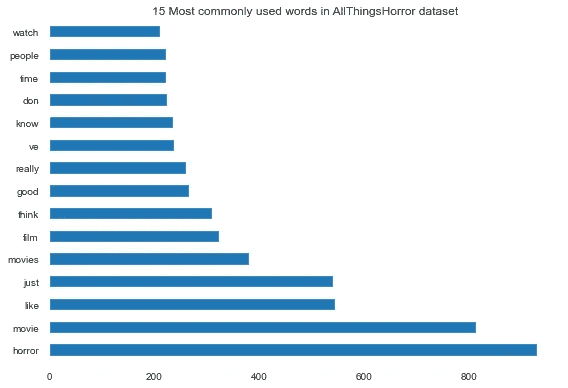
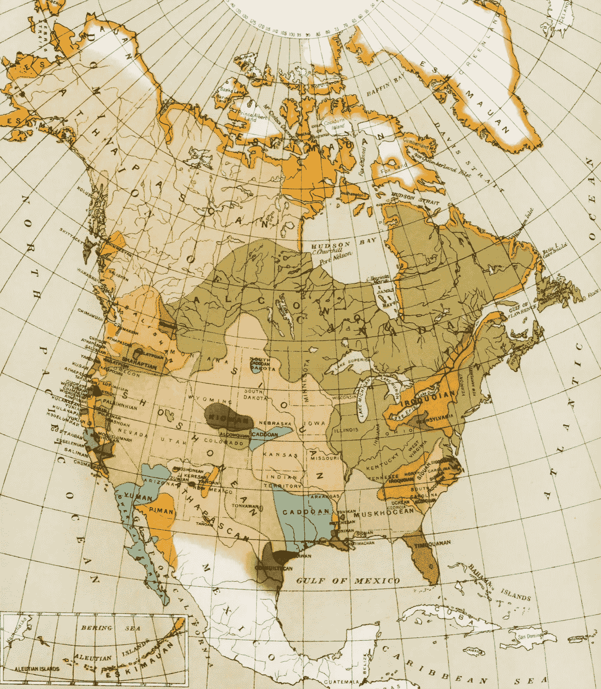
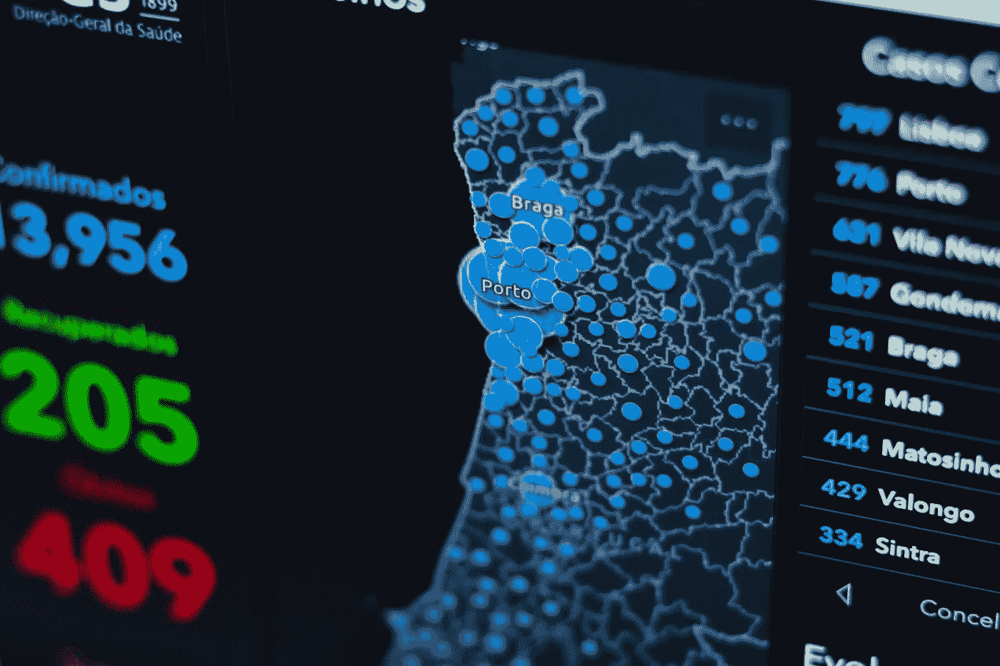
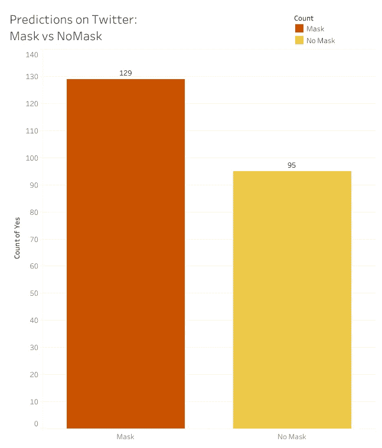
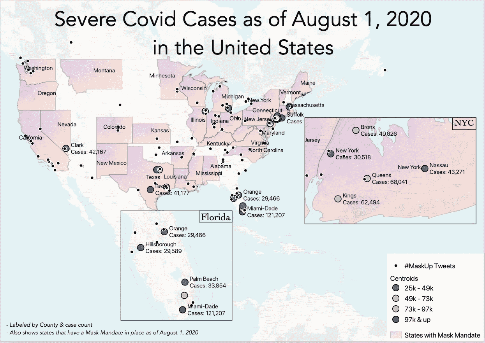

# 地理信息系统在报告中的作用

> 原文：<https://towardsdatascience.com/the-role-of-gis-in-reporting-51cc82b2fad0?source=collection_archive---------48----------------------->

布莱恩·麦高恩在 [Unsplash](https://unsplash.com/s/photos/computer-map?utm_source=unsplash&utm_medium=referral&utm_content=creditCopyText) 上的照片

我是一名有 GIS 经历的商业分析师。作为一名分析师，我被要求以信息丰富的方式向高管展示数据。这是一系列文章的开始，在这些文章中，我将演示如何使用 GIS 为大众提供报告。无论您是数据科学家、分析师还是 GIS 专业人士，我都将展示 GIS 的动态使用，以及它如何将您的报告转变为通用的精彩内容。我将从为什么 GIS 在报告中有用开始。

传统的分析师报告包括 excel 条形图和饼图。这是有益的，但不一定让高管们兴奋。

作者图片来自[ohthehoror](https://www.melissa-anthony.com/oh-the-horror)项目

这就是 GIS 的用武之地。地图的基础是为那些不是专家的人准备的。历史地图是艺术作品，因其夸张的风格而备受推崇。从概念上来说，将地图视为艺术触及到了为什么它们具有普遍性的核心。《牛津词典》对艺术的定义是:

> 人类创造性技能和想象力的表达或应用，通常以绘画或雕塑等视觉形式，创作出主要因其美或情感力量而被欣赏的作品。

照片由[大英图书馆](https://unsplash.com/@britishlibrary?utm_source=unsplash&utm_medium=referral&utm_content=creditCopyText)在 [Unsplash](https://unsplash.com/s/photos/historical-maps?utm_source=unsplash&utm_medium=referral&utm_content=creditCopyText) 上拍摄

只要你能在报道中引发情绪，你就在减少观众的解读工作。这是为群众创作报道的关键。以下面的图片为例:

由 [KOBU 机构](https://unsplash.com/@kobuagency?utm_source=unsplash&utm_medium=referral&utm_content=creditCopyText)在 [Unsplash](https://unsplash.com/s/photos/redline-maps?utm_source=unsplash&utm_medium=referral&utm_content=creditCopyText) 上拍摄的照片

蓝色、绿色和红色在黑色背景的衬托下非常突出。气泡的大小有助于直观地看到聚集发生的位置。蓝色是一种对眼睛无害的颜色，所以你可以在视觉上看到大量的蓝色。而绿色被认为是令人振奋的。红色绝对凸显“危险”。这就是地理信息系统的威力:无需解释就能立即收集到如此多的信息。

GIS 如何帮助报告的另一个例子是我做的一个项目，建立一个 Twitter 照片图像分类器，以发现戴口罩者和不戴口罩者的数据之间的相关性。这是我创建的一个传统报告:

作为条形图的蒙版与无蒙版(图片来自作者的蒙版项目后面的

现在，这是一份有影响力的报告，显示了推特上戴口罩和不戴口罩照片的数字。但是，如果我把它放到地图上:

作为地图的面具与无面具(图片来自作者的面具背后的[项目)](https://www.melissa-anthony.com/behind-the-mask)

尽管地图更加繁忙，需要用户阅读图例，但最终它传达的信息比条形图多得多，而且对解释者来说速度更快。它直观地显示了自然的相关性，如口罩佩戴者与有口罩强制令的州的分布，以及严重的 covid 病例分布。它也通过颜色引发情感反应。

在接下来的几篇文章中，我将向那些可能没有太多 GIS 知识的人展示发送带有地图的报告的快速方法。这些报告还将向他们强调可共享性。