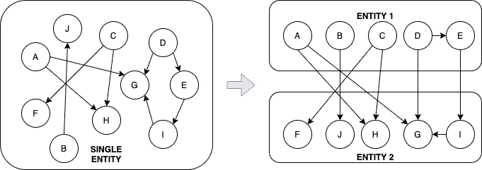
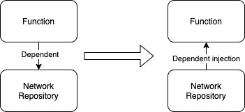
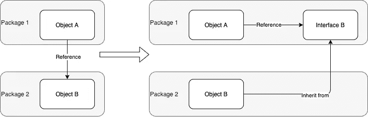
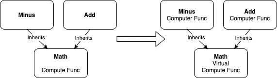
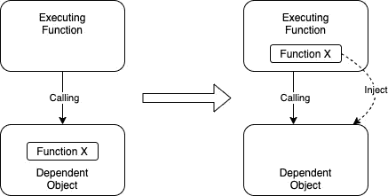
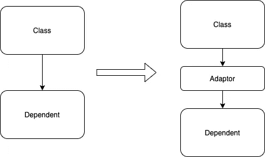
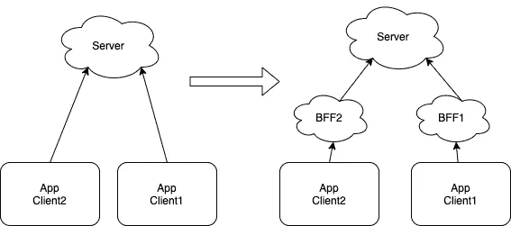
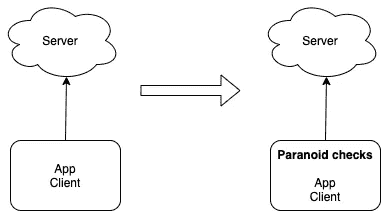

# 所有软件设计挑战的根源:独立还是依赖

> 原文：<https://towardsdatascience.com/the-root-of-all-software-design-challenge-independent-or-dependent-31252051bf0e?source=collection_archive---------18----------------------->

## 程序员世界

## 独立依赖设计:许多软件设计方案的蓝图


图片由[克里斯在](https://pixabay.com/de/users/chrisreadingfoto-2723427/?utm_source=link-attribution&utm_medium=referral&utm_campaign=image&utm_content=1928848)[皮克斯贝](https://pixabay.com/de/photos/team-haufen-gemeinsamkeit-1928848/)阅读

我们先学习编码，然后学习软件设计和架构。然后我们被介绍了许多解决问题的方法。Vijini Mallawaarachchi 撰写的关于 10 种常见软件架构模式的文章为其中的许多模式提供了很好的说明。

然而，很多时候，在解决了问题之后，我们会发现新的问题又出现了。这让我思考，我们到底在解决什么？

如果我们“抽象”软件设计的所有问题，它们都面向一个单一的问题，即。我们如何将它们分开，又将它们联系在一起。换句话说:

1.  应该独立到什么程度？和
2.  他们应该如何依赖？

当我们能够清楚地理解这个问题时，它将帮助我们制定一个更可持续的解决方案。我将在下面提供一些例子。

但是首先，让我更清楚地说明这个问题

# 独立还是依赖？

当我们第一次想要构建软件(或者编码一个解决方案)时，我们把它看作一个单一的实体。所有组件都在内。没有界限。实体本身是相对独立的，因为它不依赖于任何其他实体。

然而，这并不理想，当没有边界时，连接可能会变得混乱，并变得纠缠不清。这就是代码中禁止使用`goto`命令的原因。

因此，软件设计概念出现了，我们将单个实体分成两个或更多的实体，其中一个依赖于另一个，并且理想的是只有一个方向(避免循环依赖)。



在上图中，我们可以看到最初的单一实体设计。然后，我们将其转换为依赖于实体 2 设计的实体 1。这种设计比单一实体更简洁。我们也可以分配不同开发人员拥有每个实体，因此每个人都有更清晰的职责。

然而，新的挑战出现了…如果实体 1 中的 D 需要 G 中的新东西，我们该如何处理呢？

*   只需修改实体 2 中的 G？(实体 2 的所有者将会不高兴，因为每次 D 想要 G 改变时，实体 2 将需要改变)
*   在实体 1 中复制 G，让 D 可以随心所欲的对 G 做任何改动，不依赖实体 2？(但之后我们可能会有两组可能相似的 G)。
*   将 G 移到实体 1，因为 A 也需要 G？(但问题是我也需要 G，把 G 移到实体 1 会在实体 1 和实体 2 之间产生循环依赖)。

也许最好的解决方案是将 G 和 I 移到实体 1，使实体 1 更加独立于实体 2。但我们知道，这将回到原点问题，它将导致更混乱的实体 1。

这就是软件设计的永恒之战。应该独立还是依赖？上面的场景是对它的一个非常简化的解释。我们可以在不同层次的软件设计中看到这种挑战，例如

*   将代码划分成功能，例如，我们应该重构或复制多少？
*   类对象之间的责任划分
*   抽象级别的划分，例如，什么应该在基础中，什么应该在子中
*   客户机与服务器、主服务器与从服务器等之间的责任划分…

定义分区边界是困难的。没有完美解决方案，它会不断发展。

然而，如果我们将这种划分视为独立和依赖的范围划分，我们可能会发现一些双赢的情况。这可以通过我所谓的“**独立依赖**解决方案”来实现。

这听起来可能很新鲜，但是这种方法已经在软件设计中以多种方式应用，而我们却没有意识到。让我与你分享一些例子

# 独立依赖于解决方案

一个**独立依赖**另一个实体的实体是指，虽然它依赖于另一个实体，但它本身也可以影响依赖的实体，更加自力更生。

我们今天在抽象层次上使用的许多流行的软件设计方法是一种使一些东西独立的方法。

下面的一些例子将有助于使这一点更清楚…

## 1.依赖注入



假设我们有一个函数，我们想执行网络获取，我们有这个简单的函数如下

```
fun performNetworkFetch(input: String): String {
    if (validateInput(input)) {
        return **NetworkRepository()**.fetch(input)
    } else {
        return "Sorry, invalid input"
    }
}
```

这里我们可以看到`performNetworkFetch`依赖于`NetworkRepository`实例上的**来执行获取。**

这是可行的，但是对于测试来说是不是很糟糕，因为没有办法去模仿`NetworkResponsitory`。

所以解决的办法就是通过在函数内实例化，让`performNetworkFetch`不直接依赖`networkRepository`，而是通过参数注入。这种方法被称为*依赖注入*。

```
fun performNetworkFetch(input: String, 
    **networkRepostoriy: NetworkRespositor**y): String { if (validateInput(input)) {
        return **networkRepostoriy**.fetch(input)
    } else {
        return "Sorry, invalid input"
    }
}
```

有了这些，现在我们可以通过模仿`networkResponsitory`来测试这个函数。

通过使`performNetworkFetch`不直接依赖于`networkRepository`，我们可以看到*依赖注入*使得函数**独立依赖于对象**。

## 2.依赖性倒置



当对象 A 引用另一个包中的另一个对象 B 时，它**依赖于它**。

```
class Aclass(val B: Bclass)val a1 = Aclass(Bclass())
```

这将发布对象 A 无法动态地将对象 B 的内容更改为另一个的问题。

然而，如果我们使用*依赖倒置*，通过让对象引用接口 B 来代替

```
class Aclass(val B: interface)val a1 = Aclass(Bclass()) // B inherits from interface B
val a2 = Aclass(Cclass()) // C is also inherits from interface B
```

现在，A 虽然有点依赖 B，但也更加独立了。它也可以得到 C(它是 B 接口的继承)。

这样，我们就使对象 A **独立于对象 b**。

## 3.多态性

面向对象编程(OOP)的三个基本概念是封装、继承和多态。

封装和继承都是定义边界和创建依赖关系的方法。使 OOP 更加灵活的核心是多态性。



在典型的子类中，类继承自父类，子类的函数定义依赖于父类。例如，根据上图，在一个数学类中，减类和加类都是从 Math 的计算函数继承的。

这不好，因为如果我们运行下面的函数，减和加应该有不同的计算行为

```
fun (math: Math): Int {
   return math.compute(1, 2)
}
```

因此，OOP 的多态性部分开始发挥作用。数学类将只定义一个虚拟(或抽象)函数，并允许子类(即加法和减法)相应地重新定义计算函数。

这使得加和减，**独立依赖于**数学课。

## 4.函数式编程

最近，函数式编程成为了流行的编程范例。这与它改变一个人所依赖的核心的能力有很大关系。下面的文章将详细介绍。

<https://levelup.gitconnected.com/why-code-evolve-from-procedural-to-object-oriented-to-functional-programming-13a88292307e>  

简而言之，函数式编程通过提供一种将函数作为另一个函数或对象的参数的方式，增强了开发人员的体验。



没有注入函数的能力，执行函数完全依赖于依赖对象

```
fun executionFunction() {
    dependentObject.doSomething()
}class DependentObject {
    func doSomething() { 
        x() // calling x within
    }
 **fun x() { /* Do something */ }**
}
```

使用函数式编程，我们可以如下所示定义和注入函数。

```
fun executionFunction() {
 **fun x() { /* Do something */ }**
    dependentObject.doSomething(::x)
}class DependentObject {
    func doSomething(x: () -> Unit) { 
        x() // calling x from executionFunction
    }
}
```

如你所见，我们通过将函数注入其中，使执行函数**独立依赖于依赖对象**。

## 5.适配器设计模式

这是四人帮的模式之一。它最初的目的是允许不兼容的接口一起工作。

同时，adaptor 模式也可以用来允许一个类的备用接口，使得一个类虽然依赖于，但也独立于被依赖者。



如果没有适配器，这个类将完全**依赖于直接依赖的数据类型。这使得类和依赖者之间产生了强耦合。**

如果接口的依赖方有任何变化，我们将需要直接修改类，这可能会涉及很多变化。

为了更好地保护类免受依赖项的修改，我们可以在类和依赖项之间设置一个适配器。这将保护类免受依赖者发生的任何变化。发生这种情况时，只需要更换适配器。

因此，从这里我们可以看到，*适配器设计模式*使得类**独立于依赖者**。

## 6.后端对前端

如今，在任何应用程序开发中，都有**依赖**来自服务器的服务。该服务为多个客户端提供服务。



如果服务器发生变化，两者都会发生变化。客户也必须改变。如果客户端是不能立即更改的移动应用程序，这就变得棘手了。

为了防止这个问题，目前一种常见的做法是在应用程序客户端和服务器之间实现后端对前端(BFF)。BFF 就像一个迷你服务，作为应用程序客户端的代理。

服务器上的任何更改都被屏蔽在应用程序之外。人们只需要相应地修改 BFF，而 App 客户端没有影响。

这使得应用客户端**独立依赖于服务器**。

## 7.偏执的编码&优雅的退出

如果一个应用客户端依赖于一个服务(BFF 或者直接依赖于服务器)，通常在定义接口之间有一个契约 API，即什么是可空的，什么不是。

然而，正如罗纳德·里根所说，“信任但要核实”。不能保证服务器会一直履行合同。如果有一天没有，应用程序可能会崩溃。



因此，有一种被称为偏执编码的编程方法，它将检查所有输入，即使已经有一个输入肯定会以某种方式运行的契约。一旦检查失败，它将优雅地退出应用程序。

同样，在这里我们可以看到偏执编码如何使应用程序客户端更加独立于服务器，同时依赖于服务器，在应用程序端提供更安全的结果。另一种**独立依赖**的软件处理方式。

# 最后

软件本质上比其他领域变化更快，因此简单的基于分区的解决方案通常不足以使软件更加通用。

由此，正如我们从上面看到的，许多软件设计正在应用基于**独立依赖**的解决方案来迎合软件既灵活又可靠的需求。

以后当你卡在解决一个软件设计问题的时候，想想怎么才能独立依赖。你可能会找到一个有用的。