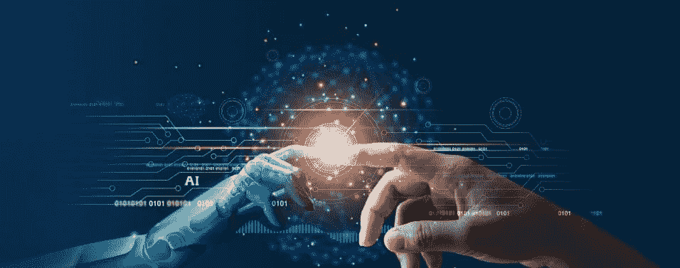

# 人工智能在医疗保健领域的安全有效发展

> 原文：<https://towardsdatascience.com/the-safe-and-effective-evolution-of-ai-in-healthcare-c0c66372f0fa?source=collection_archive---------49----------------------->

## 人工智能允许我们使用计算机的大脑和人类的心脏来实践医疗保健

资料来源:Verantos.com

作者:Dan Riskin，医学博士，FACS，Verantos 的创始人兼首席执行官

在我创伤外科医生职业生涯的早期，我见过一个病人，他遭遇了一场可怕的车祸，多处器官受伤。对于如何治疗病人，我有多种选择，但做出决定的证据有限。我心想，要是一台计算机能找到其他遭受类似伤害的人，并告诉我哪种方法最有效就好了。

那时候技术还不存在。但是，如果有，病人会受益。相反，他的治疗依赖于一个人，而一个人不可能知道所有正确的答案。然而今天，这项技术确实存在。人工智能(AI)允许我们使用计算机的大脑和人类的心脏来实践医疗保健。

**AI 作为一种电器**

我们经常看到以机器人形式描绘人工智能(AI)的恐怖电影，以毁灭人类为背景。这种以机器最终取代人类为中心的思路既不具有建设性，也不真实。我喜欢把人工智能看作是一种必要的支持。几十年前，人们手工洗衣服和洗碗。最终，我们发现机器可以更有效地处理这些任务。AI 也是如此。随着我们找到更好的解决方案来解决医疗保健中重复性或需要非人类记忆的问题，我毫不怀疑我们应该从机器中受益。这不是取代人类，而是人工智能补充了人类可以做的事情。

资料来源:Verantos.com

**解决人工智能中的偏差**

围绕人工智能偏见的问题已经被详细讨论过了，而且理由充分。人工智能算法高度依赖于源数据，而源数据通常基于在先进而昂贵的医疗系统中实施的试验。能够进入这些卫生系统的个人通常符合特定的经济、社会和种族特征。这意味着最可用的源数据来自富裕的白人人口。

Verantos 通过使用精确医学来确定亚组(包括代表性不足的人群)的首选疗法，解决了这些不平等问题。我们使人工智能有可能分析数百万页去识别的健康记录，以确定哪些对这些子群有效，哪些无效。毕竟，避免人工智能偏见的最佳方式是使用分布良好的源数据。

**结论**

在医疗保健行业，我们正处于一个独特而激动人心的时刻。有了足够的数据、强大的人工智能和足够的计算能力，我们能够渴望进入医疗保健的下一个前沿领域——一个学习型健康系统，该系统根据从数千甚至数百万类似个体的过去护理中获得的经验，为每个个体量身定制治疗。

医学博士、工商管理硕士 Dan Riskin 是 Verantos 的创始人兼首席执行官，Verantos 是唯一一家在 EHR 开展监管级研究的 RWE 专业公司。他是斯坦福大学外科学兼职教授和生物医学信息学研究兼职教授。Dan 是医疗保健人工智能方面的专家，他开发的产品每年影响数百万患者的护理。