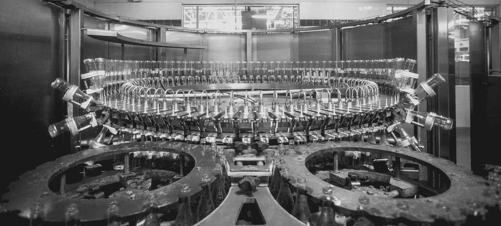
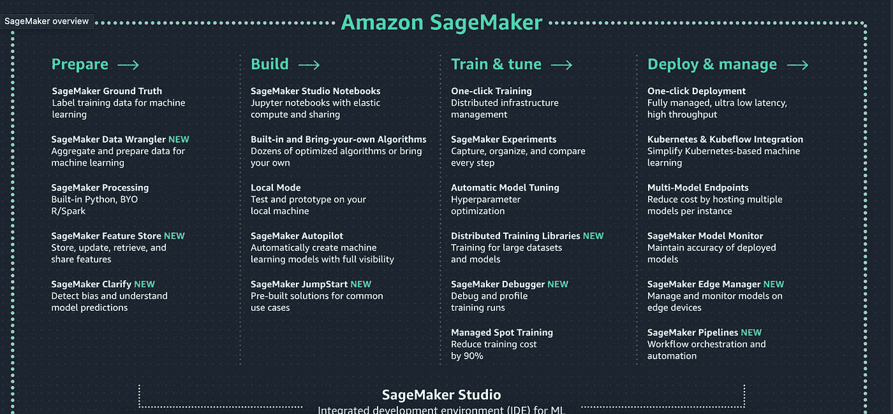

# SageMaker 传奇

> 原文：<https://towardsdatascience.com/the-sagemaker-saga-e7ea2233388f?source=collection_archive---------39----------------------->

## 自动气象站 SageMaker 简介

劳埃德·布兰克在 [Unsplash](https://unsplash.com/s/photos/machinery?utm_source=unsplash&utm_medium=referral&utm_content=creditCopyText) 上的照片

许多数据科学家在托管环境中开发、训练和部署 ML 模型。遗憾的是，对于他们来说，他们不具备根据其模型在需要时扩大或缩小资源的便利性和便利性。

这就是 AWS SageMaker 的用武之地！它通过方便开发人员构建和训练模型来解决这个问题，以便以最少的努力和经济的成本获得更快的生产。

# 但是首先…你问的 AWS 是什么？

*图片由* [*你好我是 Nik*](https://unsplash.com/@helloimnik?utm_source=unsplash&utm_medium=referral&utm_content=creditCopyText) *上* [*下*](https://unsplash.com/s/photos/amazon?utm_source=unsplash&utm_medium=referral&utm_content=creditCopyText)

亚马逊网络服务(AWS)是一个被广泛采用的、世界上最全面的按需云平台，由亚马逊提供，它从世界各地的数据中心提供 200 多种功能齐全的服务。AWS 服务可用于在云中构建、监控和部署任何类型的应用程序，使数百万人和企业(包括发展最快的初创企业、领先的政府机构和最大的企业)能够降低成本、加快创新速度并变得更加敏捷。AWS 提供了一个大规模的全球云基础设施，允许您快速创新、迭代和试验。凭借业经验证的运营专业知识、选择所需服务的灵活性以及比任何其他云提供商更多的功能和特性，AWS 让您能够专注于创新，而不仅仅是基础架构。作为一个提供无与伦比体验的语言和操作系统无关的平台，AWS 在云中提供了一个高度安全、可扩展和可靠的低成本基础架构平台，为全球 190 多个国家的数十万家企业和数百万客户提供支持。如今，AWS 拥有最具活力和最大规模的客户和合作伙伴社区，几乎涵盖各个行业和各个规模。

# 欢迎，AWS SageMaker

Amazon SageMaker 于 2017 年推出，是一个基于云的机器学习平台，它是完全管理的，将您的环境从开发、培训和部署中分离出来，让您可以单独扩展它们，同时帮助您优化您的支出和时间。AWS SageMaker 包括一些模块，数据科学家和开发人员可以一起或单独使用这些模块来构建、训练和部署任何规模的 ML 模型。AWS SageMaker 使日常开发者和科学家能够在没有任何经验的情况下使用机器学习。世界各地的许多开发人员都在以各种方式采用 SageMaker，有些是为了端到端的流程，有些是为了扩大培训工作。

# 为什么选择 AWS SageMaker:优势

AWS SageMaker 有很多优点，我在下面列出了其中一些:

*   它改善和提高了机器学习项目的生产率
*   它有助于在最短的时间内创建和管理计算实例
*   它将构建机器学习模型的成本降低了高达 70%
*   它通过以下方式自动创建、部署和训练完全可见的模型
*   检查原始数据
*   它减少了数据标记任务所需的时间
*   它有助于将所有机器学习组件存储在一个地方
*   它训练模型的速度更快，并且高度可扩展
*   它维持正常运行时间—流程保持运行，没有任何中断
*   它保持高度的数据安全性

Sagemaker 是所有 ML 服务的大保护伞，它试图为所有机器学习和数据科学工作流提供一个单一的地方。它试图涵盖所有相关步骤，从供应云资源和导入数据到清理数据、标记数据(包括手动标记)和训练模型，再到自动化和在生产中部署模型。

# AWS Sagemaker 演示 11 分钟

想在 Sagemaker 控制台上快速入门，看看 youtube 上的这个视频

亚马逊 Sagemaker 在 11 分钟内| AWS 由 [Anuj Syal](https://www.youtube.com/channel/UCO8XsgcjqArk_mAd1VGBMfg?sub_confirmation=1)

# 探索全部潜力:SageMaker 的特点和能力

*来源:*[*【aws.amazon.com/sagemaker】*](https://aws.amazon.com/sagemaker/)

## 准备

即使您没有带标签的数据集，AWS Sagemaker 也允许您在机械土耳其人的帮助下正确标记您的数据集。其中之一是`Amazon SageMaker Ground Truth`，这是一个完全托管的数据标注服务，有助于构建正确的训练数据集。通过 SageMaker Ground Truth 控制台，您可以使用自定义或内置的数据标注工作流在几分钟内开始标注数据。

## 建设

AWS SageMaker 通过提供快速连接到训练数据所需的一切，帮助您选择和优化适合您应用的最佳算法和 apt 框架，使构建 ML 模型并为训练做好准备变得容易。亚马逊 SageMaker 包括托管的 Jupyter 笔记本，可以轻松浏览和可视化您存储在亚马逊 S3 上的训练数据。你可以直接连接到 S3 的数据，或者使用 AWS Glue 将数据从 Amazon DynamoDB、Amazon RDS 和 Amazon Redshift 转移到 S3，以便在笔记本上进行分析。为了便于选择算法，AWS SageMaker 包括了 10 种最常用的 ML 算法，这些算法都是预先安装和优化的，因此其性能是在其他地方运行这些算法的 10 倍。SageMaker 还预配置为运行 Apache MXNet 和 tensor flow——两个最广泛使用的开源框架。此外，您甚至可以选择使用自己的框架。

## 火车

AWS SageMaker 机器学习的下一个基本功能是训练模型。在这一阶段，你需要专注于模型的评估。模型的训练主要涉及算法，算法的选择涉及其他各种因素。为了更有效、更快速地使用，AWS SageMaker 还提供了内置算法。训练机器学习模型的另一个关键要求是计算资源。训练数据集的大小和期望的结果速度有助于确定资源需求。下一个重要的特征也是 Amazon ML vs. SageMaker 中一个令人生畏的方面，它涉及评估。完成模型的 AWS 在线培训后，您必须评估模型，以测试推论的准确性。AWS SDK for Python (Boto)或 SageMaker 中的高级 Python 库有助于向模型发送推理请求。Jupyter notebook 辅助模型的训练和评估。

## 部署

一旦您的模型经过训练和调整，AWS SageMaker 就可以很容易地在生产中部署，这样您就可以开始对新数据运行生成预测(这个过程称为推理)。为了同时提供高性能和高可用性，SageMaker 将您的模型部署在跨多个可用性区域的 Amazon EC2 实例的自动扩展集群上。AWS SageMaker 还带有内置的 A/B 测试功能，可以帮助测试您的模型，并尝试不同的版本以获得最佳结果。AWS SageMaker 消除了 ML 的负担，因此人们可以轻松有效地构建、训练和部署机器学习模型。

# 用 SageMaker 验证模型

您可以选择使用离线或历史数据来评估模型:

**离线测试:**为此，使用历史数据通过亚马逊 SageMaker 中的 Jupyter notebook 向模型发送请求进行评估。

**使用实时数据进行在线测试:**多个模型被部署到 Amazon SageMaker 的端点，它将实时流量导向模型进行验证。

**使用“维持集”进行验证:**为此，一部分被称为“维持集”的数据被搁置。该模型随后使用剩余的输入数据进行训练，并基于其最初学习的内容对数据进行归纳。

**K 倍验证:**为此，输入数据被分成两部分——K，这是用于测试模型的验证数据，另一部分称为 k1，用作训练数据。现在，基于输入数据，ML 模型评估最终输出。

# 先睹为快:AWS SageMaker 工作室和建筑视图

这是一个完全集成的机器学习开发环境，其中模型的构建、训练和部署都可以在一个单一的屋顶下完成。

*   **亚马逊 SageMaker 笔记本:**用于轻松创建和分享 Jupyter 笔记本。
*   **亚马逊 SageMaker 实验:**用于跟踪、组织、比较、评估不同的 ML 实验。
*   **Amazon SageMaker 调试器:**顾名思义，用于调试和分析复杂类型的训练问题，接收错误的预警通知。
*   **Amazon SageMaker 模型监视器:**用于检测已部署 ML 模型的质量偏差。亚马逊 SageMaker Autopilot:用于自动构建 ML 模型，具有完全可见性和控制力。

# 结束语:结论

机器学习是应用程序开发的未来，AWS SageMaker 将彻底改变计算世界。机器学习中的应用程序的纯粹生产力将为采用诸如 SageMaker 这样的 ML 服务创造新的前景。

*原载于*[*https://anujsyal.com*](https://anujsyal.com/the-sagemaker-saga)*。*